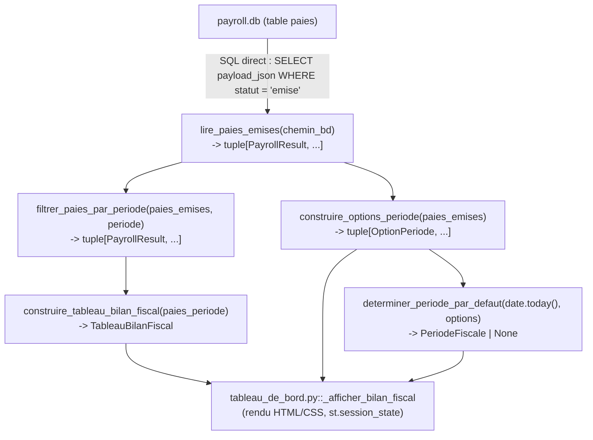

# Design Document

<!-- Titre métier : Document de conception — bilan-fiscal-employeur. Les
en-têtes structurels de niveau supérieur sont maintenus en anglais pour la
conformité au format Kiro ; tout le contenu métier est rédigé en français. -->

## Overview

Le Bilan_Fiscal est une nouvelle section du Tableau_De_Bord
(`app/pages_ui/tableau_de_bord.py`), affichée immédiatement sous
`_afficher_liste_employes`, qui agrège — pour une Periode_Fiscale choisie
par l'opérateur (un Mois_Fiscal ou une Annee_Complete) — les montants déjà
calculés et tracés par le moteur de paie pour **toutes les paies de statut
`EMISE`** du Registre_Maitre, répartis en trois colonnes : « Retenues et
cotisations », « QC », « CA ».

Cette fonctionnalité est une **pure couche d'agrégation et d'affichage** :
elle ne recalcule aucun montant fiscal (règle 02), ne touche ni
`payroll_engine/` ni `models/`, et n'affiche aucune donnée nominative
(règle 04) — seuls des totaux agrégés apparaissent. Tous les montants
sources proviennent de `PayrollResult.retenues_employe` et
`PayrollResult.cotisations_employeur`, déjà persistés en JSON dans la
colonne `payload_json` de la table `paies` (`payroll.db`).

Deux problèmes distincts sont résolus par cette conception :

1. **Détermination de la Periode_Fiscale d'une paie et présélection** —
   fonctions pures, indépendantes de tout accès disque, opérant sur des
   `PayrollResult` déjà décodés (Requirements 2, 3).
2. **Agrégation des montants pour une Periode_Fiscale donnée** — fonction
   pure construisant la structure de données du Tableau_Bilan_Fiscal à
   partir d'un ensemble de `PayrollResult` déjà filtré (Requirements 5 à
   9, 11).

La lecture SQL (Requirement 10, 11.3) est le seul point d'accès disque —
elle isole la désérialisation (et son échec éventuel) de toute la logique
d'agrégation pure, testable en isolation par property-based testing sans
jamais toucher SQLite.

## Architecture

### Décision n° 1 — Nouveau module `app/logique_metier/bilan_fiscal.py`

`app/logique_metier/dernieres_paies.py` agrège les paies **d'un seul
employé** (`employe_id` en paramètre de chaque fonction) pour alimenter le
Tableau_De_Bord (statut/date de la dernière paie) et la
Fiche_Employe_Detaillee (historique des paies de cet employé). Le
Bilan_Fiscal a une portée fondamentalement différente : il agrège les
paies de **tous les employés confondus** pour une Periode_Fiscale, sans
jamais exposer ni filtrer par `employe_id` (règle 04 — aucune donnée
nominative, y compris aucun identifiant employé, n'apparaît dans le
résultat agrégé).

Étendre `dernieres_paies.py` avec des fonctions qui ignorent son paramètre
central (`employe_id`) aurait mélangé deux portées de lecture
incompatibles dans un seul module, au détriment de la lisibilité. Un
nouveau module **`app/logique_metier/bilan_fiscal.py`** est donc créé,
dans le même style que `dernieres_paies.py` (lecture SQL directe via
`sqlite3.connect`, jamais de fonction privée de `payroll_engine.register`,
même traduction de `sqlite3.OperationalError` « no such table » en
absence de données — décision n° 5 de `interface-streamlit`, règle 01).

### Décision n° 2 — Séparation stricte lecture / logique pure / rendu

Trois couches, du plus bas niveau (accès disque) au plus haut (affichage) :



- **Lecture** (`lire_paies_emises`) : seul point d'E/S, seul point où
  `sqlite3.OperationalError`/désérialisation invalide peuvent survenir
  (Requirement 11.3).
- **Logique pure** (`construire_options_periode`,
  `determiner_periode_par_defaut`, `filtrer_paies_par_periode`,
  `construire_tableau_bilan_fiscal`, et leurs sous-fonctions) : aucune
  E/S, aucun import `streamlit` — testable exhaustivement par
  property-based testing (cohérent avec le test de garde existant
  `tests/app/test_guards.py` qui vérifie l'absence d'import `streamlit`
  sous `app/logique_metier/`).
- **Rendu** (`app/pages_ui/tableau_de_bord.py::_afficher_bilan_fiscal`) :
  seul endroit qui importe `streamlit`, orchestre les trois appels
  ci-dessus via `executer_avec_capture`, gère `st.session_state` pour la
  persistance du choix manuel (Requirement 3.4), et construit le bloc
  HTML/CSS du Tableau_Bilan_Fiscal.

### Décision n° 3 — Rendu HTML/CSS plutôt que `st.dataframe`/`st.table`

Le Tableau_Bilan_Fiscal exige deux dispositions que ni `st.dataframe` ni
`st.table` ne peuvent produire :

- une **ligne d'en-tête de section fusionnée sur les trois colonnes**
  (« Retenues sur le salaire de l'employé », « Cotisations patronales » —
  Requirements 6.1, 8.1) ;
- une **cellule fusionnée sur les colonnes QC et CA** pour la ligne
  « Grand total combiné (QC + CA) » (Requirement 9.3).

`st.dataframe`/`st.table` rendent toujours une grille rectangulaire
uniforme (une colonne d'index générée automatiquement en prime, que le
Requirement 5.1 interdit explicitement) sans mécanisme de fusion de
cellules. Le projet a déjà tranché ce même arbitrage pour
`bulletin_paie.py` (tableaux personnalisés avec lignes de total en gras,
sections fusionnées visuellement) : un bloc HTML/CSS unique rendu via
`st.markdown(..., unsafe_allow_html=True)` est la solution retenue, par
cohérence directe avec ce précédent. Le CSS est scoped par des classes
préfixées `bilan-fiscal-` (même convention que `bulletin-` dans
`bulletin_paie.py`) pour éviter toute collision de style avec les autres
pages. Aucune donnée interpolée dans ce bloc HTML n'est une donnée
personnelle (règle 04) — uniquement des montants agrégés et des libellés
fixes — donc aucun `html.escape` n'est nécessaire ici (à la différence de
`bulletin_paie.py`, qui interpole des noms d'employés).

Aucun bouton n'est introduit par cette section (seul un `st.selectbox`) —
la règle UI 07 (boutons primaires/secondaires) ne s'applique donc pas à ce
module.

### Décision n° 4 — Emplacement dans `tableau_de_bord.py::render()`

```python
def render() -> None:
    ...
    _afficher_liste_employes(employes)

    st.divider()
    _afficher_bilan_fiscal()          # <-- nouvelle section (Requirement 1.1)

    st.divider()
    if st.button("Ajouter un nouvel employé", type="primary"):
        ...
```

`_afficher_bilan_fiscal()` est appelée après `_afficher_liste_employes`,
avant le bouton « Ajouter un nouvel employé » — immédiatement sous la
liste des Fiches_Employe, qu'elle soit vide ou non (Requirement 1.1,
1.2), avec son propre `st.divider()` pour la séparer visuellement de la
liste ci-dessus (cohérent avec le séparateur déjà présent avant le bouton
d'ajout).

## Components and Interfaces

### `app/logique_metier/bilan_fiscal.py`

#### 1. Détermination du Mois_De_Rattachement et options du Selecteur_De_Periode

```python
_NOMS_MOIS: dict[int, str] = {
    1: "Janvier", 2: "Février", 3: "Mars", 4: "Avril",
    5: "Mai", 6: "Juin", 7: "Juillet", 8: "Août",
    9: "Septembre", 10: "Octobre", 11: "Novembre", 12: "Décembre",
}

@dataclass(frozen=True)
class PeriodeFiscale:
    """Une Periode_Fiscale — un Mois_Fiscal (`mois` renseigné) ou une
    Annee_Complete (`mois` absent). Requirements 2, 10."""
    annee: int
    mois: int | None = None  # 1-12 ; None => Annee_Complete


@dataclass(frozen=True)
class OptionPeriode:
    """Une option affichable du Selecteur_De_Periode — libellé pré-formaté
    (Requirement 2.5, 2.6) associé à sa `PeriodeFiscale`."""
    libelle: str
    periode: PeriodeFiscale


def mois_annee_rattachement(date_paiement: date) -> tuple[int, int]:
    """Mois_De_Rattachement (`annee`, `mois`) d'une paie (Requirement 2.2).

    Extraction pure de `PayPeriod.date_paiement.year`/`.month` — aucune
    autre source (ni `annee_fiscale`, ni `date_debut`/`date_fin`,
    décision n° 1 des requirements).
    """


def formater_option_annee_complete(annee: int) -> str:
    """`"<annee> (année complète)"` (Requirement 2.5)."""


def formater_option_mois_fiscal(annee: int, mois: int) -> str:
    """`"<Nom_du_mois> <annee>"` avec les 12 noms exacts `_NOMS_MOIS`
    (Requirement 2.6)."""


def construire_options_periode(
    paies_emises: tuple[PayrollResult, ...]
) -> tuple[OptionPeriode, ...]:
    """Options du Selecteur_De_Periode (Requirements 2.1, 2.3, 2.4, 2.7).

    Pour chaque `PayrollResult` de ``paies_emises``, détermine le
    Mois_De_Rattachement via :func:`mois_annee_rattachement`. Construit
    l'ensemble des années présentes (Annee_Complete) et l'ensemble des
    couples (mois, année) présents (Mois_Fiscal), formate chaque option
    via :func:`formater_option_annee_complete`/
    :func:`formater_option_mois_fiscal`, puis trie par année décroissante,
    Annee_Complete avant les Mois_Fiscal (croissants) de cette même année
    (Requirement 2.7). Retourne un tuple vide si ``paies_emises`` est
    vide.
    """
```

#### 2. Présélection par défaut et persistance du choix manuel

```python
def determiner_periode_par_defaut(
    aujourdhui: date, options: tuple[OptionPeriode, ...]
) -> PeriodeFiscale | None:
    """Mois_Fiscal présélectionné à l'ouverture de session (Requirements
    3.1, 3.2, 3.3).

    - Si ``1 <= aujourdhui.day <= 15`` : cible le mois **précédant** le
      mois courant (Requirement 3.1).
    - Sinon (``16 <= aujourdhui.day <= dernier jour du mois``) : cible le
      mois **courant** (Requirement 3.2).
    - Si la `PeriodeFiscale` cible ne correspond à aucun `OptionPeriode`
      de type Mois_Fiscal de ``options``, retourne le Mois_Fiscal le plus
      récent parmi ``options`` (Requirement 3.3).
    - Retourne `None` si ``options`` ne contient aucun Mois_Fiscal (cas
      dégénéré — en pratique jamais atteint tant que le Requirement 4
      masque le Selecteur_De_Periode en l'absence totale de paie EMISE).

    Fonction pure — ne lit jamais `st.session_state` ni l'horloge
    elle-même ; l'appelant (`tableau_de_bord.py`) lui fournit
    ``aujourdhui`` (Requirement 3.5).
    """
```

La **persistance du choix manuel** (Requirement 3.4) n'est pas une
fonction pure supplémentaire : elle repose sur le patron standard
`st.session_state` de Streamlit, appliqué dans la couche de rendu (voir
§4 ci-dessous) — la clé `st.session_state["bilan_fiscal_periode_libelle"]`
n'est initialisée qu'une seule fois par session
(`st.session_state.setdefault(...)`, ou test d'appartenance équivalent) à
la valeur retournée par `determiner_periode_par_defaut` ; tout
réaffichage subséquent lit la valeur déjà présente dans
`st.session_state`, que le `st.selectbox` lié à cette clé aura
éventuellement mise à jour lors d'une sélection manuelle de l'opérateur.
Cette logique de garde (« n'initialiser que si la clé est absente ») est
néanmoins isolée dans une fonction pure testable indépendamment de
Streamlit :

```python
def resoudre_periode_a_afficher(
    cle_deja_definie: bool,
    valeur_en_session: str | None,
    periode_par_defaut: PeriodeFiscale | None,
    options: tuple[OptionPeriode, ...],
) -> str | None:
    """Libellé de la `PeriodeFiscale` à afficher/présélectionner
    (Requirement 3.4).

    Si ``cle_deja_definie`` est vrai (un choix, automatique ou manuel, a
    déjà été résolu durant cette session) ET que ``valeur_en_session``
    correspond encore à une option de ``options``, la retourne inchangée
    (conserve le choix de l'opérateur, Requirement 3.4). Sinon (première
    résolution de la session, ou option devenue indisponible entre deux
    réaffichages), recalcule et retourne le libellé correspondant à
    ``periode_par_defaut`` (ou `None` si ``periode_par_defaut`` est
    `None`).
    """
```

#### 3. Filtrage par Periode_Fiscale

```python
def filtrer_paies_par_periode(
    paies_emises: tuple[PayrollResult, ...], periode: PeriodeFiscale
) -> tuple[PayrollResult, ...]:
    """Sous-ensemble des Paies_Agregees de ``periode`` (Requirements 10.1,
    10.2, 10.3).

    Si ``periode.mois`` est renseigné (Mois_Fiscal) : conserve les
    `PayrollResult` dont `mois_annee_rattachement(...) == (periode.annee,
    periode.mois)`. Si ``periode.mois`` est `None` (Annee_Complete) :
    conserve les `PayrollResult` dont l'année de rattachement égale
    `periode.annee`, tous mois confondus. ``paies_emises`` est supposé déjà
    filtré sur `statut == EMISE` par :func:`lire_paies_emises` — cette
    fonction ne filtre plus jamais par statut (Requirement 10.3 déjà
    assuré en amont par la requête SQL).
    """
```

#### 4. Agrégation — structure du Tableau_Bilan_Fiscal

```python
@dataclass(frozen=True)
class LigneBilan:
    """Une ligne du Tableau_Bilan_Fiscal dont les deux colonnes sont
    toujours calculables (Requirements 6.2-6.5, 8.2-8.7) — `qc`/`ca` sont
    explicitement `Decimal("0")` (jamais `None`) lorsque la juridiction
    ne s'applique pas ou que ``paies`` est vide."""
    libelle: str
    qc: Decimal
    ca: Decimal


def calculer_total(*cellules: Decimal | None) -> Decimal | None:
    """Somme générique avec propagation de l'indisponibilité (Requirements
    7.1, 7.2, 7.3, 9.1, 9.2, 9.3, 9.4).

    - Si ``cellules`` ne contient **aucune** valeur `Decimal` (toutes
      `None`) : retourne `None` (indicateur d'indisponibilité,
      Requirement 7.3/9.4 — jamais un total calculé).
    - Sinon, retourne la somme exacte (arithmétique `Decimal`, sans
      arrondissement additionnel) des cellules non `None`, chaque `None`
      individuel comptant comme zéro dans la somme (Requirement 7.2).

    Fonction unique réutilisée pour les quatre lignes de total du tableau
    (Total des retenues, Total des cotisations, Grand total, Grand total
    combiné) — même sous-fonction générique, appliquée à des jeux de
    cellules différents selon le niveau (design §Correctness Properties,
    Property 10).
    """


@dataclass(frozen=True)
class TableauBilanFiscal:
    """Structure complète du Tableau_Bilan_Fiscal pour une Periode_Fiscale
    (Requirements 5 à 9). Les quatre champs `total_*`/`grand_total_*` sont
    `Decimal | None` — `None` signifie « indicateur d'indisponibilité »
    (Requirement 7.3, 9.4), rendu par la couche d'affichage comme un
    texte explicite plutôt qu'un montant."""

    ligne_rrq: LigneBilan
    ligne_rqap: LigneBilan
    ligne_ae: LigneBilan
    ligne_impot: LigneBilan               # QC=impot_qc_retenu, CA=impot_federal_retenu
    total_retenues_qc: Decimal | None
    total_retenues_ca: Decimal | None

    ligne_rrq_employeur: LigneBilan
    ligne_rqap_employeur: LigneBilan
    ligne_ae_employeur: LigneBilan
    ligne_fss: LigneBilan
    ligne_cnesst: LigneBilan
    ligne_cnt: LigneBilan
    cnesst_en_attente_classification: bool   # Requirement 8.8 — OU logique
    total_cotisations_qc: Decimal | None
    total_cotisations_ca: Decimal | None

    grand_total_qc: Decimal | None
    grand_total_ca: Decimal | None
    grand_total_combine: Decimal | None      # cellule fusionnée QC+CA, Requirement 9.3


def construire_tableau_bilan_fiscal(
    paies_periode: tuple[PayrollResult, ...]
) -> TableauBilanFiscal:
    """Construit le `TableauBilanFiscal` complet (Requirements 5 à 9, 11.1).

    Chaque `LigneBilan` est obtenue par sommation directe du champ
    `MontantAvecTrace.montant` correspondant sur ``paies_periode`` — RRQ,
    RQAP, AE, RRQ employeur, RQAP employeur, AE employeur, FSS, CNESST,
    CNT alimentent chacun **une seule** colonne, l'autre étant
    explicitement `Decimal("0")` (Requirements 6.2-6.4, 8.2-8.7). La ligne
    Impôt alimente les deux colonnes à partir de deux champs distincts
    (`impot_qc_retenu`, `impot_federal_retenu`), sans jamais inclure
    `impot_qc_formule`/`impot_federal_formule` (Requirements 6.5, 6.6).
    `cnesst_en_attente_classification` est le OU logique de ce drapeau sur
    l'ensemble de ``paies_periode`` (Requirement 8.8). ``paies_periode`` vide
    produit un tableau où chaque `LigneBilan` vaut `Decimal("0")` dans ses
    deux colonnes (Requirements 6.1, 8.1 — cas « aucune Paie_Agregee »).
    Les quatre totaux sont calculés via :func:`calculer_total` en cascade
    (`total_retenues` → `total_cotisations` → `grand_total` →
    `grand_total_combine`).
    """
```

#### 5. Lecture SQL directe (seul point d'E/S)

```python
def lire_paies_emises(
    chemin_bd: str | Path = chemin_bd_production(),
) -> tuple[PayrollResult, ...]:
    """Toutes les paies de statut `EMISE` du Registre_Maitre (Requirements
    10.3, 11.1, 11.2, 11.3).

    Interroge `paies` en SQL direct
    (`SELECT payload_json FROM paies WHERE statut = ?`, paramètre
    `StatutDePaie.EMISE.value`), sans jamais appeler de fonction privée de
    `payroll_engine.register` (décision n° 5). Sur une base neuve sans
    table `paies`, `sqlite3.OperationalError` (message contenant `"no such
    table"`) est interceptée explicitement et traduite en tuple vide —
    toute autre `OperationalError` est repropagée sans interception (même
    discipline que `dernieres_paies.derniere_annee_paie`).

    Chaque `payload_json` est décodé via
    `PayrollResult.model_validate_json` — **aucune interception locale**
    de `pydantic.ValidationError`/`json.JSONDecodeError` : ces deux
    exceptions (sous-classes de `ValueError`) se propagent intactes
    jusqu'à `executer_avec_capture` dans la couche de rendu (Requirement
    11.3 — interrompt l'agrégation de la Periode_Fiscale concernée plutôt
    que de silencieusement ignorer la paie corrompue).

    Règle 01 : chaque montant reste un `Decimal` depuis la désérialisation
    Pydantic jusqu'au retour de cette fonction — aucune conversion
    `float` à aucune étape (Requirement 11.2).
    """
```

**Requête SQL — pourquoi pas de filtrage additionnel par date en SQL** :
`date_paiement` est un champ imbriqué dans `payload_json` (au sein de
`pay_period`), pas une colonne SQL indexable — la requête SQL ne peut
filtrer que sur `statut`. Le filtrage par Periode_Fiscale (Mois_De_
Rattachement) est donc nécessairement fait en mémoire, après
désérialisation complète, par :func:`filtrer_paies_par_periode`. Le
volume de paies `EMISE` du Camp LilySO (quelques employés saisonniers, ≤27
paies/an/employé) rend ce coût négligeable — aucune optimisation
(colonne SQL dédiée, index) n'est justifiée pour ce volume.

### `app/pages_ui/tableau_de_bord.py::_afficher_bilan_fiscal`

```python
_CLE_PERIODE_LIBELLE = "bilan_fiscal_periode_libelle"

def _afficher_bilan_fiscal() -> None:
    """Section « Bilan fiscal » du Tableau_De_Bord (Requirement 1.1).

    Orchestre `lire_paies_emises` (via `executer_avec_capture`),
    `construire_options_periode`, `resoudre_periode_a_afficher`/
    `determiner_periode_par_defaut`, un `st.selectbox` positionné en haut
    à droite (Requirement 2.1), `filtrer_paies_par_periode`, et
    `construire_tableau_bilan_fiscal` (via `executer_avec_capture` —
    Requirement 11.3). Affiche le message d'absence (Requirement 4.1) si
    `lire_paies_emises` retourne un tuple vide, sans Selecteur_De_Periode
    ni Tableau_Bilan_Fiscal dans ce cas.
    """
```

## Data Models

Résumé des structures introduites par `app/logique_metier/bilan_fiscal.py`
(toutes des `@dataclass(frozen=True)`, cohérent avec `LignePaieResume` de
`dernieres_paies.py`) :

| Type | Champs | Rôle |
|---|---|---|
| `PeriodeFiscale` | `annee: int`, `mois: int \| None` | Valeur sélectionnée (Mois_Fiscal si `mois` renseigné, sinon Annee_Complete) |
| `OptionPeriode` | `libelle: str`, `periode: PeriodeFiscale` | Une option du Selecteur_De_Periode |
| `LigneBilan` | `libelle: str`, `qc: Decimal`, `ca: Decimal` | Une ligne « détail » du tableau (jamais indisponible) |
| `TableauBilanFiscal` | 6 `LigneBilan` (retenues), 6 `LigneBilan` (cotisations), `cnesst_en_attente_classification: bool`, 6 `Decimal \| None` (les 4 totaux, sur leurs 2 colonnes chacun sauf le combiné) | Structure complète consommée par le rendu |

Aucun nouveau modèle Pydantic n'est introduit — ces structures sont des
DTO internes à la couche `app/logique_metier/`, jamais persistées ni
sérialisées, distinctes des contrats figés `PayrollResult`/
`RetenuesEmploye`/`CotisationsEmployeur` (règle 05 — aucune règle fiscale
n'est encodée dans ces types, qui ne font que porter des `Decimal` déjà
calculés).

## Correctness Properties

*A property is a characteristic or behavior that should hold true across
all valid executions of a system-essentially, a formal statement about
what the system should do. Properties serve as the bridge between
human-readable specifications and machine-verifiable correctness
guarantees.*

### Property 1: Détermination du Mois_De_Rattachement et exactitude des options générées

Pour tout ensemble de `PayrollResult` `EMISE` (avec des `PayPeriod.
date_paiement` arbitraires), l'ensemble des `OptionPeriode` produit par
`construire_options_periode` doit correspondre exactement à l'ensemble des
années présentes (une `PeriodeFiscale(annee, mois=None)` par année
distincte de `date_paiement.year`) et à l'ensemble des couples
(mois, année) présents (une `PeriodeFiscale(annee, mois)` par couple
distinct de `(date_paiement.month, date_paiement.year)`) — jamais une
option supplémentaire, jamais une option manquante.

**Validates: Requirements 2.2, 2.3, 2.4**

### Property 2: Formatage des libellés d'options

Pour toute année et pour tout mois (1 à 12) associé à une année,
`formater_option_annee_complete(annee)` doit produire exactement
`f"{annee} (année complète)"`, et `formater_option_mois_fiscal(annee, mois)`
doit produire exactement `f"{_NOMS_MOIS[mois]} {annee}"`, où `_NOMS_MOIS`
associe chacun des 12 mois à son nom français avec l'orthographe et la
casse exactes imposées par le Requirement 2.6.

**Validates: Requirements 2.5, 2.6**

### Property 3: Ordre des options du Selecteur_De_Periode

Pour tout ensemble arbitraire d'années et de couples (mois, année)
présents, la liste des `OptionPeriode` produite par
`construire_options_periode` doit être ordonnée par année décroissante,
et pour chaque année, l'option Annee_Complete doit précéder toutes les
options Mois_Fiscal de cette année, elles-mêmes ordonnées par mois
croissant.

**Validates: Requirements 2.7**

### Property 4: Présélection par défaut de la période

Pour toute date arbitraire ``aujourdhui`` et tout ensemble d'options
disponibles : si `1 <= aujourdhui.day <= 15`, `determiner_periode_par_defaut`
doit cibler le mois précédant celui de `aujourdhui` ; si
`16 <= aujourdhui.day`, il doit cibler le mois de `aujourdhui` ; si le mois
ciblé (l'une ou l'autre branche) ne correspond à aucune option Mois_Fiscal
disponible, la fonction doit retourner le Mois_Fiscal disponible dont
`(annee, mois)` est maximal (le plus récent).

**Validates: Requirements 3.1, 3.2, 3.3**

### Property 5: Persistance du choix manuel de l'opérateur

Pour toute séquence arbitraire d'appels à `resoudre_periode_a_afficher`
simulant plusieurs réaffichages successifs d'une même session : une fois
qu'un libellé a été résolu et écrit (``cle_deja_definie=True``,
``valeur_en_session`` fixée à ce libellé) et que ce libellé correspond
encore à une option disponible, tout appel subséquent avec les mêmes
``cle_deja_definie``/``valeur_en_session`` doit retourner exactement cette
même valeur, sans jamais la remplacer par un nouveau calcul de
`determiner_periode_par_defaut` — y compris lorsque ``periode_par_defaut``
fourni à cet appel diffère de la valeur déjà en session (simulant un jour
différent).

**Validates: Requirements 3.4**

### Property 6: Détection de l'absence totale de Paie_Agregee

Pour tout ensemble de paies (de statuts arbitraires) dont **aucune**
n'est de statut `EMISE`, la fonction de lecture doit retourner un tuple
vide, et pour tout tuple vide de `PayrollResult` en entrée de
`construire_options_periode`, le résultat doit être un tuple vide
d'options — le même comportement (absence de Selecteur_De_Periode et de
Tableau_Bilan_Fiscal) s'applique donc que la cause soit une base sans
aucune paie, une base sans employé, ou une base avec uniquement des
statuts `BROUILLON`/`ANNULEE`/`REMPLACE_PAR`.

**Validates: Requirements 1.2, 4.1**

### Property 7: Répartition QC/CA à sens unique des lignes mono-juridictionnelles

Pour tout ensemble arbitraire de `PayrollResult`, chacune des neuf lignes
mono-juridictionnelles (RRQ, RQAP, AE côté retenues employé ; RRQ
employeur, RQAP employeur, AE employeur, FSS, CNESST, CNT côté
cotisations employeur) doit avoir, dans sa colonne de juridiction
attribuée (QC pour RRQ/RQAP/RRQ employeur/RQAP employeur/FSS/CNESST/CNT,
CA pour AE/AE employeur), une valeur égale à la somme exacte des montants
sources correspondants (`MontantAvecTrace.montant`) de toutes les paies
de l'ensemble, arrondie à deux décimales ; sa colonne de l'autre
juridiction doit valoir explicitement `Decimal("0.00")` — y compris pour
un ensemble vide, où les deux colonnes de chaque ligne valent zéro.

**Validates: Requirements 6.2, 6.3, 6.4, 8.2, 8.3, 8.4, 8.5, 8.6, 8.7**

### Property 8: Ligne Impôt et exclusion des montants formule

Pour tout ensemble arbitraire de `PayrollResult` (y compris des cas où
`impot_qc_formule`/`impot_federal_formule` diffèrent significativement de
`impot_qc_retenu`/`impot_federal_retenu`, simulant une exonération
TP-1015.3/TD1), la colonne QC de la ligne « Impôt sur le revenu retenu »
doit égaler exactement la somme des `impot_qc_retenu.montant`, et sa
colonne CA doit égaler exactement la somme des
`impot_federal_retenu.montant` — les valeurs `impot_qc_formule.montant` et
`impot_federal_formule.montant` ne doivent jamais influencer cette somme
ni aucune autre somme du Tableau_Bilan_Fiscal.

**Validates: Requirements 6.5, 6.6**

### Property 9: Agrégation du drapeau CNESST en attente de classification

Pour tout ensemble arbitraire de `PayrollResult` dont chacun porte un
`cnesst_en_attente_classification` arbitraire (vrai ou faux), le drapeau
agrégé du `TableauBilanFiscal` doit égaler exactement le OU logique de ce
drapeau sur l'ensemble des paies — vrai si et seulement si au moins une
paie de l'ensemble porte ce drapeau à vrai, faux (y compris pour
l'ensemble vide) sinon.

**Validates: Requirements 8.8**

### Property 10: Calcul générique des lignes de total avec propagation de l'indisponibilité

Pour toute séquence arbitraire de cellules `Decimal | None` : si la
séquence ne contient aucune valeur `Decimal` (toutes `None`),
`calculer_total` doit retourner `None` ; sinon, elle doit retourner la
somme exacte (arithmétique `Decimal`, sans arrondissement additionnel)
des valeurs non `None` de la séquence, chaque `None` individuel comptant
comme zéro dans cette somme.

**Validates: Requirements 7.1, 7.2, 7.3, 9.1, 9.2, 9.3, 9.4**

### Property 11: Filtrage exact des Paies_Agregees par Periode_Fiscale

Pour tout ensemble arbitraire de `PayrollResult` `EMISE` et toute
`PeriodeFiscale` (Mois_Fiscal ou Annee_Complete) : si `periode.mois` est
renseigné, `filtrer_paies_par_periode` doit retourner exactement le
sous-ensemble dont `mois_annee_rattachement(...) == (periode.annee,
periode.mois)` ; si `periode.mois` est `None`, elle doit retourner
exactement le sous-ensemble dont l'année de rattachement égale
`periode.annee`, tous mois confondus — y compris le tuple vide lorsque
aucun élément ne correspond.

**Validates: Requirements 10.1, 10.2**

### Property 12: La lecture SQL n'agrège que les paies de statut EMISE

Pour tout mélange arbitraire de paies de statuts `BROUILLON`, `EMISE`,
`ANNULEE`, `REMPLACE_PAR` insérées dans une base SQLite temporaire,
`lire_paies_emises` doit retourner exactement l'ensemble des
`PayrollResult` dont le statut persisté est `EMISE`, jamais un statut
différent — y compris un tuple vide si aucune paie `EMISE` n'est présente,
et sans lever d'exception sur une base neuve sans table `paies`.

**Validates: Requirements 10.3**

### Property 13: Préservation stricte du type Decimal de bout en bout

Pour tout ensemble arbitraire de `PayrollResult` valides insérés dans une
base SQLite temporaire, chaque cellule numérique de la `TableauBilanFiscal`
produite par le pipeline complet (`lire_paies_emises` →
`filtrer_paies_par_periode` → `construire_tableau_bilan_fiscal`) doit être
de type `decimal.Decimal` exactement (jamais `float`, jamais `int` nu,
jamais `str`) pour chaque cellule non `None`.

**Validates: Requirements 11.2**

### Property 14: Interruption de l'agrégation sur échec de désérialisation

Pour toute base SQLite temporaire contenant au moins une ligne `paies` de
statut `EMISE` dont le `payload_json` est syntaxiquement invalide ou
structurellement non conforme au schéma `PayrollResult`,
`lire_paies_emises` doit lever une exception (`json.JSONDecodeError` ou
`pydantic.ValidationError`, toutes deux sous-classes de `ValueError`)
plutôt que de retourner silencieusement un résultat partiel ou de
substituer une valeur par défaut à la paie corrompue.

**Validates: Requirements 11.3**

## Error Handling

### Disjonction stricte (Req 16) — réutilisation du mécanisme central existant

Toute la surface `app/pages_ui/tableau_de_bord.py::_afficher_bilan_fiscal`
enveloppe chaque appel susceptible d'échouer
(`lire_paies_emises`, `construire_tableau_bilan_fiscal`) via
`executer_avec_capture` (`app/logique_metier/erreurs.py`), déjà utilisé
par `render()`/`_afficher_liste_employes` dans ce même fichier. Aucun
`except Exception`/`except BaseException` générique n'est introduit
(Req 16.3) :

- `sqlite3.OperationalError` (« no such table ») → interceptée
  **localement** dans `lire_paies_emises` (décision n° 5), jamais
  propagée jusqu'à `executer_avec_capture` — traduite en tuple vide, donc
  en message d'absence de paie émise (Requirement 4.1).
- `pydantic.ValidationError`/`json.JSONDecodeError` (échec de
  désérialisation, Requirement 11.3) → **sous-classes de `ValueError`**,
  jamais interceptées localement dans `lire_paies_emises` — capturées par
  la branche `except ValueError` déjà existante d'`executer_avec_capture`,
  affichées comme `ErreurDomaineAffichable("ValueError", ...)`. Aucun
  nouveau type d'erreur n'est introduit par cette spec.
- Toute autre `sqlite3.OperationalError` (base corrompue, verrou) →
  repropagée sans interception, hors des quatre types capturés par
  `executer_avec_capture`, remontant jusqu'à Streamlit (Req 16.3, même
  discipline que `dernieres_paies.py`).

### Cas limites couverts explicitement

| Cas | Comportement | Requirement |
|---|---|---|
| Aucune paie `EMISE` dans le Registre_Maitre | Message d'absence, ni Selecteur_De_Periode ni Tableau_Bilan_Fiscal | 4.1 |
| Liste des Fiches_Employe vide | Même comportement que ci-dessus (implique nécessairement aucune paie `EMISE`) | 1.2 |
| Periode_Fiscale sélectionnée sans Paie_Agregee correspondante | Chaque ligne affiche `Decimal("0.00")` dans ses deux colonnes ; les totaux se calculent normalement sur ces zéros | 10.1, 10.2 |
| Échec de désérialisation d'un `payload_json` | Exception propagée, agrégation de la Periode_Fiscale interrompue, message d'erreur affiché, aucun Tableau_Bilan_Fiscal partiel | 11.3 |
| Valeur(s) manquante(s) mais pas toutes, pour une ligne de total | Traitées comme zéro dans la somme (`calculer_total`) | 7.2 |
| Toutes les valeurs manquantes pour une ligne de total | `None` → indicateur d'indisponibilité affiché à la place du montant | 7.3, 9.4 |
| Option de période choisie devenue indisponible entre deux réaffichages | `resoudre_periode_a_afficher` recalcule la présélection par défaut plutôt que de faire échouer le `st.selectbox` | 3.3 (défensif) |

## Testing Strategy

### Approche double

- **Tests unitaires** : exemples concrets pour les cas limites explicites
  ci-dessus (base neuve, `payload_json` corrompu, ensemble vide,
  formatage d'un mois précis, frontière jour 15/16), et intégration
  légère de `lire_paies_emises` contre une base SQLite temporaire.
- **Tests de propriété** (Hypothesis, minimum 100 itérations en profil
  `ci` — `tests/conftest.py`) : les 14 propriétés ci-dessus, chacune
  implémentée par un seul test paramétré par `@given(...)`, taggé
  `# Feature: bilan-fiscal-employeur, Property N: <titre>`.

### Stratégies Hypothesis nécessaires (extension de `tests/strategies.py`)

- `st_payroll_result_arbitraire(statut=..., date_paiement=...)` — variante
  généralisée de la stratégie privée existante
  `_st_payroll_result_pour_registre`, acceptant un `statut` et une
  `date_paiement` arbitraires (au lieu de forcer `EMISE` et une période
  dérivée de `annee_fiscale` uniquement) — nécessaire pour les Properties
  1, 7, 8, 9, 11, 12, 13, 14, qui exigent de faire varier indépendamment
  le statut et le mois/année de `pay_period.date_paiement`.
- `st_periode_fiscale()` — génère une `PeriodeFiscale` arbitraire (Mois_
  Fiscal ou Annee_Complete), pour les Properties 4, 11.
- `st_cellule_montant_ou_indisponible()` — `st.one_of(st.none(),
  _st_decimal_monetaire())`, pour la Property 10 (`calculer_total`),
  testée en isolation sans passer par le pipeline complet.

### Tests d'exemple ciblés (complémentaires aux propriétés)

- `test_exemple_base_memoire_neuve_sans_table_paies_retourne_tuple_vide`
  — même patron que `TestDerniereAnneePaie` de `dernieres_paies.py`.
- `test_exemple_frontiere_jour_15_cible_mois_precedent` et
  `test_exemple_frontiere_jour_16_cible_mois_courant` — bornes exactes du
  Requirement 3.1/3.2, en complément de la Property 4 (Hypothesis couvre
  déjà ces bornes par construction de l'espace des jours 1-31, mais un
  test d'exemple explicite documente la frontière pour la lecture
  humaine du fichier de test, cohérent avec le style existant du projet).
- `test_exemple_douze_mois_formates_avec_orthographe_exacte` — vérifie
  littéralement les 12 libellés attendus (Janvier à Décembre, incluant
  Février/Août/Décembre accentués), en complément de la Property 2.
- `test_exemple_payload_json_syntaxiquement_invalide_leve_json_decode_error`
  et `test_exemple_payload_json_valide_mais_non_conforme_leve_validation_error`
  — les deux sous-cas explicitement cités par le Requirement 11.3, en
  complément de la Property 14.
- `test_exemple_executer_avec_capture_transforme_echec_deserialisation_en_erreur_affichable`
  — vérifie que la couche de rendu (`executer_avec_capture`) transforme
  bien l'exception propagée par `lire_paies_emises` en
  `ErreurDomaineAffichable`, sans capture locale intermédiaire.

### Test de garde structurel (complément non-PBT au Requirement 11.1)

Un test d'inspection `ast` du code source de
`app/logique_metier/bilan_fiscal.py` (même patron que
`tests/app/logique_metier/test_dernieres_paies.py::_REPO_ROOT` et son
inspection d'absence d'appel à une fonction privée de `register.py`)
vérifie qu'aucune fonction de `payroll_engine/` (autre que
`chemin_bd_production`) n'est importée par ce module — garantit
structurellement qu'aucune nouvelle formule fiscale n'est introduite
(règle 02, Requirement 11.1), en complément des propriétés numériques
ci-dessus qui ne peuvent pas, par nature, prouver l'absence de code mort
ou d'import interdit.
