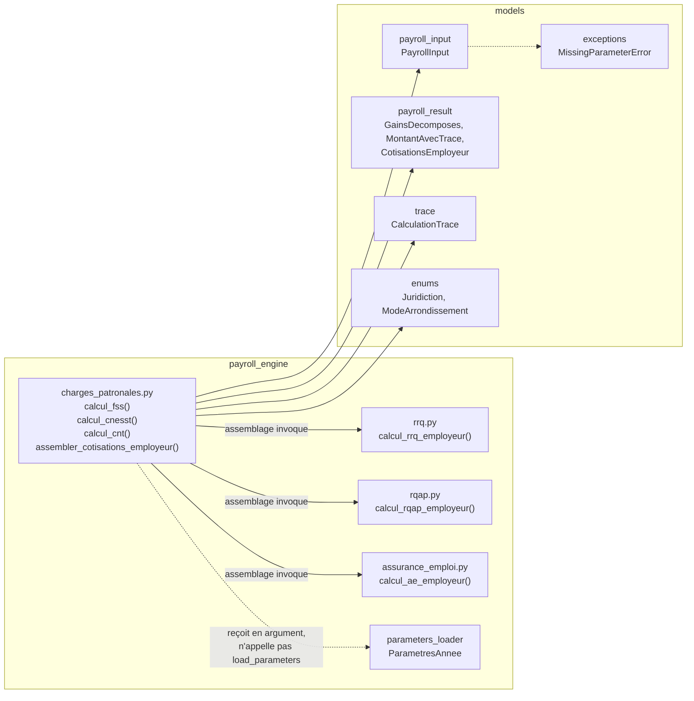

# Design Document

<!-- Document de design — charges-patronales. Les en-têtes structurels de niveau supérieur (Overview, Architecture, Components and Interfaces, Data Models, Correctness Properties, Error Handling, Testing Strategy) sont maintenus en anglais pour la conformité au format Kiro. Tout le contenu métier est rédigé en français. -->

## Overview

Cette spec livre **l'étape 5 du plan d'implémentation** (`docs/plan-implementation.md`), après `moteur-paie-contrats` (étape 1, socle contractuel figé), `gains-bruts-vacances-hs` (étape 2, `calcul_gains`), `cotisations-sociales-qc` (étape 3, RRQ/RQAP/AE employé et employeur) et `impots-retenues-source` (étape 4, impôt QC et fédéral). Elle ajoute au moteur de paie Camp LilySO **trois fonctions pures** qui calculent les **charges patronales** — FSS, CNESST, CNT — plus une **fonction d'assemblage** qui produit l'agrégat figé `CotisationsEmployeur`, à partir d'un `PayrollInput` figé, du `GainsDecomposes` produit par l'étape 2, et des paramètres annuels versionnés.

Elle **ne recalcule pas** le RRQ, le RQAP ni l'AE employeur (déjà livrés à l'étape 3) — l'assemblage les **invoque** telles quelles. Elle n'assemble **pas** le `PayrollResult` complet, ne calcule **pas** `net`, ni le champ `cout_employeur` lui-même, ni les cumuls YTD de fin de paie (étape 6, `net-cumuls-registre`). Elle **spécifie** la relation `cout_employeur = brut + total_cotisations_employeur` (Requirement 9) sans construire le `PayrollResult`.

### Livrables

| Fichier | Rôle |
|---|---|
| `payroll_engine/charges_patronales.py` | `calcul_fss`, `calcul_cnesst`, `calcul_cnt` (trois fonctions pures) + `assembler_cotisations_employeur` (assemblage). |
| `parameters/2026/quebec.json` (édition) | (a) Section `cnt` : renseigner `taux = "0.0006"`, `base_admissible = "103000.00"`, source `LE-39.0.2 (2026-01)` et date de consultation (Req 12.1, 12.2). (b) Section `cnesst` : **corriger les sous-libellés inversés** `taux_unite`/`taux_cni` (Req 5.7, règle 02) — sans toucher `taux_total`. |
| `models/trace.py` (extension du contrat `moteur-paie-contrats`) | Étendre la liste blanche `_SOURCES_OFFICIELLES_REGEX` pour admettre le motif `LE-39.0.2 <année>` (Req 5.7, Req 12.3). |
| `tests/payroll_engine/test_charges_patronales.py` | Property tests Hypothesis + tests d'exemple (FSS, CNESST, CNT, assemblage). |
| `tests/test_golden_outputs.py` (extension) | Assertions golden sur `cotisations_employeur.{fss,cnesst,cnt}` et `total_cotisations_employeur` des 6 fixtures QC001–QC006. |
| `tests/test_guards.py` (extension) | Nouvelles classes de garde pour `charges_patronales.py` : absence de `float`, absence de constante fiscale en dur, absence d'appel à `load_parameters`, absence de `UnsupportedPayrollCase`. |
| `tests/strategies.py` (extension) | Stratégies pour `brut_total` (dont `0.00`) et `ParametresAnnee` 2026 avec sections `fss`/`cnesst`/`cnt`. |
| `tests/fixtures/inputs/` + `tests/fixtures/outputs/` (régénération) | QC001–QC006 régénérées : CNT au taux `0,0006` (au lieu de `0,00`), sources corrigées CNESST/CNT, `total_cotisations_employeur` et `cout_employeur` recalculés (Req 11.4). |
| `docs/sources-officielles.md` (extension) | Consigner l'ajout de `LE-39.0.2` à la liste blanche et l'archivage du guide (Req 5.7, Req 12.3). |
| `docs/plan-implementation.md` (extension) | Consigner la déviation de nom de module `charges_patronales.py` (décision requirements n° 6). |
| `docs/cas-non-supportes.md` (extension) | Note documentaire : plafonds annuels CNESST/CNT (103 000 $) et table FSS par masse salariale, hors périmètre (Req 7.3). |

### Contrats consommés sans modification

Les socles `moteur-paie-contrats`, `cotisations-sociales-qc` et `impots-retenues-source` fournissent tout ce qu'il faut :

- `models.payroll_input.PayrollInput` — porte `pay_period.annee_fiscale`, `pay_period.nb_periodes_annuelles`, et `cumuls_debut` (lu par les fonctions employeur RRQ/RQAP/AE lors de l'assemblage).
- `models.payroll_result.GainsDecomposes` — fournit `brut_total`, **seule source** du Salaire_Assujetti.
- `models.payroll_result.MontantAvecTrace` — couple `(montant, trace)` porté par chaque champ de `CotisationsEmployeur`.
- `models.payroll_result.CotisationsEmployeur` — agrégat figé (six `MontantAvecTrace` + `cnesst_en_attente_classification` + `total_cotisations_employeur`, avec invariant de somme `model_validator`).
- `models.trace.CalculationTrace` — contrat de trace (règle 02). **Seule modification** : extension de la liste blanche pour `LE-39.0.2` (extension strictement additive, aucun motif existant retiré).
- `models.exceptions.MissingParameterError` — seule exception (hors bug interne) que ces fonctions peuvent propager.
- `payroll_engine.parameters_loader.ParametresAnnee`, `FSSParametres`, `CNESSTParametres`, `CNTParametres` — sections **déjà typées et matérialisées** (properties `Decimal`, lèvent `MissingParameterError` sur `"TO_FILL"`).
- `payroll_engine.rrq.calcul_rrq_employeur`, `payroll_engine.rqap.calcul_rqap_employeur`, `payroll_engine.assurance_emploi.calcul_ae_employeur` — fonctions employeur de l'étape 3, **invoquées telles quelles** par l'assemblage.

**Aucun contrat n'est redéfini.** Les sous-modèles `FSSParametres`, `CNESSTParametres`, `CNTParametres` existent déjà (spec `moteur-paie-contrats`) et exposent les propriétés matérialisées nécessaires — cette spec n'ajoute aucun champ typé, elle **renseigne** seulement les valeurs `TO_FILL` de la section `cnt` du fichier JSON et **corrige** deux sous-libellés de la section `cnesst`.

### Découverte de recherche déterminante — les valeurs officielles vérifiées au cent

Les valeurs suivantes ont été extraites et confirmées directement dans les guides officiels archivés dans `docs/sources-officielles/2026/` :

1. **FSS** (TP-1015.F 2026, p. 8 et § 5 « Formule pour le calcul de la cotisation au FSS ») : formule officielle `D2 = W × S2`, où `W` est le taux FSS (%) et `S2` les salaires de la période assujettis au FSS. Le taux Camp LilySO est **1,65 %** (masse salariale totale ≤ 1 000 000 $). La bande de réduction s'étend de > 1 M$ à < 7,8 M$ ; ≥ 7,8 M$ → 4,26 %. Camp LilySO ≈ 14 861,60 $ ≪ 1 M$ → taux unique **1,65 %** (la table par masse salariale reste hors périmètre, décision requirements n° 3). Paramètre : `parametres_annee.fss.taux_camp_lilyso_2026 = "0.0165"` (déjà renseigné, `VALIDE_WEBRAS_POUR_MASSE_ACTUELLE`).

2. **CNESST** (Décision de classification Camp LilySO + table des taux) : unité **57020**, taux total **1,12 %** par 100 $ de salaire assurable, décomposé en **taux de l'unité = 0,90** + **prime/CNI = 0,22** = 1,12. Calcul : `Taux_Total_CNESST × Salaire_Assujetti`, lu depuis `parametres_annee.cnesst.taux_total = "0.0112"`. **Correction de traçabilité requise (règle 02)** : dans `parameters/2026/quebec.json`, les sous-libellés sont **inversés** par rapport au document officiel — actuellement `taux_cni = "0.0090"` / `taux_unite = "0.0022"`, alors que la classification énonce « taux de l'unité = 0,90 » (donc `0.0090`) et « prime/CNI = 0,22 » (donc `0.0022`). Le total `0.0112` est **correct** (le calcul n'utilise que le total) ; cette spec corrige les libellés : `taux_unite = "0.0090"`, `taux_cni = "0.0022"`, avec commentaire citant la décision de classification. **Le total n'est pas modifié.**

3. **CNT** (LE-39.0.2 (2026-01)) : ligne 35 « Taux de cotisation = **0,06 %** » → `parametres_annee.cnt.taux = "0.0006"` ; ligne 29 « Montant maximal par employé = **103 000 $** » → `parametres_annee.cnt.base_admissible = "103000.00"` (jamais atteint au Camp LilySO → non appliqué comme plafond, décision requirements n° 4). Calcul : `Taux_CNT × Salaire_Assujetti`. La CNT est légalement annuelle (sommaire RLZ-1.ST) mais répartie par paie au taux 0,06 % (décision requirements n° 2). Absente de WebRAS par paie → validée par calcul direct `0,0006 × Salaire_Assujetti`. Source à ajouter à la liste blanche de `CalculationTrace` : motif `LE-39.0.2 <année>` (Req 5.7).

### Décisions structurantes retenues

1. **Trois fonctions pures + un assemblage, dans un module unique** — `payroll_engine/charges_patronales.py`. Les trois fonctions de calcul partagent la signature `(payroll_input, gains, parametres_annee) -> tuple[Decimal, CalculationTrace]` (Req 1.1) ; l'assemblage porte la signature `(payroll_input, gains, parametres_annee) -> CotisationsEmployeur` (Req 1.2).
2. **FSS, CNESST, CNT = même patron proportionnel simple** — `montant = arrondir(taux × brut_total)`, sans exemption, sans plafond, sans cumul YTD. C'est le patron le plus simple du moteur (plus simple encore que le RQAP employeur, qui plafonne). Aucune des trois n'applique de plafond annuel (décision n° 4, Req 2.7 / 3.7 / 4.7 / 7.2).
3. **Salaire_Assujetti unique** — `gains.brut_total` alimente indifféremment les trois assiettes (Req 1.5), cohérence transversale avec les étapes 3 et 4.
4. **FSS — taux unique** — usage exclusif de `fss.taux_camp_lilyso_2026` ; la `table_taux_par_masse_salariale` (`TO_FILL`) n'est **jamais** consultée (Req 2.7). La `masse_salariale_utilisee_webras_2026` est portée dans la trace à titre **documentaire** (justifie le choix du taux) sans entrer dans le calcul du montant de période (Req 5.2).
5. **CNESST — taux total uniquement** — le calcul lit `cnesst.taux_total` ; les sous-taux `taux_unite`/`taux_cni` (corrigés, Req 5.7) ne servent qu'à la traçabilité documentaire, jamais au calcul. Le drapeau `en_attente_classification` **n'annule pas** le calcul (taux provisoire, Req 3.8) : il est reporté tel quel dans `CotisationsEmployeur.cnesst_en_attente_classification` (Req 6.4, 9.3).
6. **CNT — taux par paie, sans plafond** — `base_admissible` est renseignée pour la trace mais **jamais** appliquée comme plafond (Req 4.7).
7. **Assemblage par invocation, jamais par recalcul** — `assembler_cotisations_employeur` **appelle** `calcul_rrq_employeur`, `calcul_rqap_employeur`, `calcul_ae_employeur` (étape 3) et `calcul_fss`, `calcul_cnesst`, `calcul_cnt` (cette spec), puis construit `CotisationsEmployeur` (Req 6). Aucune formule RRQ/RQAP/AE n'est réécrite (décision n° 1 des requirements).
8. **`total_cotisations_employeur` = somme exacte au cent des six montants** — chaque montant étant déjà arrondi à 2 décimales, leur somme est exacte au cent ; l'invariant de somme du contrat `CotisationsEmployeur` est satisfait sans ré-arrondissement (Req 6.5, 9.1).
9. **Arrondissement `ROUND_HALF_UP` à 2 décimales, une fois par montant théorique** — helper `_arrondir` dupliqué par convention contrôlée (comme les autres modules). Sous-totaux de trace exposés au cent (cohérence avec `impot_qc.py`/`impot_federal.py`, évite les faux positifs du test de garde « aucun `float` », règle 04 — voir note ci-dessous).
10. **Aucun nouveau garde-fou `UnsupportedPayrollCase`** — délégation totale aux garde-fous déjà portés par `PayrollInput`/`GainsDecomposes` (Req 7.1).
11. **Extension additive de la liste blanche `CalculationTrace`** — ajout du motif `LE-39.0.2 <année>`, seule modification d'un contrat figé, documentée dans `docs/sources-officielles.md` (Req 5.7).

> **Note de clarification (règle 04 — données sensibles)** — la mention « faux positifs NAS » du cadrage renvoie au test de garde qui détecte les littéraux numériques suspects dans le code. En exposant les sous-totaux de trace **au cent** (valeurs monétaires arrondies) plutôt que des valeurs brutes de pleine précision, on aligne `charges_patronales.py` sur `impot_qc.py`/`impot_federal.py` et on évite qu'un test de garde structurel ne signale à tort une constante numérique. Aucune donnée personnelle n'apparaît dans ce module : le corpus reste anonymisé QC001–QC006.

### Traçabilité requirement → composant

| Requirement | Composant de conception |
|---|---|
| Req 1 — Signatures, pureté | §Components §1 |
| Req 2 — FSS | §Components §2 |
| Req 3 — CNESST | §Components §3 |
| Req 4 — CNT | §Components §4 |
| Req 5 — Trace + liste blanche | §Components §2–§4, §Data Models (extension `trace.py`) |
| Req 6 — Assemblage | §Components §5 |
| Req 7 — Périmètre Camp LilySO | §Error Handling |
| Req 8 — Arrondissement | §Components §6 (helper partagé) |
| Req 9 — Relation `cout_employeur` | §Components §5, §Correctness Properties |
| Req 10 — Invariants PBT | §Correctness Properties |
| Req 11 — Corpus golden + régénération | §Testing Strategy |
| Req 12 — Complétude des paramètres | §Data Models, §Testing Strategy |

### Application explicite des 6 règles steering

- **Règle 01** — `Decimal` de bout en bout, helper d'arrondissement `quantize`, test de garde « aucun `float` ».
- **Règle 02** — chaque fonction retourne `(Decimal, CalculationTrace)` avec source officielle sur liste blanche : FSS → `"TP-1015.F <année>, section 5 — FSS"`, CNESST → URL `www.cnesst.gouv.qc.ca`, CNT → `"LE-39.0.2 <année>"` (nouveau motif). Correction des sous-libellés CNESST inversés.
- **Règle 03** — délégation totale aux garde-fous de `PayrollInput`/`GainsDecomposes` ; plafonds annuels et table FSS documentés hors périmètre.
- **Règle 04** — corpus QC001–QC006 anonymisé uniquement ; sous-totaux de trace exposés au cent.
- **Règle 05** — dépendance stricte à `ParametresAnnee` (taux FSS/CNESST/CNT lus depuis `quebec.json`), aucune valeur en dur, test de garde « aucune constante fiscale en dur ».
- **Règle 06** — property tests + golden tests écrits avant l'implémentation ; paramètres `cnt` complétés avant l'exécution des golden tests (Req 12).

---

## Architecture

### Placement dans l'arbre

```
payroll_engine/
├── __init__.py
├── parameters_loader.py         # existant (sections fss/cnesst/cnt déjà typées)
├── gains_bruts.py                # existant (étape 2)
├── rrq.py                        # existant (étape 3) — invoqué par l'assemblage
├── rqap.py                       # existant (étape 3) — invoqué par l'assemblage
├── assurance_emploi.py           # existant (étape 3) — invoqué par l'assemblage
├── impot_qc.py                   # existant (étape 4)
├── impot_federal.py              # existant (étape 4)
└── charges_patronales.py         # NOUVEAU — cette spec
```

Un module unique regroupe les trois charges patronales (formes de formule identiques : taux × assiette) et l'assemblage. Contrairement à l'étape 3 (trois modules), le regroupement en un seul fichier est justifié par la simplicité et l'homogénéité des trois calculs, et par le fait que l'assemblage a besoin des trois dans le même espace de noms.

### Dépendances entrantes



`charges_patronales.py` importe :

- `decimal.Decimal`, `decimal.ROUND_HALF_UP` (stdlib) ;
- `models.payroll_input.PayrollInput`, `models.payroll_result.GainsDecomposes`, `models.payroll_result.MontantAvecTrace`, `models.payroll_result.CotisationsEmployeur` ;
- `models.trace.CalculationTrace`, `models.enums.Juridiction`, `models.enums.ModeArrondissement` ;
- `payroll_engine.parameters_loader.ParametresAnnee` (typage du troisième argument uniquement) ;
- `payroll_engine.rrq.calcul_rrq_employeur`, `payroll_engine.rqap.calcul_rqap_employeur`, `payroll_engine.assurance_emploi.calcul_ae_employeur` (**pour l'assemblage seulement**).

Aucune nouvelle dépendance externe. Aucun logger, aucune sérialisation ajoutée.

### Contrainte de pureté

Identique aux étapes précédentes : aucun état de module mutable, aucune E/S, aucun appel à `datetime.now()`, aucune mutation des arguments (`frozen=True` structurel), thread-safe par construction (Req 1.3, 1.6, 1.7).

### Helper d'arrondissement — duplication contrôlée

Comme `rrq.py`/`rqap.py`/`assurance_emploi.py`/`impot_qc.py`/`impot_federal.py`, `charges_patronales.py` définit son propre helper privé `_arrondir` :

```python
_PRECISION_MONNAIE: Final[Decimal] = Decimal("0.01")

def _arrondir(montant: Decimal) -> Decimal:
    """Arrondit à 2 décimales selon ROUND_HALF_UP (Req 8, règle 01)."""
    return montant.quantize(_PRECISION_MONNAIE, rounding=ROUND_HALF_UP)
```

Même justification qu'aux étapes 3 et 4 : duplication triviale préférée à un module utilitaire transversal, pour ne pas coupler artificiellement des modules de calcul indépendants.

---

## Components and Interfaces

### 1. Signatures exactes

```python
from decimal import Decimal, ROUND_HALF_UP
from typing import Final

from models.enums import Juridiction, ModeArrondissement
from models.payroll_input import PayrollInput
from models.payroll_result import (
    CotisationsEmployeur,
    GainsDecomposes,
    MontantAvecTrace,
)
from models.trace import CalculationTrace
from payroll_engine.parameters_loader import ParametresAnnee


def calcul_fss(
    payroll_input: PayrollInput,
    gains: GainsDecomposes,
    parametres_annee: ParametresAnnee,
) -> tuple[Decimal, CalculationTrace]: ...


def calcul_cnesst(
    payroll_input: PayrollInput,
    gains: GainsDecomposes,
    parametres_annee: ParametresAnnee,
) -> tuple[Decimal, CalculationTrace]: ...


def calcul_cnt(
    payroll_input: PayrollInput,
    gains: GainsDecomposes,
    parametres_annee: ParametresAnnee,
) -> tuple[Decimal, CalculationTrace]: ...


def assembler_cotisations_employeur(
    payroll_input: PayrollInput,
    gains: GainsDecomposes,
    parametres_annee: ParametresAnnee,
) -> CotisationsEmployeur: ...
```

Ordre des arguments fixe, aucun défaut. Exceptions autorisées : `MissingParameterError` (propagée depuis `parametres_annee` ou depuis les fonctions employeur invoquées) et `pydantic.ValidationError` (bug interne uniquement — construction d'une `CalculationTrace` ou d'un `CotisationsEmployeur` invalide, chemin nominal inaccessible).

**Garde-fou de section manquante (Req 1.8)** : au début de chaque fonction de calcul, si la section requise est `None`, lever `MissingParameterError` avec un message actionnable :

```python
if parametres_annee.fss is None:
    raise MissingParameterError(
        "Section 'fss' absente des paramètres "
        f"({parametres_annee.annee}, {parametres_annee.juridiction}). "
        "Renseigner parameters/<AAAA>/quebec.json, section 'fss'."
    )
```

(idem `cnesst` pour `calcul_cnesst`, `cnt` pour `calcul_cnt`). Ce contrôle porte sur l'**absence de section** (`None`), distincte de l'absence de **valeur** (`"TO_FILL"`) qui est gérée par la propriété matérialisée du sous-modèle (voir §Error Handling).

### 2. `calcul_fss` (Requirement 2, Requirement 5, Requirement 8)

Algorithme :

```
salaire_assujetti = gains.brut_total
taux_fss           = parametres_annee.fss.taux_camp_lilyso_2026        # Decimal("0.0165")
masse_salariale     = parametres_annee.fss.masse_salariale_utilisee_webras_2026  # documentaire
montant             = _arrondir(taux_fss * salaire_assujetti)
```

Aucune exemption, aucun plafond, aucun cumul. La `table_taux_par_masse_salariale` n'est **jamais** lue (Req 2.7). Lorsque `salaire_assujetti == Decimal("0.00")`, `montant == Decimal("0.00")` sans branche dédiée (Req 2.5).

Trace :

| Champ | Valeur |
|---|---|
| `source` | `f"TP-1015.F {annee_fiscale}, section 5 — FSS"` |
| `annee` | `payroll_input.pay_period.annee_fiscale` |
| `juridiction` | `Juridiction.QUEBEC` |
| `section` | `"5 — Fonds des services de santé (FSS)"` |
| `parametres_utilises` | `{"taux_fss": taux_fss}` |
| `entrees` | `{"salaire_assujetti": salaire_assujetti, "masse_salariale_annuelle": masse_salariale}` |
| `sous_totaux` | `{"cotisation_brute": montant}` |
| `mode_arrondissement` | `ModeArrondissement.ROUND_HALF_UP` |
| `precision_arrondissement` | `2` |
| `resultat` | `montant` |

La `masse_salariale_annuelle` figure dans `entrees` **à titre documentaire** (Req 5.2) : elle justifie le choix du taux unique 1,65 % mais n'entre pas dans le calcul. Le sous-total `cotisation_brute` est exposé au cent (déjà arrondi).

### 3. `calcul_cnesst` (Requirement 3, Requirement 5, Requirement 8)

Algorithme :

```
salaire_assujetti = gains.brut_total
taux_total         = parametres_annee.cnesst.taux_total          # Decimal("0.0112")
unite               = parametres_annee.cnesst.unite               # "57020" (str)
montant             = _arrondir(taux_total * salaire_assujetti)
```

Aucun plafond annuel de salaire assujetti (Req 3.7, décision n° 4). Le drapeau `en_attente_classification` **n'est pas lu ici** (il ne change pas le calcul de période) — il est lu par l'assemblage pour renseigner `CotisationsEmployeur.cnesst_en_attente_classification` (Req 3.8, Req 6.4). Lorsque `salaire_assujetti == Decimal("0.00")`, `montant == Decimal("0.00")` (Req 3.5).

Trace :

| Champ | Valeur |
|---|---|
| `source` | URL officielle sur `www.cnesst.gouv.qc.ca` (voir note ci-dessous) |
| `annee` | `payroll_input.pay_period.annee_fiscale` |
| `juridiction` | `Juridiction.QUEBEC` |
| `section` | `f"Classification CNESST — unité {unite}"` |
| `parametres_utilises` | `{"taux_total_cnesst": taux_total}` |
| `entrees` | `{"salaire_assujetti": salaire_assujetti}` |
| `sous_totaux` | `{"cotisation_brute": montant}` |
| `mode_arrondissement` | `ModeArrondissement.ROUND_HALF_UP` |
| `precision_arrondissement` | `2` |
| `resultat` | `montant` |

**Note sur la source CNESST** : la liste blanche de `CalculationTrace` admet déjà toute URL `^https?://[a-z0-9\-\.]+\.gouv\.qc\.ca/.+$`. La source CNESST est donc une **URL officielle concrète avec chemin** sur `www.cnesst.gouv.qc.ca` (par exemple la page des taux de prime / classification), à figer par la phase de tâches à partir du guide archivé dans `docs/sources-officielles/2026/` (Req 5.3). L'`unite` (chaîne `"57020"`) est portée dans `section` (le contrat `parametres_utilises` est typé `dict[str, Decimal]` et ne peut pas contenir la chaîne d'unité ; l'unité est donc exposée dans le champ texte `section`, ce qui satisfait Req 5.3 « exposer l'Unite_CNESST »).

### 4. `calcul_cnt` (Requirement 4, Requirement 5, Requirement 8)

Algorithme :

```
salaire_assujetti = gains.brut_total
taux_cnt           = parametres_annee.cnt.taux              # Decimal("0.0006")
base_admissible     = parametres_annee.cnt.base_admissible   # Decimal("103000.00") — documentaire
montant             = _arrondir(taux_cnt * salaire_assujetti)
```

Aucun plafond appliqué : `base_admissible` est lue **uniquement** pour la trace, jamais comparée au salaire (Req 4.7, décision n° 4). Lorsque `salaire_assujetti == Decimal("0.00")`, `montant == Decimal("0.00")` (Req 4.5).

Trace :

| Champ | Valeur |
|---|---|
| `source` | `f"LE-39.0.2 {annee_fiscale}"` (**nouveau motif de liste blanche**) |
| `annee` | `payroll_input.pay_period.annee_fiscale` |
| `juridiction` | `Juridiction.QUEBEC` |
| `section` | `"Normes du travail — cotisation (ligne 35)"` |
| `parametres_utilises` | `{"taux_cnt": taux_cnt, "base_admissible": base_admissible}` |
| `entrees` | `{"salaire_assujetti": salaire_assujetti}` |
| `sous_totaux` | `{"cotisation_brute": montant}` |
| `mode_arrondissement` | `ModeArrondissement.ROUND_HALF_UP` |
| `precision_arrondissement` | `2` |
| `resultat` | `montant` |

La `base_admissible` figure dans `parametres_utilises` **à titre documentaire** (Req 4.7, 5.4). La source `LE-39.0.2 <année>` exige l'extension de la liste blanche (§Data Models, Req 5.7).

### 5. `assembler_cotisations_employeur` (Requirement 6, Requirement 9)

Algorithme — **invocation, jamais recalcul** :

```
# --- Trois cotisations sociales employeur (étape 3, invoquées telles quelles) ---
rrq_er_montant,  rrq_er_trace  = calcul_rrq_employeur(payroll_input, gains, parametres_annee)
rqap_er_montant, rqap_er_trace = calcul_rqap_employeur(payroll_input, gains, parametres_annee)
ae_er_montant,   ae_er_trace   = calcul_ae_employeur(payroll_input, gains, parametres_annee)

# --- Trois charges patronales (cette spec) ---
fss_montant,    fss_trace    = calcul_fss(payroll_input, gains, parametres_annee)
cnesst_montant, cnesst_trace = calcul_cnesst(payroll_input, gains, parametres_annee)
cnt_montant,    cnt_trace    = calcul_cnt(payroll_input, gains, parametres_annee)

# --- Drapeau CNESST (lu, jamais recalculé) ---
en_attente = parametres_annee.cnesst.en_attente_classification   # bool

# --- Somme au cent (chaque montant déjà arrondi à 2 décimales) ---
total = (rrq_er_montant + rqap_er_montant + ae_er_montant
         + fss_montant + cnesst_montant + cnt_montant)

return CotisationsEmployeur(
    rrq_employeur=MontantAvecTrace(montant=rrq_er_montant, trace=rrq_er_trace),
    rqap_employeur=MontantAvecTrace(montant=rqap_er_montant, trace=rqap_er_trace),
    ae_employeur=MontantAvecTrace(montant=ae_er_montant, trace=ae_er_trace),
    fss=MontantAvecTrace(montant=fss_montant, trace=fss_trace),
    cnesst=MontantAvecTrace(montant=cnesst_montant, trace=cnesst_trace),
    cnesst_en_attente_classification=en_attente,
    cnt=MontantAvecTrace(montant=cnt_montant, trace=cnt_trace),
    total_cotisations_employeur=total,
)
```

Points clés :

- **Invocation stricte** (Req 6.1, 6.2) : les six montants proviennent d'appels aux fonctions dédiées ; aucune formule RRQ/RQAP/AE n'est réécrite.
- **Somme exacte au cent** (Req 6.5, 9.1) : chaque montant étant un `Decimal` à 2 décimales, `total` est déjà à 2 décimales — l'invariant `model_validator` de `CotisationsEmployeur` (`total == somme des six`) passe sans ré-arrondissement. Aucun `_arrondir` supplémentaire n'est appliqué au total (l'appliquer serait neutre mais inutile ; on préfère ne pas masquer une éventuelle dérive).
- **Drapeau non modifiant** (Req 6.4, 9.3) : `cnesst_en_attente_classification` est reporté depuis les paramètres ; `cnesst.montant` (même provisoire) est **toujours** inclus dans `total`.
- **Propagation des exceptions** (Req 6.7) : si une fonction invoquée lève `MissingParameterError`, l'assemblage la laisse remonter sans interception.
- **Pureté** (Req 6.6) : aucune mutation d'argument, aucun état.

**Relation `cout_employeur` (Req 9.2)** : `cout_employeur = gains.brut_total + total_cotisations_employeur` est un invariant **déjà porté par le contrat `PayrollResult`** ; sa vérification effective relève de l'étape 6. Cette spec ne construit pas le `PayrollResult` et se contente de garantir `total_cotisations_employeur` correct.

### 6. Helper d'arrondissement (Requirement 8)

Voir §Architecture. Appelé **exactement une fois** par montant théorique dans chacune des trois fonctions de calcul (`_arrondir(taux × brut_total)`). Jamais appliqué à une valeur reçue déjà arrondie (`gains.brut_total`), ni au total de l'assemblage. Le mode `ROUND_HALF_UP` et la précision `2` sont consignés dans chaque trace (Req 8.4).

### 7. Ordre d'exécution (invariant de reproduction)

Pour chacune des trois fonctions de calcul :

1. Contrôle de section (`None` → `MissingParameterError`, Req 1.8).
2. Lecture du Salaire_Assujetti (`gains.brut_total`).
3. Lecture des paramètres pertinents (déclenche potentiellement `MissingParameterError` sur `"TO_FILL"`).
4. Calcul et arrondissement de `montant`.
5. Construction de la `CalculationTrace`.
6. Retour du tuple `(montant, trace)`.

Pour l'assemblage : appels dans l'ordre RRQ_er → RQAP_er → AE_er → FSS → CNESST → CNT, lecture du drapeau, somme, construction de `CotisationsEmployeur`. Cet ordre garantit le déterminisme (deux appels identiques → deux résultats égaux au sens `==`).

---

## Data Models

**Aucun nouveau modèle n'est introduit par cette spec.** Les sous-modèles nécessaires existent déjà.

| Modèle | Package | Rôle |
|---|---|---|
| `PayrollInput` | `models.payroll_input` | Argument d'entrée. Fournit `pay_period.annee_fiscale` (trace) et `cumuls_debut` (lu par les fonctions employeur invoquées). |
| `GainsDecomposes` | `models.payroll_result` | Argument d'entrée. Fournit `brut_total` (Salaire_Assujetti unique). |
| `MontantAvecTrace` | `models.payroll_result` | Couple `(montant, trace)` de chaque champ de `CotisationsEmployeur`. |
| `CotisationsEmployeur` | `models.payroll_result` | Produit par l'assemblage. Six `MontantAvecTrace` + `cnesst_en_attente_classification` + `total_cotisations_employeur`, avec invariant de somme `model_validator`. |
| `ParametresAnnee` | `payroll_engine.parameters_loader` | Troisième argument. Fournit les sections `fss`, `cnesst`, `cnt` (optionnelles, `| None`). |
| `FSSParametres` | `payroll_engine.parameters_loader` | **Champs consommés** : `taux_camp_lilyso_2026` (calcul), `masse_salariale_utilisee_webras_2026` (trace documentaire). `table_taux_par_masse_salariale` **non consommée**. |
| `CNESSTParametres` | `payroll_engine.parameters_loader` | **Champs consommés** : `taux_total` (calcul), `unite` (trace), `en_attente_classification` (assemblage). Sous-taux `taux_unite`/`taux_cni` **non consommés** par le calcul mais **corrigés** pour la traçabilité (Req 5.7). |
| `CNTParametres` | `payroll_engine.parameters_loader` | **Champs consommés** : `taux` (calcul), `base_admissible` (trace documentaire). Actuellement `"TO_FILL"` → **à renseigner** (Req 12.1). |
| `CalculationTrace` | `models.trace` | Second élément de chaque tuple. **Liste blanche à étendre** pour `LE-39.0.2`. |
| `Juridiction`, `ModeArrondissement` | `models.enums` | Valeurs de trace. |
| `MissingParameterError` | `models.exceptions` | Seule exception (hors bug interne) propagée. |

### Édition des paramètres `parameters/2026/quebec.json`

**Section `cnt`** — remplacement des sentinelles `"TO_FILL"` (Req 12.1, 12.2) :

```json
"cnt": {
  "commentaire": "Cotisation relative aux normes du travail (LE-39.0.2 (2026-01)). Ligne 35 : taux 0,06 %. Ligne 29 : montant maximal par employé 103 000 $ (jamais atteint au Camp LilySO, non appliqué comme plafond — décision requirements n° 4). Répartie par paie au taux 0,06 % (décision requirements n° 2). Absente de WebRAS par paie ; validée par calcul direct 0,0006 × salaire assujetti.",
  "source": "LE-39.0.2 (2026-01)",
  "date_consultation": "AAAA-MM-JJ",
  "taux": "0.0006",
  "base_admissible": "103000.00",
  "statut": "VALIDE_LE_39_0_2_2026"
}
```

**Section `cnesst`** — correction des sous-libellés inversés (Req 5.7, règle 02), **sans toucher `taux_total`** :

```json
"cnesst": {
  "commentaire": "Classification et taux confirmés officiellement par la CNESST pour Camp LilySO. Décision de classification : « taux de l'unité = 0,90 » (taux_unite = 0.0090), « prime/CNI = 0,22 » (taux_cni = 0.0022). Sous-libellés corrigés (spec charges-patronales) : ils étaient inversés dans la version antérieure. Seul taux_total = 0.0112 est consommé par le calcul ; les sous-taux servent à la traçabilité (règle 02).",
  "statut": "VALIDE_OFFICIEL",
  "unite": "57020",
  "taux_unite": "0.0090",
  "taux_cni": "0.0022",
  "taux_total": "0.0112",
  "en_attente_classification": false
}
```

> **Invariant de contrôle (facultatif, non bloquant)** : `taux_unite + taux_cni == taux_total` (`0.0090 + 0.0022 == 0.0112`). Cette égalité peut être vérifiée par un test d'exemple, mais le calcul de période n'utilise **que** `taux_total` — la correction des sous-libellés est une exigence de traçabilité (règle 02), pas de calcul.

Les paramètres FSS (`taux_camp_lilyso_2026 = "0.0165"`) et CNESST (`taux_total = "0.0112"`, `en_attente_classification = false`), déjà renseignés et validés, **ne sont pas modifiés** par cette spec (Req 12.4).

### Extension de la liste blanche `CalculationTrace` (`models/trace.py`)

Ajout d'un motif à `_SOURCES_OFFICIELLES_REGEX` (Req 5.7, Req 12.3) :

```python
_SOURCES_OFFICIELLES_REGEX: tuple[str, ...] = (
    r"^TP-1015\.F \d{4}(, section .+)?$",
    r"^TP-1015\.G \d{4}(, section .+)?$",
    r"^TP-1015\.3 \d{4}(, section .+)?$",
    r"^T4127 \d{4}(, section .+)?$",
    r"^TD1 \d{4}(, section .+)?$",
    r"^Guide de l'employeur ARC \d{4}(, section .+)?$",
    r"^LE-39\.0\.2 \d{4}(, .+)?$",          # NOUVEAU — cotisation CNT (Req 5.7)
    r"^https?://[a-z0-9\-\.]+\.gouv\.qc\.ca/.+$",
    r"^https?://[a-z0-9\-\.]+\.canada\.ca/.+$",
)
```

Extension **strictement additive** : aucun motif existant n'est retiré ni modifié. Le formulaire `LE-39.0.2` (Déclaration pour la cotisation des normes du travail, Revenu Québec) est un document officiel `.gouv.qc.ca` ; son ajout est documenté dans `docs/sources-officielles.md` avec la référence au guide archivé dans `docs/sources-officielles/2026/` (règle 02). La source CNESST utilise le motif URL `.gouv.qc.ca` déjà présent, sans extension.

---

## Correctness Properties

*A property is a characteristic or behavior that should hold true across all valid executions of a system-essentially, a formal statement about what the system should do. Properties serve as the bridge between human-readable specifications and machine-verifiable correctness guarantees.*

Le property-based testing (PBT) est **applicable** aux trois fonctions de calcul et à l'assemblage : chacune est une fonction pure, `Decimal` de bout en bout, sans I/O et sans état — le prototype idéal pour Hypothesis. Chaque propriété ci-dessous doit être implémentée avec **au minimum 100 itérations** (défaut `hypothesis.settings`) et **taguée** en commentaire `# Feature: charges-patronales, Property N: <titre>`.

Toutes les propriétés partagent une **stratégie de génération commune** (§Testing Strategy) : un `PayrollInput` valide, un `GainsDecomposes` valide (`brut_total ≥ 0`, biaisé vers `0.00` et vers de grandes valeurs), et le `ParametresAnnee` réel 2026 (sections `fss`/`cnesst`/`cnt` renseignées) chargé une seule fois. Les propriétés « formule », « non-négativité », « monotonie », « forme Decimal » et « conformité de trace » sont **paramétrées sur les trois fonctions** `calcul_fss`/`calcul_cnesst`/`calcul_cnt` plutôt que dupliquées.

### Property 1: Déterminisme (pureté)

*For any* `PayrollInput`, `GainsDecomposes` et `ParametresAnnee` valides, pour chacune des trois fonctions de calcul `f` et pour l'assemblage `assembler_cotisations_employeur`, deux appels avec les mêmes arguments produisent des résultats égaux au sens `==` (montant et trace pour les fonctions de calcul ; l'objet `CotisationsEmployeur` complet pour l'assemblage).

**Validates: Requirements 1.3, 6.6, 10.4**

### Property 2: Formule proportionnelle et arrondissement

*For any* `PayrollInput`, `GainsDecomposes` et `ParametresAnnee` valides, chacune des trois fonctions retourne un montant égal à `arrondir(taux × gains.brut_total)`, où `taux` est le taux propre à la fonction (`fss.taux_camp_lilyso_2026`, `cnesst.taux_total`, `cnt.taux` respectivement), `arrondir` étant `quantize(Decimal("0.01"), rounding=ROUND_HALF_UP)`. En conséquence, l'écart entre le montant retourné et le montant théorique `taux × brut_total` est borné par un demi-cent. Aucune exemption n'est soustraite.

**Validates: Requirements 2.1, 2.2, 3.1, 3.2, 4.1, 4.2, 8.1, 8.2, 10.3**

### Property 3: Non-négativité

*For any* `PayrollInput`, `GainsDecomposes` avec `brut_total ≥ 0` et `ParametresAnnee` valides, chacune des trois fonctions retourne un montant `≥ Decimal("0.00")`.

**Validates: Requirements 2.4, 3.4, 4.4, 10.1**

### Property 4: Zéro lorsque le salaire assujetti est nul

*For any* `PayrollInput`, `GainsDecomposes` avec `brut_total == Decimal("0.00")` et `ParametresAnnee` valides, chacune des trois fonctions retourne `Decimal("0.00")` sans lever d'exception.

**Validates: Requirements 2.5, 3.5, 4.5**

### Property 5: Monotonie croissante par rapport au salaire assujetti

*For any* `PayrollInput`, `ParametresAnnee` valides et deux `GainsDecomposes` `g1`, `g2` tels que `g1.brut_total ≤ g2.brut_total`, chacune des trois fonctions produit `montant(g1) ≤ montant(g2)` (à taux fixé).

**Validates: Requirements 10.2**

### Property 6: Forme `Decimal` du résultat et de la trace (aucun `float`)

*For any* `PayrollInput`, `GainsDecomposes` et `ParametresAnnee` valides, pour chacune des trois fonctions et pour l'assemblage, le montant retourné et chaque valeur contenue dans `trace.parametres_utilises`, `trace.entrees`, `trace.sous_totaux` et `trace.resultat` satisfont : `isinstance(v, Decimal)`, `v.is_finite()`, et le montant retourné est arrondi à 2 décimales (`v == v.quantize(Decimal("0.01"), rounding=ROUND_HALF_UP)`). Le `total_cotisations_employeur` de l'assemblage est également un `Decimal` fini à 2 décimales.

**Validates: Requirements 2.6, 3.6, 4.6, 8.3, 10.5**

### Property 7: Indépendance vis-à-vis des champs non pertinents de `payroll_input`

*For any* `GainsDecomposes` et `ParametresAnnee` valides, et deux `PayrollInput` `pi1`, `pi2` identiques sur `pay_period.annee_fiscale` mais différant sur des champs non liés au salaire assujetti (par exemple `cumuls_debut`, montants TP-1015.3/TD1), chacune des trois fonctions produit le même montant — le Salaire_Assujetti est lu exclusivement depuis `gains.brut_total`.

**Validates: Requirements 1.5**

### Property 8: Insensibilité aux paramètres non consommés et absence de plafond

*For any* `PayrollInput`, `GainsDecomposes` (y compris `brut_total` très élevé, au-delà de `103 000 $ / nb_periodes`) et deux `ParametresAnnee` différant **uniquement** sur des champs non consommés par le calcul de période, les montants sont identiques :

- **FSS** — le montant ne dépend ni de `fss.masse_salariale_utilisee_webras_2026` ni de `fss.table_taux_par_masse_salariale` (jamais consultée) ;
- **CNESST** — le montant ne dépend pas de `cnesst.en_attente_classification` (taux provisoire calculé quand même) ni des sous-taux `taux_unite`/`taux_cni` ;
- **CNT** — le montant ne dépend pas de `cnt.base_admissible` (jamais appliquée comme plafond).

De plus, à `brut_total` élevé, chaque montant reste égal à `arrondir(taux × brut_total)` sans aucun plafonnement.

**Validates: Requirements 2.7, 3.7, 3.8, 4.7, 7.2**

### Property 9: Conformité et contenu de la trace

*For any* `PayrollInput`, `GainsDecomposes` et `ParametresAnnee` valides, pour chacune des trois fonctions, la trace retournée satisfait :

- `trace` est une `CalculationTrace` valide, `trace.resultat == montant` retourné (cohérence trace ↔ montant) ;
- `trace.annee == payroll_input.pay_period.annee_fiscale`, `trace.mode_arrondissement == ModeArrondissement.ROUND_HALF_UP`, `trace.precision_arrondissement == 2`, `trace.juridiction == Juridiction.QUEBEC` ;
- **FSS** : `trace.source` matche `"TP-1015.F <année>, section 5 — FSS"` ; `parametres_utilises` contient le taux FSS ; `entrees` contient `salaire_assujetti` et `masse_salariale_annuelle` ;
- **CNESST** : `trace.source` matche une URL `www.cnesst.gouv.qc.ca` ; `parametres_utilises` contient le taux total ; `section` contient l'unité `57020` ; `entrees` contient `salaire_assujetti` ;
- **CNT** : `trace.source == "LE-39.0.2 <année>"` ; `parametres_utilises` contient le taux CNT et `base_admissible` ; `entrees` contient `salaire_assujetti`.

**Validates: Requirements 5.1, 5.2, 5.3, 5.4, 5.5, 5.6, 8.4**

### Property 10: Assemblage par invocation sans recalcul

*For any* `PayrollInput`, `GainsDecomposes` et `ParametresAnnee` valides, l'objet `CotisationsEmployeur` produit par `assembler_cotisations_employeur` satisfait, champ par champ :

- `cot.rrq_employeur.montant == calcul_rrq_employeur(pi, g, p)[0]`, `cot.rqap_employeur.montant == calcul_rqap_employeur(pi, g, p)[0]`, `cot.ae_employeur.montant == calcul_ae_employeur(pi, g, p)[0]` ;
- `cot.fss.montant == calcul_fss(pi, g, p)[0]`, `cot.cnesst.montant == calcul_cnesst(pi, g, p)[0]`, `cot.cnt.montant == calcul_cnt(pi, g, p)[0]` ;
- chaque champ est un `MontantAvecTrace` dont la `trace` provient de la fonction correspondante.

**Validates: Requirements 6.1, 6.2, 6.3**

### Property 11: Report du drapeau CNESST sans effet sur le total

*For any* `PayrollInput`, `GainsDecomposes` et `ParametresAnnee` valides, `cot.cnesst_en_attente_classification == parametres_annee.cnesst.en_attente_classification`, et le `total_cotisations_employeur` est identique que le drapeau vaille `true` ou `false` (le `cnesst.montant`, même provisoire, est toujours inclus dans la somme).

**Validates: Requirements 6.4, 9.3**

### Property 12: Identité d'agrégation

*For any* `PayrollInput`, `GainsDecomposes` et `ParametresAnnee` valides, `cot.total_cotisations_employeur` égale, au cent près, la somme des six montants employeur (`rrq_employeur + rqap_employeur + ae_employeur + fss + cnesst + cnt`) — invariant également imposé par le `model_validator` du contrat `CotisationsEmployeur`.

**Validates: Requirements 6.5, 9.1, 10.6**

### Property 13: Propagation de `MissingParameterError` sans interception

*For any* `PayrollInput` et `GainsDecomposes` valides, et pour tout `ParametresAnnee` où un champ consommé par l'une des fonctions est marqué `"TO_FILL"` (par exemple `cnt.taux`) ou dont une section requise est `None`, l'appel à la fonction concernée — et par transitivité l'assemblage — lève `MissingParameterError` (jamais une autre exception, ni une exception interceptée puis masquée).

**Validates: Requirements 1.8, 6.7**

---

## Error Handling

### Matrice des exceptions

| Condition | Exception levée | Origine | Test | Requirements |
|---|---|---|---|---|
| Section requise absente (`parametres_annee.fss`/`.cnesst`/`.cnt` == `None`) | `MissingParameterError` | **Levée** en tête de la fonction concernée (message identifiant la section) | Test d'exemple + Property 13 | 1.8 |
| Un champ consommé (`fss.taux_camp_lilyso_2026`, `cnesst.taux_total`, `cnt.taux`, `cnt.base_admissible`, `fss.masse_salariale_utilisee_webras_2026`) est marqué `"TO_FILL"` | `MissingParameterError` | **Propagée** — levée par la propriété matérialisée du sous-modèle (`moteur-paie-contrats`) | Property 13 | 1.8, 12.1 |
| Une fonction employeur invoquée (RRQ/RQAP/AE) lève `MissingParameterError` | `MissingParameterError` | **Propagée** — non interceptée par l'assemblage | Property 13 | 6.7 |
| Construction interne d'une `CalculationTrace` ou d'un `CotisationsEmployeur` avec un invariant violé (bug de refactoring, inaccessible en nominal) | `pydantic.ValidationError` | **Propagée** — levée par le constructeur du modèle | Non testée directement — Property 1 couvre la non-régression | 1.3 |

### Distinction section absente vs valeur absente

- **Section absente** (`None`) : `calcul_fss`/`calcul_cnesst`/`calcul_cnt` testent explicitement `parametres_annee.<section> is None` en tête et lèvent `MissingParameterError` avec un message pointant la section à renseigner (Req 1.8). Ce contrôle est nécessaire car `ParametresAnnee.<section>` est typé `| None`.
- **Valeur absente** (`"TO_FILL"`) : aucun contrôle explicite dans `charges_patronales.py` — l'accès à la propriété matérialisée (`.taux`, `.taux_total`, etc.) lève `MissingParameterError` avec un message contextualisé (année, juridiction, fichier, source officielle) déjà porté par `_ParametresSectionBase._materialiser`. Cette spec ne redouble pas ce mécanisme.

### Aucun nouveau garde-fou `UnsupportedPayrollCase`

Cette spec **n'introduit aucun** garde-fou `UnsupportedPayrollCase` (Req 7.1). Les fonctions comptent entièrement sur les refus déjà portés à la construction par `PayrollInput` (province Québec, fréquence aux deux semaines, taux de vacances ∈ `{0.04, 0.06}`) et par `GainsDecomposes` (`brut_total ≥ 0`) — elles ne re-testent aucun de ces invariants. Un test de garde vérifie l'absence du token `UnsupportedPayrollCase` dans le module.

### Hors périmètre — plafonds annuels et table FSS (Req 7.3)

- **Plafond annuel CNESST/CNT** (103 000 $ par employé) : jamais atteint au Camp LilySO, non appliqué (décision n° 4). `base_admissible` est portée dans la trace CNT à titre documentaire mais jamais comparée.
- **Table FSS par masse salariale** (`table_taux_par_masse_salariale`, `"TO_FILL"`) : jamais consultée ; le premier seuil de changement de taux (masse ≥ 1 M$) n'est jamais atteint.

Ces trois éléments sont documentés dans `docs/cas-non-supportes.md` avec la mention qu'une extension future exigerait un golden test dédié avant activation (règle 03).

### Ce que les fonctions NE font PAS

- Elles **ne re-testent pas** la province, la fréquence, le taux de vacances, ni la non-négativité de `brut_total` (Req 7.1).
- Elles **ne transforment pas** une exception en une autre : `MissingParameterError` remonte inchangée (Req 6.7).
- Elles **n'interceptent** ni ne masquent `pydantic.ValidationError` — une violation d'invariant interne reste visible comme un bug.

---

## Testing Strategy

### Approche duale

- **Property tests** (Hypothesis) — valident les 13 propriétés §Correctness Properties sur une plage étendue de `brut_total` (dont `0.00` et des valeurs très élevées), croisées sur les trois fonctions et l'assemblage.
- **Golden tests** — vérifient la reproduction au cent près de `cotisations_employeur.{fss,cnesst,cnt}.montant`, du drapeau `cnesst_en_attente_classification` et de `total_cotisations_employeur` des 6 fixtures QC001–QC006 régénérées (Req 11).
- **Tests de garde** — introspection statique de `payroll_engine/charges_patronales.py` (absence de `float`, absence de constante fiscale en dur, absence d'appel à `load_parameters`, absence de `UnsupportedPayrollCase`).
- **Tests d'exemple** — signatures exactes, import sans effet de bord, section `None` → `MissingParameterError`, acceptation de la source `LE-39.0.2 2026` par `CalculationTrace`, édition de config (`cnt` renseignée, sous-libellés CNESST corrigés, valeurs FSS/CNESST total inchangées).

### Organisation des fichiers de test

```
tests/
├── payroll_engine/
│   ├── test_charges_patronales.py    # NOUVEAU — property tests + tests d'exemple
│   └── ...                            # existants
├── models/
│   └── test_trace.py                  # existant — extension : LE-39.0.2 accepté par la liste blanche
├── test_golden_outputs.py             # existant — extension : fss/cnesst/cnt + total sur QC001-QC006
├── test_guards.py                     # existant — extension : classes de garde charges_patronales
└── strategies.py                      # existant — extension : brut_total (dont 0), ParametresAnnee 2026 fss/cnesst/cnt
```

### Détail des golden tests (extension de `tests/test_golden_outputs.py`)

```python
@pytest.mark.golden
@pytest.mark.parametrize("scenario_id", ["QC001", "QC002", "QC003", "QC004", "QC005", "QC006"])
def test_charges_patronales_reproduisent_fixture(scenario_id: str) -> None:
    """Reproduit fss/cnesst/cnt et le total au cent près (Requirement 11)."""
    payroll_input = charger_fixture_input(scenario_id)
    gains = charger_fixture_gains(scenario_id)
    parametres = load_parameters(2026, Juridiction.QUEBEC)
    sortie = charger_fixture_output(scenario_id)["cotisations_employeur"]

    fss, trace_fss = calcul_fss(payroll_input, gains, parametres)
    cnesst, _ = calcul_cnesst(payroll_input, gains, parametres)
    cnt, _ = calcul_cnt(payroll_input, gains, parametres)
    cot = assembler_cotisations_employeur(payroll_input, gains, parametres)

    assert fss == Decimal(sortie["fss"]["montant"])
    assert cnesst == Decimal(sortie["cnesst"]["montant"])
    assert cnt == Decimal(sortie["cnt"]["montant"])
    assert cot.cnesst_en_attente_classification == sortie["cnesst_en_attente_classification"]
    assert cot.total_cotisations_employeur == Decimal(sortie["total_cotisations_employeur"])
    assert trace_fss.resultat == fss  # cohérence trace/montant (Req 5.5)
```

### Régénération du corpus golden QC001–QC006 (Req 11.4)

Les fixtures portaient `cnt = 0,00` et des sources incorrectes. Elles sont **régénérées** pour :

1. **CNT** — porter `calcul_cnt` au taux `0,0006` (= `arrondir(0,0006 × brut_total)`) au lieu de `0,00`.
2. **Sources corrigées** — `cnesst.trace.source` → URL `www.cnesst.gouv.qc.ca` ; `cnt.trace.source` → `LE-39.0.2 2026`. L'attribution `TP-1015.F ... — CNESST/CNT` d'origine est supprimée (Req 5.7).
3. **Totaux recalculés** — `total_cotisations_employeur` et `cout_employeur` recalculés pour intégrer la CNT désormais non nulle (Req 11.4c).

**Validation** (Req 11.5) : FSS et CNESST restent exacts au cent contre WebRAS ; la CNT, absente de WebRAS par paie, est validée contre `0,0006 × Salaire_Assujetti` de la LE-39.0.2. La régénération est consignée dans `docs/journal-validation.md`.

### Détail des tests de garde (extension de `tests/test_guards.py`)

| Classe | Couvre | Mécanisme |
|---|---|---|
| `TestChargesPatronalesNoFloat` | Req 2.6, 3.6, 4.6, 8.3 | Parse le module avec `ast`, vérifie l'absence de `ast.Constant(value=float)`, d'appel `Decimal(<non-str>)`, de `round`/`math.floor`/`math.ceil`/`math.trunc`. |
| `TestChargesPatronalesNoHardcodedFiscalValues` | Req 2.3, 3.3, 4.3, règle 05 | Lecture ligne par ligne, absence de toute constante `Decimal` autre que `Decimal("0.00")` (valeur neutre) et l'entier `2` (précision). |
| `TestChargesPatronalesNoLoadParametersCall` | Req 1.4 | Grep du token `load_parameters` absent du module. |
| `TestChargesPatronalesNoUnsupportedPayrollCase` | Req 7.1 | Grep du token `UnsupportedPayrollCase` absent du module. |

### Tests d'exemple ciblés

- Signatures exactes des trois fonctions et de l'assemblage (Req 1.1, 1.2), import sans effet de bord (Req 1.7).
- Section `None` → `MissingParameterError` pour chaque fonction (Req 1.8).
- `CalculationTrace(source="LE-39.0.2 2026", ...)` construit sans erreur après extension de la liste blanche ; une source `"TP-1015.F 2026, section 5 — FSS"` reste acceptée (non-régression) (Req 5.7, 12.3).
- Édition de config : `parametres.cnt.taux == Decimal("0.0006")`, `parametres.cnt.base_admissible == Decimal("103000.00")` sans `"TO_FILL"` (Req 12.1) ; section `cnt` porte `source`/`date_consultation` (Req 12.2) ; sous-libellés CNESST corrigés `taux_unite == Decimal("0.0090")`, `taux_cni == Decimal("0.0022")`, `taux_total == Decimal("0.0112")` inchangé (Req 5.7, 12.4) ; `fss.taux_camp_lilyso_2026 == Decimal("0.0165")` inchangé (Req 12.4).
- Extension de `tests/models/test_trace.py` : la source `LE-39.0.2 2026` matche la liste blanche.

### Stratégies Hypothesis (extension de `tests/strategies.py`)

- `st_brut_total_avec_zero_et_grands()` — `Decimal` dans `[Decimal("0.00"), Decimal("200000.00")]` avec `places=2`, biaisé vers `Decimal("0.00")` (Property 4) et vers de grandes valeurs > `103 000 $` (Property 8, absence de plafond), via `st.one_of(st.just(Decimal("0.00")), st.decimals(...))`.
- `st_parametres_annee_2026_qc()` — le `ParametresAnnee` réel 2026 (sections `fss`/`cnesst`/`cnt` renseignées) chargé une seule fois en fixture module-scoped.
- `st_parametres_annee_variantes_non_consommees()` — variantes différant uniquement sur `fss.masse_salariale_utilisee_webras_2026`, `fss.table_taux_par_masse_salariale`, `cnt.base_admissible`, `cnesst.en_attente_classification` et sous-taux CNESST, pour Property 8 et Property 11.
- `st_parametres_annee_avec_to_fill(champ)` — `ParametresAnnee` où un champ consommé porte `"TO_FILL"` (ou une section `None`), pour Property 13.

### Configuration Hypothesis

- **Itérations minimum** : 100 par propriété (défaut). `@settings(max_examples=200)` pour les propriétés à large surface (Property 2 formule, Property 8 insensibilité).
- **Deadline** : `None` — cohérent avec `test_gains_bruts.py`.
- **Tag par propriété** : `# Feature: charges-patronales, Property N: <titre>`.

### Ordre d'écriture (règle 06 — TDD)

1. Extension de `tests/strategies.py` (stratégies `brut_total`, `ParametresAnnee` 2026, variantes, `TO_FILL`).
2. `tests/payroll_engine/test_charges_patronales.py` — 13 propriétés + tests d'exemple. Échouent avec `ModuleNotFoundError`.
3. Extension de `tests/models/test_trace.py` (LE-39.0.2). Échoue tant que la liste blanche n'est pas étendue.
4. Nouveau paramétrage dans `tests/test_golden_outputs.py`. Échoue (module absent + fixtures non régénérées).
5. Nouvelles classes de garde dans `tests/test_guards.py`. Échouent (module absent).
6. **À ce stade, tous les tests de la spec sont écrits et rouges.**
7. Édition de `models/trace.py` (liste blanche `LE-39.0.2`) ; édition de `parameters/2026/quebec.json` (section `cnt` renseignée, sous-libellés CNESST corrigés) ; extension de `docs/sources-officielles.md`.
8. Régénération des fixtures QC001–QC006 (CNT, sources, totaux).
9. Implémentation de `payroll_engine/charges_patronales.py` — jusqu'à ce que **tous** les tests passent (property, golden, garde, exemple).
10. Validation manuelle : ré-exécuter WebRAS pour FSS/CNESST sur QC001, confirmer la CNT par calcul direct, consigner dans `docs/journal-validation.md`. Consigner la déviation de nom de module dans `docs/plan-implementation.md`.

Cette séquence matérialise la règle 06 (« spec → tests → implémentation → validation ») et garantit qu'aucune ligne de `charges_patronales.py` n'est écrite sans qu'un test rouge lui préexiste.
