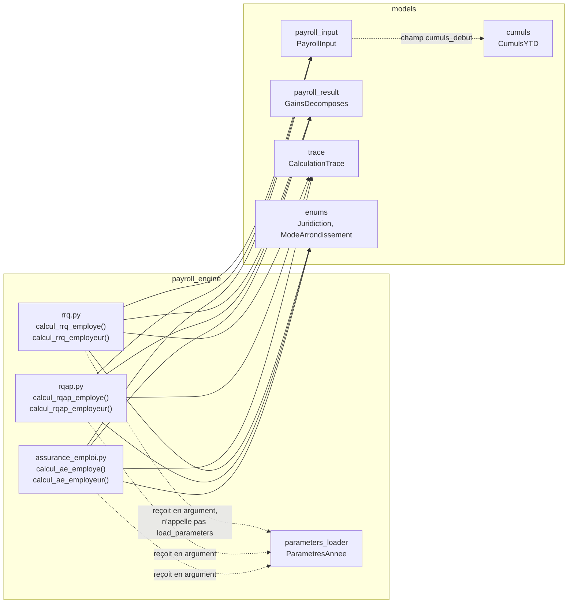

# Design Document

<!-- Document de design — cotisations-sociales-qc. Les en-têtes structurels de niveau supérieur (Overview, Architecture, Components and Interfaces, Data Models, Correctness Properties, Error Handling, Testing Strategy) sont maintenus en anglais pour la conformité au format Kiro. Tout le contenu métier est rédigé en français. -->

## Overview

Cette spec livre **l'étape 3 du plan d'implémentation** (`docs/plan-implementation.md`). Elle ajoute au moteur de paie Camp LilySO six fonctions pures qui calculent les trois cotisations sociales à taux fixe plafonné — RRQ, RQAP, AE — pour la partie employé et pour la partie employeur, à partir d'un `PayrollInput` figé, du `GainsDecomposes` produit par l'étape 2, et des paramètres annuels versionnés.

Elle ne calcule **ni** l'impôt du Québec **ni** l'impôt fédéral (étape 4), **ni** le FSS, la CNESST ou la CNT (étape 5), et n'assemble **pas** le `PayrollResult` complet ni le `CumulsYTD` de fin de paie (étape 6).

### Livrables ratifiés

| Fichier | Rôle |
|---|---|
| `payroll_engine/rrq.py` | `calcul_rrq_employe`, `calcul_rrq_employeur`. |
| `payroll_engine/rqap.py` | `calcul_rqap_employe`, `calcul_rqap_employeur`. |
| `payroll_engine/assurance_emploi.py` | `calcul_ae_employe`, `calcul_ae_employeur`. |
| `tests/payroll_engine/test_rrq.py` | Property tests Hypothesis + tests d'exemple. |
| `tests/payroll_engine/test_rqap.py` | Property tests Hypothesis + tests d'exemple, y compris l'anomalie QC004. |
| `tests/payroll_engine/test_assurance_emploi.py` | Property tests Hypothesis + tests d'exemple. |
| `tests/test_golden_outputs.py` (extension) | Assertions golden sur les six champs `rrq`, `rrq_employeur`, `rqap`, `rqap_employeur`, `ae`, `ae_employeur` des 6 fixtures QC001–QC006. |
| `tests/test_guards.py` (extension) | Trois nouvelles classes de garde : absence de `float`, absence de constante fiscale en dur, absence d'appel à `load_parameters`, appliquées aux trois nouveaux modules. |
| `tests/strategies.py` (extension) | Stratégies pour cumuls YTD non nuls (plafonnement en cours de saison) et pour les paramètres canadiens 2026. |
| `docs/cas-non-supportes.md` (extension) | Note documentaire sur le statut hors périmètre de la RRQ2 (Requirement 8). |

### Contrats consommés sans modification

Les socles `moteur-paie-contrats` (605 tests) et `gains-bruts-vacances-hs` (649 tests) fournissent tout ce qu'il faut :

- `models.payroll_input.PayrollInput` — porte `cumuls_debut: CumulsYTD` (six catégories pertinentes : `rrq_employe`, `rrq_employeur`, `rqap_employe`, `rqap_employeur`, `ae_employe`, `ae_employeur`), `pay_period.annee_fiscale`.
- `models.payroll_result.GainsDecomposes` — fournit `brut_total`, seule source du Salaire_Admissible.
- `models.trace.CalculationTrace` — contrat de trace, liste blanche des sources.
- `models.cumuls.CumulsYTD` — `frozen=True`, six champs pertinents `Decimal ≥ 0`.
- `models.exceptions.MissingParameterError` — seule exception (hors bug interne) que ces six fonctions peuvent propager.
- `payroll_engine.parameters_loader.ParametresAnnee`, `RRQParametres`, `RQAPParametres`, `AEParametres` — sections déjà typées et matérialisées (properties `Decimal`, lèvent `MissingParameterError` sur `"TO_FILL"`).
- `payroll_engine.gains_bruts.calcul_gains` — produit le `GainsDecomposes` consommé en entrée ; cette spec ne le ré-invoque pas elle-même (l'orchestration amont appartient à l'appelant, typiquement l'étape 6).

**Aucun contrat n'est modifié, étendu ni redéfini.**

### Décisions structurantes retenues

1. **Six fonctions pures, signature uniforme** — même patron que `calcul_gains` : `(payroll_input, gains, parametres_annee) -> tuple[Decimal, CalculationTrace]`. Aucune classe, aucun état, aucun appel à `load_parameters` (Requirement 1).
2. **Salaire admissible unique** — `gains.brut_total` alimente indifféremment l'assiette RRQ, RQAP et AE (décision de périmètre de l'Introduction des requirements, confirmée par les données PDOC de QC001).
3. **RRQ employeur = RRQ employé** — pas de calcul indépendant, simple délégation (Requirement 3), conforme au TP-1015.F qui ne prévoit aucune formule employeur distincte.
4. **RQAP employeur = calcul indépendant sur le brut** — propre taux, propre plafond, jamais dérivé du montant employé déjà arrondi (Requirement 5). C'est la clé de la résolution de l'anomalie QC004.
5. **AE employeur = dérivé du montant employé effectif (post-plafonnement)** — multiplicateur appliqué à la retenue employé réellement retenue, pas à un calcul indépendant sur le brut (Requirement 7). C'est l'inverse de la décision RQAP employeur — la distinction entre les deux mécanismes est explicitement documentée et testée.
6. **RRQ2 hors périmètre** — aucun code, aucune lecture des champs `taux_deuxieme_cotisation_supplementaire_*` (Requirement 8). Documentation dans `docs/cas-non-supportes.md`.
7. **Aucun nouveau garde-fou de matrice** — ces six fonctions ne redoublent aucun contrôle déjà porté par `PayrollInput`/`GainsDecomposes` (Requirement 9).
8. **Arrondissement `ROUND_HALF_UP` à 2 décimales, une fois par montant théorique, avant plafonnement** — cohérent avec l'étape 2.
9. **Cumul YTD consommé, jamais retourné ni muté** — ces fonctions ne produisent pas de `CumulsYTD` mis à jour ; cette responsabilité appartient à `CumulsYTD.avec_paie` (étape 6).

### Traçabilité requirement → composant

| Requirement | Composant de conception |
|---|---|
| Req 1 — Signatures | §Components §1 |
| Req 2 — RRQ employé | §Components §2 |
| Req 3 — RRQ employeur | §Components §3 |
| Req 4 — RQAP employé | §Components §4 |
| Req 5 — RQAP employeur | §Components §5 |
| Req 6 — AE employé | §Components §6 |
| Req 7 — AE employeur | §Components §7 |
| Req 8 — RRQ2 hors périmètre | §Error Handling (absence de code), §Architecture |
| Req 9 — Délégation garde-fous | §Error Handling |
| Req 10 — Arrondissement | §Components §8 (helper partagé) |
| Req 11 — Trace exhaustive | §Components §2 à §7 (tableaux de trace par fonction) |
| Req 12 — Paramètres versionnés | §Architecture (dépendances), §Components §2 à §7 |
| Req 13 — Corpus golden | §Testing Strategy |
| Req 14 — Cas d'erreur et bornes | §Correctness Properties, §Error Handling |

### Application explicite des 6 règles steering

- **Règle 01** — helper d'arrondissement partagé `Decimal.quantize`, test de garde « aucun `float` », toutes les formules en `Decimal` de bout en bout.
- **Règle 02** — chaque fonction retourne `(Decimal, CalculationTrace)` avec source officielle sur liste blanche.
- **Règle 03** — délégation totale aux garde-fous de `PayrollInput`/`GainsDecomposes` (Req 9), garde-fou documentaire unique pour RRQ2 (Req 8, pas de code).
- **Règle 04** — corpus QC001–QC006 anonymisé uniquement.
- **Règle 05** — dépendance stricte à `ParametresAnnee`, test de garde « aucune constante fiscale en dur ».
- **Règle 06** — property tests + golden tests écrits avant l'implémentation.

---

## Architecture

### Placement dans l'arbre

```
payroll_engine/
├── __init__.py
├── parameters_loader.py         # existant
├── gains_bruts.py                # existant (étape 2)
├── rrq.py                        # NOUVEAU — cette spec
├── rqap.py                       # NOUVEAU — cette spec
└── assurance_emploi.py           # NOUVEAU — cette spec
```

Six fonctions publiques, réparties en trois modules, un par cotisation. Aucune classe. Aucune dépendance croisée entre `rrq.py`, `rqap.py` et `assurance_emploi.py` — chaque module est indépendant des deux autres et pourrait être testé/déployé isolément.

### Dépendances entrantes



Chaque module importe :

- `decimal.Decimal`, `decimal.ROUND_HALF_UP` (stdlib) ;
- `models.payroll_input.PayrollInput` (typage du premier argument ; lecture de `cumuls_debut` et `pay_period.annee_fiscale`) ;
- `models.payroll_result.GainsDecomposes` (typage du second argument ; lecture de `brut_total`) ;
- `models.trace.CalculationTrace` (construction du second élément du tuple retourné) ;
- `models.enums.Juridiction`, `models.enums.ModeArrondissement` (renseignement de la trace) ;
- `payroll_engine.parameters_loader.ParametresAnnee` (typage du troisième argument uniquement).

Aucune nouvelle dépendance externe. Aucun nouveau logger, aucune nouvelle sérialisation.

### Contrainte de pureté

Identique à `calcul_gains` (étape 2) : aucun état de module mutable, aucune E/S, aucun appel à `datetime.now()`, aucune mutation des arguments (`frozen=True` structurel), thread-safe par construction.

### Helper d'arrondissement partagé — décision de duplication contrôlée

Chaque module (`rrq.py`, `rqap.py`, `assurance_emploi.py`) définit son propre helper privé `_arrondir` identique à celui de `payroll_engine/gains_bruts.py` :

```python
_PRECISION_MONNAIE: Final[Decimal] = Decimal("0.01")

def _arrondir(montant: Decimal) -> Decimal:
    return montant.quantize(_PRECISION_MONNAIE, rounding=ROUND_HALF_UP)
```

**Décision** : ce helper est **dupliqué** dans chacun des trois modules plutôt que factorisé dans un module utilitaire partagé (`payroll_engine/_arrondissement.py` ou équivalent). Justification : (a) le helper est trivial (deux lignes), (b) l'étape 2 a déjà établi ce patron de duplication locale sans module utilitaire, (c) créer un module utilitaire partagé maintenant introduirait une dépendance transversale entre modules de calcul indépendants sans bénéfice proportionné, au risque de coupler artificiellement `rrq.py`, `rqap.py`, `assurance_emploi.py` et `gains_bruts.py`. Une factorisation pourra être envisagée lors d'une spec future si un quatrième ou cinquième module reproduit le même besoin (Req 10).

---

## Components and Interfaces

### 1. Signatures exactes

```python
from decimal import Decimal, ROUND_HALF_UP
from typing import Final

from models.enums import Juridiction, ModeArrondissement
from models.payroll_input import PayrollInput
from models.payroll_result import GainsDecomposes
from models.trace import CalculationTrace
from payroll_engine.parameters_loader import ParametresAnnee


def calcul_rrq_employe(
    payroll_input: PayrollInput,
    gains: GainsDecomposes,
    parametres_annee: ParametresAnnee,
) -> tuple[Decimal, CalculationTrace]: ...


def calcul_rrq_employeur(
    payroll_input: PayrollInput,
    gains: GainsDecomposes,
    parametres_annee: ParametresAnnee,
) -> tuple[Decimal, CalculationTrace]: ...
```

Signature identique pour `calcul_rqap_employe`, `calcul_rqap_employeur`, `calcul_ae_employe`, `calcul_ae_employeur` (Req 1.1–1.3). Ordre des arguments fixe : `payroll_input`, `gains`, `parametres_annee`. Aucun argument par défaut. Type de retour : `tuple[Decimal, CalculationTrace]` exactement.

Exceptions autorisées : `MissingParameterError` (propagée depuis `parametres_annee`) et `pydantic.ValidationError` (propagée depuis une construction interne de `CalculationTrace` invalide — bug interne, chemin normal ne peut pas le déclencher).

### 2. `calcul_rrq_employe` (Requirement 2)

Algorithme :

```
salaire_admissible   = gains.brut_total
exemption_periode    = parametres_annee.rrq.exemption_par_periode_aux_deux_semaines_2026
assiette_cotisable   = max(Decimal("0.00"), salaire_admissible - exemption_periode)
montant_periode       = arrondir(parametres_annee.rrq.taux_cotisation_totale_employe * assiette_cotisable)

plafond_annuel        = parametres_annee.rrq.cotisation_max_annuelle_employe
cumul_ytd             = payroll_input.cumuls_debut.rrq_employe
marge_disponible      = max(Decimal("0.00"), plafond_annuel - cumul_ytd)

cotisation_effective  = min(montant_periode, marge_disponible)
```

`min`/`max` opèrent exclusivement sur des `Decimal` — pas de conversion, pas de comparaison via `float`.

Trace :

| Champ | Valeur |
|---|---|
| `source` | `f"TP-1015.F {annee_fiscale}, section 3.2 — RRQ"` |
| `annee` | `payroll_input.pay_period.annee_fiscale` |
| `juridiction` | `Juridiction.QUEBEC` |
| `section` | `"3.2 — RRQ"` |
| `parametres_utilises` | `{"taux_base_employe": taux_cotisation_totale_employe, "exemption_generale_annuelle": exemption_generale_annuelle}` |
| `entrees` | `{"salaire_periode": salaire_admissible, "nb_periodes_annuelles": Decimal(str(nb_periodes_annuelles)), "cumul_ytd": cumul_ytd}` |
| `sous_totaux` | `{"exemption_periode": exemption_periode, "assiette_cotisable": assiette_cotisable}` |
| `mode_arrondissement` | `ModeArrondissement.ROUND_HALF_UP` |
| `precision_arrondissement` | `2` |
| `resultat` | `cotisation_effective` |

Cette structure de trace reproduit exactement celle déjà présente dans `tests/fixtures/outputs/qc001.json` (`retenues_employe.rrq.trace`), qui sert de golden test.

**Note sur `nb_periodes_annuelles` dans `entrees`** : ce champ de `CalculationTrace.entrees` est typé `dict[str, Decimal]` (contrat `moteur-paie-contrats`) — la valeur entière `payroll_input.pay_period.nb_periodes_annuelles` est donc convertie en `Decimal` via `Decimal(str(...))` (jamais `Decimal(int)` directement au risque de heurter une éventuelle validation de format, ni `float`), cohérent avec la fixture existante où `"nb_periodes_annuelles": "27"` est une chaîne interprétée comme `Decimal("27")`.

### 3. `calcul_rrq_employeur` (Requirement 3)

Algorithme :

```
cotisation_employe_effective, _ = calcul_rrq_employe(payroll_input, gains, parametres_annee)
cotisation_effective = cotisation_employe_effective
```

Aucun plafond, aucun cumul, aucun taux distinct — délégation stricte. `calcul_rrq_employeur` **invoque** `calcul_rrq_employe` en interne (même module, appel direct) pour garantir qu'aucune divergence de calcul ne puisse apparaître entre les deux fonctions au fil d'un refactoring futur — l'égalité `rrq_employeur == rrq_employe` est alors une propriété structurelle du code, pas seulement une propriété testée.

Trace : mêmes valeurs que `calcul_rrq_employe`, avec `section = "3.2 — RRQ employeur"` et un `parametres_utilises` reformulé sur `taux_cotisation_totale_employeur` (valeur numériquement identique à `taux_cotisation_totale_employe` en 2026, mais lue depuis la clé employeur pour rester fidèle à la structure du fichier de paramètres). Le champ `entrees` inclut en outre `assiette_cotisable` (reproduisant le format de `tests/fixtures/outputs/qc001.json`, `cotisations_employeur.rrq_employeur.trace`).

### 4. `calcul_rqap_employe` (Requirement 4)

Algorithme :

```
salaire_admissible    = gains.brut_total
montant_periode        = arrondir(parametres_annee.rqap.taux_employe * salaire_admissible)

plafond_annuel          = parametres_annee.rqap.cotisation_max_employe
cumul_ytd               = payroll_input.cumuls_debut.rqap_employe
marge_disponible        = max(Decimal("0.00"), plafond_annuel - cumul_ytd)

cotisation_effective    = min(montant_periode, marge_disponible)
```

Aucune exemption soustraite (contrairement au RRQ).

Trace :

| Champ | Valeur |
|---|---|
| `source` | `f"TP-1015.F {annee_fiscale}, section 3.3 — RQAP"` |
| `section` | `"3.3 — RQAP employé"` |
| `parametres_utilises` | `{"taux_employe": taux_employe}` |
| `entrees` | `{"salaire_periode": salaire_admissible}` |
| `sous_totaux` | `{"cotisation_brute": montant_periode}` |
| `resultat` | `cotisation_effective` |

Reproduit `tests/fixtures/outputs/qc001.json`, `retenues_employe.rqap.trace`.

### 5. `calcul_rqap_employeur` (Requirement 5)

Algorithme — **calcul indépendant**, jamais dérivé du montant employé :

```
salaire_admissible    = gains.brut_total
montant_periode         = arrondir(parametres_annee.rqap.taux_employeur * salaire_admissible)

plafond_annuel           = parametres_annee.rqap.cotisation_max_employeur
cumul_ytd                = payroll_input.cumuls_debut.rqap_employeur
marge_disponible         = max(Decimal("0.00"), plafond_annuel - cumul_ytd)

cotisation_effective     = min(montant_periode, marge_disponible)
```

**Point de vigilance central de cette spec** : `montant_periode` se calcule à partir de `salaire_admissible` (le brut), **jamais** à partir de `cotisation_rqap_employe_effective` (qui a déjà été arrondie). C'est cette indépendance de calcul qui produit `Decimal("1.77")` pour QC004 (`294,84 × 0,602 % = 1,7749` → `1,77`), et non `Decimal("1.78")` (qui aurait résulté d'une dérivation erronée `1,27 × 1,4 = 1,778` → `1,78`, méthode que cette spec rejette explicitement — voir la décision de résolution de l'anomalie dans l'Introduction des requirements).

Trace : même structure que `calcul_rqap_employe`, `section = "3.3 — RQAP employeur"`, `parametres_utilises = {"taux_employeur": taux_employeur}`.

### 6. `calcul_ae_employe` (Requirement 6)

Algorithme :

```
salaire_admissible    = gains.brut_total
montant_periode         = arrondir(parametres_annee.assurance_emploi.taux_employe_quebec * salaire_admissible)

plafond_annuel           = parametres_annee.assurance_emploi.cotisation_max_employe
cumul_ytd                = payroll_input.cumuls_debut.ae_employe
marge_disponible         = max(Decimal("0.00"), plafond_annuel - cumul_ytd)

cotisation_effective     = min(montant_periode, marge_disponible)
```

Trace :

| Champ | Valeur |
|---|---|
| `source` | `"T4127 2026, section 4 — Assurance-emploi"` (année interpolée) |
| `juridiction` | `Juridiction.CANADA` |
| `section` | `"4 — AE employé (taux Québec)"` |
| `parametres_utilises` | `{"taux_employe_quebec": taux_employe_quebec}` |
| `entrees` | `{"salaire_periode": salaire_admissible}` |
| `sous_totaux` | `{"cotisation_brute": montant_periode}` |
| `resultat` | `cotisation_effective` |

Reproduit `tests/fixtures/outputs/qc001.json`, `retenues_employe.ae.trace`.

### 7. `calcul_ae_employeur` (Requirement 7)

Algorithme — **dérivé du montant employé effectif**, à l'opposé du RQAP employeur :

```
cotisation_ae_employe_effective, _ = calcul_ae_employe(payroll_input, gains, parametres_annee)

multiplicateur           = parametres_annee.assurance_emploi.multiplicateur_employeur
montant_periode           = arrondir(multiplicateur * cotisation_ae_employe_effective)

plafond_annuel             = parametres_annee.assurance_emploi.cotisation_max_employeur
cumul_ytd                  = payroll_input.cumuls_debut.ae_employeur
marge_disponible            = max(Decimal("0.00"), plafond_annuel - cumul_ytd)

cotisation_effective        = min(montant_periode, marge_disponible)
```

`calcul_ae_employeur` **invoque** `calcul_ae_employe` en interne — même stratégie de délégation structurelle que `calcul_rrq_employeur` (§Components §3), mais appliquée à un multiplicateur plutôt qu'à une simple égalité. Le T4127 ne définit aucun taux employeur AE indépendant : le seul paramètre disponible est `multiplicateur_employeur`, appliqué à la retenue employé.

Trace :

| Champ | Valeur |
|---|---|
| `source` | `"T4127 2026, section 4 — Assurance-emploi"` |
| `section` | `"4 — AE employeur (multiplicateur 1.4)"` |
| `parametres_utilises` | `{"multiplicateur_employeur": multiplicateur}` |
| `entrees` | `{"ae_employe": cotisation_ae_employe_effective}` |
| `sous_totaux` | `{"cotisation_employeur": multiplicateur * cotisation_ae_employe_effective}` (produit **avant** arrondissement final, tel qu'observé dans la fixture, ex. `"27.594"`) |
| `resultat` | `cotisation_effective` |

Reproduit `tests/fixtures/outputs/qc001.json`, `cotisations_employeur.ae_employeur.trace` — noter que `sous_totaux.cotisation_employeur` y porte la valeur non arrondie (`"27.594"`), tandis que `resultat` porte la valeur arrondie (`"27.59"`). Cette spec reproduit fidèlement cette convention : `sous_totaux` documente l'étape de calcul intermédiaire à précision complète, `resultat` documente la valeur finale arrondie.

### 8. Helper d'arrondissement (Req 10)

Voir §Architecture — dupliqué dans chacun des trois modules :

```python
_PRECISION_MONNAIE: Final[Decimal] = Decimal("0.01")

def _arrondir(montant: Decimal) -> Decimal:
    """Arrondit à 2 décimales selon ROUND_HALF_UP (Req 10, règle 01)."""
    return montant.quantize(_PRECISION_MONNAIE, rounding=ROUND_HALF_UP)
```

Appelé exactement une fois par montant théorique de période (`montant_periode`), avant toute comparaison avec la marge disponible (Req 10.1). Pour `calcul_ae_employeur`, appelé une seconde fois après la multiplication par le multiplicateur (Req 10.2). Jamais appelé sur une valeur déjà arrondie reçue en entrée (`Cumul_YTD_*`, `gains.brut_total`, `exemption_periode`) — Req 10.3.

### 9. Ordre d'exécution (invariant de reproduction, par fonction)

Pour chacune des six fonctions, l'ordre est fixe :

1. Lecture du Salaire_Admissible (`gains.brut_total`) ou, pour les fonctions employeur dérivées (RRQ, AE), appel interne à la fonction employé correspondante.
2. Lecture des paramètres pertinents depuis `parametres_annee` (déclenche potentiellement `MissingParameterError`).
3. Calcul et arrondissement de `montant_periode`.
4. Lecture du cumul YTD pertinent depuis `payroll_input.cumuls_debut`.
5. Calcul de la marge disponible.
6. Calcul de la cotisation effective (`min`).
7. Construction de la `CalculationTrace`.
8. Retour du tuple `(cotisation_effective, trace)`.

Cet ordre garantit le déterminisme : deux appels avec les mêmes arguments produisent deux tuples exactement égaux au sens `==`.

---

## Data Models

**Aucun nouveau modèle n'est introduit par cette spec.**

| Modèle | Package | Rôle |
|---|---|---|
| `PayrollInput` | `models.payroll_input` | Argument d'entrée commun aux six fonctions. Fournit `cumuls_debut` et `pay_period.annee_fiscale`. |
| `GainsDecomposes` | `models.payroll_result` | Argument d'entrée commun. Fournit `brut_total` (Salaire_Admissible unique). |
| `CumulsYTD` | `models.cumuls` | Accédé via `payroll_input.cumuls_debut`. Six champs pertinents : `rrq_employe`, `rrq_employeur`, `rqap_employe`, `rqap_employeur`, `ae_employe`, `ae_employeur`, tous `Decimal ≥ 0`, `frozen=True`. |
| `ParametresAnnee` | `payroll_engine.parameters_loader` | Troisième argument d'entrée. Fournit les sections `rrq`, `rqap`, `assurance_emploi`. |
| `RRQParametres` | `payroll_engine.parameters_loader` | `taux_cotisation_totale_employe`, `taux_cotisation_totale_employeur`, `exemption_generale_annuelle`, `exemption_par_periode_aux_deux_semaines_2026`, `cotisation_max_annuelle_employe` (propriétés `Decimal` matérialisées). |
| `RQAPParametres` | `payroll_engine.parameters_loader` | `taux_employe`, `taux_employeur`, `cotisation_max_employe`, `cotisation_max_employeur`. |
| `AEParametres` | `payroll_engine.parameters_loader` | `taux_employe_quebec`, `multiplicateur_employeur`, `cotisation_max_employe`, `cotisation_max_employeur`. |
| `CalculationTrace` | `models.trace` | Second élément de chaque tuple retourné. |
| `Juridiction`, `ModeArrondissement` | `models.enums` | Valeurs de trace. |
| `MissingParameterError` | `models.exceptions` | Seule exception (hors bug interne) propagée par ces six fonctions. |

L'ensemble des invariants (non-négativité, refus de `float`, immuabilité) est hérité de ces modèles. Cette spec n'ajoute ni ne restreint aucun contrat.

---

## Correctness Properties

*A property is a characteristic or behavior that should hold true across all valid executions of a system-essentially, a formal statement about what the system should do. Properties serve as the bridge between human-readable specifications and machine-verifiable correctness guarantees.*

Le property-based testing (PBT) est **applicable** aux six fonctions de cette spec : chacune est une fonction pure, `Decimal` de bout en bout, sans I/O et sans état — le prototype idéal pour Hypothesis. Chaque propriété ci-dessous doit être implémentée avec **au minimum 100 itérations** (paramètre par défaut de `hypothesis.settings`) et **taguée** en commentaire par `# Feature: cotisations-sociales-qc, Property N: <titre>`.

Toutes les propriétés partagent une **stratégie de génération commune** documentée en §Testing Strategy : un `PayrollInput` valide (avec `cumuls_debut` généré, y compris des cumuls non nuls pour exercer le plafonnement en cours de saison — absent du corpus golden), un `GainsDecomposes` valide (`brut_total ≥ 0`) et le `ParametresAnnee` réel 2026 chargé une seule fois.

### Property 1: Déterminisme (pureté)

*For any* `PayrollInput`, `GainsDecomposes` et `ParametresAnnee` valides, et pour chacune des six fonctions `f`, `f(pi, g, p) == f(pi, g, p)` — deux appels avec les mêmes arguments produisent deux tuples égaux au sens `==` sur les deux composantes (`Decimal` et `CalculationTrace`).

**Validates: Requirements 1.4**

### Property 2: Absence d'exception sur entrée valide

*For any* `PayrollInput`, `GainsDecomposes` et `ParametresAnnee` valides (paramètres 2026 entièrement renseignés), chacune des six fonctions retourne un tuple sans lever aucune exception — y compris pour les cas extrêmes générés (salaire admissible nul, cumul YTD nul ou proche du plafond, salaire très élevé).

**Validates: Requirements 1.9, 14.1**

### Property 3: Forme `Decimal` du résultat et de la trace

*For any* `PayrollInput`, `GainsDecomposes` et `ParametresAnnee` valides, pour chacune des six fonctions, le montant retourné et chaque valeur contenue dans `trace.parametres_utilises`, `trace.entrees`, `trace.sous_totaux` et `trace.resultat` satisfont :

- `isinstance(v, Decimal)` — aucun `float` produit ;
- `v.is_finite()` — pas de `NaN` ni d'infini ;
- le montant retourné et `trace.resultat` sont arrondis à deux décimales selon `ROUND_HALF_UP` (`v == v.quantize(Decimal("0.01"), rounding=ROUND_HALF_UP)`).

**Validates: Requirements 2.7, 3.4, 4.5, 5.6, 6.5, 7.4, 11.7**

### Property 4: Bornes générales de toute cotisation plafonnée

*For any* `PayrollInput`, `GainsDecomposes` et `ParametresAnnee` valides, pour chacune des cinq cotisations directement plafonnées par un cumul YTD (RRQ employé, RQAP employé, RQAP employeur, AE employé, AE employeur), la cotisation effective retournée satisfait :

- `Decimal("0.00") <= cotisation <= montant_periode` (le montant théorique de période) ;
- `cumul_ytd_correspondant + cotisation <= plafond_annuel_correspondant`.

**Validates: Requirements 2.8, 4.6, 5.7, 6.6, 7.5, 14.4, 14.5**

### Property 5: Plancher à zéro lorsque le cumul atteint ou dépasse le plafond

*For any* `PayrollInput`, `GainsDecomposes` et `ParametresAnnee` valides, pour chacune des cinq cotisations plafonnées (RRQ employé, RQAP employé, RQAP employeur, AE employé, AE employeur), si `cumul_ytd_correspondant >= plafond_annuel_correspondant`, alors la fonction retourne `Decimal("0.00")` sans lever d'exception, quel que soit le `Salaire_Admissible` de la période.

**Validates: Requirements 2.6, 4.4, 5.5, 6.4, 14.2**

### Property 6: Zéro lorsque le salaire admissible est nul

*For any* `PayrollInput`, `GainsDecomposes` avec `brut_total == Decimal("0.00")` et `ParametresAnnee` valides, chacune des six fonctions retourne `Decimal("0.00")` sans lever d'exception.

**Validates: Requirements 2.5, 14.1**

### Property 7: Formule de l'assiette cotisable RRQ

*For any* `PayrollInput`, `GainsDecomposes` et `ParametresAnnee` valides, `calcul_rrq_employe` calcule un montant théorique de période égal à `arrondir(taux_cotisation_totale_employe × max(Decimal("0.00"), brut_total − exemption_par_periode))` — l'exemption est toujours soustraite avant application du taux, et l'assiette ne devient jamais négative.

**Validates: Requirements 2.1, 2.2**

### Property 8: Formule proportionnelle simple sans exemption (RQAP employé, RQAP employeur, AE employé)

*For any* `PayrollInput`, `GainsDecomposes` et `ParametresAnnee` valides, le montant théorique de période de `calcul_rqap_employe`, `calcul_rqap_employeur` et `calcul_ae_employe` est égal à `arrondir(taux × brut_total)`, où `taux` est le taux propre à la fonction (`rqap.taux_employe`, `rqap.taux_employeur`, `assurance_emploi.taux_employe_quebec` respectivement) — **aucune** exemption n'est soustraite du `Salaire_Admissible`, contrairement au RRQ.

**Validates: Requirements 4.1, 5.1, 6.1**

### Property 9: Égalité structurelle RRQ employeur = RRQ employé

*For any* `PayrollInput`, `GainsDecomposes` et `ParametresAnnee` valides, `calcul_rrq_employeur(pi, g, p) == calcul_rrq_employe(pi, g, p)` — égalité stricte sur le montant retourné, sans plafond, cumul ni taux distinct appliqué côté employeur.

**Validates: Requirements 3.1, 3.2**

### Property 10: Indépendance de la cotisation RQAP employeur

*For any* `PayrollInput`, `GainsDecomposes` et `ParametresAnnee` valides tels que `taux_employeur ≠ taux_employe × multiplicateur_hypothetique_1.4` produit un résultat divergent, le montant théorique de période de `calcul_rqap_employeur` est calculé à partir de `brut_total` (le salaire admissible brut) et **non** à partir du montant `calcul_rqap_employe` déjà arrondi — c'est-à-dire que `calcul_rqap_employeur(pi, g, p)[0]` n'est **pas** systématiquement égal à `arrondir(Decimal("1.4") × calcul_rqap_employe(pi, g, p)[0])` lorsque les deux quantités divergent après arrondissement. Formellement : `montant_periode_rqap_employeur == arrondir(taux_employeur × brut_total)`, indépendamment de la valeur de `calcul_rqap_employe(pi, g, p)[0]`.

**Validates: Requirements 5.1, 5.2**

### Property 11: Dérivation de la cotisation AE employeur depuis la cotisation AE employé plafonnée

*For any* `PayrollInput`, `GainsDecomposes` et `ParametresAnnee` valides, le montant théorique de période de `calcul_ae_employeur` est égal à `arrondir(multiplicateur_employeur × cotisation_ae_employe_effective)`, où `cotisation_ae_employe_effective` est exactement le montant retourné par `calcul_ae_employe(pi, g, p)` (c'est-à-dire **après** plafonnement employé) — **jamais** `arrondir(taux_employe_quebec × multiplicateur_employeur × brut_total)` (calcul indépendant sur le brut).

**Validates: Requirements 7.1, 7.2**

### Property 12: Arrondissement `ROUND_HALF_UP` unique avant plafonnement

*For any* `PayrollInput`, `GainsDecomposes` et `ParametresAnnee` valides, pour chacune des six fonctions, `montant_periode` (ou, pour l'AE employeur, le produit `multiplicateur × cotisation_ae_employe_effective`) est égal à sa propre valeur `.quantize(Decimal("0.01"), rounding=ROUND_HALF_UP)`, et cet arrondissement est appliqué **avant** toute comparaison avec la marge disponible. Les valeurs déjà arrondies reçues en entrée (`cumul_ytd`, `brut_total`, `exemption_par_periode`) ne sont jamais ré-arrondies : elles apparaissent inchangées dans `trace.entrees`/`trace.sous_totaux` lorsqu'elles y sont recopiées.

**Validates: Requirements 10.1, 10.2, 10.3**

### Property 13: Conformité de `trace.source`, `trace.annee`, `trace.juridiction` et `trace.section`

*For any* `PayrollInput`, `GainsDecomposes` et `ParametresAnnee` valides, pour chacune des six fonctions, la trace retournée satisfait :

- `trace.source` matche la liste blanche de `CalculationTrace` (`"TP-1015.F ..."` pour RRQ et RQAP, `"T4127 ..."` pour AE) ;
- `trace.annee == payroll_input.pay_period.annee_fiscale` ;
- `trace.juridiction == Juridiction.QUEBEC` pour RRQ et RQAP, `Juridiction.CANADA` pour AE ;
- `trace.section` est une chaîne non vide qui distingue explicitement le côté employé du côté employeur (ex. contient `"employeur"` pour les trois fonctions employeur, ne le contient pas — ou contient `"employé"` — pour les trois fonctions employé).

**Validates: Requirements 11.1, 11.2**

### Property 14: Contenu minimal exact de la trace par fonction

*For any* `PayrollInput`, `GainsDecomposes` et `ParametresAnnee` valides :

- la trace de `calcul_rrq_employe` contient dans `parametres_utilises` au moins `taux_cotisation_totale_employe` et une exemption ; dans `entrees` au moins `salaire_periode`, `nb_periodes_annuelles` et `cumul_ytd` ; dans `sous_totaux` au moins `exemption_periode` et `assiette_cotisable` ;
- les traces de `calcul_rqap_employe`/`calcul_rqap_employeur` contiennent dans `parametres_utilises` le taux effectivement appliqué ; dans `entrees` au moins `salaire_periode` ; dans `sous_totaux` au moins `cotisation_brute` ;
- la trace de `calcul_ae_employe` contient dans `parametres_utilises` `taux_employe_quebec` ; dans `entrees` au moins `salaire_periode` ; dans `sous_totaux` au moins `cotisation_brute` ;
- la trace de `calcul_ae_employeur` contient dans `parametres_utilises` `multiplicateur_employeur` ; dans `entrees` au moins `ae_employe` ; dans `sous_totaux` au moins le produit avant arrondissement final.

**Validates: Requirements 11.3, 11.4, 11.5**

### Property 15: Cohérence `resultat` / `mode_arrondissement` / `precision_arrondissement`

*For any* `PayrollInput`, `GainsDecomposes` et `ParametresAnnee` valides, pour chacune des six fonctions, `trace.mode_arrondissement == ModeArrondissement.ROUND_HALF_UP`, `trace.precision_arrondissement == 2`, et `trace.resultat` est égal au montant retourné par la fonction (premier élément du tuple).

**Validates: Requirements 10.4, 11.6**

### Property 16: Auto-suffisance de la trace

*For any* `PayrollInput`, `GainsDecomposes` et `ParametresAnnee` valides, pour chacune des six fonctions, un tiers peut recalculer `trace.resultat` à partir des seuls contenus de `trace.parametres_utilises`, `trace.entrees` et `trace.sous_totaux` (sans consulter le `PayrollInput`, le `GainsDecomposes` ni `parameters/<AAAA>/*.json` d'origine) — par exemple, pour `calcul_rrq_employe`, `trace.sous_totaux["assiette_cotisable"] == max(Decimal("0.00"), trace.entrees["salaire_periode"] − trace.sous_totaux["exemption_periode"])`.

**Validates: Requirements 11.8**

### Property 17: Propagation de `MissingParameterError` sans interception

*For any* `PayrollInput` et `GainsDecomposes` valides, et pour tout `ParametresAnnee` construit avec l'un des champs consommés par les Requirements 12.1 à 12.3 marqué `"TO_FILL"`, l'appel à la fonction concernée lève `MissingParameterError` (et non une autre exception, ni une exception interceptée puis masquée).

**Validates: Requirements 12.5**

### Property 18: Reproduction chiffrée de la résolution de l'anomalie QC004

*Pour* le scénario QC004 du Corpus_Golden (`brut_total = Decimal("294.84")`, cumuls YTD nuls, paramètres 2026), `calcul_rqap_employeur` retourne exactement `Decimal("1.77")` — et non `Decimal("1.78")` — confirmant que le calcul indépendant sur le brut (`294,84 × 0,602 % = 1,7749` → `1,77`) prévaut sur la dérivation erronée à partir du montant employé déjà arrondi (`1,27 × 1,4 = 1,778` → `1,78`).

**Validates: Requirements 5.8, 13.3**

---

## Error Handling

### Matrice des exceptions

Deux classes d'exceptions peuvent remonter d'un appel à l'une des six fonctions de cette spec. Elles sont **disjointes** et le consommateur peut les capturer séparément.

| Condition | Exception levée | Origine | Test | Requirements |
|---|---|---|---|---|
| Un champ consommé par l'une des six fonctions (`parametres_annee.rrq.*`, `.rqap.*`, `.assurance_emploi.*`) est marqué `"TO_FILL"` | `MissingParameterError` | **Propagée** — levée par la propriété matérialisée de `RRQParametres`/`RQAPParametres`/`AEParametres` (spec `moteur-paie-contrats`) | Property 17 | 1.9, 12.5 |
| Construction interne d'une `CalculationTrace` avec un invariant violé (bug de refactoring, théoriquement inaccessible en fonctionnement nominal) | `pydantic.ValidationError` | **Propagée** — levée par le constructeur du modèle `CalculationTrace` | Non testée directement — Property 2 (« aucune exception sur entrée valide ») couvre la non-régression | 1.9 |

### Aucun nouveau garde-fou `UnsupportedPayrollCase`

Cette spec **n'introduit aucun** garde-fou `UnsupportedPayrollCase` (Requirement 9.3). Les six fonctions comptent entièrement sur les refus déjà portés à la construction par `PayrollInput` (province Québec, fréquence aux deux semaines, taux de vacances ∈ `{0.04, 0.06}`) et par `GainsDecomposes` (`brut_total ≥ 0`) — elles ne re-testent aucun de ces invariants (Requirement 9.1, 9.2). Aucun code de refus supplémentaire n'existe dans `rrq.py`, `rqap.py` ni `assurance_emploi.py` : un test de garde (§Testing Strategy) vérifie l'absence du token `UnsupportedPayrollCase` dans ces trois modules.

### RRQ2 — hors périmètre, documentation uniquement (Requirement 8)

La deuxième cotisation supplémentaire au RRQ (« RRQ2 », taux 4 % entre le MGA et le MSGA) est explicitement **hors périmètre** de cette spec :

- aucune fonction de cette spec ne calcule ni n'expose un montant RRQ2 (Requirement 8.1) ;
- aucune fonction ne lit `taux_deuxieme_cotisation_supplementaire_employe` ni `taux_deuxieme_cotisation_supplementaire_employeur` de `RRQParametres` (Requirement 8.2) ;
- le seul changement lié à ce point est **documentaire** : `docs/cas-non-supportes.md` est étendu pour expliquer que le `Plafond_Annuel_RRQ_Employe` (`4 479,30 $`) correspond exactement au seuil où l'Assiette_Cotisable_RRQ atteint le MGA (`71 100 $`), si bien que la cotisation RRQ employé cesse naturellement de croître à ce seuil sans qu'aucun garde-fou supplémentaire ne soit requis pour le périmètre Camp LilySO (Requirement 8.3) ;
- **aucun code** n'est ajouté pour ce point — ni fonction, ni branchement, ni exception dédiée (Requirement 8.4).

### Ce que les six fonctions NE font PAS

- Elles **ne re-testent pas** la province de travail, la fréquence de paie, le taux de vacances, ni la non-négativité de `brut_total` (Requirement 9.1, 9.2) — ces invariants sont portés par `PayrollInput` et `GainsDecomposes` ; leur duplication introduirait un point de divergence.
- Elles **ne transforment pas** une exception en une autre : `MissingParameterError` remonte inchangée, jamais interceptée ni convertie (Requirement 12.5).
- Elles **n'interceptent** ni ne masquent `pydantic.ValidationError` — une violation d'invariant interne reste visible comme un bug, pas comme un cas métier.

---

## Testing Strategy

### Approche duale

- **Property tests** (Hypothesis) — valident les 18 propriétés énoncées §Correctness Properties sur une plage étendue d'entrées générées, y compris des cumuls YTD non nuls pour exercer le plafonnement en cours de saison (absent du corpus golden).
- **Golden tests** — vérifient la reproduction au cent près des six champs (`rrq`, `rrq_employeur`, `rqap`, `rqap_employeur`, `ae`, `ae_employeur`) des 6 fixtures QC001–QC006, y compris le cas particulier `rqap_employeur == Decimal("1.77")` du scénario QC004 (Requirement 13).
- **Tests de garde** — introspection statique des trois nouveaux modules `payroll_engine/rrq.py`, `rqap.py`, `assurance_emploi.py` (absence de `float`, absence de constante fiscale en dur, absence d'appel à `load_parameters`, absence de `UnsupportedPayrollCase`).
- **Tests d'exemple** — scénarios ciblés (imports sans effet de bord, forme du tuple, signatures exactes des six fonctions).

### Organisation des fichiers de test

```
tests/
├── payroll_engine/
│   ├── __init__.py                                # existant
│   ├── test_parameters_loader.py                  # existant
│   ├── test_gains_bruts.py                        # existant (étape 2)
│   ├── test_rrq.py                                # NOUVEAU — property tests + tests d'exemple RRQ
│   ├── test_rqap.py                               # NOUVEAU — property tests + tests d'exemple RQAP (dont QC004)
│   └── test_assurance_emploi.py                   # NOUVEAU — property tests + tests d'exemple AE
├── test_golden_outputs.py                         # existant — extension : 6 champs supplémentaires sur les 6 fixtures
├── test_guards.py                                 # existant — extension : 3 nouvelles classes de garde par module (9 au total)
└── strategies.py                                  # existant — extension : stratégies pour cumuls YTD non nuls et ParametresAnnee 2026
```

### Détail des property tests

| Fichier | Classes / propriétés couvertes | Type |
|---|---|---|
| `test_rrq.py` | Property 1, 2, 3, 4, 5, 6, 7, 9, 12 (variantes RRQ), 13, 14, 15, 16, 17 (variante RRQ) | Property + exemple |
| `test_rqap.py` | Property 1, 2, 3, 4, 5, 6, 8 (variantes RQAP), 10, 12 (variantes RQAP), 13, 14, 15, 16, 17 (variante RQAP), 18 | Property + exemple |
| `test_assurance_emploi.py` | Property 1, 2, 3, 4, 5, 6, 8 (variante AE employé), 11, 12 (variantes AE), 13, 14, 15, 16, 17 (variante AE) | Property + exemple |

Les propriétés transversales (déterminisme, absence d'exception, forme `Decimal`, bornes générales, plancher à zéro, zéro sur salaire nul, arrondissement, conformité de trace) sont paramétrées sur les six fonctions plutôt que dupliquées — chaque module de test importe une fabrique commune `st_payroll_input_et_gains()` / `st_parametres_annee_2026()` depuis `tests/strategies.py`.

### Configuration Hypothesis

- **Nombre d'itérations minimum** : 100 par propriété (paramètre par défaut). Réglable via `@settings(max_examples=200)` pour les propriétés à surface d'entrée large (ex. Property 4 « bornes générales », Property 10 « indépendance RQAP employeur »).
- **Deadline** : `None` — cohérent avec la convention déjà en usage dans `test_gains_bruts.py`.
- **Tag par propriété** : chaque test property porte en commentaire `# Feature: cotisations-sociales-qc, Property N: <titre>`.

### Stratégies Hypothesis (extension de `tests/strategies.py`)

- `st_cumuls_ytd_non_nuls()` — génère un `CumulsYTD` où au moins une des six catégories est strictement positive et potentiellement proche de son plafond annuel (biais explicite vers `[0, plafond]` et vers `plafond` exactement), afin d'exercer le plafonnement en cours de saison non couvert par le corpus golden (Introduction des requirements).
- `st_brut_total_avec_zero()` — `Decimal` dans `[Decimal("0.00"), Decimal("5000.00")]` avec `places=2`, biaisé vers `Decimal("0.00")` (Property 6) via `st.one_of(st.just(Decimal("0.00")), st.decimals(...))`.
- `st_parametres_annee_2026_qc_ca()` — retourne le `ParametresAnnee` réel 2026 chargé une seule fois via `load_parameters(2026, ...)` en fixture module-scoped, partagé entre `rrq.py`, `rqap.py` et `assurance_emploi.py` (immutable, thread-safe).
- `st_parametres_annee_avec_to_fill(champ)` — construit un `ParametresAnnee` où un champ ciblé parmi ceux consommés par les Requirements 12.1 à 12.3 porte la sentinelle `"TO_FILL"`, utilisée par Property 17.

### Détail des golden tests (extension de `tests/test_golden_outputs.py`)

Nouveau paramétrage sur les six fonctions, croisé avec les six scénarios :

```python
@pytest.mark.golden
@pytest.mark.parametrize("scenario_id", ["QC001", "QC002", "QC003", "QC004", "QC005", "QC006"])
def test_cotisations_sociales_reproduisent_fixture(scenario_id: str) -> None:
    """Reproduit les six champs de cotisation au cent près (Requirement 13).

    QC004 confirme en particulier rqap_employeur == Decimal("1.77")
    (résolution de l'anomalie — voir Introduction des requirements et
    Property 18).
    """
    payroll_input = charger_fixture_input(scenario_id)
    gains = charger_fixture_gains(scenario_id)
    parametres = load_parameters(2026, Juridiction.QUEBEC)
    fixture_output = charger_fixture_output(scenario_id)

    rrq_employe, trace_rrq_employe = calcul_rrq_employe(payroll_input, gains, parametres)
    rrq_employeur, _ = calcul_rrq_employeur(payroll_input, gains, parametres)
    rqap_employe, _ = calcul_rqap_employe(payroll_input, gains, parametres)
    rqap_employeur, _ = calcul_rqap_employeur(payroll_input, gains, parametres)
    ae_employe, _ = calcul_ae_employe(payroll_input, gains, parametres)
    ae_employeur, _ = calcul_ae_employeur(payroll_input, gains, parametres)

    assert rrq_employe == Decimal(fixture_output["retenues_employe"]["rrq"]["montant"])
    assert rrq_employeur == Decimal(fixture_output["cotisations_employeur"]["rrq_employeur"]["montant"])
    assert rqap_employe == Decimal(fixture_output["retenues_employe"]["rqap"]["montant"])
    assert rqap_employeur == Decimal(fixture_output["cotisations_employeur"]["rqap_employeur"]["montant"])
    assert ae_employe == Decimal(fixture_output["retenues_employe"]["ae"]["montant"])
    assert ae_employeur == Decimal(fixture_output["cotisations_employeur"]["ae_employeur"]["montant"])
    assert trace_rrq_employe.resultat == rrq_employe  # cohérence trace/montant, Req 13.5

    if scenario_id == "QC004":
        assert rqap_employeur == Decimal("1.77")  # Req 5.8, 13.3 — anomalie résolue
    if scenario_id == "QC001":
        assert rrq_employe == Decimal("87.36")  # Req 13.6 — valeur corrigée (27 périodes)
```

Le décorateur `@pytest.mark.golden` (déjà en usage dans le projet) permet de filtrer les tests golden lors des exécutions rapides.

### Limitation héritée du corpus golden

Comme pour `gains-bruts-vacances-hs`, tous les scénarios QC001–QC006 sont des paies n° 1 de la saison (`cumul_ytd` de départ nul pour les six catégories, cf. Introduction des requirements). Le corpus golden **ne valide donc pas directement** le comportement de plafonnement en cours de saison — ce comportement reste néanmoins spécifié (Requirements 2 à 7) et **couvert par les property tests** (Property 4 et Property 5, avec la stratégie `st_cumuls_ytd_non_nuls()`) plutôt que par le corpus golden.

### Détail des tests de garde (extension de `tests/test_guards.py`)

Trois nouvelles classes ajoutées, **une par nouveau module** (soit neuf classes au total pour cette spec) :

| Classe | Couvre | Mécanisme |
|---|---|---|
| `TestRrqNoFloat`, `TestRqapNoFloat`, `TestAssuranceEmploiNoFloat` | Req 2.7, 3.4, 4.5, 5.6, 6.5, 7.4 | Parse le module avec `ast` et vérifie l'absence de `ast.Constant(value=float)`, l'absence d'appel `Decimal(<non-str>)`, l'absence d'appel `round`/`math.floor`/`math.ceil`/`math.trunc`. |
| `TestRrqNoHardcodedFiscalValues`, `TestRqapNoHardcodedFiscalValues`, `TestAssuranceEmploiNoHardcodedFiscalValues` | Req 12.4 | Lecture ligne par ligne du fichier source, vérifie l'absence de toute constante `Decimal` autre que `Decimal("0.00")` (plancher/valeur neutre) et l'entier `2` (précision d'arrondissement). |
| `TestRrqNoLoadParametersCall`, `TestRqapNoLoadParametersCall`, `TestAssuranceEmploiNoLoadParametersCall` | Req 1.5 | Grep du fichier source pour vérifier l'absence du token `load_parameters`. |

Une classe transversale supplémentaire `TestCotisationsSocialesNoUnsupportedPayrollCase` vérifie, sur les trois modules à la fois, l'absence du token `UnsupportedPayrollCase` (Req 8.1, 8.2, 9.3 — voir §Error Handling).

Aucune modification des classes de garde existantes — les nouvelles classes s'ajoutent sans conflit.

### Ordre d'écriture (règle 06 — TDD)

L'ordre de production est **strict** :

1. Extension de `tests/strategies.py` avec `st_cumuls_ytd_non_nuls`, `st_brut_total_avec_zero`, `st_parametres_annee_2026_qc_ca`, `st_parametres_annee_avec_to_fill` (préalable, aucun run attendu).
2. `tests/payroll_engine/test_rrq.py`, `test_rqap.py`, `test_assurance_emploi.py` — toutes les propriétés + tests d'exemple. Échouent avec `ModuleNotFoundError`.
3. Nouveaux paramétrages dans `tests/test_golden_outputs.py`. Échouent avec `ModuleNotFoundError`.
4. Nouvelles classes de garde (9 + 1 transversale) dans `tests/test_guards.py`. Échouent car les modules n'existent pas.
5. Extension documentaire de `docs/cas-non-supportes.md` (Requirement 8.3) — aucun test associé, revue manuelle.
6. **À ce stade, tous les tests de la spec sont écrits et rouges.**
7. Implémentation de `payroll_engine/rrq.py`, puis `rqap.py`, puis `assurance_emploi.py` — jusqu'à ce que **tous** les tests passent (property, golden, garde, exemple).
8. Validation manuelle : ré-exécuter WebRAS pour le scénario QC004 et confirmer que `1,77 $` est bien la valeur retenue par Revenu Québec pour le RQAP employeur (ou consigner l'écart si WebRAS produit `1,78 $`). Consigner dans `docs/journal-validation.md`.

Cette séquence matérialise la règle 06 (« spec → tests → implémentation → validation ») et garantit qu'aucune ligne de `rrq.py`, `rqap.py` ou `assurance_emploi.py` n'est écrite sans qu'un test rouge lui préexiste.
