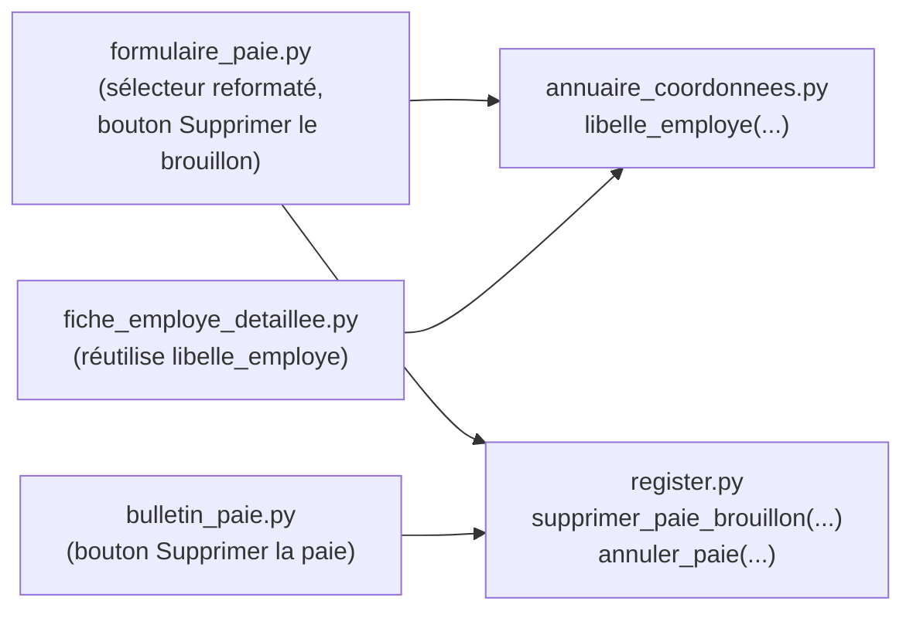

# Design Document

<!-- Document de design — formulaire-paie-suppression-et-ux. Les en-têtes
structurels de niveau supérieur (Overview, Architecture, Components and
Interfaces, Data Models, Correctness Properties, Error Handling, Testing
Strategy, Dependencies) sont maintenus en anglais pour la conformité au
format Kiro. Tout le contenu métier est rédigé en français. -->

## Overview

Cette fonctionnalité regroupe quatre améliorations ciblées de l'Interface_
Streamlit, toutes centrées sur le Formulaire_Paie et le Bulletin_De_Paie :

1. **Libellé d'employé cohérent** — le sélecteur d'employé du Formulaire_
   Paie (flux « Nouvelle paie ») affiche aujourd'hui l'identifiant technique
   brut (`EMPnnn`) plutôt que le format `Prénom Nom (courriel)` déjà utilisé
   par la Fiche_Employe_Detaillee. Cette incohérence est corrigée en
   extrayant la logique de formatage dans une fonction partagée,
   réutilisée par les deux écrans.
2. **Suppression physique d'un BROUILLON** — un nouveau bouton « Supprimer
   le brouillon » (visuel danger, fond rouge/police blanche) permet de
   supprimer physiquement une paie encore au statut `BROUILLON`
   directement depuis le Formulaire_Paie, avec confirmation explicite
   (popup).
3. **Annulation d'une paie ÉMISE** — un nouveau bouton « Supprimer la
   paie » (même visuel danger) est ajouté au Bulletin_De_Paie, avec une
   popup de confirmation dédiée (le texte de confirmation rappelle
   explicitement la perte du calcul de salaire et des cotisations).
   Contrairement au cas BROUILLON, cette action ne supprime **jamais**
   physiquement la ligne (règle 06 — immutabilité historique) : elle fait
   transiter le statut vers `ANNULEE` (déjà défini dans
   `models/enums.py::StatutDePaie`, jusqu'ici jamais utilisé activement) et
   décrémente les cumuls YTD de la contribution de cette paie — même
   mécanisme de retrait que celui déjà utilisé par `remplacer_paie`.
4. **Radio bouton BROUILLON/EMISE** — **hors périmètre**, confirmé
   explicitement avec l'utilisateur : le `st.radio` existant du
   Formulaire_Paie n'est pas modifié par cette spec.

Deux fonctions nouvelles et strictement symétriques sont ajoutées à
`payroll_engine/register.py`, suivant la même discipline transactionnelle
(`_connexion`, garde-fous explicites avant toute écriture) que
`inserer_paie`/`remplacer_paie` déjà en place :

| Fonction | Statut requis en entrée | Effet |
|---|---|---|
| `supprimer_paie_brouillon` | `BROUILLON` uniquement | `DELETE` physique de la ligne — aucun impact sur `cumuls_ytd` (un `BROUILLON` n'y contribue jamais). |
| `annuler_paie` | `EMISE` uniquement | Mutation `statut → ANNULEE` (même patron que `remplacer_paie` étape 3a) + décrément de `cumuls_ytd` (même mécanisme que `_soustraire_contribution`, déjà privé à ce module). Jamais de `DELETE`. |

**Aucune formule fiscale n'est modifiée** : ces deux fonctions ne touchent
ni `assembler_paie` ni aucun module de calcul (`gains_bruts`, `cotisations_
sociales_qc`, `impots_retenues_source`, `charges_patronales`). Elles
étendent uniquement la couche de persistance (`payroll_engine/register.py`)
et la couche de rendu (`app/pages_ui/**`).

### Décisions actées avec l'utilisateur

1. **Radio bouton EMISE/BROUILLON** — confirmé hors périmètre ; le
   `st.radio` existant (`_section_enregistrement`) reste inchangé.
2. **Nature de la suppression d'une paie ÉMISE** — jamais de `DELETE`
   physique. Statut `ANNULEE` + décrément automatique des cumuls YTD
   (même mécanisme que `remplacer_paie`), **sans** condition bloquante
   liée à l'existence de paies de périodes postérieures — limitation
   documentée ci-dessous (§ Error Handling, « Limitation connue »),
   symétrique à une limitation déjà existante de `remplacer_paie`.
3. **Confirmation pour la suppression d'un BROUILLON** — popup de
   confirmation obligatoire (titre « Supprimer le brouillon ? », texte
   « Vous perdrez les dates et les heures saisies dans ce brouillon de
   paie. »), deux boutons : « Supprimer le brouillon » (danger) et
   « Annuler » (secondaire).

## Glossary

- **Formulaire_Paie** : `app/pages_ui/formulaire_paie.py`, écran de
  saisie/assemblage/enregistrement d'une paie (flux « Nouvelle paie » et
  « Corriger une paie émise »).
- **Bulletin_De_Paie** : `app/pages_ui/bulletin_paie.py`, écran de
  consultation en lecture seule d'une paie déjà enregistrée.
- **Paie_Brouillon** : une paie de statut `StatutDePaie.BROUILLON`.
- **Paie_Emise** : une paie de statut `StatutDePaie.EMISE`.
- **Paie_Annulee** : une paie de statut `StatutDePaie.ANNULEE` — état
  terminal, jusqu'ici défini mais jamais atteint par aucune mutation du
  registre ; cette spec est la première à le produire activement.
- **Fiche_Coordonnees** : `app.logique_metier.annuaire_coordonnees.
  FicheCoordonnees`, portant notamment `prenom`, `nom`, `courriel`.
- **Libelle_Employe** : le texte `"Prénom Nom (courriel)"` (ou repli sur
  l'identifiant technique si les coordonnées sont absentes/incomplètes),
  déjà produit par la fonction interne `_libelle_employe` de
  `fiche_employe_detaillee.py`, désormais extraite et partagée.
- **Bouton_Danger** : visuel de bouton à fond rouge et police blanche,
  hors du binaire primaire/secondaire natif de la Règle UI 07 — utilisé
  exclusivement pour les deux actions destructives de cette spec
  (« Supprimer le brouillon », « Supprimer la paie »).
- **`supprimer_paie_brouillon`** : nouvelle fonction publique de
  `payroll_engine/register.py` — suppression physique d'une ligne
  `BROUILLON`.
- **`annuler_paie`** : nouvelle fonction publique de `payroll_engine/
  register.py` — annulation (mutation de statut) d'une ligne `EMISE`.

## Architecture

Aucun nouveau module n'est créé. Les changements s'insèrent dans les
fichiers existants, en respectant la séparation déjà en place entre
`app/logique_metier/**` (aucun import `streamlit`) et `app/pages_ui/**`
(rendu exclusivement) :

```
app/
├── logique_metier/
│   └── annuaire_coordonnees.py     # MODIFIÉ — nouvelle fonction libelle_employe
└── pages_ui/
    ├── fiche_employe_detaillee.py  # MODIFIÉ — réutilise libelle_employe (retrait duplication)
    ├── formulaire_paie.py          # MODIFIÉ — sélecteur reformaté, bouton+popup Supprimer le brouillon
    └── bulletin_paie.py            # MODIFIÉ — bouton+popup Supprimer la paie

payroll_engine/
└── register.py                    # MODIFIÉ — supprimer_paie_brouillon, annuler_paie (nouvelles fonctions publiques)
```



## Components and Interfaces

### 1. `annuaire_coordonnees.py::libelle_employe` — format partagé (nouvelle fonction publique)

Extraite de la fonction interne `_libelle_employe` de
`fiche_employe_detaillee.py`, rendue publique et réutilisable, sans
changement de comportement :

```python
def libelle_employe(
    employe_id: str,
    coordonnees_par_employe_id: dict[str, FicheCoordonnees],
) -> str:
    """Formate le libellé d'affichage d'un employé — ``"Prénom Nom (courriel)"``.

    Repli explicite, dans l'ordre :

    1. Aucune ``FicheCoordonnees`` pour ``employe_id`` → retourne
       ``employe_id`` tel quel (identifiant technique brut).
    2. ``FicheCoordonnees`` présente mais ``prenom``/``nom`` tous deux
       absents ou vides une fois assemblés → retourne ``employe_id``.
    3. ``prenom``/``nom`` disponibles, ``courriel`` absent → retourne
       ``"Prénom Nom"`` (sans parenthèses).
    4. ``prenom``/``nom`` et ``courriel`` disponibles → retourne
       ``"Prénom Nom (courriel)"``.

    Fonction pure — aucune E/S, aucun import ``streamlit`` (cohérent avec
    le reste de ce module). ``coordonnees_par_employe_id`` est fourni par
    l'appelant (résultat d'un seul appel groupé à ``lister_coordonnees()``,
    jamais un appel ``lire_coordonnees`` par option de sélecteur — même
    optimisation que le code existant de ``fiche_employe_detaillee.py``).
    """
    fiche = coordonnees_par_employe_id.get(employe_id)
    if fiche is None:
        return employe_id
    nom_complet = " ".join(
        partie for partie in (fiche.prenom, fiche.nom) if partie
    ).strip()
    if not nom_complet:
        return employe_id
    if fiche.courriel:
        return f"{nom_complet} ({fiche.courriel})"
    return nom_complet
```

**`fiche_employe_detaillee.py`** : la fonction interne `_libelle_employe`
(closure locale à `render()`) est retirée ; le `format_func` du `st.
selectbox("Employé", ...)` appelle désormais `libelle_employe(
employe_id_option, coordonnees_par_employe_id)` — comportement strictement
identique, seule la duplication est éliminée.

### 2. Sélecteur d'employé du Formulaire_Paie (`_section_nouvelle_paie`)

Le seul sélecteur déroulant d'employé du Formulaire_Paie est celui de
`_section_nouvelle_paie` (`st.selectbox("Employé", options_employes, ...,
key="fp_nouvelle_employe_id")`). Le flux « Corriger une paie émise »
(`_section_corriger_paie`) n'a délibérément **aucun** sélecteur d'employé
— l'employé ciblé est déterminé indirectement par l'`id_paie` déjà
sélectionné depuis le Bulletin_De_Paie (voir la « Simplification
documentée de l'Action_Corriger » déjà en place, docstring de module) ;
son affichage en lecture seule (`st.write(f"**Employé** : {nom_complet_
ciblee}")`) construit déjà son libellé selon le même format Prénom Nom
(sans courriel, sans changement demandé ici) — inchangé par cette spec.

Changement dans `_section_nouvelle_paie` :

```python
resultat_coordonnees_toutes = executer_avec_capture(lambda: lister_coordonnees())
coordonnees_par_employe_id: dict[str, FicheCoordonnees] = (
    {}
    if isinstance(resultat_coordonnees_toutes, ErreurDomaineAffichable)
    else {f.employe_id: f for f in resultat_coordonnees_toutes}
)

employe_id = st.selectbox(
    "Employé",
    options_employes,
    index=index_employe_precharge,
    format_func=lambda eid: libelle_employe(eid, coordonnees_par_employe_id),
    key="fp_nouvelle_employe_id",
)
```

Un seul appel groupé à `lister_coordonnees()` par rendu (même optimisation
que `fiche_employe_detaillee.py` — jamais un appel `lire_coordonnees` par
option affichée).

### 3. `register.py::supprimer_paie_brouillon` — suppression physique (nouvelle fonction publique)

```python
def supprimer_paie_brouillon(
    id_paie: str,
    chemin_bd: str | Path = chemin_bd_production(),
) -> None:
    """Supprime physiquement la ligne ``paies`` identifiée par ``id_paie``.

    Réservée aux lignes de statut ``BROUILLON`` — jamais utilisée pour une
    ligne ``EMISE``/``ANNULEE``/``REMPLACE_PAR`` (voir ``annuler_paie`` pour
    ce cas). Un ``BROUILLON`` ne contribue jamais à ``cumuls_ytd`` (Req
    11.4 de la spec ``net-cumuls-registre``) : aucune mise à jour de
    ``cumuls_ytd`` n'est donc nécessaire ici.

    Dans une seule transaction atomique (:func:`_connexion`) :

    1. **Lecture + contrôle** — si ``id_paie`` est absent de ``paies``,
       lève ``KeyError`` citant l'identifiant recherché. Si la ligne
       existe mais que son ``statut`` n'est pas ``BROUILLON``, lève
       ``ValueError`` citant le statut courant — seule une paie
       ``BROUILLON`` peut être supprimée physiquement.
    2. **Suppression** — ``DELETE FROM paies WHERE id_paie = ?``.

    Sortie du bloc ``with`` : ``COMMIT`` si aucune exception, ``ROLLBACK``
    sinon — les deux étapes sont donc visibles ensemble ou pas du tout.

    **Écart documenté avec la règle 06 (immutabilité historique)** : cette
    fonction est la seule du registre à retirer une ligne plutôt que de la
    muter ou d'en ajouter une nouvelle (append-only). Cet écart est
    délibéré et limité aux lignes ``BROUILLON`` uniquement — un brouillon
    n'est, par définition, jamais une « paie émise » au sens de la règle
    06 (aucune valeur auditable n'a jamais été communiquée à l'employé) ;
    l'immutabilité historique protège les paies ``EMISE``/``ANNULEE``/
    ``REMPLACE_PAR``, jamais les brouillons.
    """
    with _connexion(chemin_bd) as connexion:
        _creer_schema_si_absent(connexion)

        ligne = connexion.execute(
            "SELECT statut FROM paies WHERE id_paie = ?", (id_paie,)
        ).fetchone()
        if ligne is None:
            raise KeyError(f"Aucune paie trouvée pour id_paie={id_paie!r}.")
        (statut_actuel,) = ligne
        if statut_actuel != StatutDePaie.BROUILLON.value:
            raise ValueError(
                f"Impossible de supprimer physiquement la paie '{id_paie}' : "
                f"statut actuel '{statut_actuel}' \u2260 BROUILLON — utilisez "
                "annuler_paie(...) pour une paie déjà EMISE."
            )

        connexion.execute("DELETE FROM paies WHERE id_paie = ?", (id_paie,))
    # Sortie du `with` -> COMMIT si aucune exception, ROLLBACK sinon.
```

### 4. `register.py::annuler_paie` — annulation d'une paie ÉMISE (nouvelle fonction publique)

```python
def annuler_paie(
    id_paie: str,
    chemin_bd: str | Path = chemin_bd_production(),
) -> None:
    """Annule la paie ÉMISE identifiée par ``id_paie`` — jamais de ``DELETE``.

    Réservée aux lignes de statut ``EMISE`` — jamais utilisée pour une
    ligne ``BROUILLON`` (voir ``supprimer_paie_brouillon``) ni pour une
    ligne déjà ``ANNULEE``/``REMPLACE_PAR``. Contrairement à ``remplacer_
    paie``, aucune nouvelle ligne n'est insérée — l'ancienne ligne est
    uniquement mutée, jamais remplacée par une version successeure
    (``remplace_par_id`` reste ``None``).

    Dans une seule transaction atomique (:func:`_connexion`) :

    1. **Lecture + contrôle** — si ``id_paie`` est absent de ``paies``,
       lève ``KeyError`` citant l'identifiant recherché. Si la ligne
       existe mais que son ``statut`` n'est pas ``EMISE``, lève
       ``ValueError`` citant le statut courant.
    2. **Mutation du statut** — ``UPDATE paies SET statut = 'annulee',
       payload_json = ? WHERE id_paie = ?``, via ``model_copy(update=
       {"statut": StatutDePaie.ANNULEE})`` de l'ancien ``PayrollResult``
       désérialisé — même patron exact que l'étape 3a de ``remplacer_
       paie`` (``date_emission`` reste inchangée : déjà renseignée
       puisque la ligne était ``EMISE`` ; l'invariant ``PayrollResult``
       exige une ``date_emission`` pour ``ANNULEE`` tout comme pour
       ``EMISE``, condition déjà satisfaite).
    3. **Décrément de ``cumuls_ytd``** — lecture du cumul courant via
       ``_lire_cumuls_ytd_tx``, puis retrait de la contribution de cette
       paie via :func:`_soustraire_contribution` (fonction interne déjà
       existante, réutilisée sans duplication — même mécanisme que
       l'étape 3c de ``remplacer_paie``), puis ``_upsert_cumuls_ytd``.

    Sortie du bloc ``with`` : ``COMMIT`` si les trois étapes réussissent,
    ``ROLLBACK`` intégral sinon.

    **Limitation documentée** (symétrique à une limitation déjà existante
    de ``remplacer_paie``) : si des paies de périodes postérieures pour le
    même employé et la même année civile ont déjà été émises après
    ``id_paie``, leurs propres ``cumuls_fin`` (snapshots figés dans leur
    ``payload_json`` respectif) ne sont **jamais** recalculés par cette
    fonction — seul le total courant de la table ``cumuls_ytd`` est
    ajusté. Décision actée explicitement avec l'utilisateur : aucune
    condition bloquante liée à l'existence de paies postérieures n'est
    ajoutée par cette spec.
    """
    with _connexion(chemin_bd) as connexion:
        _creer_schema_si_absent(connexion)

        ligne = connexion.execute(
            "SELECT statut, payload_json FROM paies WHERE id_paie = ?",
            (id_paie,),
        ).fetchone()
        if ligne is None:
            raise KeyError(f"Aucune paie trouvée pour id_paie={id_paie!r}.")
        statut_actuel, payload_actuel = ligne
        if statut_actuel != StatutDePaie.EMISE.value:
            raise ValueError(
                f"Impossible d'annuler la paie '{id_paie}' : statut actuel "
                f"'{statut_actuel}' \u2260 EMISE."
            )
        ancien_resultat = PayrollResult.model_validate_json(payload_actuel)

        payload_maj = ancien_resultat.model_copy(
            update={"statut": StatutDePaie.ANNULEE}
        ).model_dump_json()
        connexion.execute(
            "UPDATE paies SET statut = ?, payload_json = ? WHERE id_paie = ?",
            (StatutDePaie.ANNULEE.value, payload_maj, id_paie),
        )

        cumul_actuel = _lire_cumuls_ytd_tx(
            connexion, ancien_resultat.employe_id, ancien_resultat.annee_fiscale
        )
        cumul_final = _soustraire_contribution(cumul_actuel, ancien_resultat)
        _upsert_cumuls_ytd(connexion, cumul_final)
    # Sortie du `with` -> COMMIT si les 3 étapes réussissent, ROLLBACK sinon.
```

`__all__` de `register.py` est étendu avec `"annuler_paie"` et
`"supprimer_paie_brouillon"`.

### 5. Formulaire_Paie — bouton « Supprimer le brouillon » + popup de confirmation

Visible **uniquement** dans `_section_nouvelle_paie`, lorsque le
formulaire est pré-rempli depuis un brouillon existant (`id_paie_
brouillon_precharge` renseigné ET la paie relue a effectivement
`statut == BROUILLON` — une paie déjà `EMISE` atteinte par ce même
mécanisme de pré-remplissage, cas défensif, n'affiche jamais ce bouton).
Positionné à droite du bouton « Assembler la paie » via `st.columns` :

```python
if id_paie_brouillon_precharge and paie_brouillon.statut == StatutDePaie.BROUILLON:
    col_assembler, col_supprimer = st.columns(2)
else:
    col_assembler, col_supprimer = st.container(), None

with col_assembler:
    bouton_assembler_clique = st.button(
        "Assembler la paie", type="primary", key="fp_nouvelle_assembler"
    )

if col_supprimer is not None:
    with col_supprimer:
        st.markdown(_CSS_BOUTON_DANGER, unsafe_allow_html=True)
        if st.button(
            "Supprimer le brouillon",
            key="fp_supprimer_brouillon_ouvrir",
        ):
            _dialogue_confirmation_suppression_brouillon(id_paie_brouillon_precharge)

if bouton_assembler_clique:
    ...  # logique d'assemblage existante, inchangée
```

**Note sur le libellé « Assembler la paie » / « Réassembler la paie »** :
le bouton « Réassembler la paie » n'apparaît que dans `_section_corriger_
paie`, un flux réservé exclusivement à la correction d'une paie déjà
`EMISE` (`remplacer_paie` refuse tout `ancien_id` dont le statut n'est pas
`EMISE`) — une paie `BROUILLON` n'est donc **jamais** éditée via ce
bouton. Le bouton « Supprimer le brouillon » n'a donc de sens qu'à côté
d'« Assembler la paie » (`_section_nouvelle_paie`), jamais à côté de
« Réassembler la paie » — écart documenté avec la formulation initiale de
la demande, qui employait les deux libellés de façon générique.

**Popup de confirmation** (`st.dialog`) :

```python
@st.dialog("Supprimer le brouillon ?")
def _dialogue_confirmation_suppression_brouillon(id_paie: str) -> None:
    """Popup de confirmation avant `supprimer_paie_brouillon` (destructif).

    Toujours ouverte via le bouton « Supprimer le brouillon » —
    `st.dialog` bloque le reste de l'interface tant qu'elle est ouverte,
    garantissant qu'aucune autre action du Formulaire_Paie ne peut être
    déclenchée pendant la confirmation.
    """
    st.write("Vous perdrez les dates et les heures saisies dans ce brouillon de paie.")
    col_confirmer, col_annuler = st.columns(2)
    with col_confirmer:
        st.markdown(_CSS_BOUTON_DANGER, unsafe_allow_html=True)
        if st.button("Supprimer le brouillon", key="fp_supprimer_brouillon_confirmer"):
            resultat = executer_avec_capture(
                lambda: supprimer_paie_brouillon(id_paie, chemin_bd=chemin_bd_production())
            )
            if isinstance(resultat, ErreurDomaineAffichable):
                st.error(f"{resultat.type_exception}: {resultat.message}")
            else:
                st.session_state.pop("fp_nouvelle_id_paie_precharge", None)
                st.rerun()
    with col_annuler:
        if st.button("Annuler", key="fp_supprimer_brouillon_annuler"):
            st.rerun()
```

Après suppression réussie, `st.rerun()` fait retomber la page en mode
« Nouvelle paie » vierge (le brouillon supprimé n'existe plus, aucune
clé de pré-remplissage ne le référence plus).

### 6. Bulletin_De_Paie — bouton « Supprimer la paie » + popup de confirmation

Ajouté à **gauche** du bouton « Corriger cette paie » existant — la barre
d'actions passe de deux colonnes à trois :

```python
with col_actions, st.container(key="bulletin_barre_actions"):
    col_action_supprimer, col_action_corriger, col_action_imprimer = st.columns(3)
    with col_action_supprimer:
        st.markdown(_CSS_BOUTON_DANGER, unsafe_allow_html=True)
        if st.button("Supprimer la paie", key="bulletin_supprimer_ouvrir"):
            _dialogue_confirmation_suppression_paie(id_paie, prenom_affiche, nom_affiche)
    with col_action_corriger:
        if paie.statut == StatutDePaie.EMISE and st.button(
            "Corriger", type="secondary"
        ):
            ...  # inchangé
    with col_action_imprimer:
        components.html(_BOUTON_IMPRIMER_HTML, height=48)
```

**Popup de confirmation** (`st.dialog`), titre et texte dynamiques
(prénom/nom de l'employé) :

```python
@st.dialog("Confirmer la suppression")
def _dialogue_confirmation_suppression_paie(
    id_paie: str, prenom_affiche: str, nom_affiche: str
) -> None:
    """Popup de confirmation avant `annuler_paie` (destructif — perte du
    calcul de salaire et des cotisations pour l'employé concerné).
    """
    nom_complet = f"{prenom_affiche} {nom_affiche}".strip()
    st.write(f"Supprimer la paie de {nom_complet} ?")
    st.write(
        "Cette paie est marquée comme émise, si vous la supprimez, vous "
        "perdrez le calcul du salaire et des cotisations."
    )
    col_confirmer, col_annuler = st.columns(2)
    with col_confirmer:
        st.markdown(_CSS_BOUTON_DANGER, unsafe_allow_html=True)
        if st.button(f"Supprimer la paie de {nom_complet}", key="bulletin_supprimer_confirmer"):
            resultat = executer_avec_capture(
                lambda: annuler_paie(id_paie, chemin_bd=chemin_bd_production())
            )
            if isinstance(resultat, ErreurDomaineAffichable):
                st.error(f"{resultat.type_exception}: {resultat.message}")
            else:
                st.success(f"Paie '{id_paie}' annulée.")
                st.rerun()
    with col_annuler:
        if st.button("Annuler", key="bulletin_supprimer_annuler"):
            st.rerun()
```

Après annulation réussie, la page se rafraîchit (`st.rerun()`) et affiche
la paie relue avec son nouveau statut `ANNULEE` — le bouton « Corriger
cette paie » disparaît naturellement (visible uniquement si `statut ==
EMISE`), tout comme le bouton « Supprimer la paie » lui-même devrait
disparaître pour une paie déjà `ANNULEE` (voir § Error Handling).

### 7. `_CSS_BOUTON_DANGER` — visuel Bouton_Danger (écart documenté à la Règle UI 07)

Constante privée dupliquée dans `formulaire_paie.py` et `bulletin_paie.py`
(même discipline de duplication de petites constantes déjà en place entre
modules de rendu, ex. `_LIBELLES_STATUT`) :

```python
#: Visuel "Bouton_Danger" (fond rouge, police blanche) — troisième couleur
#: de bouton, hors du binaire primaire/secondaire natif de la Règle UI 07
#: (`.kiro/steering/07-ui-boutons.md`). Contrairement au bouton
#: « Imprimer » (`_BOUTON_IMPRIMER_HTML`, JS pur sans retour Python), ces
#: deux boutons DOIVENT rester des `st.button` natifs — leur clic déclenche
#: une suppression/annulation côté serveur (`supprimer_paie_brouillon`/
#: `annuler_paie`), impossible à exprimer via `components.v1.html` (aucun
#: canal de retour vers le code Python). Le CSS ci-dessous cible donc la
#: classe `st-key-<key>` que Streamlit attribue automatiquement au
#: conteneur d'un widget natif portant un `key=` explicite — même
#: technique de ciblage que `fiche_employe_detaillee.py::_CSS_TABLEAU_
#: PAIES` (utilisée là pour l'alignement, ici pour la couleur), jamais une
#: modification de `.streamlit/config.toml` (qui ne pilote que primaire/
#: secondaire). Écart documenté à la Règle UI 07 : la couleur n'est pas
#: codée en dur sur un `st.button` natif *sans* `key=` scoping — elle est
#: appliquée exclusivement aux deux boutons destructifs de cette spec, via
#: leurs clés explicites, jamais globalement.
_CSS_BOUTON_DANGER = """
<style>
div[class*="st-key-fp_supprimer_brouillon"] button,
div[class*="st-key-bulletin_supprimer"] button {
    background-color: #b3261e;
    color: #FFFFFF;
    border: 1px solid #b3261e;
}
div[class*="st-key-fp_supprimer_brouillon"] button:hover,
div[class*="st-key-bulletin_supprimer"] button:hover {
    background-color: #8c1d17;
    border-color: #8c1d17;
    color: #FFFFFF;
}
</style>
"""
```

Le sélecteur `[class*="st-key-fp_supprimer_brouillon"]` cible à la fois
`fp_supprimer_brouillon_ouvrir` et `fp_supprimer_brouillon_confirmer` (les
deux boutons du flux BROUILLON, préfixe commun) ; de même pour
`bulletin_supprimer_ouvrir`/`bulletin_supprimer_confirmer`. Le bouton
« Annuler » de chaque popup n'est délibérément **pas** ciblé par ce CSS —
il conserve le visuel secondaire natif par défaut (aucun `type=`),
cohérent avec la Règle UI 07.

## Correctness Properties

*A property is a characteristic or behavior that should hold true across all valid executions of a system-essentially, a formal statement about what the system should do. Properties serve as the bridge between human-readable specifications and machine-verifiable correctness guarantees.*

### Property 1: Règles de repli exhaustives de `libelle_employe`

For all `employe_id` and all `coordonnees_par_employe_id` (un dictionnaire arbitraire, y compris vide ou sans entrée pour `employe_id`), `libelle_employe(employe_id, coordonnees_par_employe_id)` retourne exactement `employe_id` si aucune `FicheCoordonnees` n'existe pour cet identifiant ou si `prenom`/`nom` sont tous deux absents ou vides une fois assemblés ; retourne exactement `"{prenom} {nom}"` si `prenom`/`nom` sont disponibles mais que `courriel` est absent ou vide ; retourne exactement `"{prenom} {nom} ({courriel})"` si les trois champs sont disponibles — sans jamais lever d'exception.

**Validates: Requirements 1.1, 1.2, 1.3, 1.4**

### Property 2: Visibilité conditionnelle du bouton « Supprimer le brouillon »

For all `PayrollResult` chargés dans le Formulaire_Paie, le bouton « Supprimer le brouillon » est affiché si et seulement si le statut de la paie chargée est `BROUILLON`.

**Validates: Requirements 3.1, 3.2**

### Property 3: Suppression physique d'une paie `BROUILLON` et préservation des Cumuls_YTD

For all `PayrollResult` de statut `BROUILLON` déjà insérés dans le Registre et pour tout état préexistant arbitraire des Cumuls_YTD de l'employé et de l'année concernés, l'appel à `supprimer_paie_brouillon(id_paie)` retire physiquement la ligne correspondante (une relecture ultérieure via `lire_paie(id_paie)` lève `KeyError`) et laisse les Cumuls_YTD strictement inchangés (chacune des onze catégories monétaires identique avant/après).

**Validates: Requirements 3.4, 3.8**

### Property 4: Garde-fou de `supprimer_paie_brouillon`

For all `PayrollResult` déjà insérés dans le Registre dont le statut n'est pas `BROUILLON` (`EMISE`, `ANNULEE` ou `REMPLACE_PAR`), et for all identifiants de paie absents du Registre, l'appel à `supprimer_paie_brouillon` lève respectivement `ValueError` ou `KeyError`, sans qu'aucune ligne de la table des paies ne soit modifiée.

**Validates: Requirements 3.6, 3.7**

### Property 5: Absence de référence résiduelle après suppression d'un brouillon

For all `id_paie` d'une paie `BROUILLON` supprimée avec succès depuis le Formulaire_Paie, l'état de session affiché immédiatement après ne référence plus cet `id_paie` dans aucune valeur pré-remplie du formulaire.

**Validates: Requirements 3.9**

### Property 6: Visibilité conditionnelle du bouton « Supprimer la paie »

For all `PayrollResult` affichés dans le Bulletin_De_Paie, le bouton « Supprimer la paie » est affiché si et seulement si le statut de la paie affichée est `EMISE` — ce qui implique en particulier qu'après une annulation réussie (statut devenu `ANNULEE`), ni ce bouton ni le bouton « Corriger cette paie » ne sont affichés pour cette même paie.

**Validates: Requirements 4.1, 4.2, 4.10**

### Property 7: Construction dynamique du titre et du texte de la Popup_Confirmation_Paie_Emise

For all `prenom_affiche` et `nom_affiche` arbitraires (incluant des caractères spéciaux HTML), le titre de la Popup_Confirmation_Paie_Emise contient exactement `"Supprimer la paie de {prenom_affiche} {nom_affiche} ?"` et le bouton de confirmation porte exactement le texte `"Supprimer la paie de {prenom_affiche} {nom_affiche}"`.

**Validates: Requirements 4.3**

### Property 8: Annulation transite vers `ANNULEE` sans jamais supprimer physiquement la ligne

For all `PayrollResult` de statut `EMISE` déjà insérés dans le Registre, l'appel à `annuler_paie(id_paie)` fait en sorte qu'une relecture ultérieure via `lire_paie(id_paie)` retourne une ligne existante dont le statut est exactement `ANNULEE`, avec `remplace_par_id` toujours absent et `date_emission` inchangée.

**Validates: Requirements 4.4**

### Property 9: Décrément exact des Cumuls_YTD lors de l'annulation

For all `PayrollResult` de statut `EMISE` et for all états préexistants arbitraires des Cumuls_YTD de l'employé et de l'année concernés, après un appel réussi à `annuler_paie(id_paie)`, chacune des onze catégories monétaires des Cumuls_YTD résultants est égale à la valeur précédente moins la contribution exacte de cette paie (symétrie exacte avec `CumulsYTD.avec_paie`).

**Validates: Requirements 4.6**

### Property 10: Garde-fou de `annuler_paie`

For all `PayrollResult` déjà insérés dans le Registre dont le statut n'est pas `EMISE` (`BROUILLON`, `ANNULEE` ou `REMPLACE_PAR`), et for all identifiants de paie absents du Registre, l'appel à `annuler_paie` lève respectivement `ValueError` ou `KeyError`, sans qu'aucune ligne de la table des paies ni aucune valeur des Cumuls_YTD ne soit modifiée.

**Validates: Requirements 4.8, 4.9**

## Data Models

Aucun nouveau modèle Pydantic. `models/enums.py::StatutDePaie.ANNULEE`
existe déjà et n'est pas modifié — cette spec le fait simplement transiter
d'un état « défini mais jamais atteint » à un état activement produit par
`annuler_paie`. `models/payroll_result.py::PayrollResult` n'est pas
modifié : son invariant biconditionnel existant (`statut ∈ {EMISE,
ANNULEE, REMPLACE_PAR} ⟹ date_emission renseignée`) admet déjà `ANNULEE`
et reste satisfait par la mutation de `annuler_paie` (`date_emission`
inchangée, déjà renseignée puisque la ligne était `EMISE`).

Schéma SQL de `paies` (`payroll_engine/register.py`) inchangé — aucune
nouvelle colonne, aucune migration.

## Error Handling

### Cas d'erreur — `supprimer_paie_brouillon`

| Cas | Comportement |
|---|---|
| `id_paie` absent de `paies` | `KeyError` — interceptée par `executer_avec_capture`, affichée via `st.error`. |
| Statut courant ≠ `BROUILLON` (ex. déjà `EMISE`/`ANNULEE`/`REMPLACE_PAR`) | `ValueError` explicite citant le statut courant — interceptée par `executer_avec_capture`. |

### Cas d'erreur — `annuler_paie`

| Cas | Comportement |
|---|---|
| `id_paie` absent de `paies` | `KeyError` — interceptée par `executer_avec_capture`. |
| Statut courant ≠ `EMISE` (ex. déjà `ANNULEE`/`BROUILLON`/`REMPLACE_PAR`) | `ValueError` explicite citant le statut courant. |

### Bulletin_De_Paie — bouton « Supprimer la paie » masqué si déjà `ANNULEE`

Défense en profondeur côté interface, en complément du garde-fou de
`annuler_paie` : le bouton « Supprimer la paie » n'est affiché que si
`paie.statut == StatutDePaie.EMISE` — même condition que celle déjà
appliquée à « Corriger cette paie ». Une paie déjà `ANNULEE`/`REMPLACE_PAR`
n'affiche donc jamais ce bouton, évitant un appel systématiquement refusé
par le garde-fou du registre.

### Limitation connue — cumuls YTD et paies postérieures

Décision actée explicitement avec l'utilisateur (voir § Overview) :
`annuler_paie` ne vérifie jamais l'existence de paies de périodes
postérieures pour le même employé/année avant de décrémenter `cumuls_ytd`.
Si de telles paies existent déjà, leurs propres `cumuls_fin` (figés dans
leur `payload_json` au moment de leur émission) resteront incohérents avec
le nouveau total de `cumuls_ytd` après l'annulation — limitation
symétrique à celle déjà tolérée par `remplacer_paie` (qui ne recalcule
jamais non plus les `cumuls_fin` de paies postérieures). Aucune régression
n'est introduite par rapport au comportement déjà accepté du registre.

### Disjonction stricte des erreurs (règle du projet, Req 16 de `interface-streamlit`)

Les deux nouvelles fonctions ne lèvent que `KeyError` et `ValueError` —
les deux types déjà interceptés par `executer_avec_capture`
(`app/logique_metier/erreurs.py`). Aucun `except Exception`/`except
BaseException` générique n'est introduit dans `formulaire_paie.py` ni
`bulletin_paie.py`.

## Testing Strategy

### Unit Testing Approach

- `supprimer_paie_brouillon` : suppression réussie d'une ligne `BROUILLON`
  (la ligne n'existe plus après l'appel, `lire_paie` lève `KeyError`) ;
  refus explicite (`ValueError`) pour chacun des trois autres statuts
  (`EMISE`, `ANNULEE`, `REMPLACE_PAR`) ; `KeyError` si `id_paie` inconnu ;
  `cumuls_ytd` strictement inchangée avant/après (un `BROUILLON` n'y
  contribue jamais).
- `annuler_paie` : annulation réussie d'une ligne `EMISE` (`lire_paie`
  relit `statut == ANNULEE`, `date_emission` inchangée) ; refus explicite
  pour chacun des trois autres statuts ; `KeyError` si `id_paie` inconnu ;
  `cumuls_ytd` correctement décrémentée de la contribution exacte de la
  paie annulée (comparaison avant/après avec un cumul non nul préexistant).
- `libelle_employe` : les quatre cas de repli (aucune fiche, fiche sans
  prénom/nom, prénom/nom sans courriel, cas complet) — tests d'exemple
  suffisants, logique de branchement simple déjà couverte par les
  property tests ci-dessous pour la partie universelle.
- Câblage `formulaire_paie.py` : le bouton « Supprimer le brouillon »
  n'apparaît que si un brouillon est effectivement pré-chargé et à
  statut `BROUILLON` ; disparaît une fois le brouillon supprimé.
- Câblage `bulletin_paie.py` : le bouton « Supprimer la paie » n'apparaît
  que si `paie.statut == EMISE`.

### Property-Based Testing Approach

Deux propriétés universelles se dégagent naturellement des garde-fous des
deux nouvelles fonctions du registre (formalisées après la rédaction des
requirements, § Correctness Properties du design finalisé) :

1. Pour toute paie de statut différent de `BROUILLON`, `supprimer_paie_
   brouillon` refuse toujours l'opération sans muter la ligne.
2. Pour toute paie de statut différent de `EMISE`, `annuler_paie` refuse
   toujours l'opération sans muter la ligne ni `cumuls_ytd`.
3. Pour toute paie `EMISE` avec des cumuls YTD préexistants arbitraires,
   `annuler_paie` décrémente chacune des onze catégories monétaires
   exactement de la contribution de cette paie (symétrie avec
   `CumulsYTD.avec_paie`).
4. Pour tout couple `(FicheCoordonnees | None, employe_id)` arbitraire,
   `libelle_employe` respecte les quatre règles de repli documentées et
   ne lève jamais d'exception.

**Property Test Library** : Hypothesis (bibliothèque déjà utilisée par
tout le projet, ≥100 itérations en profil CI, `tests/conftest.py`),
réutilisation des stratégies existantes (`st_payroll_result_arbitraire`,
générateurs de `CumulsYTD`/`FicheCoordonnees` de `tests/app/strategies.py`).

### Integration Testing Approach

- Flux complet « Nouvelle paie » : pré-charger un brouillon existant,
  cliquer « Supprimer le brouillon », confirmer dans la popup → le
  Tableau_De_Bord ne montre plus ce brouillon dans la Colonne_Paies.
- Flux complet Bulletin_De_Paie : afficher une paie `EMISE`, cliquer
  « Supprimer la paie », confirmer dans la popup → la paie relue affiche
  `statut == ANNULEE`, le Bilan_Fiscal de l'année ne compte plus sa
  contribution.
- Sélecteur d'employé : vérifier que le format affiché correspond
  exactement à celui de la Fiche_Employe_Detaillee pour un même employé
  (même `employe_id`, mêmes coordonnées).

## Dependencies

Aucune nouvelle dépendance externe. `st.dialog` (Streamlit ≥1.37,
disponible dans la version installée du projet, 1.61.1) est utilisé pour
les deux popups de confirmation — première utilisation de cette API dans
le projet, documentée explicitement dans les deux modules concernés
(même discipline que `_BOUTON_IMPRIMER_HTML`/`components.v1.html` déjà
documentés pour une autre limitation de `st.markdown`).
