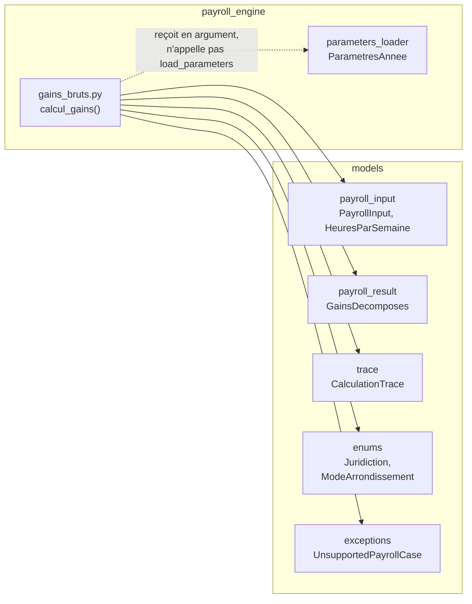
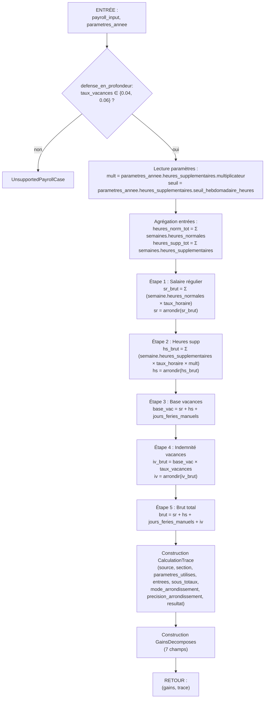

# Design Document

<!-- Document de design — gains-bruts-vacances-hs. Les en-têtes structurels de niveau supérieur (Overview, Architecture, Components and Interfaces, Data Models, Correctness Properties, Error Handling, Testing Strategy) sont maintenus en anglais pour la conformité au format Kiro. Tout le contenu métier est rédigé en français. -->

## Overview

Cette spec livre **l'étape 2 du plan d'implémentation** (`docs/plan-implementation.md`). Elle ajoute au moteur de paie Camp LilySO la fonction pure `calcul_gains` qui **assemble le brut** d'une paie à partir d'un `PayrollInput` figé et des paramètres annuels versionnés, et qui produit :

1. un `GainsDecomposes` (les cinq composantes du brut + les deux valeurs de contexte heures supplémentaires transportées) ;
2. une `CalculationTrace` conforme à la règle 02, référencée au `TP-1015.G` de l'année fiscale.

Elle ne calcule **aucune** retenue (RRQ, RQAP, AE, impôt QC, impôt fédéral) ni **aucune** charge patronale (FSS, CNESST, CNT) — ces capacités relèvent des étapes 3 à 8 du plan d'implémentation, chacune dans sa propre spec.

### Livrables ratifiés

| Fichier | Rôle |
|---|---|
| `payroll_engine/gains_bruts.py` | Module abritant la fonction publique unique `calcul_gains`. |
| `tests/payroll_engine/test_gains_bruts.py` | Property tests Hypothesis (10+ propriétés) + tests d'exemple pour la trace et les cas de garde. |
| `tests/test_golden_outputs.py` (extension) | Assertions golden sur la section `gains` des 6 fixtures QC001–QC006. |
| `tests/test_guards.py` (extension) | Deux tests de garde additionnels : « aucun `float` dans `payroll_engine/gains_bruts.py` », « aucune constante fiscale codée en dur dans ce module ». |
| `parameters/2026/quebec.json` (vérification) | Section `heures_supplementaires` porte déjà `multiplicateur = "1.5"` et `seuil_hebdomadaire_heures = "40"` — voir §Architecture, point de vérification. |

### Contrats consommés sans modification

Le socle `moteur-paie-contrats` (55/55 tâches livrées, 605 tests verts) fournit tout ce qu'il faut :

- `models.payroll_input.PayrollInput` (§Components 8 de `moteur-paie-contrats`) — garantit à la construction : province QC, fréquence aux deux semaines, `taux_vacances ∈ {Decimal("0.04"), Decimal("0.06")}`, correspondance 1-à-1 entre `heures_par_semaine` et `pay_period.semaines`, appariement `cumuls_debut ↔ employee ↔ pay_period`, refus de `float`.
- `models.payroll_result.GainsDecomposes` (§Components 9 de `moteur-paie-contrats`) — accepte exactement sept champs `Decimal`, cinq `≥ 0`, deux `> 0`, `frozen=True`, refus de `float`.
- `models.trace.CalculationTrace` (§Components 4 de `moteur-paie-contrats`) — impose `source` sur liste blanche (TP-1015.F/G/3, T4127, TD1, guide ARC, URL `.gouv.qc.ca` ou `.canada.ca`), `annee ∈ [2000, 2100]`, `precision_arrondissement ∈ [0, 10]`, refus de `float` dans `parametres_utilises` / `entrees` / `sous_totaux` / `resultat`.
- `payroll_engine.parameters_loader.ParametresAnnee` (§Components 10 de `moteur-paie-contrats`) — expose `heures_supplementaires.multiplicateur` et `heures_supplementaires.seuil_hebdomadaire_heures` comme `Decimal` déjà matérialisés (lecture différée mais préalable au calcul, cf. Req 9.5).
- `models.exceptions.UnsupportedPayrollCase` et `MissingParameterError` (§Components 2 de `moteur-paie-contrats`) — natives (`Exception`), non enveloppées par Pydantic, disjointes de `ValidationError`.

**Aucun contrat n'est modifié, étendu ni redéfini.** Cette spec consomme, elle n'invente pas.

### Décisions structurantes retenues

1. **Fonction pure, signature unique** — pas de classe, pas d'état interne, pas de cache, pas de logger, pas de `datetime.now()`. La fonction accepte deux arguments injectés et retourne un tuple à deux éléments (Req 1).
2. **Consommation stricte des heures d'entrée** — le moteur ne reclasse jamais `heures_normales` ↔ `heures_supplementaires`. La classification est un fait fourni par l'utilisateur (Req 4), documenté dans `docs/hypotheses-2026.md` §9.
3. **Ordre d'arrondissement figé** — chaque composante monétaire est arrondie **une seule fois**, dans l'ordre : `Salaire_Regulier` → `Heures_Supplementaires_Montant` → `Indemnite_Vacances` → `Brut_Total`. Le calcul de la `Base_Vacances` se fait sur des composantes **déjà arrondies** (Req 7).
4. **Trace exhaustive et auto-suffisante** — un tiers doit pouvoir recalculer le brut à partir de la seule `CalculationTrace`, sans accès au `PayrollInput` ni au fichier de paramètres (Req 8.8).
5. **Aucune donnée en dur** — les seules constantes numériques admises dans le module sont l'entier `2` (précision d'arrondissement) et `Decimal("0")` / `Decimal("0.00")` (neutre additif et repli de somme vide). Le multiplicateur `1.5` et le seuil `40` viennent exclusivement de `parametres_annee.heures_supplementaires` (Req 9.4).
6. **Défense en profondeur unique** — un seul garde-fou de matrice est ajouté par cette spec : le refus d'un `taux_vacances` hors `{0.04, 0.06}` accessible uniquement via `PayrollInput.model_construct` (contournement de la validation). Tous les autres cas hors matrice sont déjà refusés en amont par `PayrollInput` (Req 10).

### Sections de conception

- **Architecture** — placement du module, dépendances entrantes et sortantes, absence de nouvelle dépendance transitive.
- **Components and Interfaces** — signature exacte, algorithme en quatre étapes, ordre d'arrondissement, construction de la `CalculationTrace` avec ses cinq contenus normatifs (`source`, `section`, `parametres_utilises`, `entrees`, `sous_totaux`), matérialisation du `GainsDecomposes`.
- **Data Models** — aucun nouveau modèle ; référence explicite aux modèles consommés.
- **Correctness Properties** — propriétés Hypothesis à couvrir (linéarité, identité comptable, monotonie, non-négativité, déterminisme, absence de `float` dans le résultat, invariance au découpage, garde `taux_vacances`).
- **Error Handling** — matrice `(condition, exception, origine)` : `UnsupportedPayrollCase` sur défense en profondeur `taux_vacances` (introduit ici), propagation de `MissingParameterError` de `load_parameters` (amont), propagation de `pydantic.ValidationError` de la construction du résultat (aval).
- **Testing Strategy** — property tests, golden tests sur les 6 fixtures (**totaux de période uniquement**, cf. limitation documentée dans l'Introduction des requirements), tests de garde, organisation des fichiers de test.

### Traçabilité requirement → composant

| Requirement | Composant de conception |
|---|---|
| Req 1 — Point d'entrée et signature | §Components §1 (signature) |
| Req 2 — Salaire régulier | §Components §2 (étape 1 de l'algorithme) |
| Req 3 — Heures supplémentaires | §Components §2 (étape 2 de l'algorithme) |
| Req 4 — Consommation stricte des heures | §Components §2 (règle « pas de reclassement ») |
| Req 5 — Indemnité de vacances | §Components §2 (étapes 3 et 4 de l'algorithme) |
| Req 6 — Brut total | §Components §2 (étape 5) + §Components §3 (construction `GainsDecomposes`) |
| Req 7 — Arrondissement | §Components §4 (helper d'arrondissement, ordre) |
| Req 8 — Trace exhaustive | §Components §5 (construction de la `CalculationTrace`) |
| Req 9 — Consommation des paramètres | §Architecture (dépendance `parameters_loader`), §Components §5 (lecture des deux clés) |
| Req 10 — Cas hors matrice | §Error Handling (défense en profondeur `taux_vacances`) |
| Req 11 — Corpus QC001–QC006 | §Testing Strategy (golden tests, totaux de période) |
| Req 12 — Interdiction `float` | §Components §4 (arrondissement `quantize`), §Testing Strategy (test de garde) |
| Req 13 — Extensibilité 6 % | §Components §2 (formule sans branchement sur le taux) |
| Req 14 — Déterminisme | §Architecture (fonction pure), §Correctness Properties (déterminisme) |

### Application explicite des 6 règles steering

- **Règle 01 (`Decimal` obligatoire)** — §Components §4 (arrondissement via `Decimal.quantize`), §Testing Strategy (test de garde « aucun `float` dans le module »), Correctness Property « absence de `float` dans le résultat ».
- **Règle 02 (traçabilité des formules)** — §Components §5 (construction de la `CalculationTrace` avec `source` conforme à la liste blanche du §Components 4 de `moteur-paie-contrats`).
- **Règle 03 (périmètre Camp LilySO)** — §Error Handling (défense en profondeur `taux_vacances`), délégation aux garde-fous de `PayrollInput` pour tout le reste (Req 10.1).
- **Règle 04 (données sensibles)** — §Testing Strategy (fixtures anonymisées QC001–QC006 uniquement, aucun corpus réel réintroduit).
- **Règle 05 (paramètres annuels versionnés)** — §Architecture (dépendance à `parametres_annee`), §Components §5 (lecture des deux clés), §Testing Strategy (test de garde « aucune constante fiscale codée en dur »).
- **Règle 06 (workflow spec → tests → implémentation)** — §Testing Strategy (property tests + golden tests écrits **avant** l'implémentation, ordre respecté).

---

## Architecture

### Placement dans l'arbre

```
payroll_engine/
├── __init__.py
├── parameters_loader.py       # existant (moteur-paie-contrats §Components 10)
└── gains_bruts.py             # NOUVEAU — cette spec
```

Une seule fonction publique est exposée : `calcul_gains`. Le module ne définit **aucune classe** — les modèles sont importés du package `models/`.

### Dépendances entrantes (le module lit)



Le module importe :

- `models.payroll_input.PayrollInput`, `models.payroll_input.HeuresParSemaine` (typage de l'argument et itération sur les semaines) ;
- `models.payroll_result.GainsDecomposes` (construction du premier élément du tuple retourné) ;
- `models.trace.CalculationTrace` (construction du second élément du tuple retourné) ;
- `models.enums.Juridiction`, `models.enums.ModeArrondissement` (renseignement des champs `juridiction` et `mode_arrondissement` de la trace) ;
- `models.exceptions.UnsupportedPayrollCase` (défense en profondeur `taux_vacances`) ;
- `payroll_engine.parameters_loader.ParametresAnnee` (typage du second argument uniquement — la fonction **n'appelle pas** `load_parameters` elle-même, cf. Req 1.3).

Le module importe également, depuis la bibliothèque standard :

- `decimal.Decimal`, `decimal.ROUND_HALF_UP` — arithmétique décimale exacte et mode d'arrondissement (règle 01).

### Absence de nouvelle dépendance transitive

Aucune bibliothèque externe **nouvelle** n'est introduite. Le `pyproject.toml` du dépôt n'est pas modifié. En particulier :

- pas de nouveau chargeur de fichier — les paramètres sont **injectés**, jamais relus ;
- pas de nouveau logger — la fonction est silencieuse par contrat (Req 14.3) ;
- pas de nouvelle sérialisation — la trace hérite de la sérialisation JSON déterministe déjà installée sur `CalculationTrace` (règle 01, Req 13.4 de `moteur-paie-contrats`).

### Point de vérification `parameters/2026/quebec.json` (Req 9.6)

Le fichier `parameters/2026/quebec.json` **contient déjà** les deux clés nécessaires. Vérification effectuée :

```json
"heures_supplementaires": {
  "commentaire": "Loi sur les normes du travail du Québec.",
  "seuil_hebdomadaire_heures": "40",
  "multiplicateur": "1.5"
}
```

Ces deux clés sont exposées par `payroll_engine.parameters_loader.HeuresSupplementairesParametres` (§Data Models 9 de `moteur-paie-contrats`) comme propriétés `Decimal` matérialisées à la lecture. Aucune modification du fichier n'est requise par cette spec ; le livrable de la phase tasks est donc **une simple assertion de non-régression** dans un test dédié, pas un ajout de clé.

### Contrainte de pureté (Req 1, Req 14)

`calcul_gains` est **une fonction pure** au sens strict :

- pas d'état de module mutable (`_cache = {}` interdit) ;
- pas de lecture de fichier ni d'appel réseau ;
- pas d'appel à `datetime.now()`, `random.*`, `os.environ` ni à toute autre source de non-déterminisme ;
- pas de mutation des arguments (les modèles sont `frozen=True`, garanti structurellement) ;
- pas d'écriture sur `stdout` / `stderr`, pas de `print()`, pas d'appel à un logger global (l'utilisation de `logging.getLogger()` est proscrite) ;
- exécutable en isolation à partir d'objets construits en mémoire.

Ces contraintes rendent la fonction naturellement **thread-safe** (Req 14.5) — aucune synchronisation externe requise.

---

## Components and Interfaces

### 1. Signature exacte

```python
from decimal import Decimal, ROUND_HALF_UP

from models.enums import Juridiction, ModeArrondissement
from models.exceptions import UnsupportedPayrollCase
from models.payroll_input import PayrollInput
from models.payroll_result import GainsDecomposes
from models.trace import CalculationTrace
from payroll_engine.parameters_loader import ParametresAnnee


def calcul_gains(
    payroll_input: PayrollInput,
    parametres_annee: ParametresAnnee,
) -> tuple[GainsDecomposes, CalculationTrace]:
    """Assemble le brut d'une paie et sa trace (Req 1, règles 01, 02, 05)."""
    ...
```

- **Nom** : `calcul_gains` (exact, cf. Req 1.1).
- **Position des arguments** : `payroll_input` d'abord, `parametres_annee` ensuite. Aucun argument par défaut (kwarg-only n'est pas imposé, mais **aucun défaut n'est admis** — la fonction reste sans configuration cachée).
- **Type de retour** : `tuple[GainsDecomposes, CalculationTrace]` — exactement deux éléments, dans cet ordre (Req 1.4).
- **Effets de bord** : aucun (Req 1.6, Req 14).
- **Exceptions autorisées** : `UnsupportedPayrollCase` (défense en profondeur `taux_vacances`), `MissingParameterError` (propagée depuis `parametres_annee` si un accès inattendu à une propriété non renseignée avait lieu — voir §Error Handling), `pydantic.ValidationError` (propagée depuis la construction du `GainsDecomposes` ou de la `CalculationTrace`). Toute autre exception est un bug (Req 1.5).

### 2. Algorithme en quatre étapes (plus construction de la trace et du résultat)

L'algorithme suit un ordre strict. Chaque étape est indépendante des suivantes (pas de rétroaction, pas de branchement conditionnel sur le taux de vacances) — un simple fil d'exécution linéaire.



#### Étape 0 — Défense en profondeur `taux_vacances` (Req 10.3, Req 13.3)

Avant tout calcul, la fonction vérifie que `payroll_input.taux_vacances ∈ {Decimal("0.04"), Decimal("0.06")}`. En temps normal cette garde ne se déclenche jamais (le validateur `_coherence_croisee` de `PayrollInput` refuse déjà à la construction), mais elle protège contre un contournement via `PayrollInput.model_construct(...)`.

Ensemble comparé : `{Decimal("0.04"), Decimal("0.06")}` — écrit littéralement dans le code source (cette spec introduit **exactement** ce littéral, autorisé par exception à la règle 05 car ce n'est pas un taux fiscal mais une **matrice de refus métier**, cohérent avec l'exception documentée dans `tests/test_guards.py` pour le même ensemble sur `Employee`).

En cas de rejet :

```python
raise UnsupportedPayrollCase(
    f"Taux d'indemnité de vacances {payroll_input.taux_vacances} non "
    "supporté par le Camp LilySO (règle 03, Req 10.3). Seuls les taux "
    "0.04 (1re–2e année) et 0.06 (à partir de la 3e année) sont "
    "admis. Pour un cas exceptionnel, utiliser WebRAS "
    "(revenuquebec.ca/webras) et PDOC (canada.ca/pdoc)."
)
```

Le message respecte la Property 16 de `moteur-paie-contrats` (cite la valeur refusée + renvoie à WebRAS/PDOC).

#### Étape 1 — Salaire régulier (Req 2)

Formule :

```
sr_brut = Σ ( semaine.heures_normales × payroll_input.taux_horaire_effectif )
sr      = arrondir(sr_brut)                            # ROUND_HALF_UP, 2 décimales
```

Implémentation : itération sur `payroll_input.heures_par_semaine` avec accumulation dans un `Decimal("0")` initial. Une seule multiplication par semaine, une seule addition par semaine, un seul `quantize` **après** l'agrégation (pas d'arrondissement intermédiaire par semaine, Req 7.2).

Cas de bord : si la somme des heures normales vaut `Decimal("0")`, `sr` vaut `Decimal("0.00")` — le `quantize` fixe la précision (Req 2.4).

#### Étape 2 — Heures supplémentaires (Req 3)

Formule :

```
hs_brut = Σ ( semaine.heures_supplementaires × payroll_input.taux_horaire_effectif × multiplicateur )
hs      = arrondir(hs_brut)                            # ROUND_HALF_UP, 2 décimales
```

Le `multiplicateur` provient de `parametres_annee.heures_supplementaires.multiplicateur` (Req 3.2, Req 9.1). Le `seuil_hebdomadaire_heures` est **transporté** dans la sortie (Req 3.4) mais **n'est pas utilisé** pour reclasser les heures (Req 3.5, Req 4). Toutes les heures fournies comme `heures_supplementaires` par `HeuresParSemaine` sont traitées comme telles, indépendamment de la valeur de `heures_normales` de la même semaine.

Cas de bord : si la somme des heures supplémentaires vaut `Decimal("0")`, `hs` vaut `Decimal("0.00")` (Req 3.6).

#### Étape 3 — Base vacances (Req 5.1, Req 7.3)

Formule :

```
base_vac = sr + hs + payroll_input.jours_feries_manuels
```

Trois termes déjà arrondis à deux décimales (Req 7.3) :

- `sr` — arrondi à l'étape 1 ;
- `hs` — arrondi à l'étape 2 ;
- `payroll_input.jours_feries_manuels` — déjà normalisé à deux décimales par contrat `PayrollInput` (défaut `Decimal("0.00")`, Req 7.4).

La `base_vac` n'est **pas** ré-arrondie : c'est une somme exacte de trois `Decimal` à 2 décimales, elle a naturellement au plus 2 décimales.

**Exclusion explicite** : l'indemnité de vacances calculée à l'étape 4 n'entre **pas** dans la `base_vac` (Req 5.3 — pas de vacances sur vacances).

#### Étape 4 — Indemnité de vacances (Req 5.2, Req 5.6)

Formule :

```
iv_brut = base_vac × payroll_input.taux_vacances
iv      = arrondir(iv_brut)                            # ROUND_HALF_UP, 2 décimales
```

Le taux vient exclusivement de `payroll_input.taux_vacances` (Req 5.4, Req 9.3). Aucune lecture de `parametres_annee.vacances` — ces valeurs sont réservées à la fabrique `Employee.avec_defauts_par_annee` en amont.

La formule est identique pour `Decimal("0.04")` et `Decimal("0.06")` — aucun branchement conditionnel sur le taux (Req 13.1).

#### Étape 5 — Brut total (Req 6.1, Req 6.4)

Formule :

```
brut = sr + hs + payroll_input.jours_feries_manuels + iv
```

Quatre termes déjà arrondis à deux décimales. Cette somme est **exacte** au sens `Decimal` — chaque opérande a au plus 2 décimales, la somme aussi.

**Vérification interne d'identité comptable** (Req 6.4) : la fonction assert que `brut == sr + hs + payroll_input.jours_feries_manuels + iv` **après** l'assemblage, avant de construire le `GainsDecomposes`. La vérification est théoriquement redondante (la somme vient d'être calculée par la même expression) mais elle protège contre un refactoring futur qui introduirait un arrondissement supplémentaire. Un écart lève `AssertionError` — bug interne, jamais un cas métier.

### 3. Construction du `GainsDecomposes` (Req 6.3, Req 6.5)

Les sept champs sont peuplés dans l'ordre suivant :

| Champ | Valeur |
|---|---|
| `salaire_regulier` | `sr` (arrondi à 2 décimales) |
| `heures_supplementaires_montant` | `hs` (arrondi à 2 décimales) |
| `vacances` | `iv` (arrondi à 2 décimales) |
| `jours_feries_manuels` | `payroll_input.jours_feries_manuels` (recopié sans transformation, Req 6.2) |
| `brut_total` | `brut` (somme exacte des quatre précédents) |
| `multiplicateur_heures_supp` | `parametres_annee.heures_supplementaires.multiplicateur` (transport, Req 3.3, Req 7.6) |
| `seuil_heures_supp_hebdo` | `parametres_annee.heures_supplementaires.seuil_hebdomadaire_heures` (transport, Req 3.4, Req 7.6) |

Le constructeur `GainsDecomposes(...)` déclenche tous les validateurs Pydantic v2 déjà installés sur ce modèle (non-négativité des cinq composantes, positivité stricte des deux valeurs de contexte, refus de `float`, `frozen=True`). Toute violation (théoriquement impossible étant donné l'algorithme) lève `pydantic.ValidationError`, qui remonte naturellement (Req 1.5).

### 4. Helper d'arrondissement (Req 7.1, Req 12.3)

Le module définit un helper privé unique pour matérialiser le mode d'arrondissement fiscal :

```python
_PRECISION_MONNAIE: Final[Decimal] = Decimal("0.01")  # 2 décimales, imposé par TP-1015.G


def _arrondir(montant: Decimal) -> Decimal:
    """Arrondit à 2 décimales selon ROUND_HALF_UP (Req 7.1, règle 01)."""
    return montant.quantize(_PRECISION_MONNAIE, rounding=ROUND_HALF_UP)
```

- Le seul appel Python autorisé pour l'arrondissement est `Decimal.quantize` avec `rounding=ROUND_HALF_UP` (Req 12.3). Les fonctions `round()`, `math.floor()`, `math.ceil()`, `math.trunc()` sont proscrites — le test de garde §Testing Strategy vérifie leur absence.
- La constante `_PRECISION_MONNAIE = Decimal("0.01")` est **la seule** littérale `Decimal` du module. Elle n'est pas un paramètre fiscal (la règle 05 n'exige pas qu'elle vive dans `parameters/`) : c'est une convention de forme imposée par le TP-1015.G. La valeur `2` (précision d'arrondissement stockée dans la trace) est une constante d'audit dérivée de cette précision.

L'helper est appelé exactement trois fois dans l'algorithme : après l'agrégation de `sr_brut`, après l'agrégation de `hs_brut`, après le calcul de `iv_brut`. Il **n'est pas** appelé sur `payroll_input.jours_feries_manuels` (déjà normalisé, Req 7.4) ni sur `brut` (somme exacte de quatre termes à 2 décimales, Req 6.4).

### 5. Construction de la `CalculationTrace` (Req 8)

Les champs de la trace sont peuplés comme suit :

| Champ | Valeur |
|---|---|
| `source` | `f"TP-1015.G {payroll_input.pay_period.annee_fiscale}, section salaire brut, heures supplémentaires et indemnité de vacances"` |
| `annee` | `payroll_input.pay_period.annee_fiscale` |
| `juridiction` | `Juridiction.QUEBEC` |
| `section` | `"salaire brut, heures supplémentaires et indemnité de vacances"` |
| `parametres_utilises` | dict à deux clés — voir tableau ci-dessous |
| `entrees` | dict à quatre clés — voir tableau ci-dessous |
| `sous_totaux` | dict à quatre clés dans l'ordre exact `sr → hs → base_vac → iv` — voir tableau ci-dessous |
| `mode_arrondissement` | `ModeArrondissement.ROUND_HALF_UP` |
| `precision_arrondissement` | `2` |
| `resultat` | `brut` (identique à `gains.brut_total`) |

#### 5.1 Champ `source` — conformité à la liste blanche

La chaîne exacte `f"TP-1015.G {annee}, section salaire brut, heures supplémentaires et indemnité de vacances"` **matche** l'expression régulière `^TP-1015\.G \d{4}(, section .+)?$` publiée dans `models/trace.py` (`_SOURCES_OFFICIELLES_REGEX[1]`, cohérente avec le design §Components 4 de `moteur-paie-contrats`). Cette conformité est **ratifiée** contre la liste blanche existante — aucune extension n'est demandée.

L'année est interpolée depuis `payroll_input.pay_period.annee_fiscale` (invariant `PayPeriod`, garanti dans `[2000, 2100]` par contrat amont).

#### 5.2 Champ `parametres_utilises` (Req 8.3)

```python
parametres_utilises = {
    "multiplicateur_heures_supp": parametres_annee.heures_supplementaires.multiplicateur,
    "taux_vacances": payroll_input.taux_vacances,
}
```

Deux clés uniquement. Toutes les valeurs sont des `Decimal` (règle 01, Req 8.7). L'ordre d'insertion est préservé par `dict` (Python 3.7+) et par la sérialisation JSON de `CalculationTrace` (Req 5.5 de `moteur-paie-contrats`).

Le `seuil_heures_supp_hebdo` n'apparaît **pas** dans `parametres_utilises` : il n'est pas consommé par le calcul, uniquement transporté dans `GainsDecomposes`. Cette distinction respecte la sémantique de `parametres_utilises` (« paramètres qui ont participé au calcul »).

#### 5.3 Champ `entrees` (Req 8.4)

```python
entrees = {
    "heures_normales_totales": sum(
        (s.heures_normales for s in payroll_input.heures_par_semaine),
        start=Decimal("0"),
    ),
    "heures_supplementaires_totales": sum(
        (s.heures_supplementaires for s in payroll_input.heures_par_semaine),
        start=Decimal("0"),
    ),
    "taux_horaire_effectif": payroll_input.taux_horaire_effectif,
    "jours_feries_manuels": payroll_input.jours_feries_manuels,
}
```

Quatre clés dans cet ordre. Les deux premières agrègent les deux semaines constituantes — c'est **cette** granularité (totaux de période) qui est validée au cent près par le corpus QC001–QC006 (voir Testing Strategy et la limitation documentée dans l'Introduction des requirements).

L'utilisation de `sum(..., start=Decimal("0"))` est explicite : `start=0` (entier) déclencherait une addition `int + Decimal` qui produit un `Decimal`, mais l'écriture explicite documente que la somme est décimale de bout en bout (règle 01).

#### 5.4 Champ `sous_totaux` (Req 8.5)

```python
sous_totaux = {
    "salaire_regulier": sr,
    "heures_supplementaires_montant": hs,
    "base_vacances": base_vac,
    "vacances": iv,
}
```

**Quatre clés dans cet ordre exact** (Req 8.5). L'ordre est fonctionnel : un auditeur qui lit la trace de haut en bas peut recalculer `brut = sous_totaux["salaire_regulier"] + sous_totaux["heures_supplementaires_montant"] + entrees["jours_feries_manuels"] + sous_totaux["vacances"]` (identité vérifiable, Req 8.8), et vérifier que `sous_totaux["base_vacances"] == sous_totaux["salaire_regulier"] + sous_totaux["heures_supplementaires_montant"] + entrees["jours_feries_manuels"]` puis que `sous_totaux["vacances"] == arrondir(sous_totaux["base_vacances"] × parametres_utilises["taux_vacances"])`.

#### 5.5 Champs `mode_arrondissement`, `precision_arrondissement`, `resultat` (Req 8.6)

Trois valeurs constantes ou dérivées :

- `mode_arrondissement = ModeArrondissement.ROUND_HALF_UP` — cohérent avec le helper `_arrondir` (§Components §4) ;
- `precision_arrondissement = 2` — cohérent avec `_PRECISION_MONNAIE = Decimal("0.01")` ;
- `resultat = brut` — identique à `gains.brut_total` (Req 11.8).

Le constructeur `CalculationTrace(...)` déclenche tous ses validateurs (source sur liste blanche, refus de `float` sur `parametres_utilises` / `entrees` / `sous_totaux` / `resultat`, année dans `[2000, 2100]`, précision dans `[0, 10]`, `frozen=True`). Toute violation — théoriquement impossible étant donné l'algorithme et les invariants amont — lève `pydantic.ValidationError`, qui remonte naturellement.

### 6. Ordre d'exécution (invariant de reproduction)

L'ordre d'exécution est **fixe** :

1. Défense en profondeur `taux_vacances`.
2. Lecture des deux clés `parametres_annee.heures_supplementaires`.
3. Agrégation des deux totaux d'heures.
4. Calcul et arrondissement de `sr`.
5. Calcul et arrondissement de `hs`.
6. Calcul de `base_vac` (pas d'arrondissement — somme exacte à 2 décimales).
7. Calcul et arrondissement de `iv`.
8. Calcul de `brut` (pas d'arrondissement — somme exacte à 2 décimales).
9. Vérification interne d'identité comptable (`assert`, cf. §Components §2 étape 5).
10. Construction de la `CalculationTrace`.
11. Construction du `GainsDecomposes`.
12. Retour du tuple `(gains, trace)`.

Cet ordre garantit le déterminisme (Req 14.1) : deux appels avec les mêmes arguments produisent deux tuples exactement égaux au sens `==` (les deux modèles sont `frozen=True` et implémentent l'égalité structurelle Pydantic v2).

---

## Data Models

**Aucun nouveau modèle n'est introduit par cette spec.**

Tous les modèles consommés sont déjà définis par le socle `moteur-paie-contrats` :

| Modèle | Package | Rôle dans `calcul_gains` |
|---|---|---|
| `PayrollInput` | `models.payroll_input` | Argument d'entrée. Fournit `heures_par_semaine`, `taux_horaire_effectif`, `taux_vacances`, `jours_feries_manuels`, `pay_period.annee_fiscale`. |
| `HeuresParSemaine` | `models.payroll_input` | Éléments du tuple `payroll_input.heures_par_semaine`. Chaque élément porte `heures_normales` et `heures_supplementaires` (`Decimal ∈ [0, 168]`). |
| `ParametresAnnee` | `payroll_engine.parameters_loader` | Argument d'entrée. Fournit `heures_supplementaires.multiplicateur` et `heures_supplementaires.seuil_hebdomadaire_heures` (propriétés `Decimal` matérialisées). |
| `HeuresSupplementairesParametres` | `payroll_engine.parameters_loader` | Sous-modèle typé accessible via `parametres_annee.heures_supplementaires`. |
| `GainsDecomposes` | `models.payroll_result` | Premier élément du tuple retourné. Sept champs `Decimal` (cinq `≥ 0`, deux `> 0`). |
| `CalculationTrace` | `models.trace` | Second élément du tuple retourné. Neuf champs (source, année, juridiction, section, trois dicts, mode, précision, résultat). |
| `Juridiction` | `models.enums` | Valeur `Juridiction.QUEBEC` pour la trace. |
| `ModeArrondissement` | `models.enums` | Valeur `ModeArrondissement.ROUND_HALF_UP` pour la trace. |
| `UnsupportedPayrollCase` | `models.exceptions` | Exception levée en défense en profondeur (voir §Error Handling). |
| `MissingParameterError` | `models.exceptions` | Exception propagée depuis `parametres_annee` (voir §Error Handling). Non levée directement par ce module. |

L'ensemble des invariants (non-négativité, refus de `float`, immuabilité, listes blanches) est **hérité** de ces modèles. Cette spec n'ajoute ni ne restreint aucun contrat.


---

## Correctness Properties

*A property is a characteristic or behavior that should hold true across all valid executions of a system-essentially, a formal statement about what the system should do. Properties serve as the bridge between human-readable specifications and machine-verifiable correctness guarantees.*

Le property-based testing (PBT) est **applicable** à ce module : `calcul_gains` est une fonction pure, `Decimal` de bout en bout, sans I/O et sans état — le prototype idéal pour Hypothesis. Chaque propriété ci-dessous doit être implémentée avec **au minimum 100 itérations** (paramètre par défaut de `hypothesis.settings`) et **taguée** en commentaire par `# Feature: gains-bruts-vacances-hs, Property N: <titre>`.

Toutes les propriétés partagent une **stratégie de génération commune** documentée en §Testing Strategy. En particulier, un `PayrollInput` valide est généré via `hypothesis.strategies.builds(PayrollInput, ...)` en composant des stratégies pour chaque sous-modèle (`Employee`, `PayPeriod` avec deux `WeekSegment`, `HeuresParSemaine`, `CumulsYTD`), avec des `Decimal` typés `places=2` et des heures dans `[0, 168]`.

### Property 1: Linéarité du salaire régulier

*For any* `PayrollInput` valide, `gains.salaire_regulier == arrondir(taux_horaire_effectif × Σ heures_normales_semaine)` — la formule est linéaire en le taux horaire et en la somme des heures normales, sans branchement conditionnel et sans reclassement par rapport au seuil hebdomadaire.

**Validates: Requirements 2.1, 2.2, 2.4, 4.1, 4.2, 4.3, 4.4, 4.5**

### Property 2: Linéarité du montant des heures supplémentaires

*For any* `PayrollInput` valide et tout `ParametresAnnee` valide, `gains.heures_supplementaires_montant == arrondir(taux_horaire_effectif × multiplicateur × Σ heures_supplementaires_semaine)` — la formule est linéaire en le taux horaire, le multiplicateur et la somme des heures supplémentaires, sans reclassement par rapport au seuil.

**Validates: Requirements 3.1, 3.2, 3.5, 3.6, 4.1, 4.2, 4.3**

### Property 3: Identité comptable du brut total

*For any* `PayrollInput` valide, `gains.brut_total == gains.salaire_regulier + gains.heures_supplementaires_montant + gains.jours_feries_manuels + gains.vacances` — comparaison stricte `==` sur `Decimal` (tolérance nulle, règle 01). Cette identité doit tenir **après** arrondissement des composantes à 2 décimales.

**Validates: Requirements 6.1, 6.4**

### Property 4: Monotonie du brut vs heures normales

*For any* deux `PayrollInput` `pi_a` et `pi_b` valides, identiques sauf que la somme des `heures_normales` de `pi_b` est strictement supérieure à celle de `pi_a` (à taux horaire, taux vacances et jours fériés égaux), `calcul_gains(pi_b, ...).gains.brut_total >= calcul_gains(pi_a, ...).gains.brut_total`. Une augmentation des heures normales ne peut jamais diminuer le brut.

**Validates: Requirements 2.1, 4.1** (conséquence de la linéarité + non-négativité du taux horaire)

### Property 5: Monotonie du brut vs heures supplémentaires

*For any* deux `PayrollInput` `pi_a` et `pi_b` valides, identiques sauf que la somme des `heures_supplementaires` de `pi_b` est strictement supérieure à celle de `pi_a` (à taux horaire, taux vacances, jours fériés et multiplicateur égaux), `calcul_gains(pi_b, ...).gains.brut_total >= calcul_gains(pi_a, ...).gains.brut_total`. Une augmentation des heures supplémentaires ne peut jamais diminuer le brut.

**Validates: Requirements 3.1, 4.1** (conséquence de la linéarité + positivité du multiplicateur)

### Property 6: Forme des composantes monétaires

*For any* `PayrollInput` valide, chacune des cinq composantes monétaires du `GainsDecomposes` (`salaire_regulier`, `heures_supplementaires_montant`, `vacances`, `jours_feries_manuels`, `brut_total`) satisfait :

- `isinstance(v, Decimal)` — aucun `float` produit ;
- `v == v.quantize(Decimal("0.01"), rounding=ROUND_HALF_UP)` — arrondi à 2 décimales avec le bon mode ;
- `v >= Decimal("0")` — non-négativité (contrat du `GainsDecomposes`) ;
- `v.is_finite()` — pas de `NaN` ni d'infini.

De même pour `trace.resultat` et pour toutes les valeurs de `trace.parametres_utilises`, `trace.entrees`, `trace.sous_totaux` (mais sans la contrainte d'arrondissement pour les entrées — les heures et les taux ne sont pas des montants monétaires).

**Validates: Requirements 2.3, 2.5, 3.7, 3.8, 5.6, 7.1, 7.2, 8.7, 12.5**

### Property 7: Transport strict de `jours_feries_manuels`

*For any* `PayrollInput` valide, `gains.jours_feries_manuels == payroll_input.jours_feries_manuels` — égalité stricte `Decimal.__eq__`, aucun ré-arrondissement, aucune transformation.

**Validates: Requirements 6.2, 7.4**

### Property 8: Transport strict du multiplicateur et du seuil

*For any* `PayrollInput` valide et tout `ParametresAnnee` valide, `gains.multiplicateur_heures_supp == parametres_annee.heures_supplementaires.multiplicateur` et `gains.seuil_heures_supp_hebdo == parametres_annee.heures_supplementaires.seuil_hebdomadaire_heures` — égalités strictes, sans ré-arrondissement (Req 7.6).

**Validates: Requirements 3.3, 3.4, 7.6, 9.1, 9.2**

### Property 9: Déterminisme (idempotence de l'appel)

*For any* `PayrollInput` valide et tout `ParametresAnnee` valide, `calcul_gains(pi, p) == calcul_gains(pi, p)` — deux appels avec les mêmes arguments produisent deux tuples égaux au sens `==` sur les deux composantes (`GainsDecomposes` et `CalculationTrace`).

**Validates: Requirements 1.2, 14.1, 14.2**

### Property 10: Absence d'exception sur `PayrollInput` valide

*For any* `PayrollInput` valide (construit via le constructeur normal, pas `model_construct`) et tout `ParametresAnnee` valide, `calcul_gains(pi, p)` retourne un tuple sans lever aucune exception — y compris pour les cas extrêmes du corpus (heures très élevées `> 40/semaine`, brut très faible, taux vacances 6 %, heures fractionnaires).

**Validates: Requirements 1.5, 4.3, 10.4**

### Property 11: Forme du tuple retourné

*For any* `PayrollInput` valide et tout `ParametresAnnee` valide, `calcul_gains(pi, p)` retourne un `tuple` de longueur exactement 2, avec `result[0]: GainsDecomposes` et `result[1]: CalculationTrace`.

**Validates: Requirements 1.4**

### Property 12: Conformité de `trace.source` à la liste blanche

*For any* `PayrollInput` valide et tout `ParametresAnnee` valide, la trace retournée satisfait :

- `trace.source` matche l'expression régulière `^TP-1015\.G \d{4}(, section .+)?$` ;
- `int(trace.source[len("TP-1015.G "):len("TP-1015.G ") + 4]) == payroll_input.pay_period.annee_fiscale` (l'année encodée dans la source correspond à celle de la période) ;
- `trace.annee == payroll_input.pay_period.annee_fiscale` ;
- `trace.juridiction == Juridiction.QUEBEC` ;
- `trace.section` est une chaîne non vide.

**Validates: Requirements 8.1, 8.2**

### Property 13: Contenu de `trace.entrees`

*For any* `PayrollInput` valide, `trace.entrees` contient exactement les quatre clés `heures_normales_totales`, `heures_supplementaires_totales`, `taux_horaire_effectif`, `jours_feries_manuels`, avec les valeurs suivantes :

- `entrees["heures_normales_totales"] == Σ semaine.heures_normales` ;
- `entrees["heures_supplementaires_totales"] == Σ semaine.heures_supplementaires` ;
- `entrees["taux_horaire_effectif"] == payroll_input.taux_horaire_effectif` ;
- `entrees["jours_feries_manuels"] == payroll_input.jours_feries_manuels`.

**Validates: Requirements 8.4**

### Property 14: Contenu et ordre de `trace.sous_totaux`

*For any* `PayrollInput` valide, `list(trace.sous_totaux.keys()) == ["salaire_regulier", "heures_supplementaires_montant", "base_vacances", "vacances"]` (quatre clés dans cet ordre exact), et les valeurs satisfont :

- `sous_totaux["salaire_regulier"] == gains.salaire_regulier` ;
- `sous_totaux["heures_supplementaires_montant"] == gains.heures_supplementaires_montant` ;
- `sous_totaux["base_vacances"] == gains.salaire_regulier + gains.heures_supplementaires_montant + gains.jours_feries_manuels` ;
- `sous_totaux["vacances"] == gains.vacances`.

**Validates: Requirements 5.1, 5.5, 7.3, 8.5**

### Property 15: Contenu de `trace.parametres_utilises`

*For any* `PayrollInput` valide et tout `ParametresAnnee` valide, `set(trace.parametres_utilises.keys()) == {"multiplicateur_heures_supp", "taux_vacances"}`, avec :

- `parametres_utilises["multiplicateur_heures_supp"] == parametres_annee.heures_supplementaires.multiplicateur` ;
- `parametres_utilises["taux_vacances"] == payroll_input.taux_vacances`.

**Validates: Requirements 5.8, 8.3, 13.2**

### Property 16: Cohérence des métadonnées d'arrondissement dans la trace

*For any* `PayrollInput` valide, `trace.mode_arrondissement == ModeArrondissement.ROUND_HALF_UP`, `trace.precision_arrondissement == 2` et `trace.resultat == gains.brut_total`.

**Validates: Requirements 7.5, 8.6, 11.8**

### Property 17: Auto-suffisance de la trace (identité comptable interne)

*For any* `PayrollInput` valide, la trace satisfait `trace.resultat == trace.sous_totaux["salaire_regulier"] + trace.sous_totaux["heures_supplementaires_montant"] + trace.entrees["jours_feries_manuels"] + trace.sous_totaux["vacances"]`. Un tiers peut recalculer le brut à partir des seuls contenus de la trace, sans consulter le `PayrollInput` d'origine ni `parameters/<AAAA>/quebec.json`.

De plus, `trace.sous_totaux["vacances"] == arrondir(trace.sous_totaux["base_vacances"] × trace.parametres_utilises["taux_vacances"])` — la trace expose la relation liant `base_vacances`, `taux_vacances` et `vacances`.

**Validates: Requirements 8.8**

### Property 18: Extensibilité au taux 6 %

*For any* `PayrollInput` `pi_04` avec `taux_vacances = Decimal("0.04")` et le même `PayrollInput` `pi_06` avec `taux_vacances = Decimal("0.06")` (tous les autres champs identiques), `calcul_gains(pi_06, p).gains.vacances == arrondir(calcul_gains(pi_04, p).gains.base_vacances × Decimal("0.06"))`. La formule est identique pour les deux taux — aucun branchement conditionnel n'introduit de divergence.

(Note : le corollaire de linéarité `vacances(0.06) ≈ 1.5 × vacances(0.04)` n'est **pas** vérifié strictement au cent près à cause de l'arrondissement — la formulation ci-dessus, basée sur la `base_vacances` commune, est exacte.)

**Validates: Requirements 13.1**

### Property 19: Refus d'un `taux_vacances` hors matrice (défense en profondeur)

*For any* `Decimal` `taux ∉ {Decimal("0.04"), Decimal("0.06")}` construit par Hypothesis, et tout `PayrollInput` fabriqué via `PayrollInput.model_construct(taux_vacances=taux, ...)` (contournement de la validation), `calcul_gains(pi, p)` lève `UnsupportedPayrollCase`. Le message d'exception contient la valeur refusée (représentée par `str(taux)`) et renvoie à WebRAS ou PDOC (cohérent avec la Property 16 de `moteur-paie-contrats`, Req 11.6).

**Validates: Requirements 10.3, 10.5, 13.3**

---

## Error Handling

### Matrice des exceptions

Trois classes d'exceptions peuvent remonter d'un appel à `calcul_gains`. Elles sont **disjointes** (Req 8.7 de `moteur-paie-contrats`) et le consommateur peut les capturer séparément.

| Condition | Exception levée | Origine | Test | Requirements |
|---|---|---|---|---|
| `taux_vacances ∉ {0.04, 0.06}` accessible uniquement via `PayrollInput.model_construct(...)` | `UnsupportedPayrollCase` | **Introduite par cette spec** — défense en profondeur à l'entrée de `calcul_gains` | Property 19 + test d'exemple avec message | 10.3, 10.5, 13.3 |
| `parametres_annee.heures_supplementaires.multiplicateur` ou `.seuil_hebdomadaire_heures` marqué `"TO_FILL"` | `MissingParameterError` | **Propagée** — levée par la propriété matérialisée de `HeuresSupplementairesParametres._materialiser` (spec `moteur-paie-contrats`, §Data Models 9) | Non testée ici — déjà couverte par `tests/payroll_engine/test_parameters_loader.py` | 9.5 |
| Construction du `GainsDecomposes` ou de la `CalculationTrace` avec un invariant violé | `pydantic.ValidationError` | **Propagée** — levée par le constructeur du modèle ; théoriquement inaccessible en fonctionnement nominal, elle protège contre un refactoring introduisant une régression | Non testée directement — un chemin d'exécution normal ne peut pas la déclencher | 1.5 |

### Défense en profondeur `taux_vacances` (Req 10.3)

C'est **le seul garde-fou de matrice** introduit par cette spec. Il protège contre le contournement du validateur `PayrollInput._coherence_croisee` via l'API `PayrollInput.model_construct(...)` (Pydantic v2, méthode qui court-circuite la validation).

Sémantique :

- Se déclenche **avant** toute lecture de paramètres — un `taux_vacances` hors matrice est refusé même si `parametres_annee` contient des `"TO_FILL"` (l'ordre garantit la précédence de refus métier sur refus de forme).
- Message conforme à la Property 16 de `moteur-paie-contrats` : cite la valeur refusée + renvoie à WebRAS + renvoie à PDOC.
- Levée native — l'exception `UnsupportedPayrollCase` (dérivée de `Exception` via `PayrollDomainError`) n'est pas enveloppée par Pydantic. Elle remonte telle quelle jusqu'au consommateur.

### Propagation de `MissingParameterError`

L'invariant amont Req 9.5 stipule que `load_parameters` doit avoir levé cette exception **avant** l'appel à `calcul_gains` si un `"TO_FILL"` est présent sur les deux clés critiques. En pratique :

- Le mécanisme de lecture différée de `_ParametresSectionBase._materialiser` (spec `moteur-paie-contrats`, §Data Models 9) diffère la levée jusqu'au **premier accès** à la propriété matérialisée.
- `calcul_gains` accède aux deux propriétés `parametres_annee.heures_supplementaires.multiplicateur` et `.seuil_hebdomadaire_heures` **au tout début** de son exécution (étape 0 de l'algorithme, avant tout calcul).
- Si l'une des deux est `"TO_FILL"`, `MissingParameterError` est levée à cet accès et remonte naturellement. Le message porte le chemin JSON complet, l'année, la juridiction et le nom du fichier à mettre à jour (Property 16 de `moteur-paie-contrats`).

Ce comportement est **désirable** : il fait échouer un calcul dès qu'un paramètre nécessaire manque, plutôt que de produire un résultat silencieusement erroné.

### Propagation de `pydantic.ValidationError`

Deux constructions peuvent théoriquement lever cette exception :

- `CalculationTrace(source=..., ...)` — si `source` ne matche pas la liste blanche. En pratique, la source est construite par la fonction elle-même à partir d'un template fixe, donc conforme par construction. La levée signalerait un bug de refactoring.
- `GainsDecomposes(salaire_regulier=..., ...)` — si un champ est négatif ou nul (pour les deux valeurs de contexte). En pratique, l'algorithme garantit la non-négativité (les heures sont dans `[0, 168]`, le taux horaire strictement positif, le multiplicateur strictement positif — les cinq composantes monétaires sont donc `≥ 0`). La levée signalerait un bug de refactoring.

Aucun test dédié n'est demandé pour ces cas — ils sont bloqués structurellement. Le test d'exécution normale (Property 10 : « aucune exception sur `PayrollInput` valide ») suffit à couvrir la non-régression.

### Ce que la fonction NE fait PAS

- Elle **ne re-teste pas** la province de travail, la fréquence de paie, ni la longueur de `heures_par_semaine` (Req 10.2). Ces invariants sont portés par `PayrollInput` et leur duplication introduirait un point de divergence.
- Elle **ne transforme pas** une exception métier en exception de validation ni l'inverse (Req 10.5). La disjonction est préservée bout à bout.
- Elle **n'émet aucun avertissement** ni log en cas de configuration inhabituelle (`heures_normales > seuil`, `heures_supp > 0` sans heures normales). L'utilisateur reste souverain sur la classification (Req 4.3).

---

## Testing Strategy

### Approche duale

- **Property tests** (Hypothesis) — valident les 19 propriétés énoncées §Correctness Properties sur une plage étendue d'entrées générées.
- **Golden tests** — vérifient la reproduction au cent près des 6 fixtures QC001–QC006 sur les **totaux de période uniquement** (voir limitation ci-dessous).
- **Tests de garde** — introspection statique du module `payroll_engine/gains_bruts.py` (absence de `float`, absence de constantes fiscales en dur, absence d'appel à `load_parameters`).
- **Tests d'exemple** — quelques scénarios ciblés (imports sans effet de bord, forme du tuple, message d'exception).

### Limitation du corpus golden (héritée de l'Introduction des requirements)

Les fixtures `tests/fixtures/outputs/qc00X.json` portent une **décomposition hebdomadaire fabriquée 50/50** — chaque total de période est réparti à parts égales sur les deux semaines constituantes. Les valeurs WebRAS et PDOC de référence ont été calculées sur les **totaux de période**, pas sur les semaines individuelles.

**Conséquence pour les tests golden** :

- Chaque test golden compare `calcul_gains(pi_qc00X, params_2026).gains` à `GainsDecomposes(**fixture_qc00X["gains"])` **au cent près** sur les cinq composantes monétaires + les deux valeurs de contexte.
- La reproduction au cent près est valable **parce que la formule est linéaire** : `Σ (h_normales_semaine × taux) == h_normales_totales × taux`, indépendamment du découpage. Les fixtures 50/50 produisent donc le même total qu'un découpage réel non fabriqué.
- Cette spec **ne prétend pas** valider la décomposition hebdomadaire elle-même. Une révision future du corpus (nouvelles captures WebRAS/PDOC calibrées semaine par semaine) permettrait d'étendre la garantie à la granularité semaine — travail hors périmètre.

Cette limitation est **documentée dans chaque test golden** par un commentaire explicite renvoyant à l'Introduction des requirements et à `docs/hypotheses-2026.md` §9.

### Organisation des fichiers de test

```
tests/
├── payroll_engine/
│   ├── __init__.py                                # existant
│   ├── test_parameters_loader.py                  # existant
│   └── test_gains_bruts.py                        # NOUVEAU — property tests + tests d'exemple
├── test_golden_outputs.py                         # existant — extension : 6 nouveaux paramétrages
├── test_guards.py                                 # existant — extension : 3 nouvelles classes de garde
└── strategies.py                                  # existant — extension : nouvelles stratégies pour PayrollInput
```

### Détail de `tests/payroll_engine/test_gains_bruts.py`

Organisation par classe, une par propriété (ou groupe de propriétés cohérent) :

| Classe | Couvre les propriétés | Type |
|---|---|---|
| `TestSignature` | 11 (forme tuple) + AC 1.1, 1.6 | Exemple + property |
| `TestLineariteSalaireRegulier` | 1 | Property |
| `TestLineariteHeuresSupp` | 2 | Property |
| `TestIdentiteComptableBrut` | 3 | Property |
| `TestMonotonieHeuresNormales` | 4 | Property |
| `TestMonotonieHeuresSupp` | 5 | Property |
| `TestFormeComposantes` | 6 | Property |
| `TestTransportJoursFeries` | 7 | Property |
| `TestTransportMultiplicateurSeuil` | 8 | Property |
| `TestDeterminisme` | 9 | Property |
| `TestAucuneExceptionSurEntreeValide` | 10 | Property |
| `TestTraceSource` | 12 | Property |
| `TestTraceEntrees` | 13 | Property |
| `TestTraceSousTotaux` | 14 | Property |
| `TestTraceParametresUtilises` | 15 | Property |
| `TestTraceMetadonneesArrondissement` | 16 | Property |
| `TestTraceAutoSuffisante` | 17 | Property |
| `TestExtensibilite6Pourcent` | 18 | Property |
| `TestDefenseEnProfondeurTauxVacances` | 19 | Property + tests d'exemple pour le message |

### Configuration Hypothesis

- **Nombre d'itérations minimum** : 100 par propriété (paramètre par défaut). Réglable via `@settings(max_examples=200)` sur les propriétés à surface d'entrée large.
- **Deadline** : `None` (les propriétés Hypothesis sur des modèles Pydantic peuvent prendre >200 ms par exemple à cause de la validation ; le déterminisme est plus important que la vitesse).
- **Tag par propriété** : chaque test property porte en commentaire `# Feature: gains-bruts-vacances-hs, Property N: <titre>`. Ce tag permet de retrouver la relation test ↔ propriété du design par simple `grep`.

### Stratégies Hypothesis (extension de `tests/strategies.py`)

- `st_taux_horaire()` — `Decimal` dans `[Decimal("10.00"), Decimal("50.00")]` avec `places=2`.
- `st_heures_par_semaine()` — deux `Decimal` dans `[0, 60]` avec `places=2`, permettant naturellement les fractionnaires (Req 4.5) et les zéros (Req 2.4, 3.6, 4.4).
- `st_taux_vacances()` — `st.sampled_from([Decimal("0.04"), Decimal("0.06")])`.
- `st_jours_feries_manuels()` — `Decimal` dans `[Decimal("0.00"), Decimal("500.00")]` avec `places=2`, biaisé vers `Decimal("0.00")` (cas nominal) via `st.one_of(st.just(Decimal("0.00")), st.decimals(...))`.
- `st_payroll_input()` — compose les stratégies ci-dessus + les stratégies déjà définies pour `Employee`, `PayPeriod`, `CumulsYTD` en tuples cohérents (`cumuls_debut.employe_id == employee.id`, etc.).
- `st_parametres_annee_2026_qc()` — retourne le `ParametresAnnee` réel chargé une seule fois (via `load_parameters(2026, Juridiction.QUEBEC)` en fixture module-scoped) et **partagé** entre toutes les propriétés (immutable, thread-safe).

### Détail des golden tests (extension de `tests/test_golden_outputs.py`)

Nouveau paramétrage `pytest.mark.parametrize("scenario_id", ["QC001", "QC002", "QC003", "QC004", "QC005", "QC006"])` sur un test unique :

```python
@pytest.mark.golden
@pytest.mark.parametrize("scenario_id", ["QC001", "QC002", "QC003", "QC004", "QC005", "QC006"])
def test_calcul_gains_reproduit_fixture(scenario_id: str) -> None:
    """Reproduit la section `gains` de la fixture au cent près (totaux de période).

    Limitation documentée dans l'Introduction des requirements : les
    fixtures portent une décomposition hebdomadaire 50/50 fabriquée. La
    reproduction au cent près est valide parce que la formule est
    linéaire — voir docs/hypotheses-2026.md §9.
    """
    payroll_input = charger_fixture_input(scenario_id)
    parametres = load_parameters(2026, Juridiction.QUEBEC)
    fixture_output = charger_fixture_output(scenario_id)
    gains_attendus = GainsDecomposes(**fixture_output["gains"])

    gains_effectifs, trace = calcul_gains(payroll_input, parametres)

    assert gains_effectifs == gains_attendus  # égalité stricte au cent
    assert trace.resultat == gains_attendus.brut_total  # Req 11.8
```

Le décorateur `@pytest.mark.golden` (déjà en usage dans le projet) permet de filtrer les tests golden lors des exécutions rapides.

### Détail des tests de garde (extension de `tests/test_guards.py`)

Trois nouvelles classes ajoutées :

| Classe | Couvre | Mécanisme |
|---|---|---|
| `TestGainsBrutsNoFloat` | Req 12.1, 12.2, 12.3, 12.4 | Parse `payroll_engine/gains_bruts.py` avec `ast` et vérifie l'absence de `ast.Constant(value=float)`, l'absence d'appel `Decimal(<non-str>)`, l'absence d'appel `round`/`math.floor`/`math.ceil`/`math.trunc`, la présence de l'annotation `Decimal` sur les variables locales et le retour. |
| `TestGainsBrutsNoHardcodedFiscalValues` | Req 5.7, 9.4 | Lecture ligne par ligne du fichier, vérifie l'absence de `Decimal("1.5")`, `Decimal("40")`, `Decimal("40.00")`. Autorise `Decimal("0.04")` et `Decimal("0.06")` **uniquement** dans le contexte de la défense en profondeur (whitelist par nombre d'occurrences ou par ligne). |
| `TestGainsBrutsNoLoadParametersCall` | Req 1.3 | Grep du fichier source pour vérifier qu'il ne contient pas le token `load_parameters`. |

Aucune modification des classes de garde existantes — les nouvelles classes s'ajoutent sans conflit.

### Ordre d'écriture (règle 06 — TDD)

L'ordre de production est **strict** :

1. Extension de `tests/strategies.py` avec les nouvelles stratégies (préalable, aucun run attendu).
2. `tests/payroll_engine/test_gains_bruts.py` — toutes les propriétés + tests d'exemple. `pytest -k test_gains_bruts` échoue avec `ModuleNotFoundError`.
3. Nouveaux paramétrages dans `tests/test_golden_outputs.py`. Échouent avec `ModuleNotFoundError`.
4. Nouvelles classes de garde dans `tests/test_guards.py`. Échouent car le module n'existe pas.
5. **À ce stade, tous les tests de la spec sont écrits et rouges.**
6. Implémentation de `payroll_engine/gains_bruts.py` — jusqu'à ce que **tous** les tests passent (property, golden, garde, exemple).
7. Validation manuelle : lancer un scénario QC001 dans WebRAS/PDOC et confirmer la correspondance au cent près avec la sortie du moteur. Consigner dans `docs/journal-validation.md`.

Cette séquence matérialise la règle 06 (« spec → tests → implémentation → validation ») et garantit qu'aucune ligne de `payroll_engine/gains_bruts.py` n'est écrite sans qu'un test rouge lui préexiste.
