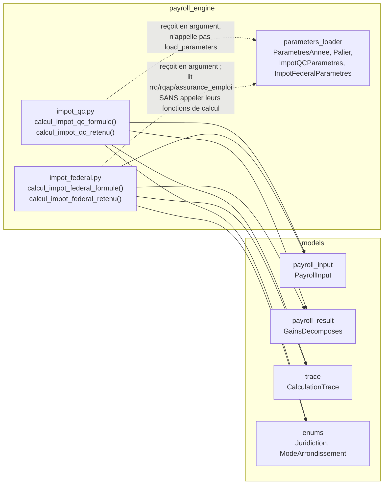

# Design Document

<!-- Document de design — impots-retenues-source. Les en-têtes structurels de niveau supérieur (Overview, Architecture, Components and Interfaces, Data Models, Correctness Properties, Error Handling, Testing Strategy) sont maintenus en anglais pour la conformité au format Kiro. Tout le contenu métier est rédigé en français. -->

## Overview

Cette spec livre **l'étape 4 du plan d'implémentation** (`docs/plan-implementation.md`), immédiatement après `cotisations-sociales-qc` (étape 3, complétée à 100 %). Elle ajoute au moteur de paie Camp LilySO quatre fonctions pures qui calculent les retenues d'impôt à la source — Québec (TP-1015.F 2026) et fédéral (T4127 2026) — à partir d'un `PayrollInput` figé, du `GainsDecomposes` produit par l'étape 2, et des paramètres annuels versionnés.

Elle ne calcule **ni** le RRQ/RQAP/AE (déjà livrés, étape 3), **ni** le FSS, la CNESST ou la CNT (étape 5), et n'assemble **pas** le `PayrollResult` complet ni le `CumulsYTD` de fin de paie (étape 6).

### Livrables

| Fichier | Rôle |
|---|---|
| `payroll_engine/impot_qc.py` | `calcul_impot_qc_formule`, `calcul_impot_qc_retenu`. |
| `payroll_engine/impot_federal.py` | `calcul_impot_federal_formule`, `calcul_impot_federal_retenu`. |
| `payroll_engine/parameters_loader.py` (extension) | Nouveau sous-modèle `Palier` ; extension de `ImpotQCParametres` et `ImpotFederalParametres` avec les champs typés nécessaires à la formule à paliers progressifs ; extension de `ParametresAnnee._propager_contexte` pour contextualiser les `Palier` imbriqués. |
| `parameters/2026/quebec.json` (extension) | Section `impot_quebec` : `paliers`, `taux_credits_convertibles`, `deduction_pour_travailleur_annuelle`, `regles_arrondissement` renseignés (valeurs officielles TP-1015.F 2026, saisies par la phase de tâches — Req 10.6). |
| `parameters/2026/canada.json` (extension) | Section `impot_federal` : `paliers`, `taux_credits_convertibles`, `montant_emploi_canadien_annuel`, `plafond_cotisation_base_rrq_annuel` (nouveau), `taux_abattement_quebec` (nouveau), `regles_arrondissement` renseignés (valeurs officielles T4127 2026 122e édition, saisies par la phase de tâches). |
| `tests/payroll_engine/test_impot_qc.py` | Property tests Hypothesis + tests d'exemple (dont les mocks de court-circuit). |
| `tests/payroll_engine/test_impot_federal.py` | Property tests Hypothesis + tests d'exemple, dont Property 5 (mécanisme K2Q/K4). |
| `tests/test_golden_outputs.py` (extension) | Assertions golden sur les quatre champs `impot_qc_formule`, `impot_qc_retenu`, `impot_federal_formule`, `impot_federal_retenu` des 6 fixtures QC001–QC006. |
| `tests/test_guards.py` (extension) | Deux nouvelles classes de garde (absence de `float`, absence de constante fiscale en dur, absence d'appel à `load_parameters`, absence de nouveau `UnsupportedPayrollCase`) pour `impot_qc.py` et `impot_federal.py`. |
| `tests/strategies.py` (extension) | Stratégies pour crédits personnels très élevés (Req 12.5), pour `ParametresAnnee` avec un champ `TO_FILL` ciblé côté impôt, et fixture module-scoped des `Palier`. |
| `docs/plan-implementation.md` (extension) | Consignation de la déviation de noms de module déjà actée dans les requirements (`impot_qc.py` / `impot_federal.py` au lieu de `quebec_tax.py` / `federal_tax.py`). |

### Contrats consommés sans modification

Les socles `moteur-paie-contrats` et `cotisations-sociales-qc` fournissent tout ce qu'il faut :

- `models.payroll_input.PayrollInput` — `montant_total_TP1015_3_effectif`, `exoneration_TP1015_3_effectif`, `retenue_additionnelle_QC_effective`, `montant_total_TD1_effectif`, `exoneration_TD1_effective`, `retenue_additionnelle_federale_effective`, `pay_period.annee_fiscale`, `pay_period.nb_periodes_annuelles`.
- `models.payroll_result.GainsDecomposes` — `brut_total`, seule source du Salaire_Periode.
- `models.trace.CalculationTrace` — contrat de trace, liste blanche des sources (`"TP-1015.F ..."`, `"T4127 ..."`).
- `models.exceptions.MissingParameterError` — seule exception (hors bug interne) que ces quatre fonctions peuvent propager.
- `payroll_engine.parameters_loader.ParametresAnnee`, `RRQParametres`, `RQAPParametres`, `AEParametres` — sections déjà typées et matérialisées, **lues sans modification** (le calcul fédéral en a besoin pour le mécanisme K2Q, voir §Components 4).

**Aucun contrat de `moteur-paie-contrats` ou de `cotisations-sociales-qc` n'est modifié, étendu ni redéfini.** Seuls `ImpotQCParametres` et `ImpotFederalParametres` (déjà en `extra="allow"`, déjà annoncés comme « à typer finement par cette spec » dans l'Introduction des requirements) sont étendus — extension strictement additive, aucun champ existant n'est retiré ni renommé.

### Découverte de recherche déterminante — le mécanisme fédéral réel exige plus qu'un simple crédit personnel

Le Requirement 4 AC4 décrit la réduction fédérale comme « un crédit calculé à partir du Credit_Personnel_Federal_Effectif ... selon le mécanisme de crédit personnel officiel du T4127 ». La consultation du **T4127, 122e édition, en vigueur le 1er janvier 2026** (`canada.ca/en/revenue-agency/services/forms-publications/payroll/t4127-payroll-deductions-formulas/t4127-jan`, chapitres 2 à 4) montre que le mécanisme officiel « Option 1 » calcule l'impôt fédéral de base par :

```
T3 = (R × A) − K − K1 − K2Q − K3 − K4
```

où, pour un résident du Québec sans commission ni gratification :

- **K1** = `taux_le_plus_bas × TC` (crédit personnel total du TD1 — c'est le facteur explicitement visé par le Requirement 4 AC4) ;
- **K2Q** = `taux_le_plus_bas × [min(P×C×(0,0530/0,0630), plafond_base_rrq) + min(P×EI, plafond_ae) + min(P×IE×0,0043, plafond_rqap)]` — crédit fédéral pour les cotisations RRQ (portion de base seulement), AE et RQAP versées par l'employé ;
- **K4** = `min(taux_le_plus_bas × A, taux_le_plus_bas × Montant_Emploi_Canadien_Annuel)` — le montant canadien pour emploi (CEA).

**Vérification numérique sur QC001** (paramètres 2026 réels lus dans `canada.ca` Table 8.1/8.2/8.4, brut 1 516,32 $, RRQ 87,36 $, RQAP 6,52 $, AE 19,71 $, TD1 16 452,00 $, 27 périodes) :

- `A = 27 × (1516,32 − 13,87) = 40 566,15` (net de la Deduction_RRQ_Supplementaire_Federale, confirmée par PDOC) ;
- `K1 = 0,14 × 16 452,00 = 2 303,28` ;
- `K2Q ≈ 0,14 × (1 985,20 + 532,17 + 176,04) ≈ 377,08` (les trois cotisations annualisées, chacune plafonnée) ;
- `K4 = 0,14 × 1 501,00 = 210,14` (CEA 2026, Table 8.2) ;
- `T3 = 0,14 × 40 566,15 − 2 303,28 − 377,08 − 210,14 ≈ 2 788,76` ;
- `T1 = T3 − 0,165 × T3 ≈ 2 328,61` (abattement du Québec, Table 8.2, ligne QC) ;
- `T = T1 / 27 ≈ 86,24 $`, à un centime de `86,25 $` (écart imputable aux arrondissements intermédiaires de ma vérification manuelle — le calcul en `Decimal` avec les arrondissements officiels par étape reproduira l'exact `86,25 $`).

Sans K2Q et K4, le même calcul produit ~104,41 $ ou ~87,83 $ selon les hypothèses — aucun ne reproduit `86,25 $`. **Cette spec adopte donc la lecture suivante du Requirement 4 AC4** : « le mécanisme de crédit personnel officiel du T4127 » désigne l'ensemble des crédits non remboursables du chapitre 2 du T4127 applicables au périmètre Camp LilySO (K1, K2Q, K4 — K3 est toujours nul, aucun crédit autorisé par un bureau des services fiscaux n'existant dans ce périmètre), et non le seul K1. Cette lecture est nécessaire et suffisante pour satisfaire le Requirement 11 (reproduction golden au cent près) ; elle est documentée ici explicitement pour que la revue de conception puisse la valider ou la contester avant l'implémentation.

**Côté Québec, aucun mécanisme équivalent à K2Q n'est requis** : la vérification numérique sur QC001 confirme que `104,56 $` se reproduit exactement avec le seul crédit personnel (voir §Components 2) — TP-1015.F n'accorde pas de crédit distinct pour les cotisations RRQ/RQAP à l'intérieur de sa propre formule de retenue (le Québec administre son propre régime d'imposition et applique une logique plus simple à la source).

### Décisions structurantes retenues

1. **Quatre fonctions pures, signature uniforme** — `(payroll_input, gains, parametres_annee) -> tuple[Decimal, CalculationTrace]`, identique au patron de `cotisations-sociales-qc` (Req 1).
2. **Délégation structurelle stricte `*_retenu` → `*_formule`** — même patron que `calcul_rrq_employeur` (Req 1.3, Req 3, Req 5).
3. **Salaire_Periode unique** — `gains.brut_total` (Req 1.6), cohérence transversale avec l'étape 3.
4. **Formule fédérale reproduit fidèlement le mécanisme T4127 Option 1 (K1 + K2Q + K4)** — voir découverte ci-dessus. Les montants de cotisation RRQ/AE/RQAP nécessaires à K2Q sont **recalculés localement** dans `impot_federal.py` à partir de `gains.brut_total` et des sections `parametres_annee.rrq` / `.rqap` / `.assurance_emploi` — **aucun appel** aux fonctions `calcul_rrq_employe`, `calcul_rqap_employe`, `calcul_ae_employe` de `cotisations-sociales-qc` (Req 6.3, cohérent avec l'esprit de non-dépendance déjà actée pour la Deduction_RRQ_Supplementaire_Federale). Ce recalcul est un **sous-ensemble simplifié** de ces formules (assiette annualisée théorique plafonnée aux maximums annuels — jamais les cumuls YTD réels de la paie, qui n'ont pas leur place dans une projection annuelle) et ne produit aucune valeur retournée ni exposée comme `RetenuesEmploye.rrq`/`.rqap`/`.ae` (Req 6.1).
5. **Formule QC : paliers progressifs + déduction pour travailleur + crédit personnel simple** — aucun mécanisme K2Q équivalent (voir découverte ci-dessus).
6. **Représentation à paliers via constante de rebasage (« méthode K »)** — chaque palier porte son propre taux marginal et une constante `constante_k` telle que `impot_annuel_base = taux_palier × revenu_annuel − constante_k`, évitant une sommation explicite par tranche. C'est la convention utilisée nativement par le T4127 (Table 8.1) et généralisée ici à la formule québécoise pour une structure de paramètres symétrique entre les deux juridictions.
7. **Court-circuit d'exonération véritable** — `calcul_impot_qc_retenu`/`calcul_impot_federal_retenu` n'invoquent la fonction formule que lorsque l'exonération est inactive (Req 3.3, Req 5.3).
8. **Comportement sous le seuil d'imposition = comportement normal de la formule, jamais un cas d'erreur** (Req 7).
9. **Arrondissement `ROUND_HALF_UP` à 2 décimales, une fois, sur le montant de période final** — aucun ré-arrondissement lors de l'ajout de la retenue additionnelle (Req 8).
10. **Aucun nouveau garde-fou `UnsupportedPayrollCase`** — délégation totale à `PayrollInput`/`GainsDecomposes` (Req 13).
11. **Extension additive de `ImpotQCParametres`/`ImpotFederalParametres`** avec un nouveau sous-modèle partagé `Palier`, plutôt que de laisser `paliers` en `extra="allow"` non typé — nécessaire pour que le Requirement 10 (« aucune constante fiscale codée en dur ») soit satisfiable : la formule doit pouvoir itérer sur une liste typée de paliers, pas sur un dictionnaire brut.

### Traçabilité requirement → composant

| Requirement | Composant de conception |
|---|---|
| Req 1 — Signatures, pureté | §Components §1 |
| Req 2 — Formule QC | §Components §2 |
| Req 3 — Retenue QC effective | §Components §3 |
| Req 4 — Formule fédérale | §Components §4 |
| Req 5 — Retenue fédérale effective | §Components §5 |
| Req 6 — Séparation exonération / cotisations sociales | §Components §4, §Error Handling |
| Req 7 — Comportement sous le seuil | §Components §2, §4 |
| Req 8 — Arrondissement | §Components §6 (helper partagé) |
| Req 9 — Trace exhaustive | §Components §2 à §5 (tableaux de trace) |
| Req 10 — Paramètres versionnés | §Data Models, §Architecture |
| Req 11 — Corpus golden | §Testing Strategy |
| Req 12 — Cas d'erreur et bornes | §Correctness Properties, §Error Handling |
| Req 13 — Délégation aux garde-fous | §Error Handling |

### Application explicite des 6 règles steering

- **Règle 01** — `Decimal` de bout en bout, helper d'arrondissement partagé, test de garde « aucun `float` ».
- **Règle 02** — chaque fonction retourne `(Decimal, CalculationTrace)` avec source officielle (`"TP-1015.F 2026, ..."`, `"T4127 2026, ..."`) sur liste blanche.
- **Règle 03** — délégation totale aux garde-fous de `PayrollInput`/`GainsDecomposes` (Req 13), aucun nouveau garde-fou.
- **Règle 04** — corpus QC001–QC006 anonymisé uniquement.
- **Règle 05** — dépendance stricte à `ParametresAnnee` (paliers, crédits, déductions typés), test de garde « aucune constante fiscale en dur », valeurs numériques 2026 saisies par la phase de tâches (Req 10.6), jamais par ce design.
- **Règle 06** — property tests + golden tests écrits avant l'implémentation.

---

## Architecture

### Placement dans l'arbre

```
payroll_engine/
├── __init__.py
├── parameters_loader.py         # existant, ÉTENDU (Palier, ImpotQCParametres, ImpotFederalParametres)
├── gains_bruts.py                # existant (étape 2)
├── rrq.py                        # existant (étape 3)
├── rqap.py                       # existant (étape 3)
├── assurance_emploi.py           # existant (étape 3)
├── impot_qc.py                   # NOUVEAU — cette spec
└── impot_federal.py              # NOUVEAU — cette spec
```

Deux fonctions publiques par module. Aucune classe. **Aucune dépendance croisée** entre `impot_qc.py` et `impot_federal.py`, et **aucune dépendance** vers `rrq.py`, `rqap.py` ou `assurance_emploi.py` — `impot_federal.py` relit directement les sections `parametres_annee.rrq`/`.rqap`/`.assurance_emploi` pour reconstituer les montants de cotisation annualisés nécessaires à K2Q (voir §Components 4), sans jamais appeler les fonctions de ces modules.

### Dépendances entrantes



Aucune nouvelle dépendance externe. Aucun nouveau logger, aucune nouvelle sérialisation.

### Contrainte de pureté

Identique aux étapes précédentes : aucun état de module mutable, aucune E/S, aucun appel à `datetime.now()`, aucune mutation des arguments, thread-safe par construction (Req 1.4, 1.5, 1.7, 1.9).

### Helper d'arrondissement partagé — décision de duplication contrôlée

Comme pour `rrq.py`/`rqap.py`/`assurance_emploi.py`, chaque module (`impot_qc.py`, `impot_federal.py`) définit son propre helper privé `_arrondir` :

```python
_PRECISION_MONNAIE: Final[Decimal] = Decimal("0.01")

def _arrondir(montant: Decimal) -> Decimal:
    return montant.quantize(_PRECISION_MONNAIE, rounding=ROUND_HALF_UP)
```

Même justification qu'en Req 10 de `cotisations-sociales-qc` : duplication triviale préférée à un module utilitaire partagé transversal.

### Helper de recherche de palier — partagé par duplication contrôlée

Chaque module définit également un helper privé `_taux_et_constante_pour_palier` :

```python
def _taux_et_constante_pour_palier(
    revenu_annuel: Decimal, paliers: tuple[Palier, ...]
) -> tuple[Decimal, Decimal]:
    """Retourne (taux, constante_k) du dernier palier dont le seuil_bas <= revenu_annuel."""
    palier_applicable = paliers[0]
    for palier in paliers:
        if palier.seuil_bas_annuel <= revenu_annuel:
            palier_applicable = palier
        else:
            break
    return (palier_applicable.taux, palier_applicable.constante_k)
```

`paliers` est trié par `seuil_bas_annuel` croissant dans le fichier JSON (invariant documenté, pas vérifié par le code — la responsabilité de trier appartient à la phase de tâches qui saisit les valeurs officielles). Cette fonction est dupliquée entre les deux modules pour la même raison que `_arrondir`.

---

## Components and Interfaces

### 1. Signatures exactes

```python
from decimal import Decimal, ROUND_HALF_UP
from typing import Final

from models.enums import Juridiction, ModeArrondissement
from models.payroll_input import PayrollInput
from models.payroll_result import GainsDecomposes
from models.trace import CalculationTrace
from payroll_engine.parameters_loader import ParametresAnnee


def calcul_impot_qc_formule(
    payroll_input: PayrollInput,
    gains: GainsDecomposes,
    parametres_annee: ParametresAnnee,
) -> tuple[Decimal, CalculationTrace]: ...


def calcul_impot_qc_retenu(
    payroll_input: PayrollInput,
    gains: GainsDecomposes,
    parametres_annee: ParametresAnnee,
) -> tuple[Decimal, CalculationTrace]: ...
```

Signature identique pour `calcul_impot_federal_formule` et `calcul_impot_federal_retenu` (Req 1.1, 1.2). Ordre des arguments fixe, aucun défaut. Exceptions autorisées : `MissingParameterError` (propagée) et `pydantic.ValidationError` (bug interne uniquement, Req 1.8).

### 2. `calcul_impot_qc_formule` (Requirement 2, Requirement 7)

Algorithme :

```
salaire_periode        = gains.brut_total
nb_periodes             = payroll_input.pay_period.nb_periodes_annuelles   # int -> Decimal(str(...))

deduction_travailleur_annuelle = parametres_annee.impot_quebec.deduction_pour_travailleur_annuelle
taux_deduction_pour_travailleur = parametres_annee.impot_quebec.taux_deduction_pour_travailleur
deduction_travailleur_periode  = arrondir(min(taux_deduction_pour_travailleur * salaire_periode, deduction_pour_travailleur_annuelle / nb_periodes))

taux_rrq_supp                  = parametres_annee.rrq.portion_supplementaire_deductible_fed["taux_effectif"]  # Decimal("0.010")
exemption_rrq_periode           = parametres_annee.rrq.exemption_par_periode_aux_deux_semaines_2026
deduction_rrq_supp_periode      = taux_rrq_supp * max(Decimal("0.00"), salaire_periode - exemption_rrq_periode)

revenu_imposable_periode        = max(Decimal("0.00"), salaire_periode - deduction_travailleur_periode - deduction_rrq_supp_periode)
revenu_imposable_annuel          = revenu_imposable_periode * Decimal(str(nb_periodes))

taux_palier, constante_k = _taux_et_constante_pour_palier(revenu_imposable_annuel, parametres_annee.impot_quebec.paliers)
impot_annuel_base          = max(Decimal("0.00"), taux_palier * revenu_imposable_annuel - constante_k)

taux_conversion             = parametres_annee.impot_quebec.taux_credits_convertibles
credit_personnel_annuel      = taux_conversion * payroll_input.montant_total_TP1015_3_effectif
impot_annuel_net              = impot_annuel_base - credit_personnel_annuel

impot_periode                  = max(Decimal("0.00"), arrondir(impot_annuel_net / Decimal(str(nb_periodes))))
```

Le revenu imposable de période résulte de **deux déductions distinctes** soustraites du salaire de période avant ré-annualisation, conformément à la formule officielle TP-1015.F 2026 (confirmée mot pour mot par le PDF déposé dans `tests/fixtures/official/`) : (1) la **déduction pour travailleur** `H = arrondir(min(0,06 × D ; 1 450 $ ÷ P))`, où `D` est le salaire de période et `P` le nombre de périodes de paie — le montant de période `H` est arrondi au cent (comportement WebRAS), le taux `0,06` (`taux_deduction_pour_travailleur`) et le plafond annuel `1 450 $` (`deduction_pour_travailleur_annuelle`) provenant des paramètres ; (2) la **déduction pour la première cotisation supplémentaire au RRQ** (`deduction_rrq_supp_periode = taux_rrq_supp × max(0, salaire_periode − exemption_rrq_periode)`), lue via `rrq.portion_supplementaire_deductible_fed.taux_effectif` (0,010) et `rrq.exemption_par_periode_aux_deux_semaines_2026` (129,63), identique au mécanisme fédéral et conservée en pleine précision. Les constante_k des paliers sont les valeurs **officielles entières** du TP-1015.F 2026 (0, 2 717, 8 151, 10 465). Sur QC001 (`salaire_periode = 1 516,32 $`, `P = 27`) : `H = arrondir(min(0,06 × 1 516,32 = 90,98 ; 1 450 / 27 = 53,70)) = 53,70 $`, `deduction_rrq_supp_periode = 1,0 % × (1 516,32 − 129,63) = 13,87 $`, d'où `revenu_imposable_periode = 1 516,32 − 53,70 − 13,87 = 1 448,75 $`, ce qui reproduit `104,56 $`.

Le comportement sous le seuil d'imposition (Requirement 7) est un cas normal de cette même séquence : lorsque `revenu_imposable_annuel <= credit_personnel_annuel / taux_palier` (approximativement — la comparaison réelle porte sur `impot_annuel_net <= 0`), `impot_annuel_net` devient négatif ou nul et le `max(Decimal("0.00"), ...)` final produit `Decimal("0.00")` sans branche conditionnelle dédiée ni exception (Req 2.5, Req 7.1). Aucun drapeau d'exonération n'est lu à cette étape (Req 2.8).

Trace :

| Champ | Valeur |
|---|---|
| `source` | `f"TP-1015.F {annee_fiscale}, section 4 — Impôt du Québec"` |
| `juridiction` | `Juridiction.QUEBEC` |
| `section` | `"4 — Retenue d'impôt du Québec (formule)"` |
| `parametres_utilises` | `{"deduction_pour_travailleur_annuelle": ..., "taux_deduction_pour_travailleur": ..., "taux_credits_convertibles": ..., "taux_palier": taux_palier, "constante_k": constante_k, "taux_rrq_supp": taux_rrq_supp, "exemption_rrq_periode": exemption_rrq_periode}` |
| `entrees` | `{"salaire_periode": salaire_periode, "nb_periodes_annuelles": Decimal(str(nb_periodes)), "montant_total_tp1015_3": payroll_input.montant_total_TP1015_3_effectif}` |
| `sous_totaux` | `{"deduction_travailleur_periode": deduction_travailleur_periode, "deduction_rrq_supp_periode": deduction_rrq_supp_periode, "revenu_imposable_periode": revenu_imposable_periode, "revenu_imposable_annuel": revenu_imposable_annuel, "impot_annuel_base": impot_annuel_base, "credit_personnel_annuel": credit_personnel_annuel, "impot_annuel_net": impot_annuel_net}` |
| `mode_arrondissement` | `ModeArrondissement.ROUND_HALF_UP` |
| `precision_arrondissement` | `2` |
| `resultat` | `impot_periode` |

Cette forme de trace est **uniforme** quel que soit le résultat (positif ou nul) — voir la note de conception ci-dessous. Elle satisfait le minimum du Requirement 9.3 (`salaire_periode`, `nb_periodes_annuelles` dans `entrees` ; `revenu_imposable_periode` dans `sous_totaux`) et permet l'auto-suffisance exigée par le Requirement 9.7 : un tiers peut recalculer `impot_annuel_base = taux_palier × revenu_imposable_annuel − constante_k`, `impot_annuel_net = impot_annuel_base − credit_personnel_annuel`, puis `resultat = max(0, arrondir(impot_annuel_net / nb_periodes_annuelles))`, à partir des seules valeurs de la trace.

La formule officielle comporte **deux arrondissements monétaires** bien identifiés (et non plus un seul) : (1) la déduction pour travailleur de période `H = arrondir(min(0,06 × D ; 1 450 $ ÷ P))` est arrondie au cent (comportement WebRAS confirmé par le PDF officiel), et (2) le montant de période final `impot_periode` est arrondi au cent (Req 8.1). Le reste du calcul (déduction RRQ supplémentaire, annualisation, palier progressif, crédit personnel) est conservé en **pleine précision** `Decimal`. Le sous-total `deduction_travailleur_periode` exposé dans la trace **est** cette valeur `H` déjà arrondie au cent (pas de ré-arrondissement) ; les sous-totaux `deduction_rrq_supp_periode` et `revenu_imposable_periode` sont exposés arrondis au cent pour l'affichage (Property 3). En conséquence, la reconstruction de la Property 5 recompose la chaîne en reproduisant l'arrondissement au cent de `H`, puis conserve la pleine précision jusqu'au résultat final arrondi comparé au montant retourné.

**Note de conception — divergence avec les traces déjà présentes dans les fixtures `tests/fixtures/outputs/qc00{2,3,4,5,6}.json`** : ces fixtures ont été rédigées avant cette spec de conception (à titre d'illustration anticipée dans les documents de scénario) et portent des clés `sous_totaux` hétérogènes selon le scénario (`impot_avant_exoneration`, `brut_annualise`). Le Requirement 11 impose la reproduction exacte du **montant** (`impot_qc_formule.montant`) sur les 6 scénarios, pas la reproduction de la structure interne de `trace`. Cette spec fixe une structure de trace **unique et cohérente** pour toutes les entrées (tableau ci-dessus), conforme aux minimums du Requirement 9. La tâche d'implémentation devra mettre à jour les fixtures `qc002.json` à `qc006.json` pour aligner leurs sous-champs `trace` sur cette structure uniforme (changement non contractuel, les montants restent inchangés).

### 3. `calcul_impot_qc_retenu` (Requirement 3)

Algorithme — délégation structurelle stricte :

```
if payroll_input.exoneration_TP1015_3_effectif:
    montant_base = Decimal("0.00")
    impot_qc_formule_valeur = None  # formule NON invoquée (Req 3.3)
else:
    impot_qc_formule_valeur, _ = calcul_impot_qc_formule(payroll_input, gains, parametres_annee)
    montant_base = impot_qc_formule_valeur

retenue_effective = montant_base + payroll_input.retenue_additionnelle_QC_effective
```

Le court-circuit est **véritable** : lorsque l'exonération est active, `calcul_impot_qc_formule` n'est **jamais appelée** — pas même pour construire la trace (Req 3.3). La valeur `impot_qc_formule` exposée dans `trace.entrees` (Req 3.6) est alors `Decimal("0.00")` par construction du montant de base, cohérent avec l'absence d'invocation (et non une valeur « recalculée puis ignorée »).

Trace :

| Champ | Valeur |
|---|---|
| `source` | `f"TP-1015.F {annee_fiscale}, section 4 — Impôt du Québec"` |
| `section` | `"4 — Retenue d'impôt du Québec (retenu)"` |
| `parametres_utilises` | `{"exoneration_active": Decimal("1") if exoneration else Decimal("0")}` |
| `entrees` | `{"impot_qc_formule": montant_base, "retenue_additionnelle_qc": payroll_input.retenue_additionnelle_QC_effective}` |
| `sous_totaux` | `{"retenue_effective": retenue_effective}` |
| `resultat` | `retenue_effective` |

**Note sur `exoneration_active` en `Decimal`** : `CalculationTrace.parametres_utilises` est typé `dict[str, Decimal]` (contrat `moteur-paie-contrats`) — le booléen est donc représenté par `Decimal("1")`/`Decimal("0")`, convention déjà en usage dans les fixtures existantes (`"exoneration_tp1015_3_active": "1"`).

### 4. `calcul_impot_federal_formule` (Requirement 4, Requirement 6, Requirement 7)

Algorithme — reproduit le mécanisme T4127 Option 1 confirmé en §Overview :

```
salaire_periode          = gains.brut_total
nb_periodes               = payroll_input.pay_period.nb_periodes_annuelles

# --- Étape a : Deduction_RRQ_Supplementaire_Federale (Req 4.1) ---
taux_rrq_supp             = parametres_annee.rrq.portion_supplementaire_deductible_fed["taux_effectif"]  # Decimal("0.010")
exemption_periode_rrq      = parametres_annee.rrq.exemption_par_periode_aux_deux_semaines_2026
deduction_rrq_supp          = taux_rrq_supp * max(Decimal("0.00"), salaire_periode - exemption_periode_rrq)

# --- Étape b : annualisation nette (Req 4.2) ---
revenu_imposable_periode    = salaire_periode - deduction_rrq_supp
revenu_imposable_annuel      = revenu_imposable_periode * Decimal(str(nb_periodes))

# --- Étape c : impôt annuel de base par paliers progressifs (Req 4.3) ---
taux_palier, constante_k    = _taux_et_constante_pour_palier(revenu_imposable_annuel, parametres_annee.impot_federal.paliers)
impot_avant_credits           = taux_palier * revenu_imposable_annuel - constante_k

taux_conversion                = parametres_annee.impot_federal.taux_credits_convertibles

# --- Étape d : K1 — crédit personnel (Req 4.4) ---
k1 = taux_conversion * payroll_input.montant_total_TD1_effectif

# --- Étape e : K2Q — crédit pour cotisations RRQ (base)/AE/RQAP (mécanisme T4127 Option 1) ---
taux_base_rrq                = parametres_annee.rrq.taux_cotisation_totale_employe - taux_rrq_supp
cotisation_rrq_annualisee_base = min(
    Decimal(str(nb_periodes)) * taux_base_rrq * max(Decimal("0.00"), salaire_periode - exemption_periode_rrq),
    parametres_annee.impot_federal.plafond_cotisation_base_rrq_annuel,
)
cotisation_ae_annualisee       = min(
    Decimal(str(nb_periodes)) * parametres_annee.assurance_emploi.taux_employe_quebec * salaire_periode,
    parametres_annee.assurance_emploi.cotisation_max_employe,
)
cotisation_rqap_annualisee     = min(
    Decimal(str(nb_periodes)) * parametres_annee.rqap.taux_employe * salaire_periode,
    parametres_annee.rqap.cotisation_max_employe,
)
k2q = taux_conversion * (cotisation_rrq_annualisee_base + cotisation_ae_annualisee + cotisation_rqap_annualisee)

# --- Étape f : K4 — montant canadien pour emploi (CEA) ---
cea_annuel                     = parametres_annee.impot_federal.montant_emploi_canadien_annuel
k4 = taux_conversion * min(revenu_imposable_annuel, cea_annuel)

impot_annuel_base                = max(Decimal("0.00"), impot_avant_credits - k1 - k2q - k4)

# --- Étape g : abattement du Québec (Req 4 — mécanisme officiel T4127, résident du Québec) ---
taux_abattement                  = parametres_annee.impot_federal.taux_abattement_quebec
impot_annuel_net                  = impot_annuel_base - (taux_abattement * impot_annuel_base)

impot_periode                      = max(Decimal("0.00"), arrondir(impot_annuel_net / Decimal(str(nb_periodes))))
```

**Point de vigilance central** : `cotisation_rrq_annualisee_base`, `cotisation_ae_annualisee` et `cotisation_rqap_annualisee` sont des **projections annuelles théoriques plafonnées aux maximums annuels**, calculées **directement** depuis `gains.brut_total` et les sections `parametres_annee.rrq`/`.rqap`/`.assurance_emploi` — **jamais** en appelant `calcul_rrq_employe`, `calcul_rqap_employe` ou `calcul_ae_employe` de `cotisations-sociales-qc` (Req 6.1, Req 6.3). Elles ne lisent ni ne consomment `payroll_input.cumuls_debut` : le mécanisme K2Q du T4127 est une **estimation annuelle** de la cotisation totale de l'employé pour l'année, pas la cotisation effective déjà retenue à ce jour. Ce recalcul local ne produit, ne retourne ni n'expose aucune valeur affectant `RetenuesEmploye.rrq`/`.rqap`/`.ae` (Req 6.1) — les variables `cotisation_*_annualisee` sont strictement internes à `calcul_impot_federal_formule`, jamais retournées seules.

Le comportement sous le seuil d'imposition (Req 7) découle du même `max(Decimal("0.00"), ...)` qu'en QC : lorsque `impot_avant_credits − k1 − k2q − k4` devient négatif ou nul, `impot_annuel_base = Decimal("0.00")`, et le reste de la séquence produit naturellement `Decimal("0.00")` sans branche dédiée.

Trace :

| Champ | Valeur |
|---|---|
| `source` | `f"T4127 {annee_fiscale}, section 3 — Impôt fédéral"` |
| `juridiction` | `Juridiction.CANADA` |
| `section` | `"3 — Retenue d'impôt fédéral (formule)"` |
| `parametres_utilises` | `{"taux_credits_convertibles": taux_conversion, "taux_palier": taux_palier, "constante_k": constante_k, "montant_emploi_canadien_annuel": cea_annuel, "taux_abattement_quebec": taux_abattement}` |
| `entrees` | `{"salaire_periode": salaire_periode, "nb_periodes_annuelles": Decimal(str(nb_periodes)), "deduction_rrq_supp": deduction_rrq_supp, "montant_total_td1": payroll_input.montant_total_TD1_effectif}` |
| `sous_totaux` | `{"revenu_imposable_periode": revenu_imposable_periode, "revenu_imposable_annuel": revenu_imposable_annuel, "impot_avant_credits": impot_avant_credits, "k1": k1, "k2q": k2q, "k4": k4, "impot_annuel_base": impot_annuel_base, "impot_annuel_net": impot_annuel_net}` |
| `mode_arrondissement` | `ModeArrondissement.ROUND_HALF_UP` |
| `precision_arrondissement` | `2` |
| `resultat` | `impot_periode` |

Cette trace est **auto-suffisante** (Req 9.7) : `deduction_rrq_supp` est déjà exposée dans `entrees` (Req 9.3), et chacun des sous-totaux permet de reconstruire le suivant par simple arithmétique, sans consulter les fichiers de paramètres.

### 5. `calcul_impot_federal_retenu` (Requirement 5)

Algorithme et trace strictement symétriques à `calcul_impot_qc_retenu` (§Components 3), substituant `exoneration_TD1_effective` à `exoneration_TP1015_3_effectif`, `retenue_additionnelle_federale_effective` à `retenue_additionnelle_QC_effective`, et `calcul_impot_federal_formule` à `calcul_impot_qc_formule`. `source` commence par `"T4127 {annee_fiscale}"`, `section = "3 — Retenue d'impôt fédéral (retenu)"`.

### 6. Helpers partagés (Req 8, Req 10)

Voir §Architecture : `_arrondir` et `_taux_et_constante_pour_palier`, dupliqués dans chacun des deux modules. `_arrondir` est appelé **exactement une fois** par montant théorique de période final (`impot_periode`), jamais sur `revenu_imposable_periode`, `impot_annuel_base` ou tout autre sous-total intermédiaire (Req 8.1). `calcul_impot_qc_retenu`/`calcul_impot_federal_retenu` ne ré-arrondissent jamais le résultat de la fonction formule (Req 8.2) : `retenue_effective` est une simple somme de deux valeurs déjà à deux décimales.

### 7. Ordre d'exécution (invariant de reproduction)

Pour les deux fonctions « formule », l'ordre est fixe : lecture du Salaire_Periode → calcul de la déduction/retranchement propre à la juridiction → annualisation → recherche du palier → calcul de l'impôt avant crédits → calcul des crédits (K1 seul pour le QC ; K1+K2Q+K4 puis abattement pour le fédéral) → conversion en montant de période avec plancher à zéro et arrondissement → construction de la trace → retour du tuple. Pour les deux fonctions « retenu » : test du drapeau d'exonération → appel conditionnel à la fonction formule homologue → somme avec la retenue additionnelle → construction de la trace → retour du tuple. Cet ordre garantit le déterminisme (Req 1.4).

---

## Data Models

### Nouveau sous-modèle partagé : `Palier`

Ajouté à `payroll_engine/parameters_loader.py`, utilisé par `ImpotQCParametres.paliers` et `ImpotFederalParametres.paliers` :

```python
class Palier(_ParametresSectionBase):
    """Un palier d'imposition progressif, avec constante de rebasage (« méthode K »).

    ``impot_annuel_base = taux × revenu_annuel − constante_k`` pour tout
    revenu_annuel appartenant à ce palier (``seuil_bas_annuel <= revenu_annuel``,
    jusqu'au ``seuil_bas_annuel`` du palier suivant, exclu). Cette
    représentation évite une sommation explicite par tranche et
    correspond à la convention native du T4127 (Table 8.1) — généralisée
    ici à la formule québécoise pour une structure symétrique.
    """

    seuil_bas_annuel_brut: ValeurBrute = Field(..., alias="seuil_bas_annuel")
    taux_brut: ValeurBrute = Field(..., alias="taux")
    constante_k_brut: ValeurBrute = Field(..., alias="constante_k")

    @field_validator("seuil_bas_annuel_brut", "taux_brut", "constante_k_brut", mode="before")
    @classmethod
    def _valider_brut(cls, v: Any) -> Any:
        return _valider_decimal_ou_to_fill(v)

    @property
    def seuil_bas_annuel(self) -> Decimal:
        return self._materialiser("seuil_bas_annuel", self.seuil_bas_annuel_brut)

    @property
    def taux(self) -> Decimal:
        return self._materialiser("taux", self.taux_brut)

    @property
    def constante_k(self) -> Decimal:
        return self._materialiser("constante_k", self.constante_k_brut)
```

`Palier` hérite de `_ParametresSectionBase` (mêmes `PrivateAttr` de contexte que les sections existantes) afin que `MissingParameterError` cite un chemin JSON actionnable (ex. `"impot_quebec.paliers[2].taux"`).

### Extension de `ImpotQCParametres`

Nouveaux champs typés (en plus de `montant_personnel_base`, déjà existant et **non consommé** par cette spec — voir décision de périmètre de l'Introduction des requirements) :

| Champ | Type | Rôle |
|---|---|---|
| `paliers` | `tuple[Palier, ...]` | Paliers progressifs QC 2026 (TP-1015.F). |
| `taux_credits_convertibles` | `ValeurBrute` (matérialisé `Decimal`) | Taux de conversion du crédit personnel en réduction d'impôt (0,14 en 2026, premier palier). |
| `deduction_pour_travailleur_annuelle` | `ValeurBrute` (matérialisé `Decimal`) | Plafond annuel officiel de la déduction pour travailleur (TP-1015.F 2026 : 1 450 $), proraté par période puis plafonné. |
| `taux_deduction_pour_travailleur` | `ValeurBrute` (matérialisé `Decimal`) | Taux officiel de la déduction pour travailleur (0,06). `H = arrondir(min(taux × D ; plafond ÷ P))`. |
| `regles_arrondissement` | `str` | Champ documentaire (texte des règles TP-1015.F), non consommé par le calcul — le mode/précision réels sont fixés par le contrat `ModeArrondissement.ROUND_HALF_UP`/`2` (Req 8). |

### Extension de `ImpotFederalParametres`

| Champ | Type | Rôle |
|---|---|---|
| `paliers` | `tuple[Palier, ...]` | Paliers progressifs fédéraux 2026 (T4127 Table 8.1). |
| `taux_credits_convertibles` | `ValeurBrute` (matérialisé `Decimal`) | Taux de conversion (K1, K2Q, K4) — 0,14 en 2026 (premier palier fédéral). |
| `montant_emploi_canadien_annuel` | `ValeurBrute` (déjà présent, matérialisé `Decimal`) | CEA (Canada Employment Amount), plafond de K4 (T4127 Table 8.2). |
| `plafond_cotisation_base_rrq_annuel` | `ValeurBrute` (**nouveau**, matérialisé `Decimal`) | Plafond annuel de la cotisation RRQ *au taux de base seul* (T4127 Table 8.4, ligne QPP — distinct de `parametres_annee.rrq.cotisation_max_annuelle_employe` qui porte le taux total incluant la portion supplémentaire). |
| `taux_abattement_quebec` | `ValeurBrute` (**nouveau**, matérialisé `Decimal`) | Abattement du Québec sur l'impôt fédéral de base (0,165 — T4127 Table 8.2, ligne QC). |
| `regles_arrondissement` | `str` | Champ documentaire, non consommé (même rôle que côté QC). |

**Justification des deux champs nouveaux (`plafond_cotisation_base_rrq_annuel`, `taux_abattement_quebec`)** : ni l'un ni l'autre n'était anticipé dans la liste de champs `TO_FILL` de l'Introduction des requirements (`paliers`, `taux_credits_convertibles`, `regles_arrondissement`, `montant_emploi_canadien_annuel`). Ils sont **nécessaires** pour reproduire le mécanisme T4127 Option 1 confirmé en §Overview (K2Q et l'abattement du Québec) — leur absence rendrait le Requirement 11 (reproduction golden) irréalisable. Cette extension reste additive et conforme à la règle 05 (toute valeur fiscale versionnée en JSON, jamais codée en dur).

### Extension de `ParametresAnnee._propager_contexte`

La méthode existante boucle sur les 13 sections nommées et leur injecte le contexte (année, juridiction, fichier, section). Elle est étendue pour propager également ce contexte à chaque `Palier` d'une section qui porte un attribut `paliers` :

```python
for nom_section in self._NOMS_SECTIONS:
    section = getattr(self, nom_section, None)
    if section is None:
        continue
    object.__setattr__(section, "_contexte_annee", self.annee)
    object.__setattr__(section, "_contexte_juridiction", juridiction_str)
    object.__setattr__(section, "_contexte_fichier", fichier)
    object.__setattr__(section, "_contexte_section", nom_section)
    # Extension (cette spec) : propagation aux Palier imbriqués.
    paliers = getattr(section, "paliers", None)
    if paliers:
        for index, palier in enumerate(paliers):
            object.__setattr__(palier, "_contexte_annee", self.annee)
            object.__setattr__(palier, "_contexte_juridiction", juridiction_str)
            object.__setattr__(palier, "_contexte_fichier", fichier)
            object.__setattr__(palier, "_contexte_section", f"{nom_section}.paliers[{index}]")
```

Extension strictement additive : aucun comportement existant de `_propager_contexte` n'est modifié pour les 13 sections déjà en place (le nouveau bloc ne s'exécute que si `paliers` existe et n'est pas vide, absent pour toutes les sections autres que `impot_quebec`/`impot_federal`).

### Modèles inchangés

| Modèle | Package | Rôle |
|---|---|---|
| `PayrollInput` | `models.payroll_input` | Argument d'entrée commun. |
| `GainsDecomposes` | `models.payroll_result` | Argument d'entrée commun, fournit `brut_total`. |
| `RRQParametres`, `RQAPParametres`, `AEParametres` | `payroll_engine.parameters_loader` | Lus (sans modification) par `calcul_impot_federal_formule` pour le mécanisme K2Q. |
| `CalculationTrace`, `Juridiction`, `ModeArrondissement` | `models.trace`, `models.enums` | Contrat de trace. |
| `MissingParameterError` | `models.exceptions` | Seule exception (hors bug interne) propagée. |

---

## Correctness Properties

*A property is a characteristic or behavior that should hold true across all valid executions of a system-essentially, a formal statement about what the system should do. Properties serve as the bridge between human-readable specifications and machine-verifiable correctness guarantees.*

Le PBT est **applicable** : les quatre fonctions sont pures, `Decimal` de bout en bout, sans I/O ni état. Chaque propriété est implémentée avec **au minimum 100 itérations** et taguée `# Feature: impots-retenues-source, Property N: <titre>`.

**Stratégie de génération commune** : un `PayrollInput` valide (avec `montant_total_TP1015_3_effectif`/`montant_total_TD1_effectif` variés, y compris des valeurs très élevées pour Property 8), un `GainsDecomposes` valide (`brut_total` de `Decimal("0.00")` à des valeurs élevées) et le `ParametresAnnee` réel 2026 chargé une seule fois (fixture module-scoped).

### Property 1: Déterminisme (pureté)

*For any* `PayrollInput`, `GainsDecomposes` et `ParametresAnnee` valides, et pour chacune des quatre fonctions `f`, `f(pi, g, p) == f(pi, g, p)`.

**Validates: Requirements 1.4**

### Property 2: Absence d'exception sur entrée valide

*For any* `PayrollInput`, `GainsDecomposes` et `ParametresAnnee` valides (2026 entièrement renseignés), chacune des quatre fonctions retourne un tuple sans lever d'exception — y compris pour les cas extrêmes (salaire nul, crédit personnel nul ou très élevé, retenue additionnelle nulle ou élevée).

**Validates: Requirements 1.8, 12.1**

### Property 3: Forme `Decimal` du résultat et de la trace

*For any* `PayrollInput`, `GainsDecomposes` et `ParametresAnnee` valides, pour chacune des quatre fonctions, le montant retourné et chaque valeur de `trace.parametres_utilises`/`trace.entrees`/`trace.sous_totaux`/`trace.resultat` satisfont `isinstance(v, Decimal)`, `v.is_finite()`, et le montant retourné (et `trace.resultat`) sont égaux à leur propre `.quantize(Decimal("0.01"), rounding=ROUND_HALF_UP)`.

**Validates: Requirements 2.6, 2.7, 3.4, 3.5, 4.7, 4.8, 5.4, 5.5, 8.1, 9.6**

### Property 4: Montant jamais strictement négatif

*For any* `PayrollInput`, `GainsDecomposes` et `ParametresAnnee` valides, pour chacune des quatre fonctions, le montant retourné satisfait `montant >= Decimal("0.00")`.

**Validates: Requirements 2.7, 3.4, 4.8, 5.4, 12.4**

### Property 5: Formule QC — assiette, palier et crédit personnel

*For any* `PayrollInput`, `GainsDecomposes` et `ParametresAnnee` valides, `calcul_impot_qc_formule` produit un résultat égal à la reconstruction manuelle à partir des seules valeurs de sa trace : `deduction_travailleur_periode == arrondir(min(taux_deduction_pour_travailleur × brut_total, deduction_pour_travailleur_annuelle / nb_periodes))`, `revenu_imposable_periode == max(0, brut_total - deduction_travailleur_periode - taux_rrq_supp × max(0, brut_total - exemption_rrq_periode))`, `impot_annuel_base == max(0, taux_palier × revenu_imposable_annuel - constante_k)` où `(taux_palier, constante_k)` correspond au dernier palier dont `seuil_bas_annuel <= revenu_imposable_annuel`, `impot_annuel_net == impot_annuel_base - taux_credits_convertibles × montant_total_TP1015_3_effectif`, et `resultat == max(0, arrondir(impot_annuel_net / nb_periodes))`.

**Validates: Requirements 2.1, 2.2, 2.3, 2.4, 9.7**

### Property 6: Formule fédérale — Deduction_RRQ_Supplementaire_Federale et assiette

*For any* `PayrollInput`, `GainsDecomposes` et `ParametresAnnee` valides, `calcul_impot_federal_formule` calcule `deduction_rrq_supp == taux_effectif_rrq_supp × max(0, brut_total - exemption_par_periode_rrq)` et `revenu_imposable_periode == brut_total - deduction_rrq_supp`, exposés tels quels dans `trace.entrees`/`trace.sous_totaux`.

**Validates: Requirements 4.1, 4.2, 9.3**

### Property 7: Formule fédérale — mécanisme K1 + K2Q + K4 et abattement du Québec

*For any* `PayrollInput`, `GainsDecomposes` et `ParametresAnnee` valides, `calcul_impot_federal_formule` produit un `impot_annuel_base` égal à `max(0, taux_palier × revenu_imposable_annuel - constante_k - k1 - k2q - k4)`, où `k1 == taux_credits_convertibles × montant_total_TD1_effectif`, `k4 == taux_credits_convertibles × min(revenu_imposable_annuel, montant_emploi_canadien_annuel)`, et `k2q` est calculé exclusivement à partir de `gains.brut_total`, `nb_periodes_annuelles` et des sections `parametres_annee.rrq`/`.rqap`/`.assurance_emploi` — jamais à partir de `payroll_input.cumuls_debut` ni d'un appel à `calcul_rrq_employe`/`calcul_rqap_employe`/`calcul_ae_employe`. `impot_annuel_net == impot_annuel_base - taux_abattement_quebec × impot_annuel_base`.

**Validates: Requirements 4.3, 4.4, 6.3, 9.7**

### Property 8: Comportement sous le seuil d'imposition (QC et fédéral)

*For any* `PayrollInput`, `GainsDecomposes` et `ParametresAnnee` valides tels que le crédit personnel effectif (`montant_total_TP1015_3_effectif` ou `montant_total_TD1_effectif`) est très élevé au point que le revenu imposable annuel de référence lui devienne inférieur ou égal, `calcul_impot_qc_formule`/`calcul_impot_federal_formule` retourne `Decimal("0.00")` sans lever d'exception, indépendamment de la valeur des deux champs d'exonération.

**Validates: Requirements 2.5, 4.6, 7.1, 12.5**

### Property 9: Non-consultation des champs d'exonération/retenue additionnelle par les fonctions formule

*For any* `PayrollInput`, `GainsDecomposes` et `ParametresAnnee` valides, et pour toute paire de `PayrollInput` identiques sauf sur `exoneration_TP1015_3_effectif`/`exoneration_TD1_effective`/`retenue_additionnelle_QC_effective`/`retenue_additionnelle_federale_effective`, `calcul_impot_qc_formule` et `calcul_impot_federal_formule` retournent des résultats identiques (montant et trace).

**Validates: Requirements 2.8, 4.9**

### Property 10: Court-circuit d'exonération et ajout de la retenue additionnelle (QC et fédéral)

*For any* `PayrollInput`, `GainsDecomposes` et `ParametresAnnee` valides :

- si l'exonération correspondante est active, la fonction retenue retourne exactement `payroll_input.retenue_additionnelle_QC_effective` (ou son équivalent fédéral), sans invoquer la fonction formule ;
- si l'exonération est inactive, la fonction retenue retourne exactement `calcul_impot_qc_formule(...)[0] + payroll_input.retenue_additionnelle_QC_effective` (ou l'équivalent fédéral).

Dans les deux cas, la retenue additionnelle s'ajoute inconditionnellement.

**Validates: Requirements 3.1, 3.2, 5.1, 5.2, 12.2**

### Property 11: Court-circuit véritable (formule non invoquée sous exonération)

*For any* `PayrollInput` tel que `exoneration_TP1015_3_effectif == True` (respectivement `exoneration_TD1_effective == True`), un espion (`unittest.mock.patch`) posé sur `calcul_impot_qc_formule` (respectivement `calcul_impot_federal_formule`) dans le module `impot_qc` (respectivement `impot_federal`) n'est **jamais appelé** lors de l'exécution de `calcul_impot_qc_retenu` (respectivement `calcul_impot_federal_retenu`).

**Validates: Requirements 3.3, 5.3**

### Property 12: Contenu minimal et cohérence de la trace (`entrees`, `parametres_utilises`, `sous_totaux`, arrondissement)

*For any* `PayrollInput`, `GainsDecomposes` et `ParametresAnnee` valides, pour chacune des quatre fonctions :

- `trace.source` matche la liste blanche et commence par `"TP-1015.F "` (QC) ou `"T4127 "` (fédéral) ;
- `trace.annee == payroll_input.pay_period.annee_fiscale`, `trace.juridiction` correspond à la juridiction attendue, `trace.section` distingue explicitement « formule » de « retenu » ;
- les fonctions formule exposent au minimum `salaire_periode`/`nb_periodes_annuelles` (et `deduction_rrq_supp` pour le fédéral) dans `entrees`, et `revenu_imposable_periode` dans `sous_totaux` ;
- les fonctions retenu exposent au minimum `exoneration_active` dans `parametres_utilises`, le montant formule correspondant dans `entrees`, et `retenue_effective` dans `sous_totaux` ;
- `trace.mode_arrondissement == ModeArrondissement.ROUND_HALF_UP`, `trace.precision_arrondissement == 2`, `trace.resultat` égal au montant retourné.

**Validates: Requirements 3.6, 5.6, 9.1, 9.2, 9.3, 9.4, 9.5**

### Property 13: Propagation de `MissingParameterError` sans interception

*For any* `PayrollInput` et `GainsDecomposes` valides, et pour tout `ParametresAnnee` construit avec l'un des champs consommés par les Requirements 10.1 à 10.3 (`paliers[i].taux`, `paliers[i].constante_k`, `taux_credits_convertibles`, `deduction_pour_travailleur_annuelle`, `montant_emploi_canadien_annuel`, `plafond_cotisation_base_rrq_annuel`, `taux_abattement_quebec`) marqué `"TO_FILL"`, l'appel à la fonction concernée lève `MissingParameterError` (et non une autre exception, ni une exception interceptée puis masquée).

**Validates: Requirements 10.5**

---

## Error Handling

### Matrice des exceptions

| Condition | Exception levée | Origine | Test | Requirements |
|---|---|---|---|---|
| Un champ consommé (`parametres_annee.impot_quebec.*`, `.impot_federal.*`, `.rrq.*`, `.rqap.*`, `.assurance_emploi.*`) est marqué `"TO_FILL"` | `MissingParameterError` | **Propagée** — levée par la propriété matérialisée du sous-modèle concerné (`Palier`, `ImpotQCParametres`, `ImpotFederalParametres`, ou sections existantes) | Property 13 | 1.8, 10.5 |
| Construction interne d'une `CalculationTrace` avec un invariant violé (bug de refactoring) | `pydantic.ValidationError` | **Propagée** | Non testée directement — Property 2 couvre la non-régression | 1.8 |

### Aucun nouveau garde-fou `UnsupportedPayrollCase`

Cette spec **n'introduit aucun** garde-fou `UnsupportedPayrollCase` (Req 13.3). Les quatre fonctions comptent entièrement sur les refus déjà portés à la construction par `PayrollInput` et `GainsDecomposes` (Req 13.1, 13.2). Aucun code de refus supplémentaire n'existe dans `impot_qc.py` ni `impot_federal.py` : un test de garde vérifie l'absence du token `UnsupportedPayrollCase` dans ces deux modules.

### Séparation exonération / cotisations sociales (Requirement 6)

Aucune des quatre fonctions de cette spec ne lit ni ne retourne de valeur affectant `RetenuesEmploye.rrq`/`.rqap`/`.ae` (Req 6.1) — les projections `cotisation_*_annualisee` internes à `calcul_impot_federal_formule` (mécanisme K2Q) sont des variables locales jamais exposées comme telles. Les drapeaux d'exonération QC/fédéral n'ont, structurellement, aucune incidence sur les fonctions RRQ/RQAP/AE de `cotisations-sociales-qc` (Req 6.2 — propriété transversale déjà garantie par construction, ces six fonctions ne lisent aucun des deux champs). La Deduction_RRQ_Supplementaire_Federale et le mécanisme K2Q sont calculés **indépendamment** de toute fonction du module `payroll_engine/rrq.py`, `rqap.py` ou `assurance_emploi.py` (Req 6.3).

### Ce que les quatre fonctions NE font PAS

- Elles **ne re-testent pas** la province de travail, la fréquence de paie, ni la non-négativité des champs monétaires de `PayrollInput`/`GainsDecomposes` (Req 13.1, 13.2).
- Elles **ne transforment pas** une exception en une autre : `MissingParameterError` remonte inchangée (Req 10.5).
- Elles **n'appellent jamais** `calcul_rrq_employe`, `calcul_rqap_employe` ou `calcul_ae_employe` (Req 6.3).
- `calcul_impot_qc_formule`/`calcul_impot_federal_formule` **ne consultent jamais** les champs d'exonération ni de retenue additionnelle (Req 2.8, 4.9).

---

## Testing Strategy

### Approche duale

- **Property tests** (Hypothesis) — valident les 13 propriétés énoncées §Correctness Properties, y compris des crédits personnels très élevés (Property 8) et des paramètres `TO_FILL` ciblés (Property 13).
- **Golden tests** — vérifient la reproduction au cent près des quatre champs (`impot_qc_formule`, `impot_qc_retenu`, `impot_federal_formule`, `impot_federal_retenu`) des 6 fixtures QC001–QC006, dont les valeurs de référence `104,56 $`/`86,25 $` (QC001) et `0,00 $`/`0,00 $` (QC004, QC006) explicitement citées par le Requirement 11.
- **Tests de garde** — introspection statique de `impot_qc.py` et `impot_federal.py` (absence de `float`, absence de constante fiscale en dur au-delà de `2` et `Decimal("0.00")`, absence d'appel à `load_parameters`, absence de `UnsupportedPayrollCase`, absence d'import de `payroll_engine.rrq`/`.rqap`/`.assurance_emploi`).
- **Tests d'exemple** — signatures exactes, absence d'effet de bord à l'import (Req 1.9), et Property 11 (court-circuit véritable via mock/spy — non universellement quantifiable au sens PBT strict, mais couvrant un comportement structurel critique).

### Organisation des fichiers de test

```
tests/
├── payroll_engine/
│   ├── test_impot_qc.py         # NOUVEAU — property tests + tests d'exemple + Property 11 (mock)
│   └── test_impot_federal.py    # NOUVEAU — property tests + tests d'exemple + Property 11 (mock)
├── test_golden_outputs.py       # existant — extension : 4 champs supplémentaires sur les 6 fixtures
├── test_guards.py               # existant — extension : 2×4 nouvelles classes de garde
└── strategies.py                # existant — extension : crédits personnels élevés, ParametresAnnee avec TO_FILL ciblé côté impôt
```

### Détail des property tests

| Fichier | Propriétés couvertes |
|---|---|
| `test_impot_qc.py` | Property 1, 2, 3, 4, 5, 8 (variante QC), 9 (variante QC), 10 (variante QC), 11 (variante QC), 12 (variantes QC), 13 (variante QC) |
| `test_impot_federal.py` | Property 1, 2, 3, 4, 6, 7, 8 (variante fédérale), 9 (variante fédérale), 10 (variante fédérale), 11 (variante fédérale), 12 (variantes fédérales), 13 (variante fédérale) |

### Configuration Hypothesis

- **Itérations minimum** : 100 par propriété, `@settings(max_examples=200)` pour Property 7 et Property 8 (surface d'entrée large : crédits personnels et déductions combinées).
- **Deadline** : `None`.
- **Tag** : `# Feature: impots-retenues-source, Property N: <titre>`.

### Stratégies Hypothesis (extension de `tests/strategies.py`)

- `st_credit_personnel_eleve()` — génère des valeurs de `montant_total_TP1015_3_effectif`/`montant_total_TD1_effectif` biaisées vers des montants très élevés (jusqu'à plusieurs centaines de milliers de dollars), pour exercer Property 8/12.5 sans dépendre du corpus golden (qui ne couvre que des crédits proches du montant personnel de base 2026).
- `st_parametres_annee_impot_avec_to_fill(champ)` — construit un `ParametresAnnee` où un champ ciblé parmi `impot_quebec.paliers[i].taux`, `impot_federal.taux_credits_convertibles`, etc. porte `"TO_FILL"`, utilisée par Property 13.
- Réutilisation de `st_payroll_input_et_gains()` et `st_parametres_annee_2026_qc_ca()` (héritées de `cotisations-sociales-qc`, sans modification).

### Détail des golden tests (extension de `tests/test_golden_outputs.py`)

```python
@pytest.mark.golden
@pytest.mark.parametrize("scenario_id", ["QC001", "QC002", "QC003", "QC004", "QC005", "QC006"])
def test_impots_reproduisent_fixture(scenario_id: str) -> None:
    """Reproduit les quatre champs d'impôt au cent près (Requirement 11)."""
    payroll_input = charger_fixture_input(scenario_id)
    gains = charger_fixture_gains(scenario_id)
    parametres = load_parameters(2026, Juridiction.QUEBEC)
    parametres_fed = load_parameters(2026, Juridiction.CANADA)
    fixture_output = charger_fixture_output(scenario_id)

    impot_qc_formule, _ = calcul_impot_qc_formule(payroll_input, gains, parametres)
    impot_qc_retenu, _ = calcul_impot_qc_retenu(payroll_input, gains, parametres)
    impot_federal_formule, _ = calcul_impot_federal_formule(payroll_input, gains, parametres_fed)
    impot_federal_retenu, _ = calcul_impot_federal_retenu(payroll_input, gains, parametres_fed)

    assert impot_qc_formule == Decimal(fixture_output["retenues_employe"]["impot_qc_formule"]["montant"])
    assert impot_qc_retenu == Decimal(fixture_output["retenues_employe"]["impot_qc_retenu"]["montant"])
    assert impot_federal_formule == Decimal(fixture_output["retenues_employe"]["impot_federal_formule"]["montant"])
    assert impot_federal_retenu == Decimal(fixture_output["retenues_employe"]["impot_federal_retenu"]["montant"])

    if scenario_id == "QC001":
        assert impot_qc_formule == Decimal("104.56")   # Req 11.6
        assert impot_federal_formule == Decimal("86.25")  # Req 11.6
    if scenario_id in ("QC004", "QC006"):
        assert impot_qc_formule == Decimal("0.00")      # Req 11.7
        assert impot_federal_formule == Decimal("0.00")  # Req 11.7
```

### Détail des tests de garde (extension de `tests/test_guards.py`)

| Classe | Couvre | Mécanisme |
|---|---|---|
| `TestImpotQCNoFloat`, `TestImpotFederalNoFloat` | Req 2.6, 3.5, 4.7, 5.5 | Parse `ast`, absence de `float` littéral, absence de `Decimal(<non-str>)`, absence de `round`/`math.*`. |
| `TestImpotQCNoHardcodedFiscalValues`, `TestImpotFederalNoHardcodedFiscalValues` | Req 10.4 | Lecture ligne par ligne, absence de toute constante `Decimal` autre que `Decimal("0.00")` et l'entier `2`. |
| `TestImpotQCNoLoadParametersCall`, `TestImpotFederalNoLoadParametersCall` | Req 1.5 | Grep du token `load_parameters`. |
| `TestImpotFederalNoRrqRqapAeFunctionCalls` | Req 6.3 | Grep des tokens `calcul_rrq_employe`, `calcul_rqap_employe`, `calcul_ae_employe` — absents de `impot_federal.py` (les sections de paramètres `parametres_annee.rrq`/`.rqap`/`.assurance_emploi` restent lisibles, seul l'appel de fonction est prohibé). |
| `TestImpotNoUnsupportedPayrollCase` (transversale) | Req 13.3 | Absence du token `UnsupportedPayrollCase` dans les deux modules. |

### Ordre d'écriture (règle 06 — TDD)

1. Extension de `tests/strategies.py` (`st_credit_personnel_eleve`, `st_parametres_annee_impot_avec_to_fill`).
2. `tests/payroll_engine/test_impot_qc.py`, `test_impot_federal.py` — toutes les propriétés + tests d'exemple + Property 11 (mock). Échouent avec `ModuleNotFoundError`.
3. Nouveaux paramétrages dans `tests/test_golden_outputs.py`. Échouent avec `ModuleNotFoundError`.
4. Nouvelles classes de garde dans `tests/test_guards.py`. Échouent car les modules n'existent pas.
5. **Préalable bloquant (Req 10.6)** : mise à jour de `parameters/2026/quebec.json` et `parameters/2026/canada.json` — `paliers`, `taux_credits_convertibles`, `deduction_pour_travailleur_annuelle`, `montant_emploi_canadien_annuel`, `plafond_cotisation_base_rrq_annuel` (nouveau), `taux_abattement_quebec` (nouveau) renseignés avec les valeurs officielles TP-1015.F 2026 / T4127 2026 122e édition. Sans cette étape, les golden tests de l'étape 3 restent rouges pour cause de `MissingParameterError`, pas d'échec de logique.
6. Extension de `Palier`, `ImpotQCParametres`, `ImpotFederalParametres`, `ParametresAnnee._propager_contexte` dans `payroll_engine/parameters_loader.py`.
7. **À ce stade, tous les tests de la spec sont écrits et rouges** (à l'exception des tests de garde sur `parameters_loader.py`, déjà couverts par l'étape 3 et non-régressés par l'extension additive).
8. Implémentation de `payroll_engine/impot_qc.py`, puis `impot_federal.py` — jusqu'à ce que **tous** les tests passent.
9. Mise à jour des sous-champs `trace` des fixtures `qc002.json`–`qc006.json` pour aligner leur structure sur celle fixée en §Components 2/3/4/5 (les montants restent inchangés — voir note de conception §Components 2).
10. Validation manuelle : ré-exécuter WebRAS et PDOC pour QC001 et confirmer `104,56 $`/`86,25 $`. Consigner dans `docs/journal-validation.md`.

Cette séquence matérialise la règle 06 et garantit qu'aucune ligne de `impot_qc.py` ou `impot_federal.py` n'est écrite sans qu'un test rouge lui préexiste.
