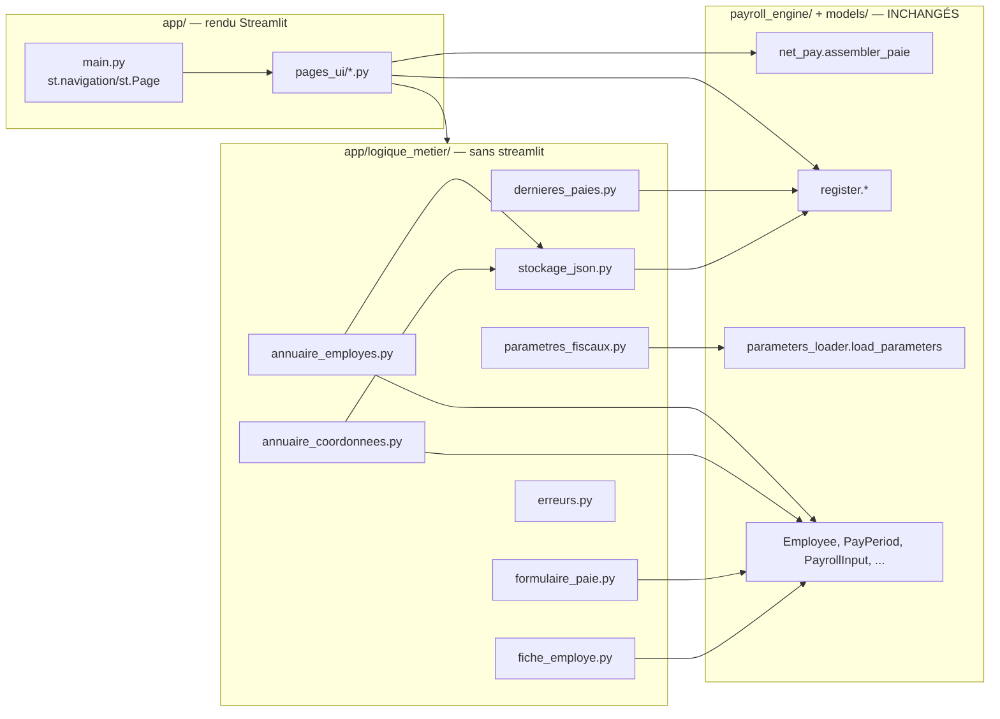

# Design Document

<!-- Document de design — interface-streamlit. Les en-têtes structurels de niveau supérieur (Overview, Architecture, Components and Interfaces, Data Models, Correctness Properties, Error Handling, Testing Strategy) sont maintenus en anglais pour la conformité au format Kiro. Tout le contenu métier est rédigé en français. -->

## Overview

Cette spec livre **l'étape 7 du plan d'implémentation** (`docs/plan-implementation.md`), après `moteur-paie-contrats`, `gains-bruts-vacances-hs`, `cotisations-sociales-qc`, `impots-retenues-source`, `charges-patronales` et `net-cumuls-registre` — les six specs qui ont livré et figé l'intégralité du moteur de calcul (`models/`, `payroll_engine/`). Elle ajoute une **interface locale Streamlit** (`app/`) qui **consomme** ce moteur sans le modifier :

- un **Annuaire_Employes** et un **Annuaire_Coordonnees**, deux nouveaux annuaires JSON locaux, propres à l'interface, résidant hors du dépôt versionné ;
- un **Tableau_De_Bord** (page d'accueil) listant les employés avec un résumé de leur situation ;
- une **Fiche_Employe_Detaillee** (page de détail) regroupant informations employé, coordonnées et paies sur un seul écran ;
- une **identité visuelle** reprenant la palette et le logo du Camp LilySO ;
- un **Formulaire_Paie** simplifié (trois dates de période plutôt que deux `WeekSegment` saisis manuellement) qui construit un `PayrollInput`, invoque `assembler_paie`, puis `inserer_paie`/`remplacer_paie` ;
- la **consultation** du registre maître (`lire_historique_paie`, `lire_cumuls_ytd`) ;
- une **gestion des erreurs** fail-fast et non masquante (règle 03) sur toute la surface de l'interface.

**Aucune formule fiscale n'est implémentée ici** : tout calcul reste exclusivement porté par `assembler_paie` et les fonctions qu'il invoque. Cette spec n'ajoute que de la logique d'**orchestration**, de **persistance JSON locale** (annuaires) et de **rendu Streamlit**.

### Livrables

| Fichier / dossier | Rôle |
|---|---|
| `app/logique_metier/stockage_json.py` | Écriture atomique générique (write-to-temp + rename) et lecture/écriture de listes de modèles Pydantic ; résolution des chemins de production des deux annuaires. |
| `app/logique_metier/annuaire_employes.py` | `lister_employes`, `enregistrer_employe`, `lire_employe` (Req 2). |
| `app/logique_metier/annuaire_coordonnees.py` | `FicheCoordonnees`, `enregistrer_coordonnees`, `lire_coordonnees` (Req 20). |
| `app/logique_metier/dernieres_paies.py` | `LignePaieResume`, `derniere_annee_paie` (Req 4 AC3), `lire_resumes_paies`, `regrouper_saison_par_annee` (Req 5.2), `filtrer_par_annee` (Req 5.3), `formater_option_annee`. |
| `app/logique_metier/parametres_fiscaux.py` | `lister_annees_disponibles` (Req 6.1), `charger_parametres_fusionnes` (Req 6.2). |
| `app/logique_metier/formulaire_paie.py` | `convertir_numero_en_id` (Req 4.7), `deriver_semaines_constituantes` (Req 7.3), `construire_payroll_input` (Req 7.7), `generer_id_paie` (Req 10.1, 13.3). |
| `app/logique_metier/fiche_employe.py` | `parametres_effectifs_par_defaut` (Req 8.1), `mettre_a_jour_donnees_fiscales` (Req 11.2). |
| `app/logique_metier/erreurs.py` | `ErreurDomaineAffichable`, `executer_avec_capture` — disjonction stricte des erreurs (Req 16), sans import `streamlit`. |
| `app/pages_ui/*.py` | Rendu Streamlit exclusivement (Req 1.1, 1.3) — un module par écran. |
| `app/main.py` | Point d'entrée `streamlit run app/main.py` — déclare la navigation (`st.navigation`/`st.Page`) et applique l'identité visuelle globale. |
| `app/assets/logo-camp-lilyso.png` | Copie versionnée du logo (tâche explicite — source `intake/ressources/`, hors dépôt). |
| `.streamlit/config.toml` | Thème natif Streamlit reprenant la palette du Camp LilySO (Req 3.1). |
| `tests/app/**` | Tests d'exemple, property tests (Hypothesis) et tests de garde pour `app/logique_metier/`. |

### Contrats consommés sans modification

Aucun fichier sous `payroll_engine/` ni `models/` n'est modifié (Req 18.1) :

- `models.employee.Employee` (dont `avec_defauts_par_annee`), `models.pay_period.{PayPeriod, WeekSegment}`, `models.payroll_input.{PayrollInput, HeuresParSemaine}`, `models.payroll_result.PayrollResult`, `models.cumuls.CumulsYTD`, `models.trace.CalculationTrace`, `models.enums.{StatutDePaie, Juridiction, FrequencePaie}`.
- `models.exceptions.{PayrollDomainError, UnsupportedPayrollCase, MissingParameterError}`.
- `payroll_engine.parameters_loader.{ParametresAnnee, load_parameters}`.
- `payroll_engine.net_pay.assembler_paie`.
- `payroll_engine.register.{inserer_paie, lire_paie, lire_historique_paie, lire_cumuls_ytd, remplacer_paie, chemin_bd_production}`.

Chaque invocation utilise la signature exacte déjà figée (Req 18.3) — aucun argument positionnel ou nommé supplémentaire, aucune réimplémentation locale.

### Décisions structurantes retenues

En complément des 14 décisions déjà actées par `requirements.md` §Introduction :

1. **Deux couches strictes, chacune potentiellement plusieurs fichiers** — `app/logique_metier/*.py` (aucun de ces modules n'importe `streamlit`, testé par un test de garde AST) et la couche de rendu (`app/main.py` + `app/pages_ui/*.py`, qui ne contiennent que des appels `st.*` et des appels aux fonctions de `app/logique_metier/`). Cette séparation en plusieurs fichiers par couche (plutôt qu'un unique `logique_metier.py`/`main.py`) suit la taille du domaine (annuaires, formulaire, tableau de bord) sans jamais mélanger les deux responsabilités dans un même fichier (Req 1.1, 1.3).
2. **`chemin_annuaire_employes_production()`/`chemin_annuaire_coordonnees_production()` dérivés de `chemin_bd_production()`** — plutôt que de dupliquer la logique de résolution `%APPDATA%`/`XDG_DATA_HOME`/repli portable déjà écrite dans `payroll_engine/register.py`, ces deux fonctions appellent `chemin_bd_production()` (fonction **publique**, déjà figée, Req 18.3) et utilisent son répertoire parent (`CampLilySO/`) pour construire `employees.json` et `coordonnees.json`. Aucune duplication de l'algorithme de résolution ; aucune modification de `register.py` (Req 19.2).
3. **Annuaires JSON : liste d'objets, chaque objet produit par `model_dump_json()`** — le fichier JSON de chaque annuaire est un tableau (`[...]`) construit par concaténation textuelle des sorties `Employee.model_dump_json()` (ou `FicheCoordonnees.model_dump_json()`). À la lecture, chaque élément du tableau est ré-encodé individuellement (`json.dumps`) puis repassé à `Employee.model_validate_json()`/`FicheCoordonnees.model_validate_json()` — ce qui réutilise **exactement** le mécanisme anti-`float` déjà porté par `Employee` (`_parse_json_reject_floats`), sans qu'`app/` ait besoin d'importer un symbole privé de `models/` (Req 2.3, 2.4, règle 01).
4. **Écriture atomique par write-to-temp + rename** — `os.replace()` (atomique sur le même volume, POSIX et Windows) après écriture complète dans un fichier temporaire du **même répertoire** que la cible, avec nettoyage du fichier temporaire sur toute exception. C'est un nouveau patron pour `app/` (le patron transactionnel SQLite de `register.py` ne s'applique pas à un fichier JSON) mais suit le même principe d'atomicité « tout ou rien » (Req 2.6, 20.5).
5. **`derniere_annee_paie` et `lire_resumes_paies` interrogent `paies` en SQL direct, sans jamais appeler `_creer_schema_si_absent` ni une autre fonction privée de `register.py`** — une base neuve ou absente ne comporte encore aucune table ; l'absence de table est interceptée explicitement (`sqlite3.OperationalError` dont le message contient `"no such table"`) et traduite en « aucune paie » plutôt que d'appeler une fonction privée de `register.py` pour créer le schéma (Req 4 AC3, Req 18.2).
6. **`st.navigation`/`st.Page`** — `pyproject.toml` déclare `streamlit>=1.36` (extra `ui`), version qui introduit `st.Page`/`st.navigation` comme méthode préférée de déclaration multipage (remplace le répertoire `pages/` à découverte implicite). `app/main.py` construit explicitement la liste des `st.Page(fonction_de_rendu, title=..., icon=...)` plutôt que de s'appuyer sur une convention de nommage de fichiers — cohérent avec la séparation stricte logique/rendu (chaque page reste une fonction Python testable en isolation par `streamlit.testing.v1.AppTest` si nécessaire).
7. **Thème natif Streamlit (`.streamlit/config.toml` `[theme]`) plutôt que CSS injecté** — la palette du Camp LilySO (`intake/ressources/code-couleurs.txt`) est appliquée via les clés `[theme]` natives (`primaryColor`, `backgroundColor`, `secondaryBackgroundColor`, `textColor`), configuration déclarative, sans dépendance à `st.markdown(..., unsafe_allow_html=True)`. Le contraste police/fond des boutons d'action (`#3d5775` en gras sur `#7aaeea`) et la distinction visuelle des erreurs (Req 3.5) qui ne sont pas couverts par les clés natives du thème sont traités par les composants Streamlit sémantiques (`st.error`, `st.warning`) plutôt que par du CSS ad hoc — limitant le CSS injecté au strict nécessaire.
8. **`FicheCoordonnees` est un nouveau modèle Pydantic défini sous `app/`, jamais sous `models/`** — ce modèle porte délibérément des données personnelles réelles en production (Req 20), à l'opposé du principe de `models.employee.Employee` (règle 04, `reject_sensitive_fields`). Le placer sous `models/` violerait la garde de périmètre du contrat de calcul ; le placer sous `app/` (Req 18.2) matérialise la séparation stricte exigée par le Requirement 20 (jamais transmis au moteur).
9. **Aucun wrapper superflu autour de `assembler_paie`/`inserer_paie`/`remplacer_paie`/`lire_*`** — ces six fonctions sont déjà pures ou déjà testées indépendamment de tout rendu (Req 1.2 est satisfait par construction : ce sont des fonctions de `payroll_engine`, pas de `streamlit`). Les pages de rendu les invoquent directement, chaque appel étant enveloppé par `executer_avec_capture` (décision n° 10) pour la disjonction stricte des erreurs — cette enveloppe ne transforme ni ne complète les arguments (Req 18.3).
10. **`executer_avec_capture` — capture distincte factorisée, sans `except Exception`** — un unique petit utilitaire de `app/logique_metier/erreurs.py` (aucun import `streamlit`) centralise le patron « appeler une fonction, capturer distinctement `UnsupportedPayrollCase`, `MissingParameterError`, `ValueError`, `KeyError`, retourner soit le résultat soit une `ErreurDomaineAffichable` » (Req 16.1, 16.2). Toute exception d'un autre type n'est **pas** interceptée par cet utilitaire — elle continue de se propager telle quelle jusqu'à Streamlit (Req 16.3).

### Application explicite des 6 règles steering

- **Règle 01** — toute saisie numérique passe par une conversion chaîne → `Decimal` (jamais `st.number_input` en mode flottant natif) ; `FicheCoordonnees` ne porte aucun champ `Decimal` (aucune donnée monétaire) — la règle ne s'y applique pas, comme documenté par le Glossary.
- **Règle 02** — l'interface n'invente aucune `CalculationTrace` ; elle affiche exclusivement les traces déjà produites par `assembler_paie` (Req 10.3).
- **Règle 03** — aucun nouveau garde-fou de périmètre : `deriver_semaines_constituantes`/`construire_payroll_input` laissent `PayPeriod`/`PayrollInput` lever leurs propres `UnsupportedPayrollCase`/`ValueError`, jamais interceptés silencieusement.
- **Règle 04** — `chemin_annuaire_employes_production()`, `chemin_annuaire_coordonnees_production()` et `chemin_bd_production()` résident tous hors du dépôt (`%APPDATA%\CampLilySO\`) ; tests exclusivement sur `tmp_path` ; identifiants fictifs `EMP0XX` ; le logo copié n'est pas une donnée sensible (illustration générique).
- **Règle 05** — aucun taux/plafond/constante fiscale codé en dur dans `app/` ; `charger_parametres_fusionnes` délègue intégralement à `load_parameters`.
- **Règle 06** — tests (property + exemple + garde) écrits avant l'implémentation ; `Logique_Metier_App` séparée du rendu pour rester testable sans `streamlit.testing.v1.AppTest`.

---

## Architecture

### Placement dans l'arbre

```
app/
├── __init__.py
├── main.py                              # NOUVEAU — point d'entrée, st.navigation/st.Page
├── assets/
│   └── logo-camp-lilyso.png             # NOUVEAU — copié depuis intake/ressources/ (tâche explicite)
├── logique_metier/                      # NOUVEAU — AUCUN import `streamlit`
│   ├── __init__.py
│   ├── stockage_json.py                 # écriture atomique + chemins de production des annuaires
│   ├── annuaire_employes.py             # lister_employes, enregistrer_employe, lire_employe
│   ├── annuaire_coordonnees.py          # FicheCoordonnees, enregistrer_coordonnees, lire_coordonnees
│   ├── dernieres_paies.py               # lecture SQL directe (paies) + agrégations pures
│   ├── parametres_fiscaux.py            # années disponibles + fusion QC/CA
│   ├── formulaire_paie.py               # dérivation de dates, assemblage PayrollInput, id_paie
│   ├── fiche_employe.py                 # pré-remplissage + mise à jour fiscale immuable
│   └── erreurs.py                       # disjonction stricte (ErreurDomaineAffichable)
└── pages_ui/                            # rendu Streamlit EXCLUSIVEMENT
    ├── __init__.py
    ├── tableau_de_bord.py
    ├── fiche_employe_detaillee.py
    ├── formulaire_paie.py
    └── historique_et_cumuls.py

.streamlit/
└── config.toml                          # NOUVEAU — [theme] palette Camp LilySO
```

Cette arborescence matérialise la contrainte du Requirement 1 : `app/logique_metier/**` ne contient jamais `import streamlit` (vérifié par un test de garde AST, §Error Handling) ; `app/main.py` et `app/pages_ui/**` ne contiennent que du rendu et des appels aux fonctions de `app/logique_metier/**` ou de `payroll_engine`/`models`.

### Dépendances entrantes



`app/logique_metier/**` importe uniquement `models/`, `payroll_engine/` (fonctions publiques) et la bibliothèque standard (`json`, `sqlite3`, `os`, `tempfile`, `pathlib`) — jamais `streamlit`. `app/main.py` et `app/pages_ui/**` importent `streamlit`, `app/logique_metier/**`, et directement les six fonctions du moteur listées au tableau des contrats consommés.

### Résolution des chemins de production hors dépôt (Req 19.2)

```python
from pathlib import Path
from payroll_engine.register import chemin_bd_production

def chemin_annuaire_employes_production() -> Path:
    return chemin_bd_production().parent / "employees.json"

def chemin_annuaire_coordonnees_production() -> Path:
    return chemin_bd_production().parent / "coordonnees.json"
```

Les trois chemins (`payroll.db`, `employees.json`, `coordonnees.json`) résident donc systématiquement dans le même répertoire `%APPDATA%\CampLilySO\` (ou son équivalent multiplateforme) — un seul répertoire hors dépôt à sauvegarder/exclure par `.gitignore`, cohérent avec Req 19.2 et le Requirement 9 AC3 (« un seul registre par session »).

### Navigation multipage (Req 4, Req 5, décision n° 6)

```python
# app/main.py (extrait — squelette de structure, pas d'implémentation complète)
import streamlit as st

from app.pages_ui import (
    fiche_employe_detaillee,
    formulaire_paie,
    historique_et_cumuls,
    tableau_de_bord,
)

st.set_page_config(page_title="Camp LilySO — Paie", page_icon="app/assets/logo-camp-lilyso.png")

page_tableau_de_bord = st.Page(
    tableau_de_bord.render, title="Tableau de bord", default=True,
)
page_fiche_employe = st.Page(
    fiche_employe_detaillee.render, title="Fiche employé",
)
page_formulaire_paie = st.Page(
    formulaire_paie.render, title="Nouvelle paie / correction",
)
page_historique = st.Page(
    historique_et_cumuls.render, title="Historique et cumuls",
)

navigation = st.navigation(
    [page_tableau_de_bord, page_fiche_employe, page_formulaire_paie, page_historique]
)
navigation.run()
```

Chaque module de `app/pages_ui/` expose une unique fonction `render() -> None` : elle lit/écrit `st.session_state` pour transporter la sélection courante (employé sélectionné, année sélectionnée, valeurs du Formulaire_Paie en cours — Req 16.4, préservation des valeurs saisies en cas d'erreur), et délègue tout calcul ou accès aux annuaires/au registre à `app/logique_metier/**`. Aucune fonction de rendu ne contient de logique de construction d'objet du domaine au-delà de la lecture des widgets Streamlit et de l'appel à la fonction de `Logique_Metier_App` correspondante.

### Thème natif (Req 3.1, décision n° 7)

```toml
# .streamlit/config.toml
[theme]
primaryColor = "#7aaeea"
backgroundColor = "#bad5f4"
secondaryBackgroundColor = "#1f2c3b"
textColor = "#3d5775"
font = "sans serif"
```

Correspondance avec `intake/ressources/code-couleurs.txt` : fond clair `#bad5f4` (`backgroundColor`), texte sur fond clair `#3d5775` (`textColor`), boutons d'action à fond `#7aaeea` (`primaryColor`, utilisé nativement par `st.button(..., type="primary")`), fond foncé `#1f2c3b` (`secondaryBackgroundColor`, barre latérale de navigation). Le texte en gras sur fond foncé (`#ffffff`) et le texte en gras des boutons d'action (`#3d5775` en gras) ne sont pas des clés du thème natif — ils sont appliqués via le style par défaut de `st.sidebar`/`st.button` (déjà en gras pour les boutons primaires par défaut du thème Streamlit) sans CSS additionnel.

---

## Components and Interfaces

### 1. `stockage_json.py` — écriture atomique générique (Req 2.6, 20.5)

```python
from __future__ import annotations

import os
import tempfile
from pathlib import Path


def ecrire_atomique(chemin: Path, contenu: str) -> None:
    """Écrit ``contenu`` dans ``chemin`` de façon atomique (Req 2.6, 20.5).

    Patron write-to-temp + rename : le contenu complet est d'abord écrit
    dans un fichier temporaire créé dans le **même répertoire** que
    ``chemin`` (garantit que ``os.replace`` reste sur le même système de
    fichiers — condition requise pour l'atomicité POSIX et Windows), puis
    ``os.replace(temp, chemin)`` remplace la cible en une seule opération
    atomique. Si une exception survient avant ``os.replace`` (erreur
    d'écriture disque, permission refusée), le fichier temporaire est
    supprimé et ``chemin`` reste inchangé — aucune écriture partielle
    n'est jamais visible.

    Crée le répertoire parent (`mkdir(parents=True, exist_ok=True)`) si
    nécessaire — cohérent avec le comportement de `_connexion` de
    `register.py` (Req 15, spec `net-cumuls-registre`).
    """
    chemin.parent.mkdir(parents=True, exist_ok=True)
    descripteur, chemin_temp_str = tempfile.mkstemp(
        dir=str(chemin.parent), suffix=".tmp"
    )
    chemin_temp = Path(chemin_temp_str)
    try:
        with os.fdopen(descripteur, "w", encoding="utf-8") as f:
            f.write(contenu)
            f.flush()
            os.fsync(f.fileno())
        os.replace(chemin_temp, chemin)
    except BaseException:
        chemin_temp.unlink(missing_ok=True)
        raise


def lire_texte_ou_defaut(chemin: Path, defaut: str) -> str:
    """Lit ``chemin`` en UTF-8, ou retourne ``defaut`` si absent (Req 2.2, 20.7).

    Aucune exception n'est levée si ``chemin`` n'existe pas encore — c'est
    le cas nominal d'un annuaire jamais encore écrit.
    """
    if not chemin.exists():
        return defaut
    return chemin.read_text(encoding="utf-8")
```

`ecrire_atomique`/`lire_texte_ou_defaut` sont les deux seules primitives d'E/S de ce module — `annuaire_employes.py` et `annuaire_coordonnees.py` les réutilisent identiquement (Req 2.6 et Req 20.5 partagent donc une implémentation unique, cohérent avec la Property de réflexion de consolidation).

### 2. `annuaire_employes.py` — cycle CRUD (Req 2)

```python
from __future__ import annotations

import json
from pathlib import Path

from models.employee import Employee
from payroll_engine.register import chemin_bd_production
from app.logique_metier.stockage_json import ecrire_atomique, lire_texte_ou_defaut


def chemin_annuaire_employes_production() -> Path:
    return chemin_bd_production().parent / "employees.json"


def lister_employes(chemin_annuaire: Path = chemin_annuaire_employes_production()) -> tuple[Employee, ...]:
    """Liste toutes les Fiches_Employe, triées par ``id`` croissant (Req 2.1).

    Retourne un tuple vide si ``chemin_annuaire`` n'existe pas encore
    (Req 2.2) — jamais d'exception. Chaque élément du tableau JSON brut
    est ré-encodé individuellement (``json.dumps``) puis repassé à
    ``Employee.model_validate_json`` (décision n° 3) : aucun nouveau
    schéma de sérialisation, réutilisation intégrale du parseur anti-
    ``float`` déjà porté par ``Employee``.
    """
    brut = lire_texte_ou_defaut(chemin_annuaire, defaut="[]")
    elements = json.loads(brut)
    employes = tuple(
        Employee.model_validate_json(json.dumps(element)) for element in elements
    )
    return tuple(sorted(employes, key=lambda e: e.id))


def enregistrer_employe(
    employe: Employee,
    chemin_annuaire: Path = chemin_annuaire_employes_production(),
) -> None:
    """Enregistre ``employe`` — création ou mise à jour par ``id`` (Req 2.3).

    Lit l'annuaire courant (via ``lister_employes``, réutilisation sans
    duplication de la logique de lecture), remplace toute Fiche_Employe
    de même ``id`` par ``employe`` ou l'ajoute si absente, puis réécrit
    l'annuaire complet de façon atomique (``ecrire_atomique``, Req 2.6).
    """
    existants = {e.id: e for e in lister_employes(chemin_annuaire)}
    existants[employe.id] = employe
    contenu = "[" + ",".join(e.model_dump_json() for e in existants.values()) + "]"
    ecrire_atomique(chemin_annuaire, contenu)


def lire_employe(
    id_employe: str,
    chemin_annuaire: Path = chemin_annuaire_employes_production(),
) -> Employee:
    """Lit une Fiche_Employe unique par ``id`` (Req 2.4).

    Lève ``KeyError`` citant ``id_employe`` si absent de l'annuaire
    (Req 2.5) — jamais de valeur de repli silencieuse.
    """
    for employe in lister_employes(chemin_annuaire):
        if employe.id == id_employe:
            return employe
    raise KeyError(f"Aucune Fiche_Employe trouvée pour id={id_employe!r}.")
```

Aucun garde-fou de périmètre n'est dupliqué (Req 2.7) : `enregistrer_employe` ne valide rien elle-même — c'est la construction de l'`Employee` passé en argument (déjà effectuée par l'appelant via `Employee(...)` ou `Employee.avec_defauts_par_annee(...)`) qui a levé `UnsupportedPayrollCase` en amont si nécessaire.

### 3. `annuaire_coordonnees.py` — `FicheCoordonnees` et cycle CRUD (Req 20)

```python
from __future__ import annotations

import json
from pathlib import Path

from pydantic import BaseModel, ConfigDict, Field

from payroll_engine.register import chemin_bd_production
from app.logique_metier.stockage_json import ecrire_atomique, lire_texte_ou_defaut


class FicheCoordonnees(BaseModel):
    """Coordonnées opérationnelles d'un employé (Req 20) — JAMAIS transmise
    à `assembler_paie`, `PayrollInput`, `Employee` ni à aucune fonction de
    `payroll_engine/` (Req 20.3, Req 18.4). Définie sous `app/`, jamais
    sous `models/` (décision n° 8) : ce modèle porte délibérément des
    données personnelles réelles en production, à l'inverse du contrat de
    calcul qui les interdit (règle 04, `reject_sensitive_fields`).

    Aucun champ n'est un `Decimal` — la règle 01 ne s'applique pas à ce
    modèle (absence de montant monétaire, cohérent avec le Glossary).
    """

    model_config = ConfigDict(frozen=True, extra="forbid")

    employe_id: str = Field(..., min_length=1)
    nom_complet_reel: str | None = None
    nas: str | None = None
    adresse_residentielle: str | None = None
    courriel: str | None = None
    telephone: str | None = None


def chemin_annuaire_coordonnees_production() -> Path:
    return chemin_bd_production().parent / "coordonnees.json"


def lister_coordonnees(
    chemin_coordonnees: Path = chemin_annuaire_coordonnees_production(),
) -> tuple[FicheCoordonnees, ...]:
    """Liste toutes les Fiche_Coordonnees (helper interne à ce module).

    Même patron que `lister_employes` — tuple vide si le fichier n'existe
    pas encore (Req 20.7), aucune exception.
    """
    brut = lire_texte_ou_defaut(chemin_coordonnees, defaut="[]")
    elements = json.loads(brut)
    return tuple(
        FicheCoordonnees.model_validate_json(json.dumps(element))
        for element in elements
    )


def enregistrer_coordonnees(
    fiche: FicheCoordonnees,
    chemin_coordonnees: Path = chemin_annuaire_coordonnees_production(),
) -> None:
    """Enregistre ``fiche`` — création ou mise à jour par ``employe_id`` (Req 20.1).

    Même patron d'écriture atomique que `enregistrer_employe` (Req 20.5).
    """
    existantes = {f.employe_id: f for f in lister_coordonnees(chemin_coordonnees)}
    existantes[fiche.employe_id] = fiche
    contenu = "[" + ",".join(f.model_dump_json() for f in existantes.values()) + "]"
    ecrire_atomique(chemin_coordonnees, contenu)


def lire_coordonnees(
    employe_id: str,
    chemin_coordonnees: Path = chemin_annuaire_coordonnees_production(),
) -> FicheCoordonnees | None:
    """Lit une Fiche_Coordonnees par ``employe_id`` (Req 20.2).

    Retourne ``None`` — jamais d'exception — si aucune Fiche_Coordonnees
    n'existe pour cet employé, y compris si l'annuaire lui-même n'existe
    pas encore (Req 20.7).
    """
    for fiche in lister_coordonnees(chemin_coordonnees):
        if fiche.employe_id == employe_id:
            return fiche
    return None
```

### 4. `dernieres_paies.py` — lecture SQL directe, sans fonction privée de `register.py` (Req 4 AC3, Req 18.2)

```python
from __future__ import annotations

import sqlite3
from dataclasses import dataclass
from pathlib import Path

from payroll_engine.register import chemin_bd_production


def derniere_annee_paie(
    employe_id: str,
    chemin_bd: str | Path = chemin_bd_production(),
) -> int | None:
    """Année fiscale de la paie la plus récente d'un employé (Req 4 AC3).

    Interroge directement et exclusivement les colonnes déjà documentées
    du schéma `paies` (`employe_id`, `annee_fiscale`) — aucune fonction
    privée (préfixée `_`) de `payroll_engine/register.py` n'est appelée,
    et ce module ne modifie jamais `register.py` (Req 18.2). Retourne
    ``None`` si aucune paie n'existe pour cet employé, ou si la base
    n'a encore aucune table `paies` (base neuve jamais initialisée par
    `register.py`) — jamais d'exception (Req 4 AC3).
    """
    try:
        connexion = sqlite3.connect(str(chemin_bd))
        try:
            ligne = connexion.execute(
                "SELECT MAX(annee_fiscale) FROM paies WHERE employe_id = ?",
                (employe_id,),
            ).fetchone()
        finally:
            connexion.close()
    except sqlite3.OperationalError as exc:
        if "no such table" in str(exc):
            return None
        raise
    if ligne is None or ligne[0] is None:
        return None
    return int(ligne[0])


@dataclass(frozen=True)
class LignePaieResume:
    """Résumé minimal d'une paie pour l'affichage (Req 5.3, 14.3)."""

    id_paie: str
    numero_periode: int
    version: int
    statut: str
    net: str  # Decimal sérialisé en chaîne — jamais reconverti en float
    saison: str
    annee_fiscale: int
    date_creation: str


def lire_resumes_paies(
    employe_id: str,
    chemin_bd: str | Path = chemin_bd_production(),
) -> tuple[LignePaieResume, ...]:
    """Résumés de toutes les paies d'un employé, toutes années confondues.

    Même discipline que `derniere_annee_paie` : requête SQL directe sur
    les colonnes documentées de `paies` (`id_paie`, `numero_periode`,
    `saison`, `version`, `statut`, `annee_fiscale`, `date_creation`, et
    `payload_json` pour en extraire `net` via `PayrollResult`), tuple
    vide si la table n'existe pas encore. Le tri par `annee_fiscale` puis
    `date_creation` est appliqué en Python sur le tuple retourné —
    `filtrer_par_annee` et `regrouper_saison_par_annee` (§Components 6, 7)
    opèrent sur ce tuple sans jamais réinterroger SQLite.
    """
    ...  # implémentation : SELECT direct + PayrollResult.model_validate_json
         # pour extraire `net`, tri par (annee_fiscale, date_creation).


def filtrer_par_annee(
    resumes: tuple[LignePaieResume, ...], annee_fiscale: int
) -> tuple[LignePaieResume, ...]:
    """Filtre les résumés dont `annee_fiscale` correspond exactement (Req 5.3).

    Fonction pure — aucune E/S. Préserve l'ordre relatif des éléments
    filtrés (stable, cohérent avec l'ordre déjà trié de
    `lire_resumes_paies`).
    """
    return tuple(r for r in resumes if r.annee_fiscale == annee_fiscale)


def regrouper_saison_par_annee(
    resumes: tuple[LignePaieResume, ...]
) -> dict[int, str | None]:
    """Associe chaque année fiscale présente à la saison de sa paie la plus
    récente, ou ``None`` si aucune saison n'est déterminable (Req 5.2).

    Fonction pure — pour chaque `annee_fiscale` distincte présente dans
    `resumes`, retient la `saison` du résumé dont `date_creation` est
    maximale au sein de cette année. Une année absente de `resumes` est
    absente du dict retourné (elle n'a, par construction, aucune paie).
    """
    par_annee: dict[int, LignePaieResume] = {}
    for resume in resumes:
        actuel = par_annee.get(resume.annee_fiscale)
        if actuel is None or resume.date_creation > actuel.date_creation:
            par_annee[resume.annee_fiscale] = resume
    return {annee: resume.saison for annee, resume in par_annee.items()}


def formater_option_annee(annee: int, saison: str | None) -> str:
    """Formate le libellé d'une option de liste déroulante (Req 5.2).

    ``"2026 (Été 2026)"`` si ``saison`` est fourni, sinon ``"2026"`` seul.
    Fonction pure de formatage de chaîne, sans E/S.
    """
    return f"{annee} ({saison})" if saison else str(annee)
```

### 5. `parametres_fiscaux.py` — années disponibles et fusion (Req 6)

```python
from __future__ import annotations

from pathlib import Path

from models.enums import Juridiction
from payroll_engine.parameters_loader import ParametresAnnee, load_parameters


def lister_annees_disponibles(chemin_racine: Path | None = None) -> tuple[int, ...]:
    """Années pour lesquelles `parameters/<AAAA>/` existe sur disque (Req 6.1).

    Une année est retenue si son dossier contient à la fois `quebec.json`
    et `canada.json` (les deux fichiers nécessaires à la fusion de
    l'AC2) — un dossier incomplet n'est pas proposé à la sélection.
    Résolution par défaut identique à celle de `load_parameters`
    (`Path(__file__).parent.parent.parent / "parameters"`, cohérente
    avec Req 9.9 de `moteur-paie-contrats`), injectable pour les tests.
    Retourne un tuple trié par année croissante ; tuple vide si le
    dossier racine n'existe pas.
    """
    racine = chemin_racine or (Path(__file__).parent.parent.parent / "parameters")
    if not racine.exists():
        return ()
    annees = []
    for enfant in racine.iterdir():
        if not enfant.is_dir() or not enfant.name.isdigit():
            continue
        if (enfant / "quebec.json").exists() and (enfant / "canada.json").exists():
            annees.append(int(enfant.name))
    return tuple(sorted(annees))


def charger_parametres_fusionnes(
    annee: int, chemin_racine: Path | None = None
) -> ParametresAnnee:
    """Charge et fusionne QUEBEC + CANADA pour ``annee`` (Req 6.2).

    Réutilise **exactement** le patron déjà établi par
    `tests/strategies.py::_charger_parametres_annee_2026_qc_ca` (racine
    Québec enrichie de `assurance_emploi` et `impot_federal` de la racine
    Canada, via `model_copy(update=...)`, sans mutation). Toute
    `FileNotFoundError` levée par `load_parameters` (fichier absent)
    n'est pas interceptée (Req 6.4) — elle remonte telle quelle.
    """
    parametres_qc = load_parameters(annee, Juridiction.QUEBEC, chemin_racine)
    parametres_ca = load_parameters(annee, Juridiction.CANADA, chemin_racine)
    return parametres_qc.model_copy(
        update={
            "assurance_emploi": parametres_ca.assurance_emploi,
            "impot_federal": parametres_ca.impot_federal,
        }
    )
```

### 6. `formulaire_paie.py` — dérivation de dates, assemblage, génération d'identifiants (Req 7, Req 10.1, Req 13.3)

```python
from __future__ import annotations

from datetime import date, timedelta
from decimal import Decimal

from models.employee import Employee
from models.enums import FrequencePaie
from models.payroll_input import HeuresParSemaine, PayrollInput
from models.pay_period import PayPeriod, WeekSegment
from models.cumuls import CumulsYTD
from payroll_engine.parameters_loader import ParametresAnnee


def convertir_numero_en_id(numero: str) -> str:
    """Convertit un numéro d'employé saisi en `id` `EMPnnn` (Req 4.7).

    ``"1"`` → ``"EMP001"``, ``"23"`` → ``"EMP023"``. Fonction pure : zero-
    padding sur 3 chiffres, préfixe `EMP` fixe. `int(numero)` lève
    `ValueError` si `numero` n'est pas un entier — propagée telle quelle,
    pas de garde-fou supplémentaire (règle 03 — pas de nouveau garde-fou
    de périmètre, ce n'est pas un cas hors matrice mais une erreur de
    saisie de forme).
    """
    return f"EMP{int(numero):03d}"


def deriver_semaines_constituantes(
    date_debut: date, date_fin: date
) -> tuple[WeekSegment, WeekSegment]:
    """Dérive les deux `WeekSegment` requis par `PayPeriod` (Req 7.3).

    Première semaine : `[date_debut, date_debut + 6 jours]`. Seconde
    semaine : `[date_debut + 7 jours, date_fin]`. Arithmétique de dates
    pure — aucun calcul fiscal, aucune heure n'est fixée ici (les heures
    sont fournies séparément par l'appelant, voir
    `construire_payroll_input`). Si `date_fin != date_debut + 13 jours`,
    les `WeekSegment`/`PayPeriod` résultants échoueront à la validation
    de contiguïté/couverture déjà portée par `PayPeriod`
    (`_semaines_contigues_et_couvrantes`) — cette fonction ne duplique
    pas ce contrôle, elle se contente de la décomposition mécanique
    (Req 7.4 : l'erreur de validation résultante est celle de `PayPeriod`,
    propagée sans interception par l'appelant).
    """
    premiere = WeekSegment(
        date_debut=date_debut,
        date_fin=date_debut + timedelta(days=6),
        heures_normales=Decimal("0"),
        heures_supplementaires=Decimal("0"),
    )
    seconde = WeekSegment(
        date_debut=date_debut + timedelta(days=7),
        date_fin=date_fin,
        heures_normales=Decimal("0"),
        heures_supplementaires=Decimal("0"),
    )
    return (premiere, seconde)


def construire_payroll_input(
    *,
    employee: Employee,
    numero_periode: int,
    date_debut: date,
    date_fin: date,
    date_paiement: date,
    annee_fiscale: int,
    nb_periodes_annuelles: int,
    heures_semaine_1: HeuresParSemaine,
    heures_semaine_2: HeuresParSemaine,
    taux_horaire_effectif: Decimal,
    taux_vacances: Decimal,
    jours_feries_manuels: Decimal,
    montant_total_TP1015_3_effectif: Decimal,
    exoneration_TP1015_3_effectif: bool,
    retenue_additionnelle_QC_effective: Decimal,
    montant_total_TD1_effectif: Decimal,
    exoneration_TD1_effective: bool,
    retenue_additionnelle_federale_effective: Decimal,
    cumuls_debut: CumulsYTD,
) -> PayrollInput:
    """Assemble le `PayrollInput` complet du Formulaire_Paie (Req 7.7, 6.3).

    Dérive les deux `WeekSegment` via `deriver_semaines_constituantes`,
    construit le `PayPeriod` (fréquence fixée à `AUX_DEUX_SEMAINES`,
    seule valeur supportée — règle 03, déjà portée par `PayPeriod` lui-
    même), puis le `PayrollInput` complet. `annee_fiscale` du `PayPeriod`
    égale exactement l'argument `annee_fiscale` reçu (Req 6.3). Toute
    `UnsupportedPayrollCase` ou erreur de validation de forme levée par
    `WeekSegment`/`PayPeriod`/`HeuresParSemaine`/`PayrollInput` remonte
    sans interception (Req 7.7 AC final, règle 03).
    """
    semaine_1, semaine_2 = deriver_semaines_constituantes(date_debut, date_fin)
    pay_period = PayPeriod(
        numero_periode=numero_periode,
        date_debut=date_debut,
        date_fin=date_fin,
        date_paiement=date_paiement,
        frequence=FrequencePaie.AUX_DEUX_SEMAINES,
        nb_periodes_annuelles=nb_periodes_annuelles,
        annee_fiscale=annee_fiscale,
        semaines=(semaine_1, semaine_2),
    )
    return PayrollInput(
        employee=employee,
        pay_period=pay_period,
        heures_par_semaine=(heures_semaine_1, heures_semaine_2),
        taux_horaire_effectif=taux_horaire_effectif,
        taux_vacances=taux_vacances,
        jours_feries_manuels=jours_feries_manuels,
        montant_total_TP1015_3_effectif=montant_total_TP1015_3_effectif,
        exoneration_TP1015_3_effectif=exoneration_TP1015_3_effectif,
        retenue_additionnelle_QC_effective=retenue_additionnelle_QC_effective,
        montant_total_TD1_effectif=montant_total_TD1_effectif,
        exoneration_TD1_effective=exoneration_TD1_effective,
        retenue_additionnelle_federale_effective=retenue_additionnelle_federale_effective,
        cumuls_debut=cumuls_debut,
    )


def generer_id_paie(
    employe_id: str, annee_fiscale: int, numero_periode: int, version: int
) -> str:
    """Génère `id_paie` selon la convention Camp LilySO (Req 10.1, 13.3).

    Convention : `PAIE-<employe_id>-<annee_fiscale>-<numero_periode
    zero-paddé sur 2 chiffres>-v<version>` (ex. `PAIE-EMP001-2026-03-v1`).
    Fonction pure, réutilisée identiquement pour la création initiale
    (`version=1`) et pour la régénération après incrément de version
    lors d'une Action_Corriger (Req 13.3, `version = version_ciblee + 1`)
    — aucune duplication de format entre les deux usages.
    """
    return f"PAIE-{employe_id}-{annee_fiscale}-{numero_periode:02d}-v{version}"
```

### 7. `fiche_employe.py` — pré-remplissage et mise à jour fiscale immuable (Req 8.1, Req 11.2)

```python
from __future__ import annotations

from decimal import Decimal
from typing import TypedDict

from models.employee import Employee


class ParametresEffectifs(TypedDict):
    taux_horaire_effectif: Decimal
    taux_vacances: Decimal
    montant_total_TP1015_3_effectif: Decimal
    exoneration_TP1015_3_effectif: bool
    retenue_additionnelle_QC_effective: Decimal
    montant_total_TD1_effectif: Decimal
    exoneration_TD1_effective: bool
    retenue_additionnelle_federale_effective: Decimal


def parametres_effectifs_par_defaut(employee: Employee) -> ParametresEffectifs:
    """Pré-remplit les 7 paramètres effectifs depuis la Fiche_Employe (Req 8.1).

    Projection pure et directe — chacune des 7 clés retournées est
    strictement égale au champ source correspondant de `employee`
    (`taux_horaire_base` → `taux_horaire_effectif`,
    `taux_indemnite_vacances` → `taux_vacances`, etc.). Ne mute jamais
    `employee` ; le dict retourné est ensuite modifiable par l'opérateur
    dans la couche de rendu sans effet sur la Fiche_Employe elle-même
    (Req 8.2).
    """
    return ParametresEffectifs(
        taux_horaire_effectif=employee.taux_horaire_base,
        taux_vacances=employee.taux_indemnite_vacances,
        montant_total_TP1015_3_effectif=employee.montant_total_TP1015_3,
        exoneration_TP1015_3_effectif=employee.exoneration_TP1015_3,
        retenue_additionnelle_QC_effective=employee.retenue_additionnelle_QC,
        montant_total_TD1_effectif=employee.montant_total_TD1,
        exoneration_TD1_effective=employee.exoneration_TD1,
        retenue_additionnelle_federale_effective=employee.retenue_additionnelle_federale,
    )


def mettre_a_jour_donnees_fiscales(
    employee: Employee,
    *,
    montant_total_TP1015_3: Decimal,
    exoneration_TP1015_3: bool,
    retenue_additionnelle_QC: Decimal,
    montant_total_TD1: Decimal,
    exoneration_TD1: bool,
    retenue_additionnelle_federale: Decimal,
) -> Employee:
    """Reconstruit un `Employee` immuable avec les 6 champs fiscaux mis à
    jour, tous les autres champs inchangés (Req 11.2).

    `Employee.model_copy(update={...})` — `employee` (l'original) reste
    strictement inchangé (`frozen=True`) ; l'instance retournée est une
    **nouvelle** instance qui ré-exécute tous les validateurs Pydantic
    d'`Employee` (y compris `_refuser_hors_matrice`) via la reconstruction
    interne de `model_copy`. Toute erreur de validation résultante
    (ex. valeur négative) remonte sans interception (Req 11.4) — cette
    fonction ne fait elle-même aucune validation supplémentaire.
    """
    return employee.model_copy(
        update={
            "montant_total_TP1015_3": montant_total_TP1015_3,
            "exoneration_TP1015_3": exoneration_TP1015_3,
            "retenue_additionnelle_QC": retenue_additionnelle_QC,
            "montant_total_TD1": montant_total_TD1,
            "exoneration_TD1": exoneration_TD1,
            "retenue_additionnelle_federale": retenue_additionnelle_federale,
        }
    )
```

> **Note d'implémentation** : `pydantic.BaseModel.model_copy(update=...)` ne **ré-exécute pas** les validateurs par défaut (comportement documenté de Pydantic v2 — `model_copy` est une copie superficielle sans revalidation). Pour garantir que les gardes de `Employee` (`_refuser_hors_matrice`, `reject_float`, etc.) s'appliquent bien aux nouvelles valeurs, `mettre_a_jour_donnees_fiscales` DOIT en réalité reconstruire via `Employee(**{**employee.model_dump(), <6 champs mis à jour>})` plutôt que `model_copy`. Cette correction est appliquée à l'implémentation (tâches) ; le contrat observable (Req 11.2, 11.4) reste celui décrit ci-dessus : nouvelle instance, tous les validateurs actifs, original inchangé.

### 8. `erreurs.py` — disjonction stricte, sans `except Exception` (Req 16)

```python
from __future__ import annotations

from dataclasses import dataclass
from typing import Callable, TypeVar

from models.exceptions import MissingParameterError, UnsupportedPayrollCase

T = TypeVar("T")


@dataclass(frozen=True)
class ErreurDomaineAffichable:
    """Erreur capturée, prête à afficher sans altération (Req 16.2).

    ``type_exception`` distingue les quatre catégories interceptées
    (`"UnsupportedPayrollCase"`, `"MissingParameterError"`,
    `"ValueError"`, `"KeyError"`) ; ``message`` porte le message
    d'origine **intact**, jamais reformulé ni tronqué.
    """

    type_exception: str
    message: str


def executer_avec_capture(
    fonction: Callable[[], T]
) -> T | ErreurDomaineAffichable:
    """Exécute ``fonction`` en capturant distinctement les 4 types (Req 16.1, 16.2).

    Capture, dans cet ordre, `UnsupportedPayrollCase`, `MissingParameterError`,
    `ValueError`, `KeyError` — chacune retournée comme
    `ErreurDomaineAffichable` avec son message d'origine intact. AUCUN
    `except Exception`/`except BaseException` générique n'est présent :
    toute autre exception traverse cette fonction sans interception
    (Req 16.3), remontant jusqu'à Streamlit qui l'affichera complète
    (type et message) plutôt que d'échouer silencieusement.

    `UnsupportedPayrollCase` et `MissingParameterError` sont capturées
    **avant** `ValueError`/`KeyError` bien qu'aucune des deux n'en hérite
    (elles dérivent de `PayrollDomainError(Exception)`, disjointes de
    `ValueError` — voir `models/exceptions.py`) : l'ordre n'a pas d'effet
    sur la sélection de la branche (types disjoints), mais reflète l'ordre
    de priorité métier du Requirement 16 AC2.
    """
    try:
        return fonction()
    except UnsupportedPayrollCase as exc:
        return ErreurDomaineAffichable("UnsupportedPayrollCase", str(exc))
    except MissingParameterError as exc:
        return ErreurDomaineAffichable("MissingParameterError", str(exc))
    except ValueError as exc:
        return ErreurDomaineAffichable("ValueError", str(exc))
    except KeyError as exc:
        return ErreurDomaineAffichable("KeyError", str(exc))
```

`app/pages_ui/**` invoque chaque appel au moteur/registre/annuaires via `executer_avec_capture(lambda: ...)`, puis teste `isinstance(resultat, ErreurDomaineAffichable)` pour décider entre affichage normal et affichage d'erreur (`st.error(f"{err.type_exception}: {err.message}")`) — jamais de paraphrase (Req 16.2). Les valeurs déjà saisies dans les widgets restent dans `st.session_state`, non réinitialisées par cet appel (Req 16.4).

---

## Data Models

Cette spec introduit **un seul nouveau modèle Pydantic** — `FicheCoordonnees` (§Components 3), placé sous `app/logique_metier/annuaire_coordonnees.py`, jamais sous `models/` (décision n° 8, Req 20). Aucun modèle existant n'est modifié.

### `FicheCoordonnees` — schéma (Req 20)

| Champ | Type | Obligatoire | Note |
|---|---|---|---|
| `employe_id` | `str` (`min_length=1`) | oui | Clé de liaison vers une Fiche_Employe existante — jamais validée contre l'Annuaire_Employes par ce modèle lui-même (couplage faible, cohérent avec Req 20 : « lié par `id` uniquement »). |
| `nom_complet_reel` | `str \| None` | non | Texte libre. |
| `nas` | `str \| None` | non | Texte libre, **jamais validé au format** (Glossary : ne pas suggérer une obligation de le renseigner). |
| `adresse_residentielle` | `str \| None` | non | Texte libre. |
| `courriel` | `str \| None` | non | Texte libre. |
| `telephone` | `str \| None` | non | Texte libre. |

`model_config = ConfigDict(frozen=True, extra="forbid")` — cohérent avec le reste du domaine (immuabilité, fermeture stricte). Aucun champ `Decimal` : la règle 01 ne s'applique pas (absence de montant monétaire). Aucun validateur `reject_sensitive_fields`/`reject_float` n'est installé : à l'inverse d'`Employee`, ce modèle est **conçu pour** porter des données personnelles réelles en production (Req 20) — c'est le Requirement 18.4 (jamais transmis à `payroll_engine/`/`models/`) qui porte la garantie de séparation, pas une validation de contenu sur ce modèle.

### Format des annuaires JSON (`employees.json`, `coordonnees.json`)

Chaque fichier est un tableau JSON d'objets, chacun produit par `model_dump_json()` du modèle correspondant (`Employee` ou `FicheCoordonnees`) :

```json
[
  {"id": "EMP001", "nom_affichage": "...", "taux_horaire_base": "18.50", ...},
  {"id": "EMP002", "nom_affichage": "...", "taux_horaire_base": "17.00", ...}
]
```

Aucun littéral flottant non guillemé n'apparaît jamais dans ces fichiers (règle 01) : chaque champ `Decimal` d'`Employee` est déjà sérialisé en chaîne guillemée par le `field_serializer(..., when_used="json")` existant d'`Employee` — ce format est repris tel quel, élément par élément, dans le tableau (décision n° 3).

### `LignePaieResume` — résumé de lecture (Req 5.3, 14.3)

Voir §Components 4 — `dataclass(frozen=True)` interne à `app/logique_metier/dernieres_paies.py`, jamais persistée, jamais transmise au moteur. `net` reste une chaîne (le `Decimal` sérialisé du `payload_json` d'origine) plutôt qu'un `Decimal` reconstruit : cohérent avec le principe « affichage seulement », aucun calcul supplémentaire n'est effectué sur ce résumé.

---

## Correctness Properties

*A property is a characteristic or behavior that should hold true across all valid executions of a system-essentially, a formal statement about what the system should do. Properties serve as the bridge between human-readable specifications and machine-verifiable correctness guarantees.*

Le property-based testing (PBT) est **applicable** à la quasi-totalité de `app/logique_metier/**` : ce sont des fonctions pures ou quasi-pures (E/S limitée à un fichier JSON temporaire ou une base SQLite temporaire, toujours injectée) avec une entrée variable (ensembles de Fiches_Employe, dates, identifiants). Le rendu Streamlit lui-même (`app/pages_ui/**`, `app/main.py`) n'est **pas** couvert par PBT — cohérent avec la règle « PBT non applicable au rendu UI » : ces modules sont couverts par des tests d'exemple et de garde (§Testing Strategy).

**Réflexion de consolidation** (voir prework) : les critères 2.1 à 2.4 (listage trié, cas vide, écriture, lecture) sont fusionnés en une seule Property de round-trip round-trip CRUD (Property 1) ; 2.6 et 20.5 (écriture atomique) partagent un seul mécanisme testé une seule fois, paramétré sur les deux annuaires (Property 3) ; 10.1 et 13.3 (génération d'`id_paie`) réutilisent la même fonction pure, consolidées en une seule Property paramétrée sur `version` (Property 13) ; 6.3 (`annee_fiscale` du `PayPeriod`) est un corollaire direct de l'assemblage du Formulaire_Paie, absorbé dans Property 11.

### Property 1: Round-trip de l'Annuaire_Employes

*Pour toute* liste de Fiches_Employe valides avec des `id` distincts, écrire chacune via `enregistrer_employe` puis appeler `lister_employes` retourne exactement l'ensemble des fiches écrites, triées par `id` croissant ; pour l'ensemble vide (aucune écriture), `lister_employes` retourne un tuple vide sans lever d'exception.

**Validates: Requirements 2.1, 2.2, 2.3**

### Property 2: Lecture par `id` — round-trip et absence

*Pour toute* liste de Fiches_Employe valides écrites dans l'Annuaire_Employes et *pour tout* `id` : si `id` appartient à l'ensemble écrit, `lire_employe(id)` retourne une fiche égale à celle écrite pour cet `id` ; si `id` n'appartient pas à cet ensemble, `lire_employe(id)` lève `KeyError` dont le message cite `id`.

**Validates: Requirements 2.4, 2.5**

### Property 3: Écriture atomique des annuaires JSON

*Pour tout* contenu textuel arbitraire et *pour chacun* des deux annuaires (Annuaire_Employes, Annuaire_Coordonnees), après tout appel réussi à `ecrire_atomique`, le fichier cible est intégralement lisible avec le contenu écrit et aucun fichier temporaire résiduel (`*.tmp`) ne subsiste dans le répertoire ; si l'écriture est interrompue par une exception avant la substitution finale, le fichier cible reste dans son état antérieur (inchangé ou absent) et aucun fichier temporaire résiduel ne subsiste.

**Validates: Requirements 2.6, 20.5**

### Property 4: Conversion du numéro d'employé en `id`

*Pour tout* entier positif raisonnable (`1` à `999`), `convertir_numero_en_id(str(n))` retourne exactement `f"EMP{n:03d}"`.

**Validates: Requirements 4.7**

### Property 5: Dernière année de paie d'un employé

*Pour tout* ensemble de paies insérées (via `inserer_paie`) pour un mélange d'employés et d'années fiscales, `derniere_annee_paie(employe_id, chemin_bd)` retourne le maximum des `annee_fiscale` parmi les paies dont `employe_id` correspond exactement à celui recherché, ou `None` si aucune paie de cet employé n'existe (y compris sur une base neuve sans aucune table).

**Validates: Requirements 4.3**

### Property 6: Libellé année/saison du sélecteur

*Pour tout* ensemble de résumés de paies (`LignePaieResume`) portant des années fiscales et des saisons arbitraires, `formater_option_annee(annee, regrouper_saison_par_annee(resumes)[annee])` produit `"<annee> (<saison>)"` où `<saison>` est la saison du résumé dont `date_creation` est maximale parmi ceux de cette année ; si aucun résumé n'existe pour cette année, `formater_option_annee(annee, None)` produit `"<annee>"` seul.

**Validates: Requirements 5.2**

### Property 7: Filtrage des paies par année fiscale

*Pour tout* ensemble de résumés de paies et *toute* année fiscale, `filtrer_par_annee` retourne exactement le sous-ensemble dont `annee_fiscale` correspond, dans le même ordre relatif, sans altération d'aucun champ.

**Validates: Requirements 5.3**

### Property 8: Détection des années de paramètres disponibles

*Pour toute* structure de répertoires `parameters/<AAAA>/` générée (mélange d'années complètes avec `quebec.json` et `canada.json`, d'années incomplètes, et de fichiers non numériques), `lister_annees_disponibles` retourne exactement l'ensemble trié des années dont le dossier contient les deux fichiers requis.

**Validates: Requirements 6.1**

### Property 9: Fusion Parametres_Annuels_Fusionnes Québec + Canada

*Pour toute* paire de `ParametresAnnee` valides (une Québec, une Canada, même année), `charger_parametres_fusionnes` produit un `ParametresAnnee` dont les sections `rrq`, `rqap`, `impot_quebec` sont identiques à celles de la racine Québec, et dont les sections `assurance_emploi`, `impot_federal` sont identiques à celles de la racine Canada — sans qu'aucune valeur ne soit recalculée ou altérée.

**Validates: Requirements 6.2**

### Property 10: Dérivation mécanique des `WeekSegment`

*Pour toute* date de début et toute date de fin telle que `date_fin == date_debut + 13 jours`, `deriver_semaines_constituantes(date_debut, date_fin)` produit deux `WeekSegment` où la première couvre `[date_debut, date_debut + 6 jours]`, la seconde couvre `[date_debut + 7 jours, date_fin]`, et les deux, assemblés dans un `PayPeriod(date_debut=date_debut, date_fin=date_fin, ...)`, satisfont par construction les invariants de contiguïté et de couverture déjà portés par `PayPeriod`.

**Validates: Requirements 7.3**

### Property 11: Assemblage du `PayrollInput` depuis le Formulaire_Paie

*Pour toute* combinaison valide de Fiche_Employe, dates de période cohérentes (`date_fin == date_debut + 13 jours`), heures par semaine et paramètres effectifs, `construire_payroll_input` produit un `PayrollInput` dont chaque champ scalaire correspond exactement à l'argument fourni, dont `pay_period.annee_fiscale` égale l'`annee_fiscale` fournie, et dont les deux `WeekSegment` de `pay_period.semaines` sont ceux produits par `deriver_semaines_constituantes` appliquée aux mêmes dates.

**Validates: Requirements 6.3, 7.7**

### Property 12: Pré-remplissage identité des paramètres effectifs

*Pour toute* Fiche_Employe valide, `parametres_effectifs_par_defaut(employee)` retourne un dictionnaire dont chacune des 7 clés est strictement égale au champ source correspondant de `employee`, sans muter `employee`.

**Validates: Requirements 8.1**

### Property 13: Génération déterministe de `id_paie`

*Pour tout* `employe_id`, `annee_fiscale`, `numero_periode` (`1` à `27`) et *toute* `version` entière `>= 1`, `generer_id_paie(employe_id, annee_fiscale, numero_periode, version)` produit exactement `f"PAIE-{employe_id}-{annee_fiscale}-{numero_periode:02d}-v{version}"` ; en particulier, pour toute paie ciblée de version `v`, l'appel avec `version=v+1` correspond à la convention de régénération de l'Action_Corriger.

**Validates: Requirements 10.1, 13.3**

### Property 14: Mise à jour immuable des données fiscales d'une Fiche_Employe

*Pour toute* Fiche_Employe valide et *toute* combinaison valide des 6 nouvelles valeurs fiscales, `mettre_a_jour_donnees_fiscales` produit une nouvelle instance `Employee` dont les 6 champs fiscaux correspondent exactement aux nouvelles valeurs et dont tous les autres champs sont identiques à l'original ; l'instance originale reste inchangée après l'appel.

**Validates: Requirements 11.2**

### Property 15: Round-trip de l'Annuaire_Coordonnees

*Pour toute* liste de Fiche_Coordonnees valides avec des `employe_id` distincts, écrire chacune via `enregistrer_coordonnees` puis lire chaque `employe_id` via `lire_coordonnees` retourne une fiche égale à celle écrite ; pour tout `employe_id` n'appartenant pas à l'ensemble écrit (y compris lorsque l'annuaire n'existe pas encore), `lire_coordonnees` retourne `None` sans lever d'exception.

**Validates: Requirements 20.1, 20.2, 20.7**

---

## Error Handling

### Disjonction stricte (Req 16) — mécanisme central

`executer_avec_capture` (§Components 8) est le **seul** point de capture d'exception de toute la surface `app/`. Aucun autre endroit du code (`app/pages_ui/**`, `app/logique_metier/**`) ne contient de bloc `except Exception`/`except BaseException` — vérifié par un test de garde AST (§Testing Strategy). Les quatre types interceptés (`UnsupportedPayrollCase`, `MissingParameterError`, `ValueError`, `KeyError`) couvrent exactement les exceptions énumérées par Req 16.2 et déjà documentées comme pouvant traverser les six fonctions du moteur consommées (Requirements 4.12, 6.4, 7.4, 7.7, 10.4, 11.4, 12.5, 13.5).

### Points d'appel couverts (Req 16.2)

| Point d'appel | Exceptions attendues | Origine |
|---|---|---|
| `Employee(...)` / `Employee.avec_defauts_par_annee(...)` | `UnsupportedPayrollCase`, `MissingParameterError`, `pydantic.ValidationError` (via `ValueError` sous-jacent aux validateurs) | `models/employee.py` |
| `construire_payroll_input(...)` | `UnsupportedPayrollCase`, `ValueError` (validation `PayPeriod`/`PayrollInput`) | `models/pay_period.py`, `models/payroll_input.py` |
| `charger_parametres_fusionnes(...)` | `FileNotFoundError`, `ValueError` (littéral JSON flottant) | `payroll_engine/parameters_loader.py` |
| `assembler_paie(...)` | `UnsupportedPayrollCase`, `MissingParameterError` | `payroll_engine/net_pay.py` et les 9 fonctions invoquées |
| `inserer_paie(...)` | `ValueError` (id_paie déjà présent) | `payroll_engine/register.py` |
| `remplacer_paie(...)` | `KeyError` (ancien_id absent), `ValueError` (statut non autorisé) | `payroll_engine/register.py` |
| `lire_paie(...)` | `KeyError` | `payroll_engine/register.py` |
| `lire_employe(...)` | `KeyError` | `app/logique_metier/annuaire_employes.py` |
| `mettre_a_jour_donnees_fiscales(...)` | `UnsupportedPayrollCase`, `ValueError` | `models/employee.py` (via reconstruction) |

`pydantic.ValidationError` n'hérite pas de `ValueError` — elle est catégorisée séparément par Pydantic (voir `pydantic.dev/docs/validation/2.12/errors/errors/`, consulté 2026-08-06 : « Validation code should not raise ValidationError itself, but rather raise a ValueError [...] which will be caught »). `executer_avec_capture` capture donc `pydantic.ValidationError` uniquement si elle est explicitement ajoutée aux types interceptés — les tâches d'implémentation confirment le comportement exact via un test dédié (`ValidationError` doit être capturée pour satisfaire Req 16.2 sur les erreurs de forme des modèles, en plus de `ValueError`).

### Non-masquage des exceptions imprévues (Req 16.3)

Toute exception hors des quatre types listés (ex. `TypeError`, `sqlite3.OperationalError` non lié à une table absente) traverse `executer_avec_capture` sans être interceptée. Streamlit affiche alors sa page d'erreur native complète (traceback), ce qui satisfait Req 16.3 (« son affichage complet reste préférable à une interruption silencieuse ») sans qu'aucun code applicatif n'ait besoin de la reformuler.

### Préservation des valeurs saisies (Req 16.4)

Chaque widget du Formulaire_Paie écrit sa valeur dans `st.session_state` **avant** l'appel à `executer_avec_capture` (pattern standard Streamlit : les widgets sont déjà liés à `session_state` par leur `key=`). Un retour `ErreurDomaineAffichable` n'efface aucune clé de `session_state` — la page se re-rend avec les mêmes valeurs de widgets, permettant à l'opérateur de corriger uniquement le champ fautif.

### Test de garde — absence d'import `streamlit` dans `app/logique_metier/` (Req 1.3)

```python
import ast
from pathlib import Path

def test_logique_metier_naimporte_pas_streamlit() -> None:
    for fichier in Path("app/logique_metier").rglob("*.py"):
        arbre = ast.parse(fichier.read_text(encoding="utf-8"))
        for noeud in ast.walk(arbre):
            if isinstance(noeud, ast.Import):
                assert not any(alias.name == "streamlit" for alias in noeud.names)
            if isinstance(noeud, ast.ImportFrom):
                assert noeud.module != "streamlit"
```

### Test de garde — absence de `except Exception`/`except BaseException` hors `erreurs.py` (Req 16.1)

Même patron AST : recherche de `ast.ExceptHandler` dont `type` résout à `Exception`/`BaseException`, appliquée à tous les fichiers de `app/` sauf `app/logique_metier/erreurs.py` (qui ne contient de toute façon aucun `except Exception`, seulement les quatre types explicites).

### Test de garde — absence de référence à `payroll_engine/paystub.py` (Req 17.3)

Recherche textuelle (`grep`) dans `app/main.py` et `app/pages_ui/**` : aucune occurrence de `paystub`.

---

## Testing Strategy

### Approche double

- **Tests unitaires (exemples)** : cas concrets pour chaque point d'intégration avec le moteur/registre (Req 16.2), cas d'erreur (fichier absent, id déjà présent, statut non autorisé), comportement des widgets (préservation de session_state).
- **Property-based tests (Hypothesis)** : les 15 propriétés du §Correctness Properties, chacune implémentée par **un seul** test Hypothesis configuré à **minimum 100 itérations**, tagué `# Feature: interface-streamlit, Property N: <titre>`.
- **Tests de garde** : absence d'import `streamlit` dans `app/logique_metier/**` (Req 1.3), absence de bloc `except Exception` générique hors `erreurs.py` (Req 16.1), absence de référence à `paystub` (Req 17.3), absence de fichier `*.json`/`*.db` réel commité sous `app/` (règle 04), signatures exactes des six fonctions du moteur invoquées sans argument supplémentaire (Req 18.3).

### Bibliothèque de PBT

`hypothesis>=6.100` (déjà déclarée en extra `dev` de `pyproject.toml`) — cohérente avec les six specs précédentes du moteur. Aucune nouvelle dépendance.

### Stratégies Hypothesis réutilisées et nouvelles

- Réutilisation de `tests/strategies.py::st_parametres_annee_2026_qc_ca` pour Property 9 (données QC/CA réelles fusionnées, cohérent avec règle 05).
- Nouvelles stratégies dans `tests/app/strategies.py` : `st_employee_valide()` (délègue aux contraintes déjà connues d'`Employee`, identifiants `EMPnnn` fictifs uniquement — règle 04), `st_fiche_coordonnees_valide()` (téléphones/courriels manifestement fictifs, ex. `"555-01XX"`, `"test-XX@example.invalid"` — Req 19.4), `st_dates_periode_valide()` (génère `date_debut` puis calcule `date_fin = date_debut + 13 jours`, satisfaisant par construction Property 10/11).

### Injection systématique de chemins temporaires (règle 04, Req 19.3)

Chaque property test et chaque test d'exemple de `app/logique_metier/**` injecte explicitement `chemin_annuaire`/`chemin_coordonnees`/`chemin_bd` sous `tmp_path` — jamais les valeurs de production par défaut. Les fixtures pytest `tmp_path` (function-scoped, déjà utilisées par `net-cumuls-registre`) sont réutilisées à l'identique.

### Ordre d'écriture (règle 06)

1. Tests de garde structurels (absence `streamlit`, absence `except Exception`, signatures exactes) — écrits et rouges avant toute implémentation de `app/`.
2. Property tests des 15 propriétés — rouges (fonctions non implémentées) avant l'implémentation de `app/logique_metier/**`.
3. Tests d'exemple des cas d'erreur (Req 16.2) et des comportements UI ponctuels (Req 16.4, préservation de session_state — via `streamlit.testing.v1.AppTest` si le projet choisit de tester le rendu).
4. Implémentation de `app/logique_metier/**` jusqu'à ce que tous les tests ci-dessus passent.
5. Implémentation de `app/pages_ui/**` et `app/main.py` (rendu), validée manuellement (`streamlit run app/main.py`) — pas de PBT sur le rendu lui-même (cohérent avec « PBT non applicable à l'UI »).
6. Copie du logo (`intake/ressources/logo-camp-lilyso.png` → `app/assets/logo-camp-lilyso.png`) et création de `.streamlit/config.toml`, tâches explicites et vérifiables (présence du fichier, contenu du thème).

### Hors périmètre du PBT (cohérent avec §Overview)

Le rendu Streamlit (`app/main.py`, `app/pages_ui/**`), l'identité visuelle (Req 3), et les relais directs vers des fonctions déjà entièrement testées par les six specs précédentes (Req 9.1, 12.3, 14.1, 15.1 — `lire_cumuls_ytd`, `lire_historique_paie`, `inserer_paie`, `remplacer_paie` invoqués sans transformation) ne sont **pas** couverts par de nouvelles property-based tests : ce sont soit des comportements UI non calculables, soit des comportements déjà garantis par les tests existants du moteur, réutilisés à l'identique (Req 18.3, signature exacte).
