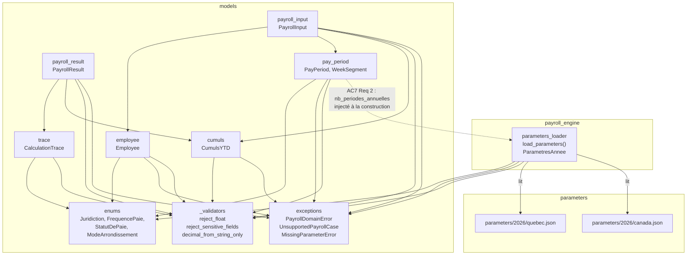
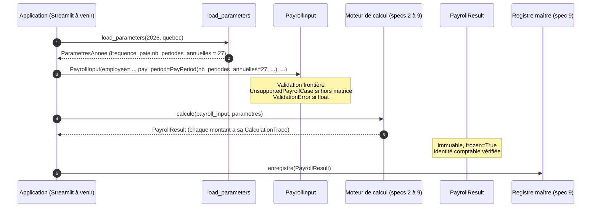
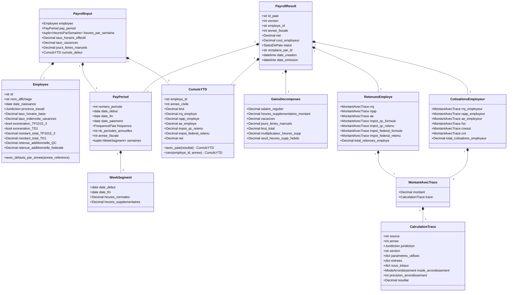

# Design Document

<!-- Document de design — moteur-paie-contrats. Les en-têtes structurels de niveau supérieur (Overview, Architecture, Components and Interfaces, Data Models, Correctness Properties, Error Handling, Testing Strategy) sont maintenus en anglais pour la conformité au format Kiro. Tout le contenu métier est rédigé en français. -->

## Overview

Cette spec établit le **socle contractuel** du moteur de paie Camp LilySO. Elle fige, une fois pour toutes, les *formes* que prennent une paie en entrée et en sortie du moteur, la trace exigée pour chaque calcul fiscal futur, la hiérarchie d'exceptions du domaine, et le point d'entrée unique de lecture des paramètres fiscaux annuels versionnés.

### Livrables

| Fichier | Rôle |
|---|---|
| `models/enums.py` | Énumérations fermées : `Juridiction`, `FrequencePaie`, `StatutDePaie`, `ModeArrondissement` |
| `models/exceptions.py` | Hiérarchie `PayrollDomainError` → `UnsupportedPayrollCase`, `MissingParameterError` |
| `models/_validators.py` | Validateurs Pydantic v2 réutilisables : `reject_float`, `reject_sensitive_fields`, `decimal_from_string_only` |
| `models/trace.py` | `CalculationTrace` — contrat de trace des calculs fiscaux |
| `models/employee.py` | `Employee` — fiche employé strictement non sensible |
| `models/pay_period.py` | `PayPeriod`, `WeekSegment` — période de paie et ses semaines constituantes |
| `models/cumuls.py` | `CumulsYTD` — cumuls year-to-date par employé et par catégorie |
| `models/payroll_input.py` | `PayrollInput` — contrat d'entrée complet du moteur |
| `models/payroll_result.py` | `PayrollResult` et ses sections (`GainsDecomposes`, `RetenuesEmploye`, `CotisationsEmployeur`) |
| `payroll_engine/parameters_loader.py` | `load_parameters(annee, juridiction) -> ParametresAnnee` et la structure typée `ParametresAnnee` |

### Hors périmètre explicite

Cette spec **n'implémente aucune formule fiscale**. Aucun taux, aucun palier, aucune constante n'apparaît dans le code Python. Les modules RRQ, RQAP, AE, impôt QC, impôt fédéral et charges patronales feront chacun l'objet d'une spec dédiée (`docs/plan-implementation.md`, étapes 2 à 8) et devront respecter les contrats fixés ici sans les modifier.

### Décisions structurantes retenues

1. **Pydantic v2** partout pour bénéficier de `model_config`, `field_validator`, `model_validator`, `frozen=True`, `extra="forbid"`, et d'un système d'erreurs de validation homogène.
2. **`decimal.Decimal` obligatoire** (règle 01). Les modèles n'acceptent en entrée qu'un `Decimal` déjà construit ou une **chaîne** convertible directement en `Decimal`. Toute valeur `float` est rejetée activement à la validation, y compris quand elle représenterait un entier exact (`4.0`, `0.0`) — voir §Validateurs transverses.
3. **Immuabilité** (règle 06 « immuabilité historique ») : tous les modèles du domaine sont `frozen=True`. Toute correction se fait par annulation-remplacement (Requirement 6).
4. **Frontière stricte du périmètre** (règle 03) : les validateurs de `Employee`, `PayPeriod` et `PayrollInput` lèvent `UnsupportedPayrollCase` dès qu'une entrée sort de la matrice Camp LilySO. Les modules de calcul aval n'ont pas à réinstaller ce garde-fou (Requirement 11 AC7).
5. **Paramètres 100 % externalisés** (règle 05) : aucun taux, plafond, seuil ou crédit n'apparaît dans le code Python. `load_parameters` est le point d'entrée unique.
6. **Round-trip JSON déterministe** : chaque `Decimal` est sérialisé en chaîne, jamais en `float` (Requirement 13). Le parseur JSON dédié `_parse_json_reject_floats` refuse tout littéral numérique non guillemé contenant un point décimal dans un champ typé `Decimal`, y compris `1.0` ou `0.0`.

### Traçabilité requirement → composant

| Requirement | Composant(s) principal(aux) |
|---|---|
| Req 1 — Employé sans donnée sensible | `models/employee.py`, `_validators.reject_sensitive_fields` |
| Req 2 — Période décomposée en semaines | `models/pay_period.py`, `models/enums.FrequencePaie`, `parameters_loader.frequence_paie` |
| Req 3 — Contrat d'entrée | `models/payroll_input.py` |
| Req 4 — Contrat de sortie | `models/payroll_result.py` |
| Req 5 — Trace exhaustive | `models/trace.py` |
| Req 6 — Immuabilité et annulation-remplacement | `models/payroll_result.py`, `models/enums.StatutDePaie` |
| Req 7 — Cumuls YTD | `models/cumuls.py` |
| Req 8 — Exceptions du domaine | `models/exceptions.py` |
| Req 9 — Chargeur de paramètres | `payroll_engine/parameters_loader.py` |
| Req 10 — Interdiction `float` transversale | `_validators.reject_float`, tests de garde |
| Req 11 — Refus à la frontière | Validateurs de `Employee`, `PayPeriod`, `PayrollInput` |
| Req 12 — Fidélité aux scénarios QC001–QC006 | Ensemble des modèles, tests golden |
| Req 13 — Round-trip JSON | Sérialiseur Pydantic + `_parse_json_reject_floats` |

## Architecture

### Vue d'ensemble

Le socle est organisé en deux packages, avec une dépendance dirigée strictement vers le bas.



### Principes directeurs

1. **`models/` ne dépend pas de `payroll_engine/`.** Les modèles décrivent les contrats ; le moteur (à venir) consomme et produit ces contrats. `parameters_loader` fait exception : c'est le seul module de `payroll_engine/` livré par cette spec, et il ne dépend que des énumérations, exceptions et validateurs des modèles.
2. **`PayPeriod` ne connaît pas `load_parameters`.** L'AC7 du Requirement 2 exige que `nb_periodes_annuelles` soit un entier fourni **à la construction** de `PayPeriod`. La responsabilité de le lire depuis `parameters/<AAAA>/*.json` incombe à l'appelant (ou à un helper de haut niveau non défini par cette spec). Cela évite un couplage cyclique et laisse la porte ouverte à des tests unitaires de `PayPeriod` sans dossier `parameters/`.
3. **Aucun taux, seuil ou plafond dans les modèles.** Les modèles ne portent que des types, des invariants et des validateurs. Les valeurs numériques concrètes (0,04, 0,06, 40 h, 1,5, 168 h) qui apparaissent dans les acceptance criteria comme bornes de validation **ne sont pas** des paramètres fiscaux au sens de la règle 05 : ce sont des **invariants de forme** documentés dans le TP-1015.G et les Normes du travail QC. Ils restent codés dans les validateurs, avec référence explicite à leur source.
4. **Refus fail-fast à la frontière.** Un `PayrollInput` construit avec succès garantit par construction : province QC, fréquence aux deux semaines, taux de vacances dans `{0.04, 0.06}`, absence de champ sensible, absence de champ hors matrice, tous les montants en `Decimal`. Les modules de calcul aval reçoivent une entrée déjà propre.

### Flux d'utilisation typique (indicatif, hors périmètre de cette spec)



## Components and Interfaces

Cette section décrit chaque composant à un niveau d'interface. La section suivante « Data Models » donne la structure précise des classes Pydantic v2 champ par champ.

### 1. `models/enums.py` — Énumérations fermées

Toutes les énumérations sont des `enum.StrEnum` (Python 3.11+), immuables, sérialisables telles quelles en JSON.

- `Juridiction` : `QUEBEC = "quebec"`, `CANADA = "canada"`. Aucune autre valeur.
- `FrequencePaie` : `AUX_DEUX_SEMAINES = "aux_deux_semaines"`. Aucune autre valeur dans le périmètre courant. Toute tentative de créer `FrequencePaie("hebdomadaire")` lève un `ValueError` standard converti en `UnsupportedPayrollCase` au niveau des modèles qui consomment cette énumération.
- `StatutDePaie` : `BROUILLON = "brouillon"`, `EMISE = "emise"`, `ANNULEE = "annulee"`, `REMPLACE_PAR = "remplace_par"`.
- `ModeArrondissement` : `ROUND_HALF_UP`, `ROUND_HALF_EVEN`, `ROUND_DOWN`, `ROUND_UP`. Miroir strict des modes `decimal` utilisés dans les guides officiels.

### 2. `models/exceptions.py` — Hiérarchie du domaine

```
Exception
└── PayrollDomainError                          (base du domaine, non-Pydantic)
    ├── UnsupportedPayrollCase                  (règle 03, Req 8 AC1-3, Req 11)
    └── MissingParameterError                   (règle 05, Req 8 AC4-6, Req 9 AC5)
```

Contraintes du Requirement 8 AC7 : ces exceptions **ne** sont **pas** des sous-classes de `pydantic.ValidationError`. Elles peuvent être capturées séparément.

Les validateurs de champ Pydantic (par exemple le rejet d'un `float`) lèvent une `ValidationError` Pydantic classique. Les validateurs métier de frontière (province ≠ QC, fréquence ≠ aux deux semaines, champ sensible) lèvent d'abord `UnsupportedPayrollCase`, qui est propagée telle quelle : Pydantic v2 enveloppe les exceptions non-`ValidationError` levées dans un validateur en préservant la classe originale via `PydanticCustomError` **seulement lorsque l'auteur l'accepte**. Nous choisissons ici de laisser remonter l'exception native `UnsupportedPayrollCase` (via `model_validator(mode="before")` ou en levant `UnsupportedPayrollCase` en dehors de tout `field_validator`) afin de respecter l'AC7 du Req 8 et de conserver la disjonction stricte entre exceptions du domaine et erreurs de validation Pydantic.

### 3. `models/_validators.py` — Validateurs transverses réutilisables

Trois validateurs sont partagés par tous les modèles du domaine.

#### 3.1 `reject_float`

Objectif : refuser toute valeur `float` à la validation d'un champ typé `Decimal`, **avant** que Pydantic ne tente une conversion silencieuse.

Mécanisme :

1. Installé comme `field_validator("*", mode="before")` sur chaque modèle du domaine via un `model_config` partagé.
2. Vérifie `isinstance(value, float)` en premier — refus immédiat avec un message actionnable citant la règle 01.
3. Vérifie ensuite `isinstance(value, Decimal)` **et** détecte les précisions aberrantes typiques d'une conversion depuis `float` : si la représentation string du `Decimal` contient plus de 20 chiffres significatifs ou dépasse une précision plausible pour un montant fiscal (>10 décimales), refus avec le même message. Ce garde-fou couvre l'AC4 du Req 10 (`Decimal(1516.32)`).
4. Convertit une chaîne en `Decimal` via `Decimal(str)` uniquement si la chaîne ne contient pas de notation scientifique (`"1e2"`) ni de caractères hors `[0-9.\-+]`.

Position dans le pipeline Pydantic : `mode="before"` garantit que la valeur est inspectée avant toute coercition automatique. Cela couvre l'AC2 du Req 3 et les AC1–2 du Req 10.

#### 3.2 `reject_sensitive_fields`

Objectif : refuser toute clé apparentée à une donnée sensible dans la construction d'un modèle (Req 1 AC3, règle 04).

Mécanisme :

1. Installé comme `model_validator(mode="before")` sur `Employee` et par extension sur `PayrollInput`.
2. Liste noire (case-insensitive, insensible aux accents et aux séparateurs `_` / `-` / espaces) : `nas`, `sin`, `numero_assurance_sociale`, `social_insurance_number`, `compte_bancaire`, `bank_account`, `iban`, `transit`, `institution_bancaire`, `adresse`, `address`, `courriel_personnel`, `personal_email`, `telephone_personnel`, `personal_phone`, `date_naissance_reelle`.
3. Si l'entrée est un `dict` (JSON ou kwargs), toute clé du `dict` qui **contient** un motif de la liste (recherche substring normalisée) déclenche une `ValidationError` Pydantic dont le message renvoie explicitement à la règle 04 et cite la clé refusée.
4. Cette garde s'applique aussi bien lors de la construction Python que lors du parsing JSON via `model_validate_json`.

Note importante sur les faux positifs : la liste noire est écrite pour être **stricte**. Aucun champ légitime du domaine ne contient ces motifs (par exemple il n'y a **pas** de champ `adresse_courriel` employeur dans le contrat — l'employé n'est identifié que par `id` et `nom_affichage`).

#### 3.3 `decimal_from_string_only`

Objectif : dans les chargeurs JSON et les parseurs de fichiers de paramètres, refuser tout littéral numérique non guillemé (Req 10 AC1, Req 13 AC5).

Mécanisme :

1. Wrapper autour de `json.loads` avec `parse_float=_reject_json_float`.
2. `_reject_json_float(s: str) -> NoReturn` lève une `ValidationError` (ou une `MissingParameterError` selon le contexte du chargeur) qui cite : le fichier, la position, la valeur refusée, l'action attendue (« envelopper la valeur dans une chaîne »).
3. Utilisé par `parameters_loader.load_parameters` et par la méthode de classe `PayrollInput.model_validate_json` (via un `model_validator` qui reroute vers `_parse_json_reject_floats`).
4. Un entier JSON sans point décimal (`27`, `40`) reste accepté et coercé en `Decimal("27")` par le validateur `reject_float` en aval — cela couvre l'exception explicite du Req 10 AC1.

### 4. `models/trace.py` — `CalculationTrace`

Contrat unique de trace attaché à chaque calcul fiscal (Req 5).

#### Interface publique

- `CalculationTrace(source, annee, juridiction, section, parametres_utilises, entrees, sous_totaux, mode_arrondissement, precision_arrondissement, resultat)`
- `CalculationTrace.model_dump_json() -> str` — sérialisation JSON déterministe, `Decimal` en chaînes, ordre stable.
- `CalculationTrace.model_validate_json(s: str) -> CalculationTrace` — parsing round-trip via `_parse_json_reject_floats`.
- `CalculationTrace.__str__() -> str` — représentation textuelle humainement lisible (Req 5 AC6), qui liste dans l'ordre : source, année, section, paramètres, entrées, sous-totaux, arrondissement, résultat.

#### Liste blanche des sources officielles (Req 5 AC2)

La chaîne `source` doit correspondre à l'un des motifs suivants (expression régulière), sinon la validation échoue :

- `^TP-1015\.F \d{4}(, section .+)?$`
- `^TP-1015\.G \d{4}(, section .+)?$`
- `^TP-1015\.3 \d{4}(, section .+)?$`
- `^T4127 \d{4}(, section .+)?$`
- `^TD1 \d{4}(, section .+)?$`
- `^Guide de l'employeur ARC \d{4}(, section .+)?$`
- `^https?://[a-z0-9\-\.]+\.gouv\.qc\.ca/.+$`
- `^https?://[a-z0-9\-\.]+\.canada\.ca/.+$`

Toute autre valeur lève une `ValidationError` avec un message renvoyant à la règle 02.

### 5. `models/employee.py` — `Employee`

Requirement 1. Fiche employé strictement non sensible.

#### Interface publique

- Constructeur classique : `Employee(**champs)`.
- Fabrique : `Employee.avec_defauts_par_annee(annee_reference: int, chemin_parametres: Path | None = None, **champs) -> Employee` (Req 1 AC7).
  - Lit `montant_total_TP1015_3` par défaut depuis `parameters/<annee_reference>/quebec.json` → `td1015_3.montant_base` (ou `impot_quebec.montant_personnel_base`, voir §Data Models).
  - Lit `montant_total_TD1` par défaut depuis `parameters/<annee_reference>/canada.json` → `td1.montant_base_<annee>` ou `impot_federal.montant_personnel_base`.
  - `retenue_additionnelle_QC` et `retenue_additionnelle_federale` par défaut à `Decimal("0.00")`, valeur lue également via `load_parameters` (clés `td1015_3.retenue_additionnelle_defaut` et `td1.retenue_additionnelle_defaut`) pour rester conforme à la règle 05.
  - **Aucune** valeur en dur (18 952, 16 452, 0) n'apparaît dans le code Python de cette fabrique — tout passe par `load_parameters`.
- Immuable après construction (`frozen=True`).

### 6. `models/pay_period.py` — `PayPeriod` et `WeekSegment`

Requirement 2. Période de paie décomposée en semaines constituantes.

#### `WeekSegment`

- Champs : `date_debut: date`, `date_fin: date`, `heures_normales: Decimal`, `heures_supplementaires: Decimal`.
- Invariants : `date_fin >= date_debut`, `heures_normales >= 0`, `heures_supplementaires >= 0`, chaque quantité `<= Decimal("168")` (bornes physiques, justifiées par les Normes du travail QC).
- Frozen.

#### `PayPeriod`

- Champs : `numero_periode: int`, `date_debut: date`, `date_fin: date`, `date_paiement: date`, `frequence: FrequencePaie`, `nb_periodes_annuelles: int`, `annee_fiscale: int`, `semaines: tuple[WeekSegment, ...]`.
- Invariants portés par les validateurs :
  1. `frequence` doit être `FrequencePaie.AUX_DEUX_SEMAINES`, sinon `UnsupportedPayrollCase` (Req 2 AC6, Req 11 AC2).
  2. `len(semaines) == 2` quand `frequence == AUX_DEUX_SEMAINES` (Req 2 AC2). Si ce n'est pas le cas, une `ValidationError` est levée **avant** que les AC4 et AC5 ne soient évalués (Req 2 AC4/AC5 : « la vérification NE DOIT PAS être évaluée lorsque le nombre de semaines constituantes ne satisfait pas l'AC2 »).
  3. Contiguïté et non-chevauchement : `semaines[i].date_fin + 1 jour == semaines[i+1].date_debut` (Req 2 AC4).
  4. Couverture exacte : `semaines[0].date_debut == date_debut` et `semaines[-1].date_fin == date_fin` (Req 2 AC5).
  5. `nb_periodes_annuelles >= 1`.
- Immuable après construction.

### 7. `models/cumuls.py` — `CumulsYTD`

Requirement 7.

#### Interface publique

- Champs : `employe_id: str`, `annee_civile: int`, plus un `Decimal` non-négatif par catégorie (voir Data Models).
- `CumulsYTD.zero(employe_id, annee_civile) -> CumulsYTD` — fabrique d'un cumul initial à zéro.
- `CumulsYTD.avec_paie(resultat: PayrollResult) -> CumulsYTD` — retourne une nouvelle instance incrémentée. L'instance courante n'est pas modifiée (immutable). Refus si `resultat.employe_id != self.employe_id` ou `resultat.annee_fiscale != self.annee_civile` (Req 7 AC6/AC7).
- Sérialisation JSON round-trip (Req 7 AC8, Req 13 AC2).

### 8. `models/payroll_input.py` — `PayrollInput`

Requirement 3. Contrat d'entrée du moteur.

#### Interface publique

- Agrégation stricte : `employee: Employee`, `pay_period: PayPeriod`, plus les champs propres à la paie courante (heures par semaine, taux horaire, taux vacances, jours fériés manuels, paramètres TP-1015.3 « effectifs » à la paie, paramètres TD1 « effectifs » à la paie, `cumuls_debut: CumulsYTD`).
- Cohérence croisée validée par un `model_validator(mode="after")` :
  - Nombre de semaines dans `heures_par_semaine` = nombre de `pay_period.semaines`.
  - `employee.province_travail == Juridiction.QUEBEC`, sinon `UnsupportedPayrollCase` (Req 3 AC10, Req 11 AC1).
  - `pay_period.frequence == FrequencePaie.AUX_DEUX_SEMAINES`, sinon `UnsupportedPayrollCase` (Req 3 AC9, Req 11 AC2).
  - `taux_vacances in {Decimal("0.04"), Decimal("0.06")}`, sinon `UnsupportedPayrollCase` (Req 3 AC5, Req 11 AC3).
  - `cumuls_debut.employe_id == employee.id` et `cumuls_debut.annee_civile == pay_period.annee_fiscale`.
- Blacklist active de champs de rémunération et de retenue hors matrice (Req 11 AC4/AC5) via `model_validator(mode="before")` qui inspecte les clés du `dict` fourni.

### 9. `models/payroll_result.py` — `PayrollResult`

Requirement 4 et Requirement 6. Contrat de sortie du moteur avec ses sections décomposées.

#### Sous-modèles

- `GainsDecomposes` : `salaire_regulier`, `heures_supplementaires_montant`, `vacances`, `jours_feries_manuels`, `brut_total`, `multiplicateur_heures_supp`, `seuil_heures_supp_hebdo` (Req 4 AC1, AC14).
- `MontantAvecTrace` : `montant: Decimal`, `trace: CalculationTrace`. Utilisé pour chaque cotisation individuelle.
- `RetenuesEmploye` : un `MontantAvecTrace` par catégorie (RRQ, RQAP, AE, impôt QC formule, impôt QC retenu, impôt fédéral formule, impôt fédéral retenu), plus `total_retenues_employe: Decimal` (Req 4 AC2, Req 12 AC8).
- `CotisationsEmployeur` : un `MontantAvecTrace` par catégorie (RRQ employeur, RQAP employeur, AE employeur, FSS, CNESST avec drapeau `en_attente_classification: bool`, CNT), plus `total_cotisations_employeur: Decimal` (Req 4 AC3).

#### `PayrollResult`

- Champs : `id_paie: str`, `version: int (>=1)`, `employe_id: str`, `annee_fiscale: int`, `pay_period: PayPeriod`, `gains: GainsDecomposes`, `retenues_employe: RetenuesEmploye`, `cotisations_employeur: CotisationsEmployeur`, `net: Decimal`, `cout_employeur: Decimal`, `cumuls_fin: CumulsYTD`, `statut: StatutDePaie`, `remplace_par_id: str | None`, `date_creation: datetime`, `date_emission: datetime | None`.
- Invariants portés par `model_validator(mode="after")` (Req 4 AC9-11, Req 6) :
  - `net + total_retenues_employe == brut_total` au cent près.
  - `cout_employeur == brut_total + total_cotisations_employeur` au cent près.
  - Toutes les retenues et cotisations sont `>= Decimal("0.00")`.
  - `statut == REMPLACE_PAR` ⟺ `remplace_par_id is not None and remplace_par_id != ""`.
  - `statut in {EMISE, ANNULEE, REMPLACE_PAR}` ⟹ `date_emission is not None`.

### 10. `payroll_engine/parameters_loader.py` — `load_parameters`

Requirement 9. Point d'entrée unique de lecture des paramètres.

#### Signature

```python
def load_parameters(
    annee: int,
    juridiction: Juridiction,
    chemin_racine: Path | None = None,
) -> ParametresAnnee:
    ...
```

- `chemin_racine` par défaut : dossier `parameters/` à la racine du projet (résolution via `Path(__file__).parent.parent / "parameters"`).
- Fonction pure, sans état global, sans cache, sans effet de bord (deux appels identiques retournent deux `ParametresAnnee` égaux au sens `==`, conformément à Req 9 AC10).
- Aucun `float` intermédiaire (Req 9 AC4). Utilise `json.loads(..., parse_float=_reject_json_float)` pour rejeter tout littéral non guillemé dans une clé numérique.

#### `ParametresAnnee`

Modèle Pydantic v2 typé qui reflète la structure des fichiers `parameters/<AAAA>/{quebec,canada}.json`. Chaque section est un sous-modèle (`FrequencePaieParametres`, `RRQParametres`, `RQAPParametres`, `AEParametres`, `ImpotQCParametres`, `ImpotFederalParametres`, `TD1015_3Parametres`, `TD1Parametres`, `FSSParametres`, `CNESSTParametres`, `CNTParametres`, `VacancesParametres`, `HeuresSupplementairesParametres`).

Contrainte importante : les champs marqués `"TO_FILL"` dans les fichiers **ne** lèvent **pas** `MissingParameterError` à la simple lecture — ils lèvent l'exception **seulement quand le chargeur tente de les convertir en `Decimal`** (fail-fast à la conversion, Req 9 AC5 et Req 8 AC5). Cela permet à `load_parameters(2026, "quebec")` de réussir aujourd'hui pour la section `frequence_paie` (qui n'a pas de `TO_FILL`) tout en refusant plus tard la lecture d'un champ RRQ dont le plafond n'a pas été renseigné.

**Précision d'implémentation.** Pour respecter à la fois Req 9 AC5 (« lever `MissingParameterError` immédiatement pendant le chargement du fichier ») et le comportement décrit ci-dessus (permettre à `load_parameters(2026, "quebec")` de réussir malgré les `"TO_FILL"` non consommés par les scénarios QC001–QC006), la validation Pydantic **n'est pas** déclenchée sur les sections dont la totalité des champs est marquée `"TO_FILL"` : ces sections sont chargées en lecture différée (`ParametresAnnee` expose des propriétés qui, à leur premier accès, matérialisent la section et lèvent `MissingParameterError` si un champ est encore `"TO_FILL"`). Autrement dit, `MissingParameterError` est levée au premier accès à une valeur `"TO_FILL"` — cet accès peut être immédiat (première lecture de la section pendant `load_parameters`) ou différé (accès par un module de calcul aval). Les acceptance criteria Req 8 AC5 et Req 9 AC5 sont respectés parce que la levée se produit **dans `load_parameters`** dès qu'une section est consommée activement (par exemple `frequence_paie`), et **jamais** au moment du calcul si le calcul ne consomme pas la section problématique.

#### Mécanisme de repli `nb_periodes_annuelles` (Req 2 AC7)

Documenté explicitement dans le corps de `load_parameters` :

```
si parameters/<annee>/<juridiction>.json existe :
    lire nb_periodes_annuelles depuis frequence_paie
    source_effective = "annee_courante"
sinon :
    si parameters/<annee - 1>/<juridiction>.json existe et contient nb_periodes_annuelles :
        lire depuis l'année précédente
        source_effective = f"repli_annee_{annee - 1}"
    sinon :
        nb_periodes_annuelles = 26  # valeur par défaut documentée
        source_effective = "valeur_par_defaut"

parametres_annee.frequence_paie.nb_periodes_annuelles_source = source_effective
```

Cette source effective est exposée dans `ParametresAnnee.frequence_paie.source_effective` afin de préserver la traçabilité (règle 02). Elle n'est **pas** un `Decimal` et n'est **pas** un paramètre fiscal — c'est une métadonnée d'audit.

## Data Models

### 1. `models/enums.py`

```python
from enum import StrEnum

class Juridiction(StrEnum):
    QUEBEC = "quebec"
    CANADA = "canada"

class FrequencePaie(StrEnum):
    AUX_DEUX_SEMAINES = "aux_deux_semaines"

class StatutDePaie(StrEnum):
    BROUILLON = "brouillon"
    EMISE = "emise"
    ANNULEE = "annulee"
    REMPLACE_PAR = "remplace_par"

class ModeArrondissement(StrEnum):
    ROUND_HALF_UP = "ROUND_HALF_UP"
    ROUND_HALF_EVEN = "ROUND_HALF_EVEN"
    ROUND_DOWN = "ROUND_DOWN"
    ROUND_UP = "ROUND_UP"
```

### 2. `models/exceptions.py`

```python
class PayrollDomainError(Exception):
    """Base des exceptions métier du moteur de paie Camp LilySO."""

class UnsupportedPayrollCase(PayrollDomainError):
    """Cas hors matrice Camp LilySO (règle 03)."""

class MissingParameterError(PayrollDomainError):
    """Paramètre fiscal manquant ou marqué 'TO_FILL' (règle 05)."""
```

Aucune de ces classes n'hérite de `pydantic.ValidationError` (Req 8 AC7).

### 3. `models/trace.py` — `CalculationTrace`

```python
from decimal import Decimal
from pydantic import BaseModel, ConfigDict, Field, field_validator

class CalculationTrace(BaseModel):
    model_config = ConfigDict(
        frozen=True,
        extra="forbid",
        str_strip_whitespace=True,
    )

    source: str = Field(..., min_length=1)
    annee: int = Field(..., ge=2000, le=2100)
    juridiction: Juridiction
    section: str = Field(..., min_length=1)
    parametres_utilises: dict[str, Decimal] = Field(default_factory=dict)
    entrees: dict[str, Decimal] = Field(default_factory=dict)
    sous_totaux: dict[str, Decimal] = Field(default_factory=dict)  # ordre insertion préservé (Python 3.7+)
    mode_arrondissement: ModeArrondissement
    precision_arrondissement: int = Field(..., ge=0, le=10)
    resultat: Decimal

    @field_validator("source")
    @classmethod
    def _valider_source_officielle(cls, v: str) -> str:
        # Vérifie la conformité à la liste blanche définie en §Components 4.
        # Lève ValueError si non conforme, converti en ValidationError par Pydantic.
        ...

    @field_validator(
        "parametres_utilises", "entrees", "sous_totaux", "resultat",
        mode="before",
    )
    @classmethod
    def _rejeter_float(cls, v):
        # Délégué à models._validators.reject_float
        ...

    def __str__(self) -> str:
        # Représentation textuelle ordonnée (Req 5 AC6)
        ...
```

**Sérialisation** : chaque `Decimal` est sérialisé via `field_serializer` en `str(x)`. La méthode `model_dump_json` produit une chaîne où toute valeur numérique est **entre guillemets**. La méthode `model_validate_json` utilise `_parse_json_reject_floats`.

### 4. `models/employee.py` — `Employee`

```python
from datetime import date
from decimal import Decimal
from pydantic import BaseModel, ConfigDict, Field, model_validator

class Employee(BaseModel):
    model_config = ConfigDict(
        frozen=True,
        extra="forbid",           # AC2
        str_strip_whitespace=True,
    )

    id: str = Field(..., min_length=1)
    nom_affichage: str = Field(..., min_length=1)
    date_naissance: date
    province_travail: Juridiction        # AC5 : doit être QUEBEC
    titre_emploi: str = Field(..., min_length=1)
    taux_horaire_base: Decimal = Field(..., gt=Decimal("0"))
    date_embauche: date
    date_fin_emploi: date | None = None
    taux_indemnite_vacances: Decimal     # doit être 0.04 ou 0.06
    exoneration_TP1015_3: bool
    exoneration_TD1: bool
    montant_total_TP1015_3: Decimal      # >= 0
    montant_total_TD1: Decimal           # >= 0
    retenue_additionnelle_QC: Decimal    # >= 0
    retenue_additionnelle_federale: Decimal  # >= 0

    @model_validator(mode="before")
    @classmethod
    def _rejeter_champs_sensibles(cls, data):
        # Délégué à models._validators.reject_sensitive_fields (§Components 3.2)
        ...

    @model_validator(mode="after")
    def _refuser_hors_matrice(self):
        if self.province_travail is not Juridiction.QUEBEC:
            raise UnsupportedPayrollCase(
                f"Province de travail '{self.province_travail}' non supportée. "
                "Le Camp LilySO opère au Québec uniquement. "
                "Pour un cas exceptionnel, utiliser WebRAS (revenuquebec.ca/webras) "
                "et PDOC (canada.ca/pdoc)."
            )
        if self.taux_indemnite_vacances not in {Decimal("0.04"), Decimal("0.06")}:
            raise UnsupportedPayrollCase(
                f"Taux d'indemnité de vacances {self.taux_indemnite_vacances} "
                "non supporté (Camp LilySO : 4 % ou 6 % uniquement)."
            )
        return self

    @classmethod
    def avec_defauts_par_annee(
        cls,
        annee_reference: int,
        chemin_parametres: Path | None = None,
        **champs,
    ) -> "Employee":
        # AC7 : lit les valeurs par défaut via load_parameters.
        # Aucune valeur en dur (18 952, 16 452, 0) dans ce corps.
        ...
```

Notes sur le typage :

- Tous les `Decimal` sont typés avec des contraintes Pydantic (`gt`, `ge`) qui laissent Pydantic générer les erreurs de validation adéquates.
- Le rejet de `float` est appliqué en amont par `_validators.reject_float` en `mode="before"`.
- La liste noire de champs sensibles inclut aussi `nas` et `sin` — leur simple présence dans les kwargs déclenche une `ValidationError` Pydantic.

### 5. `models/pay_period.py`

```python
from datetime import date, timedelta
from decimal import Decimal
from pydantic import BaseModel, ConfigDict, Field, model_validator

class WeekSegment(BaseModel):
    model_config = ConfigDict(frozen=True, extra="forbid")

    date_debut: date
    date_fin: date
    heures_normales: Decimal = Field(..., ge=Decimal("0"), le=Decimal("168"))
    heures_supplementaires: Decimal = Field(..., ge=Decimal("0"), le=Decimal("168"))

    @model_validator(mode="after")
    def _dates_coherentes(self):
        if self.date_fin < self.date_debut:
            raise ValueError("date_fin < date_debut")
        return self


class PayPeriod(BaseModel):
    model_config = ConfigDict(frozen=True, extra="forbid")

    numero_periode: int = Field(..., ge=1, le=27)
    date_debut: date
    date_fin: date
    date_paiement: date
    frequence: FrequencePaie
    nb_periodes_annuelles: int = Field(..., ge=1, le=53)
    annee_fiscale: int = Field(..., ge=2000, le=2100)
    semaines: tuple[WeekSegment, ...]

    @model_validator(mode="after")
    def _refuser_frequence_hors_matrice(self):
        if self.frequence is not FrequencePaie.AUX_DEUX_SEMAINES:
            raise UnsupportedPayrollCase(
                f"Fréquence de paie '{self.frequence}' non supportée. "
                "Le Camp LilySO fonctionne aux deux semaines uniquement. "
                "Pour un cas exceptionnel, utiliser WebRAS et PDOC."
            )
        return self

    @model_validator(mode="after")
    def _nombre_semaines_correspond_a_frequence(self):
        # AC2 : deux semaines pour aux_deux_semaines.
        # Ce validateur est le PREMIER à s'exécuter parmi les invariants de semaines.
        if self.frequence is FrequencePaie.AUX_DEUX_SEMAINES and len(self.semaines) != 2:
            raise ValueError(
                f"PayPeriod aux_deux_semaines doit contenir exactement 2 semaines, "
                f"reçu {len(self.semaines)}."
            )
        return self

    @model_validator(mode="after")
    def _semaines_contigues_et_couvrantes(self):
        # AC4 + AC5 : évalués UNIQUEMENT si AC2 est satisfait.
        if len(self.semaines) != 2:  # Court-circuit AC4/AC5 (Req 2)
            return self
        s0, s1 = self.semaines
        if s0.date_debut != self.date_debut:
            raise ValueError("La première semaine doit débuter à date_debut de la période.")
        if s1.date_fin != self.date_fin:
            raise ValueError("La dernière semaine doit finir à date_fin de la période.")
        if s1.date_debut != s0.date_fin + timedelta(days=1):
            raise ValueError("Les semaines constituantes doivent être contiguës et non chevauchantes.")
        return self
```

### 6. `models/cumuls.py`

```python
from decimal import Decimal
from pydantic import BaseModel, ConfigDict, Field, field_validator, model_validator

class CumulsYTD(BaseModel):
    model_config = ConfigDict(frozen=True, extra="forbid")

    employe_id: str = Field(..., min_length=1)
    annee_civile: int = Field(..., ge=2000, le=2100)

    brut: Decimal = Field(..., ge=Decimal("0"))
    vacances: Decimal = Field(..., ge=Decimal("0"))
    rrq_employe: Decimal = Field(..., ge=Decimal("0"))
    rrq_employeur: Decimal = Field(..., ge=Decimal("0"))
    rqap_employe: Decimal = Field(..., ge=Decimal("0"))
    rqap_employeur: Decimal = Field(..., ge=Decimal("0"))
    ae_employe: Decimal = Field(..., ge=Decimal("0"))
    ae_employeur: Decimal = Field(..., ge=Decimal("0"))
    impot_qc_retenu: Decimal = Field(..., ge=Decimal("0"))
    impot_federal_retenu: Decimal = Field(..., ge=Decimal("0"))
    net: Decimal = Field(..., ge=Decimal("0"))

    @classmethod
    def zero(cls, employe_id: str, annee_civile: int) -> "CumulsYTD":
        return cls(
            employe_id=employe_id,
            annee_civile=annee_civile,
            brut=Decimal("0.00"), vacances=Decimal("0.00"),
            rrq_employe=Decimal("0.00"), rrq_employeur=Decimal("0.00"),
            rqap_employe=Decimal("0.00"), rqap_employeur=Decimal("0.00"),
            ae_employe=Decimal("0.00"), ae_employeur=Decimal("0.00"),
            impot_qc_retenu=Decimal("0.00"), impot_federal_retenu=Decimal("0.00"),
            net=Decimal("0.00"),
        )

    def avec_paie(self, resultat: "PayrollResult") -> "CumulsYTD":
        if resultat.employe_id != self.employe_id:
            raise PayrollDomainError(
                f"Cumul YTD pour employé '{self.employe_id}' ne peut être "
                f"agrégé avec paie de l'employé '{resultat.employe_id}'."
            )
        if resultat.annee_fiscale != self.annee_civile:
            raise PayrollDomainError(
                f"Cumul YTD pour l'année civile {self.annee_civile} ne peut être "
                f"agrégé avec paie de l'année fiscale {resultat.annee_fiscale}. "
                "Repartir de CumulsYTD.zero() pour la nouvelle année."
            )
        return self.model_copy(update={
            "brut": self.brut + resultat.gains.brut_total,
            "vacances": self.vacances + resultat.gains.vacances,
            "rrq_employe": self.rrq_employe + resultat.retenues_employe.rrq.montant,
            "rrq_employeur": self.rrq_employeur + resultat.cotisations_employeur.rrq.montant,
            # ... idem pour toutes les catégories
            "net": self.net + resultat.net,
        })
```

### 7. `models/payroll_input.py`

```python
from decimal import Decimal
from pydantic import BaseModel, ConfigDict, Field, model_validator

# Champs de rémunération hors matrice (Req 11 AC4)
_CHAMPS_REMUNERATION_HORS_MATRICE = frozenset({
    "commission", "bonus", "boni", "pourboires", "tips",
    "allocation_automobile", "car_allowance",
    "logement_fourni", "avantage_logement",
    "options_achat_actions", "stock_options",
    "actions", "shares",
})

# Champs de retenue hors matrice (Req 11 AC5)
_CHAMPS_RETENUE_HORS_MATRICE = frozenset({
    "assurance_collective", "group_insurance",
    "rpa", "reer_collectif", "group_rrsp",
    "cotisation_syndicale", "union_dues",
    "pension_alimentaire", "alimony",
    "saisie_salaire", "garnishment",
})


class HeuresParSemaine(BaseModel):
    model_config = ConfigDict(frozen=True, extra="forbid")

    heures_normales: Decimal = Field(..., ge=Decimal("0"), le=Decimal("168"))
    heures_supplementaires: Decimal = Field(..., ge=Decimal("0"), le=Decimal("168"))


class PayrollInput(BaseModel):
    model_config = ConfigDict(frozen=True, extra="forbid")

    employee: Employee
    pay_period: PayPeriod
    heures_par_semaine: tuple[HeuresParSemaine, ...]
    taux_horaire_effectif: Decimal = Field(..., gt=Decimal("0"))
    taux_vacances: Decimal                 # ∈ {0.04, 0.06} — enforcé par _refuser_hors_matrice
    jours_feries_manuels: Decimal = Field(default=Decimal("0.00"), ge=Decimal("0"))
    # Paramètres TP-1015.3 effectifs à la paie (peuvent différer de ceux du dossier employé si modifiés en cours d'année)
    montant_total_TP1015_3: Decimal = Field(..., ge=Decimal("0"))
    exoneration_TP1015_3: bool
    retenue_additionnelle_QC: Decimal = Field(..., ge=Decimal("0"))
    # Paramètres TD1
    montant_total_TD1: Decimal = Field(..., ge=Decimal("0"))
    exoneration_TD1: bool
    retenue_additionnelle_federale: Decimal = Field(..., ge=Decimal("0"))
    # Cumuls YTD au début de la paie
    cumuls_debut: CumulsYTD

    @model_validator(mode="before")
    @classmethod
    def _rejeter_champs_hors_matrice_et_sensibles(cls, data):
        if isinstance(data, dict):
            for cle in data.keys():
                cle_norm = cle.lower().replace("-", "_").replace(" ", "_")
                if cle_norm in _CHAMPS_REMUNERATION_HORS_MATRICE | _CHAMPS_RETENUE_HORS_MATRICE:
                    raise UnsupportedPayrollCase(
                        f"Champ '{cle}' non supporté par le Camp LilySO. "
                        "Utiliser WebRAS et PDOC pour ce cas exceptionnel."
                    )
                # Rejet des champs sensibles délégué au validateur transverse
        return data

    @model_validator(mode="after")
    def _coherence_croisee(self):
        if self.employee.province_travail is not Juridiction.QUEBEC:
            raise UnsupportedPayrollCase("Province non supportée (Camp LilySO : QC uniquement).")
        if self.pay_period.frequence is not FrequencePaie.AUX_DEUX_SEMAINES:
            raise UnsupportedPayrollCase("Fréquence non supportée (Camp LilySO : aux deux semaines).")
        if self.taux_vacances not in {Decimal("0.04"), Decimal("0.06")}:
            raise UnsupportedPayrollCase(
                f"Taux de vacances {self.taux_vacances} non supporté (4 % ou 6 % uniquement)."
            )
        if len(self.heures_par_semaine) != len(self.pay_period.semaines):
            raise ValueError(
                f"heures_par_semaine ({len(self.heures_par_semaine)}) doit correspondre "
                f"au nombre de semaines de la période ({len(self.pay_period.semaines)})."
            )
        if self.cumuls_debut.employe_id != self.employee.id:
            raise ValueError("cumuls_debut.employe_id doit correspondre à employee.id.")
        if self.cumuls_debut.annee_civile != self.pay_period.annee_fiscale:
            raise ValueError("cumuls_debut.annee_civile doit correspondre à pay_period.annee_fiscale.")
        return self
```

### 8. `models/payroll_result.py`

```python
from datetime import datetime
from decimal import Decimal
from pydantic import BaseModel, ConfigDict, Field, model_validator

class GainsDecomposes(BaseModel):
    model_config = ConfigDict(frozen=True, extra="forbid")

    salaire_regulier: Decimal = Field(..., ge=Decimal("0"))
    heures_supplementaires_montant: Decimal = Field(..., ge=Decimal("0"))
    vacances: Decimal = Field(..., ge=Decimal("0"))
    jours_feries_manuels: Decimal = Field(..., ge=Decimal("0"))
    brut_total: Decimal = Field(..., ge=Decimal("0"))
    # AC14 Req 4 : ces deux champs sont chargés depuis parameters/<AAAA>/quebec.json
    # section heures_supplementaires. Ce sont des valeurs annuelles, pas des taux fiscaux.
    multiplicateur_heures_supp: Decimal = Field(..., gt=Decimal("0"))
    seuil_heures_supp_hebdo: Decimal = Field(..., gt=Decimal("0"))


class MontantAvecTrace(BaseModel):
    model_config = ConfigDict(frozen=True, extra="forbid")

    montant: Decimal = Field(..., ge=Decimal("0"))
    trace: CalculationTrace


class RetenuesEmploye(BaseModel):
    model_config = ConfigDict(frozen=True, extra="forbid")

    rrq: MontantAvecTrace
    rqap: MontantAvecTrace
    ae: MontantAvecTrace
    impot_qc_formule: MontantAvecTrace     # AC8 Req 12 : valeur formule
    impot_qc_retenu: MontantAvecTrace      # AC8 Req 12 : valeur retenue (0 si exonération)
    impot_federal_formule: MontantAvecTrace
    impot_federal_retenu: MontantAvecTrace
    total_retenues_employe: Decimal = Field(..., ge=Decimal("0"))

    @model_validator(mode="after")
    def _somme_totaux_coherente(self):
        somme = (self.rrq.montant + self.rqap.montant + self.ae.montant
                 + self.impot_qc_retenu.montant + self.impot_federal_retenu.montant)
        if somme != self.total_retenues_employe:
            raise ValueError(
                f"total_retenues_employe ({self.total_retenues_employe}) doit égaler "
                f"la somme des retenues effectivement retenues ({somme})."
            )
        return self


class CotisationsEmployeur(BaseModel):
    model_config = ConfigDict(frozen=True, extra="forbid")

    rrq_employeur: MontantAvecTrace
    rqap_employeur: MontantAvecTrace
    ae_employeur: MontantAvecTrace
    fss: MontantAvecTrace
    cnesst: MontantAvecTrace
    cnesst_en_attente_classification: bool
    cnt: MontantAvecTrace
    total_cotisations_employeur: Decimal = Field(..., ge=Decimal("0"))

    @model_validator(mode="after")
    def _somme_totaux_coherente(self):
        somme = (self.rrq_employeur.montant + self.rqap_employeur.montant
                 + self.ae_employeur.montant + self.fss.montant
                 + self.cnesst.montant + self.cnt.montant)
        if somme != self.total_cotisations_employeur:
            raise ValueError(
                f"total_cotisations_employeur ({self.total_cotisations_employeur}) doit égaler "
                f"la somme des cotisations ({somme})."
            )
        return self


class PayrollResult(BaseModel):
    model_config = ConfigDict(frozen=True, extra="forbid")

    id_paie: str = Field(..., min_length=1)
    version: int = Field(..., ge=1)
    employe_id: str = Field(..., min_length=1)
    annee_fiscale: int = Field(..., ge=2000, le=2100)
    pay_period: PayPeriod
    gains: GainsDecomposes
    retenues_employe: RetenuesEmploye
    cotisations_employeur: CotisationsEmployeur
    net: Decimal = Field(..., ge=Decimal("0"))
    cout_employeur: Decimal = Field(..., ge=Decimal("0"))
    cumuls_fin: CumulsYTD
    statut: StatutDePaie
    remplace_par_id: str | None = None
    date_creation: datetime
    date_emission: datetime | None = None

    @model_validator(mode="after")
    def _identites_comptables(self):
        # AC9 Req 4
        if self.net + self.retenues_employe.total_retenues_employe != self.gains.brut_total:
            raise ValueError(
                f"Identité brute rompue : "
                f"net ({self.net}) + total_retenues ({self.retenues_employe.total_retenues_employe}) "
                f"≠ brut ({self.gains.brut_total})."
            )
        # AC10 Req 4
        if self.cout_employeur != self.gains.brut_total + self.cotisations_employeur.total_cotisations_employeur:
            raise ValueError(
                f"Identité coût employeur rompue : "
                f"cout_employeur ({self.cout_employeur}) ≠ brut ({self.gains.brut_total}) "
                f"+ total_cotisations ({self.cotisations_employeur.total_cotisations_employeur})."
            )
        return self

    @model_validator(mode="after")
    def _statut_et_remplacement_coherents(self):
        # AC4, AC5, AC7 Req 6
        if self.statut is StatutDePaie.REMPLACE_PAR:
            if not self.remplace_par_id:
                raise ValueError("statut=remplace_par exige remplace_par_id non vide.")
        else:
            if self.remplace_par_id:
                raise ValueError(
                    f"remplace_par_id ne doit pas être renseigné quand statut={self.statut}."
                )
        if self.statut in {StatutDePaie.EMISE, StatutDePaie.ANNULEE, StatutDePaie.REMPLACE_PAR}:
            if self.date_emission is None:
                raise ValueError(f"date_emission doit être renseignée quand statut={self.statut}.")
        return self

    @model_validator(mode="after")
    def _cumuls_fin_coherents(self):
        if self.cumuls_fin.employe_id != self.employe_id:
            raise ValueError("cumuls_fin.employe_id doit correspondre à employe_id.")
        if self.cumuls_fin.annee_civile != self.annee_fiscale:
            raise ValueError("cumuls_fin.annee_civile doit correspondre à annee_fiscale.")
        return self
```

### 9. `payroll_engine/parameters_loader.py` — `ParametresAnnee`

Vue synoptique de la structure (les sous-modèles sont Pydantic v2, `frozen=True`, `extra="forbid"`, tous les montants en `Decimal`).

```python
from decimal import Decimal
from pathlib import Path
from pydantic import BaseModel, ConfigDict, Field

class FrequencePaieParametres(BaseModel):
    model_config = ConfigDict(frozen=True, extra="allow")
    nb_periodes_annuelles: int = Field(..., ge=1, le=53)
    statut: str
    commentaire: str = ""
    # Métadonnée de traçabilité du repli (Req 2 AC7)
    source_effective: str  # "annee_courante" | "repli_annee_<AAAA>" | "valeur_par_defaut"


class RRQParametres(BaseModel):
    model_config = ConfigDict(frozen=True, extra="allow")
    taux_cotisation_totale_employe: Decimal
    taux_cotisation_totale_employeur: Decimal
    exemption_generale_annuelle: Decimal
    # ...


# Idem pour RQAPParametres, AEParametres, ImpotQCParametres, ImpotFederalParametres,
# TD1015_3Parametres, TD1Parametres, FSSParametres, CNESSTParametres, CNTParametres,
# VacancesParametres, HeuresSupplementairesParametres.


class ParametresAnnee(BaseModel):
    model_config = ConfigDict(frozen=True, extra="allow")

    annee: int = Field(..., ge=2000, le=2100)
    juridiction: Juridiction
    source: str
    date_publication: str
    date_consultation: str = ""
    url_consultee: str = ""
    notes: str = ""

    frequence_paie: FrequencePaieParametres
    # Sections optionnelles selon la juridiction :
    rrq: RRQParametres | None = None
    rqap: RQAPParametres | None = None
    impot_quebec: ImpotQCParametres | None = None
    fss: FSSParametres | None = None
    cnesst: CNESSTParametres | None = None
    cnt: CNTParametres | None = None
    vacances: VacancesParametres | None = None
    heures_supplementaires: HeuresSupplementairesParametres | None = None
    assurance_emploi: AEParametres | None = None
    impot_federal: ImpotFederalParametres | None = None
    td1: TD1Parametres | None = None


def load_parameters(
    annee: int,
    juridiction: Juridiction,
    chemin_racine: Path | None = None,
) -> ParametresAnnee:
    ...
```

**Note sur `extra="allow"` au niveau des sous-modèles de paramètres** : les fichiers JSON contiennent souvent des clés `commentaire`, `statut`, `statut_taux`, `statut_plafonds` qui documentent l'origine des valeurs. `extra="allow"` évite de devoir énumérer toutes ces clés d'audit dans chaque sous-modèle. Cette permissivité est acceptable ici parce que ces fichiers sont sous notre contrôle (règle 05), contrairement aux modèles du domaine (`Employee`, `PayrollInput`, etc.) qui reçoivent des données externes et pour lesquels `extra="forbid"` est obligatoire.

### 10. Diagramme de classes du domaine




## Correctness Properties

*Une propriété (au sens PBT) est une caractéristique ou un comportement qui doit tenir pour toutes les exécutions valides d'une portion du système — une spécification formelle de ce que le logiciel doit faire. Les propriétés servent de pont entre les exigences rédigées en langage naturel et des garanties de correction vérifiables automatiquement.*

Cette spec ne calcule aucune formule fiscale : les propriétés ci-dessous portent uniquement sur les **contrats de données**, les **invariants structurels** des modèles, la **sérialisation** et la **traçabilité**. Elles seront implémentées avec Hypothesis (voir §Testing Strategy).

Chaque propriété est prévue pour être exécutée en 100+ itérations. Chaque test PBT devra être tagué : `# Feature: moteur-paie-contrats, Property {n}: {texte de la propriété}`.

### Property 1: Immuabilité des modèles du domaine

*Pour tout* modèle du domaine (`Employee`, `WeekSegment`, `PayPeriod`, `HeuresParSemaine`, `CumulsYTD`, `PayrollInput`, `GainsDecomposes`, `MontantAvecTrace`, `RetenuesEmploye`, `CotisationsEmployeur`, `PayrollResult`, `CalculationTrace`) et *pour toute* instance valide de ce modèle, la mutation d'un de ses champs déclarés doit lever une erreur de validation Pydantic (`frozen=True`).

**Validates: Requirements 1.6, 2.8, 3.11, 4.12, 6.2, 7.3**

### Property 2: Rejet universel de `float` dans tout champ `Decimal`

*Pour tout* modèle du domaine et *pour tout* champ typé `Decimal`, l'assignation d'une valeur `float` (Python natif, y compris `4.0` et `0.0`), d'un `Decimal` construit par `Decimal(float_val)` avec précision aberrante, ou d'un littéral JSON numérique non guillemé (avec ou sans point décimal) contenant un point décimal, doit lever une erreur de validation. Un entier JSON sans point décimal (`27`, `40`) reste accepté.

**Validates: Requirements 1.4, 3.2, 4.8, 5.3, 10.1, 10.2, 10.4, 13.1, 13.4, 13.5**

### Property 3: Rejet universel des champs inconnus (`extra="forbid"`)

*Pour tout* modèle du domaine et *pour tout* nom de champ non déclaré dans le contrat, la construction du modèle avec ce champ additionnel doit lever une erreur de validation.

**Validates: Requirements 1.2, 3.8**

### Property 4: Rejet des champs apparentés à des données sensibles (règle 04)

*Pour tout* motif de la liste noire des données sensibles (`nas`, `sin`, `numero_assurance_sociale`, `social_insurance_number`, `compte_bancaire`, `bank_account`, `iban`, `transit`, `institution_bancaire`, `adresse`, `address`, `courriel_personnel`, `personal_email`, `telephone_personnel`, `personal_phone`, `date_naissance_reelle`) et *pour toute* variante de casse, d'accentuation et de séparateurs (`_`, `-`, espace), l'ajout d'une clé contenant ce motif à la construction de `Employee` ou de `PayrollInput` doit lever une erreur de validation dont le message renvoie à la règle 04.

**Validates: Requirements 1.3**

### Property 5: Rejet des champs de rémunération et de retenue hors matrice

*Pour tout* motif de la liste noire des champs hors matrice — rémunération (`commission`, `bonus`, `boni`, `pourboires`, `tips`, `allocation_automobile`, `car_allowance`, `logement_fourni`, `avantage_logement`, `options_achat_actions`, `stock_options`, `actions`, `shares`) et retenue (`assurance_collective`, `group_insurance`, `rpa`, `reer_collectif`, `group_rrsp`, `cotisation_syndicale`, `union_dues`, `pension_alimentaire`, `alimony`, `saisie_salaire`, `garnishment`) — et *pour toute* variante de casse et de séparateurs, l'ajout d'une clé correspondante à la construction de `PayrollInput` doit lever `UnsupportedPayrollCase` (et non une simple erreur de validation Pydantic) avec un message renvoyant vers WebRAS ou PDOC.

**Validates: Requirements 11.4, 11.5**

### Property 6: Round-trip JSON déterministe pour tous les modèles du domaine

*Pour tout* modèle du domaine et *pour toute* instance valide `x`, on doit avoir :
- `parse(serialize(x)) == x` (round-trip fidèle, égalité champ à champ sur `Decimal`, `date`, `datetime`, chaînes, énumérations et sous-modèles) ;
- `serialize(x)` est déterministe (deux appels successifs produisent la même chaîne d'octets à l'ordre des clés près, en préservant l'ordre des listes et des sous-totaux nommés) ;
- La chaîne produite ne contient **aucun** littéral numérique non guillemé pour un champ typé `Decimal`.

**Validates: Requirements 5.5, 7.8, 13.1, 13.2, 13.3, 13.4**

### Property 7: Identité brute — `net + total_retenues_employe == brut_total`

*Pour tout* `PayrollResult` accepté par la validation, la relation `net + retenues_employe.total_retenues_employe == gains.brut_total` doit tenir au cent près. Toute construction d'un `PayrollResult` où cette identité est rompue doit lever une erreur de validation.

**Validates: Requirements 4.4, 4.9**

### Property 8: Identité coût employeur — `cout_employeur == brut + total_cotisations`

*Pour tout* `PayrollResult` accepté par la validation, la relation `cout_employeur == gains.brut_total + cotisations_employeur.total_cotisations_employeur` doit tenir au cent près. Toute construction où cette identité est rompue doit lever une erreur de validation.

**Validates: Requirements 4.5, 4.10**

### Property 9: Non-négativité des `Decimal` marqués comme tels

*Pour tout* modèle du domaine et *pour tout* champ `Decimal` marqué non-négatif par son contrat (retenues et cotisations dans `RetenuesEmploye`/`CotisationsEmployeur`, catégories de `CumulsYTD`, heures dans `WeekSegment` et `HeuresParSemaine`, `jours_feries_manuels`, `montant_total_TP1015_3`, `montant_total_TD1`, `retenue_additionnelle_QC`, `retenue_additionnelle_federale`, `salaire_regulier`, `vacances`, `brut_total`, `net`, `cout_employeur`), l'assignation d'une valeur strictement négative doit lever une erreur de validation, sans clampage silencieux ni conversion en valeur absolue.

**Validates: Requirements 3.3, 3.6, 4.11, 7.1**

### Property 10: Monotonie croissante des cumuls YTD via `avec_paie`

*Pour tout* `CumulsYTD c` valide et *pour toute* paie `p: PayrollResult` valide dont `p.employe_id == c.employe_id` et `p.annee_fiscale == c.annee_civile`, chaque catégorie de `c.avec_paie(p)` doit être supérieure ou égale à la catégorie correspondante de `c` (monotonie non-stricte). De plus, `c.avec_paie(p)` doit être une instance nouvelle et distincte : `c` doit rester strictement inchangée après l'appel.

**Validates: Requirements 7.4, 7.5**

### Property 11: Biconditionnelle `statut ⟺ remplace_par_id ⟺ date_emission`

*Pour tout* triplet `(statut, remplace_par_id, date_emission)` fourni à `PayrollResult`, la construction est acceptée si et seulement si :
- (`statut == REMPLACE_PAR`) ⟺ (`remplace_par_id` est une chaîne non vide) ;
- (`statut ∈ {EMISE, ANNULEE, REMPLACE_PAR}`) ⟹ (`date_emission is not None`).

Toute violation de l'une de ces deux relations doit lever une erreur de validation.

**Validates: Requirements 6.3, 6.4, 6.5, 6.7**

### Property 12: Liste blanche des sources officielles de `CalculationTrace`

*Pour toute* valeur assignée au champ `source` d'une `CalculationTrace` :
- si la valeur correspond à l'une des expressions régulières autorisées (TP-1015.F/G/3, T4127, TD1, guide de l'employeur ARC, URLs `.gouv.qc.ca` et `.canada.ca`), la construction doit réussir ;
- sinon, la construction doit lever une erreur de validation dont le message renvoie à la règle 02.

**Validates: Requirements 5.2, 12.9**

### Property 13: Contiguïté et couverture des semaines constituantes

*Pour tout* `PayPeriod` construit avec exactement le nombre de semaines exigé par sa fréquence (deux pour `aux_deux_semaines`), la construction est acceptée si et seulement si :
- `semaines[0].date_debut == pay_period.date_debut` ;
- `semaines[-1].date_fin == pay_period.date_fin` ;
- pour tout `i ∈ [0, len(semaines) - 2]`, `semaines[i+1].date_debut == semaines[i].date_fin + 1 jour`.

Cette propriété *n'est pas évaluée* quand le nombre de semaines ne satisfait pas déjà la propriété 14 : la validation s'arrête sur l'erreur de la propriété 14 (conformément à l'AC4 et à l'AC5 du Requirement 2 qui exigent le court-circuit).

**Validates: Requirements 2.4, 2.5**

### Property 14: Nombre correct de semaines constituantes

*Pour tout* `PayPeriod` avec `frequence == AUX_DEUX_SEMAINES` et *pour toute* liste `semaines` de longueur `n ≠ 2`, la construction doit lever une erreur de validation avant que les invariants de la propriété 13 ne soient évalués.

**Validates: Requirements 2.2**

### Property 15: Déterminisme de `load_parameters`

*Pour tout* triplet `(annee, juridiction, chemin_racine)` pointant vers un fichier de paramètres valide, deux appels successifs à `load_parameters(annee, juridiction, chemin_racine)` doivent retourner deux instances `ParametresAnnee` égales au sens `==` (égalité champ à champ). Aucun état global n'est mis en cache entre les appels.

**Validates: Requirements 9.10**

### Property 16: Contrat des messages d'exception du domaine

- *Pour toute* instance de `UnsupportedPayrollCase` levée par le moteur (via les validateurs de `Employee`, `PayPeriod`, `PayrollInput`, ou via un motif hors matrice), le message doit être une chaîne non vide contenant à la fois la nature du cas refusé (mention explicite du champ ou de la dimension : province, fréquence, taux de vacances, champ blacklisté) et une référence à au moins l'un des outils officiels de repli (« WebRAS » ou « PDOC »).
- *Pour toute* instance de `MissingParameterError` levée par `load_parameters`, le message doit contenir à la fois : le chemin d'accès JSON du paramètre manquant (par exemple `rrq.maximum_gains_admissibles_mga`), l'année, la juridiction, et le fichier de paramètres concerné.

**Validates: Requirements 8.3, 8.6, 11.6**

## Error Handling

### Hiérarchie des exceptions et politique de propagation

```
Exception
├── PayrollDomainError                          (base du domaine)
│   ├── UnsupportedPayrollCase                  (règle 03)
│   └── MissingParameterError                   (règle 05)
├── pydantic.ValidationError                    (erreurs de forme)
└── FileNotFoundError                           (Req 9 AC8)
```

Trois familles d'erreurs coexistent, chacune avec un rôle distinct et strictement disjoint :

| Famille | Origine | Signal | Exemples |
|---|---|---|---|
| `pydantic.ValidationError` | Validation de forme d'un modèle : type incorrect, `float` interdit, champ inconnu, valeur hors bornes, identité comptable rompue, biconditionnelle statut violée, champ sensible détecté | La donnée est syntaxiquement ou structurellement invalide. Le problème doit être corrigé par le consommateur du contrat. | `Employee(taux_horaire_base=-5.0)`, `PayrollResult(net=..., ...)` avec identité rompue |
| `UnsupportedPayrollCase` | Cas métier hors matrice Camp LilySO (règle 03) : province ≠ QC, fréquence ≠ aux deux semaines, taux vacances ∉ {0.04, 0.06}, champ de rémunération ou de retenue blacklisté | Le cas est syntaxiquement valide mais hors périmètre. Le consommateur doit utiliser WebRAS ou PDOC. | `Employee(province_travail=Juridiction.CANADA)`, `PayrollInput(**{"cotisation_syndicale": ...})` |
| `MissingParameterError` | Paramètre fiscal marqué `"TO_FILL"` ou absent dans un fichier `parameters/<AAAA>/<juridiction>.json` (règle 05) | La configuration annuelle est incomplète. Le mainteneur doit consulter le TP-1015.F ou le T4127 correspondant et compléter le fichier. | Consommer `parametres.rrq.maximum_gains_admissibles_mga` alors qu'il vaut `"TO_FILL"` dans le JSON |

**Contrainte d'isolation (Req 8 AC7).** `PayrollDomainError` et ses filles **ne** sont **pas** des sous-classes de `pydantic.ValidationError`. Un `try/except pydantic.ValidationError` ne capture donc pas `UnsupportedPayrollCase` ni `MissingParameterError`. Cela permet à l'application (Streamlit, plus tard) d'afficher des messages différenciés :
- `ValidationError` → « Formulaire mal rempli, corrigez et réessayez. »
- `UnsupportedPayrollCase` → « Ce cas n'est pas couvert par le Camp LilySO. Utilisez WebRAS/PDOC. »
- `MissingParameterError` → « Paramètre annuel manquant : consulter le TP-1015.F/T4127 et compléter `parameters/<AAAA>/*.json`. »

**Disjonction stricte (Req 8 AC2).** Un cas hors matrice **ne** doit **jamais** lever `MissingParameterError`, et un paramètre `"TO_FILL"` dans un cas par ailleurs supporté **ne** doit **jamais** lever `UnsupportedPayrollCase`. Cette disjonction est vérifiable par test : provoquer chaque type de faute et vérifier la classe exacte levée.

### Politique de fail-fast

- **Modèles du domaine** : la validation Pydantic s'exécute à la construction ; toute donnée invalide échoue immédiatement. Aucun modèle du domaine n'a de constructeur « lazy » ou « permissif ».
- **Frontière du moteur** : `Employee`, `PayPeriod` et `PayrollInput` refusent tout cas hors matrice à la construction, avant tout appel à un module de calcul. Les modules de calcul aval reçoivent une entrée dont ils peuvent supposer qu'elle est intra-matrice (Req 11 AC7).
- **Chargeur de paramètres** : `load_parameters` refuse `"TO_FILL"` au premier accès à une section consommée. Les sections non consommées par un scénario donné (par exemple `rrq.maximum_gains_admissibles_mga` pour QC001–QC006 où le plafond n'est jamais atteint) ne provoquent **pas** d'erreur tant qu'aucun module ne les lit, ce qui permet aux fichiers de paramètres actuels (avec des `"TO_FILL"` sur des champs non nécessaires au corpus) d'être chargés avec succès pour les scénarios existants (Req 9 AC11).
- **Parseur JSON** : rejet immédiat de tout littéral non guillemé dans un champ `Decimal`, sans tentative de récupération, sans coercition silencieuse, sans traitement partiel (Req 13 AC5).

### Ce que le socle NE traite PAS

- **Erreurs d'exécution des modules de calcul** (division par zéro, dépassement d'entier, erreur d'arrondi). Ces erreurs sont hors périmètre de cette spec et seront traitées par les specs de calcul (étapes 2 à 8 du plan).
- **Erreurs de persistance SQLite** (spec 9 `net-cumuls-registre`).
- **Erreurs d'entrée/sortie de fichiers PDF** (spec 10 `bulletin-pdf`).
- **Erreurs UI** (spec 11 `interface-streamlit`).

## Testing Strategy

### Approche duale : exemples et propriétés

Cette spec est un cas d'application **classique et fort** du property-based testing :
- Les modèles sont des fonctions pures (transformation dict → objet validé).
- Il existe des propriétés universelles claires (round-trip, monotonie, identités comptables, immuabilité).
- L'espace des entrées est effectivement infini (chaînes, `Decimal`, dates, listes de semaines).
- Le coût d'exécution est faible : aucun appel externe, aucune I/O, aucune base de données.

PBT est donc applicable. Les 16 propriétés listées ci-dessus deviennent chacune un test Hypothesis unique.

### Répartition entre tests d'exemple et tests de propriété

| Type | Nombre estimé | Sources |
|---|---|---|
| Tests de propriété (Hypothesis, 100+ itérations) | 16 | Correctness Properties §1 à §16 |
| Golden tests d'entrée QC001–QC006 | 6 | `docs/scenario-qc001.md` à `docs/scenario-qc006.md`, Req 12 AC1–AC6 |
| Golden tests de sortie QC001–QC006 | 6 | Idem, Req 12 AC7 |
| Tests d'exemple pour comportements ponctuels | ~25 | Enum values (Juridiction, FrequencePaie, StatutDePaie), fabrique `Employee.avec_defauts_par_annee`, fallback `nb_periodes_annuelles` (3 branches), `FileNotFoundError`, chemin racine optionnel, `MissingParameterError` par section, disjonction des classes d'exception, représentation textuelle `CalculationTrace.__str__`, champs manquants sur `CalculationTrace` |
| Tests de garde statique | ~5 | Aucun champ `float` dans les modèles (introspection), aucune valeur en dur (18952, 16452, 0.063, 40, 1.5) dans `payroll_engine/` ni `models/` (grep) |

### Bibliothèque et configuration

- **Framework de test** : `pytest` (déjà présent dans `pyproject.toml`).
- **PBT** : `hypothesis`. À ajouter aux dépendances de développement dans `pyproject.toml`.
- **Nombre minimum d'itérations par property test** : 100 (configuré via `@given` par défaut). Pour les propriétés qui construisent un modèle complet (Property 6, 7, 8, 10), envisager 200 itérations avec `settings(max_examples=200)`.
- **Tags** : chaque test PBT doit porter en commentaire `# Feature: moteur-paie-contrats, Property {n}: {texte}` pour tracer la propriété du design testée.
- **Stratégies Hypothesis** : définir des `strategies` réutilisables dans `tests/strategies.py` :
  - `decimal_monetary()` : Decimal ≥ 0 avec deux décimales, borné à 100 000 $ (largement suffisant pour le domaine).
  - `decimal_heures()` : Decimal ∈ [0, 168] avec deux décimales.
  - `date_travail()` : dates entre 2020-01-01 et 2030-12-31.
  - `employe_valide()` : `builds(Employee, ...)` avec tous les champs valides.
  - `week_segment_valide(debut)` : semaine de 7 jours à partir de `debut`.
  - `pay_period_valide()` : `PayPeriod` avec 2 semaines contiguës couvrant l'intervalle.
  - `cumuls_ytd_valide()` : `CumulsYTD` avec chaque catégorie tirée de `decimal_monetary`.
  - `calculation_trace_valide()` : `CalculationTrace` avec source tirée aléatoirement de la liste blanche.
  - `payroll_result_valide()` : `PayrollResult` construit à partir de sommes cohérentes (identités comptables satisfaites par construction).

### Corpus des scénarios comme oracle

Les 6 scénarios `QC001` à `QC006` sont l'oracle golden de cette spec. Deux jeux de tests sont construits pour chaque scénario :

1. **Test d'entrée** : construire un `PayrollInput` avec les valeurs documentées dans `docs/scenario-qc0XX.md`, sérialiser en JSON, comparer le JSON à un fichier de fixture attendu (fixture à créer sous `tests/fixtures/inputs/qc0XX.json`). Vérifie Req 12 AC1–AC6.
2. **Test de sortie** : construire un `PayrollResult` avec les valeurs de sortie documentées (retenues, cotisations, net, cout_employeur, cumuls_fin), sérialiser en JSON, comparer à `tests/fixtures/outputs/qc0XX.json`. Vérifie Req 12 AC7–AC8.

Ces fixtures **ne** contiennent **pas** de données personnelles réelles (règle 04). Les scénarios sont désignés par leur code (`QC001`, `QC002`, ...), l'employé de test porte un nom d'affichage anonymisé (`"Monitrice EMP001"`), et aucun NAS/compte bancaire n'apparaît.

### Tests de garde spécifiques

Cinq tests de garde supplémentaires, indépendants du PBT :

1. **Pas de `float` dans les annotations des modèles.** Introspection sur `Model.model_fields` de chaque modèle du domaine, assertion qu'aucune annotation n'est `float` ni un type union incluant `float`.
2. **Pas de valeurs fiscales en dur dans le code Python.** Grep des motifs `Decimal("0.04")` (autre que dans `_validators.py` et dans la liste blanche des taux de vacances qui est une convention métier, pas un paramètre fiscal), `Decimal("0.063")`, `Decimal("0.0043")`, `"18952"`, `"16452"`, dans `payroll_engine/` et `models/`. Le seul emplacement autorisé pour ces valeurs est `parameters/<AAAA>/*.json`.
3. **Disjonction des hiérarchies d'exception.** `assert not issubclass(UnsupportedPayrollCase, pydantic.ValidationError)` et `assert not issubclass(MissingParameterError, pydantic.ValidationError)`.
4. **Aucun `import` de `float` implicite.** Grep des imports pour vérifier qu'aucun module ne fait `from math import ...` (qui produit des `float`).
5. **Absence de données personnelles dans les fixtures.** Grep des fixtures de test contre les motifs de la liste noire de la règle 04 (NAS numériques à 9 chiffres, patterns d'IBAN, adresses postales).

### Ce qui n'est pas testé par cette spec

- **Aucune formule fiscale.** Aucun test ne vérifie qu'un montant RRQ, RQAP, AE, impôt QC ou impôt fédéral est calculé correctement. Ces vérifications sont l'objet des specs 3 à 8.
- **Aucune persistance.** Le registre maître SQLite est l'objet de la spec 9.
- **Aucune interaction UI.** L'interface Streamlit est l'objet de la spec 11.

### Points d'extension futurs (hors périmètre courant)

Les décisions structurantes de cette spec ferment volontairement des portes pour respecter la règle 03. Ces portes sont documentées ici pour rappeler qu'elles restent fermées jusqu'à décision explicite d'extension du périmètre.

| Extension potentielle | Verrou actuel | Levée requise |
|---|---|---|
| Autres juridictions (Ontario, Alberta, ...) | `Juridiction` enum limité à `QUEBEC` et `CANADA` ; validateur d'`Employee` refuse toute province ≠ QC | Ajouter la valeur d'énumération, ajouter le fichier `parameters/<AAAA>/<province>.json`, écrire une spec dédiée pour la formule d'impôt provincial correspondante, ajouter au moins un scénario golden validé contre le calculateur officiel de cette province |
| Autres fréquences de paie (hebdo, mensuel, semi-mensuel) | `FrequencePaie` enum limité à `AUX_DEUX_SEMAINES` ; validateur de `PayPeriod` refuse toute autre valeur ; Property 14 impose `len(semaines) == 2` | Ajouter la valeur d'énumération, adapter Property 14 pour supporter le nombre de semaines correspondant, adapter la formule d'impôt qui dépend du nombre de périodes annuelles, ajouter les scénarios golden |
| Taux de vacances hors {4 %, 6 %} | Validateur d'`Employee` et de `PayrollInput` refuse toute autre valeur ; Property 5 (rejet hors matrice) | Étendre l'ensemble admis, documenter la justification légale (loi des normes du travail QC), ajouter un scénario golden |
| Champs de rémunération/retenue actuellement hors matrice (commissions, boni, régime collectif, cotisation syndicale, saisie, ...) | Property 5 rejette ces champs à la construction de `PayrollInput` | Retirer chaque motif spécifique de la blacklist, ajouter le champ correspondant au contrat de `PayrollInput` avec type `Decimal`, écrire la formule fiscale associée dans une spec dédiée, ajouter un scénario golden validé contre WebRAS/PDOC |
| Support d'autres modes d'arrondissement | `ModeArrondissement` enum inclut déjà `HALF_UP`, `HALF_EVEN`, `DOWN`, `UP` | Aucun (déjà extensible via l'énumération) |
| Support d'autres sources officielles | Property 12 limite la liste blanche des `CalculationTrace.source` | Ajouter le motif regex à la liste blanche, documenter la source dans `docs/sources-officielles.md`, mettre à jour la règle 02 |

**Rappel** : tant qu'une de ces portes n'a pas été ouverte par la procédure d'extension du périmètre (règle 03 §« Extension du périmètre »), toute tentative de contourner le verrou doit lever `UnsupportedPayrollCase` avec un message renvoyant à WebRAS ou PDOC. C'est la garantie fail-fast qui protège l'utilisateur d'un résultat approximatif.
