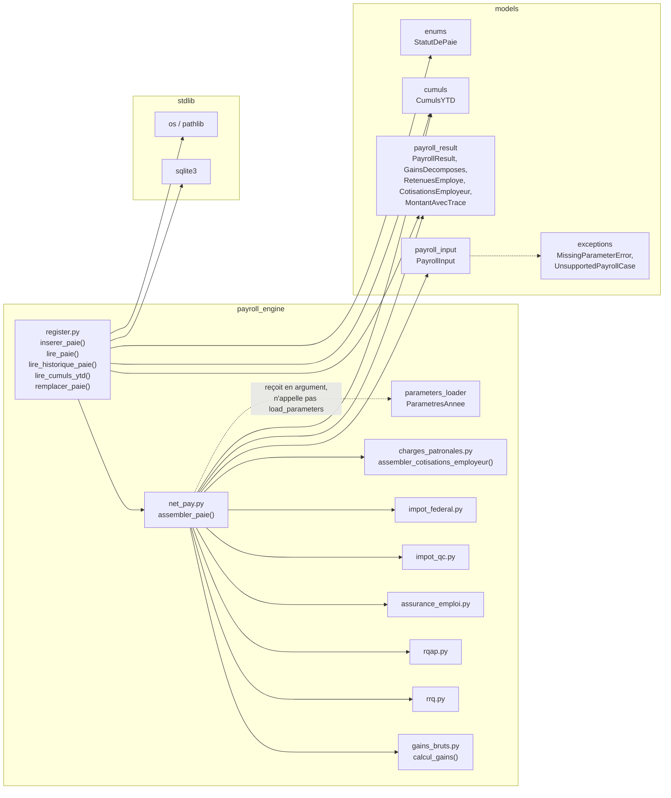

# Design Document

<!-- Document de design — net-cumuls-registre. Les en-têtes structurels de niveau supérieur (Overview, Architecture, Components and Interfaces, Data Models, Correctness Properties, Error Handling, Testing Strategy) sont maintenus en anglais pour la conformité au format Kiro. Tout le contenu métier est rédigé en français. -->

## Overview

Cette spec livre **l'étape 6 du plan d'implémentation** (`docs/plan-implementation.md`), après `moteur-paie-contrats` (étape 1, socle contractuel figé), `gains-bruts-vacances-hs` (étape 2, `calcul_gains`), `cotisations-sociales-qc` (étape 3, RRQ/RQAP/AE employé et employeur), `impots-retenues-source` (étape 4, impôt QC et fédéral) et `charges-patronales` (étape 5, FSS/CNESST/CNT et `assembler_cotisations_employeur`). Elle ajoute au moteur de paie Camp LilySO les **deux derniers composants du moteur de calcul** avant le bulletin PDF et l'interface :

- **`payroll_engine/net_pay.py`** — l'**orchestrateur bout-en-bout** : une fonction pure unique qui invoque, dans l'ordre, les neuf fonctions de calcul déjà livrées par les étapes 2 à 5, puis assemble le `PayrollResult` complet ;
- **`payroll_engine/register.py`** — le **registre maître** : une persistance SQLite locale, append-only, qui archive chaque paie, maintient une vue dénormalisée des cumuls YTD, et implémente l'annulation-remplacement par transaction atomique.

Elle **n'implémente aucune formule fiscale** (déjà livrées par les étapes 2 à 5, invoquées sans modification) et **ne modifie aucun modèle** figé par `moteur-paie-contrats` (`PayrollResult`, `CumulsYTD`, `MontantAvecTrace`, `CalculationTrace`, `StatutDePaie`) — elle les **consomme**.

### Livrables

| Fichier | Rôle |
|---|---|
| `payroll_engine/net_pay.py` | Fonction publique unique `assembler_paie` — orchestrateur pur invoquant les 9 fonctions des étapes 2 à 5 et construisant le `PayrollResult` complet (Req 1 à 8). |
| `payroll_engine/register.py` | `inserer_paie`, `lire_paie`, `lire_historique_paie`, `lire_cumuls_ytd`, `remplacer_paie` — registre SQLite append-only + cumuls dénormalisés (Req 9 à 15). |
| `tests/payroll_engine/test_net_pay.py` | Property tests Hypothesis + tests d'exemple pour `assembler_paie`. |
| `tests/payroll_engine/test_register.py` | Property tests Hypothesis (dont Requirement 16) + tests d'exemple pour le registre. |
| `tests/test_golden_outputs.py` (extension) | Assertions golden : les 6 fixtures QC001–QC006 assemblées via `assembler_paie` puis insérées via `inserer_paie` reproduisent `net`, `cout_employeur`, `cumuls_fin` au cent près (Req 17.4). |
| `tests/test_guards.py` (extension) | Nouvelles classes de garde : absence de `float`, absence de constante fiscale en dur, absence de `load_parameters`/`UnsupportedPayrollCase` redondant dans `net_pay.py` ; absence de fichier `*.db`/`*.sqlite`/`*.sqlite3` dans l'arbre versionné après exécution de la suite (Req 15.3). |
| `tests/strategies.py` (extension) | Stratégies pour séquences de `PayrollResult` valides, `StatutDePaie`, `saison`, chemins `chemin_bd` temporaires. |

### Contrats consommés sans modification

Tout est déjà figé par les specs antérieures :

- `models.payroll_input.PayrollInput` (et ses sous-modèles `Employee`, `PayPeriod`, `HeuresParSemaine`).
- `models.payroll_result.GainsDecomposes`, `MontantAvecTrace`, `RetenuesEmploye`, `CotisationsEmployeur`, `PayrollResult` — y compris ses trois invariants `model_validator` (identités comptables, biconditionnelle statut, cohérence `cumuls_fin`).
- `models.cumuls.CumulsYTD`, notamment `CumulsYTD.zero(employe_id, annee_civile)` et `CumulsYTD.avec_paie(resultat)` — méthode d'instance qui retourne une **nouvelle** instance, refuse par `PayrollDomainError` toute paie dont `employe_id` ou `annee_fiscale` diffère, et agrège **par duck typing** (`getattr(resultat, categorie, valeur_actuelle)`) sur les onze catégories `_CATEGORIES_MONETAIRES` : `brut`, `vacances`, `rrq_employe`, `rrq_employeur`, `rqap_employe`, `rqap_employeur`, `ae_employe`, `ae_employeur`, `impot_qc_retenu`, `impot_federal_retenu`, `net`. **Ce duck typing est la clé qui permet de résoudre la dépendance circulaire** (voir §Components §2).
- `models.trace.CalculationTrace`, `models.enums.StatutDePaie/Juridiction/ModeArrondissement`, `models.exceptions.PayrollDomainError/UnsupportedPayrollCase/MissingParameterError`.
- `payroll_engine.parameters_loader.ParametresAnnee`, `load_parameters`.
- `payroll_engine.gains_bruts.calcul_gains`.
- `payroll_engine.rrq.calcul_rrq_employe`, `calcul_rrq_employeur`.
- `payroll_engine.rqap.calcul_rqap_employe`, `calcul_rqap_employeur`.
- `payroll_engine.assurance_emploi.calcul_ae_employe`, `calcul_ae_employeur`.
- `payroll_engine.impot_qc.calcul_impot_qc_formule`, `calcul_impot_qc_retenu`.
- `payroll_engine.impot_federal.calcul_impot_federal_formule`, `calcul_impot_federal_retenu`.
- `payroll_engine.charges_patronales.assembler_cotisations_employeur`.

**Aucun contrat n'est redéfini.** `PayrollResult.model_dump_json()` / `model_validate_json()` porte déjà, transitivement (`GainsDecomposes`, `MontantAvecTrace`, `RetenuesEmploye`, `CotisationsEmployeur`, `CumulsYTD`, `CalculationTrace`), la sérialisation Decimal → chaîne guillemée (`field_serializer(..., when_used="json")`) et le parsing anti-`float` (`_parse_json_reject_floats`, refus de tout littéral numérique non guillemé avec point décimal). `register.py` **réutilise ce mécanisme intégralement** pour `payload_json` — il n'introduit aucun sérialiseur propre.

### Décisions structurantes retenues

Les six décisions actées par les requirements (voir `requirements.md` §Introduction) gouvernent ce design ; s'y ajoutent quatre décisions de conception propres au design :

1. **`net_pay.py` orchestre, ne calcule pas** — chaque section du `PayrollResult` provient d'un appel direct à une fonction déjà livrée ; `net_pay.py` n'effectue que de l'arithmétique d'agrégation exacte (`+`, `-`) sur des `Decimal` déjà arrondis.
2. **Résolution de la circularité `cumuls_fin` par un objet intermédiaire privé** — `_ContributionPaie`, une `dataclass(frozen=True)` interne à `net_pay.py`, exposant exactement `employe_id`, `annee_fiscale` et les onze attributs `_CATEGORIES_MONETAIRES` de `CumulsYTD`. Construite **avant** l'appel à `PayrollResult(...)`, elle est passée à `payroll_input.cumuls_debut.avec_paie(contribution)` par **duck typing** — aucune modification de `CumulsYTD` n'est nécessaire (Req 6.1, décision requirements n° 6).
3. **`register.py` n'est délibérément pas pur** — c'est le seul module du moteur qui effectue de l'E/S (SQLite). Il consomme `net_pay.py` (pur) et ne réintroduit aucune logique fiscale.
4. **Sérialisation `payload_json` = `PayrollResult.model_dump_json()` / `model_validate_json()` sans modification** — aucun nouveau schéma de sérialisation n'est introduit ; `register.py` traite `payload_json` comme une chaîne opaque produite et consommée exclusivement par ces deux méthodes déjà conformes à la règle 01 (Req 12.5).
5. **`chemin_bd` résolu sans nouvelle dépendance externe** — `pyproject.toml` ne déclare que `pydantic` en dépendance de production (`dev`/`ui`/`pdf` sont des extras optionnels non pertinents ici). Ajouter `platformdirs` pour un unique appel `os.environ["APPDATA"]` serait disproportionné (règle de dépendances minimales et épinglées). `register.py` calcule `%APPDATA%\CampLilySO\payroll.db` avec la bibliothèque standard uniquement (`os.environ`, `pathlib.Path`), avec repli explicite pour les environnements non-Windows (CI, développement) — voir §Components §4.
6. **Chaque fonction publique du registre accepte `chemin_bd: str | Path` en dernier paramètre, avec le chemin de production comme valeur par défaut** — cohérent avec Req 15.1, 15.2 ; les tests injectent systématiquement un `tmp_path` ou `":memory:"`.

### Traçabilité requirement → composant

| Requirement | Composant de conception |
|---|---|
| Req 1 — Signature, pureté de `assembler_paie` | §Components §1 |
| Req 2 — Invocation stricte des 9 fonctions | §Components §1 (pseudocode d'ordonnancement) |
| Req 3 — Assemblage `RetenuesEmploye` | §Components §1 étape C |
| Req 4 — Assemblage `CotisationsEmployeur` | §Components §1 étape D |
| Req 5 — Identités `net` / `cout_employeur` | §Components §1 étape E |
| Req 6 — `cumuls_fin`, dépendance circulaire | §Components §2 (`_ContributionPaie`) |
| Req 7 — Construction finale du `PayrollResult` | §Components §1 étape G |
| Req 8 — Traçabilité (règle 02) | §Components §1, §Error Handling |
| Req 9 — Schéma `paies` | §Data Models (DDL `paies`) |
| Req 10 — Schéma `cumuls_ytd` | §Data Models (DDL `cumuls_ytd`) |
| Req 11 — `inserer_paie` | §Components §3 |
| Req 12 — Lectures (`lire_paie`, `lire_historique_paie`, `lire_cumuls_ytd`) | §Components §3 |
| Req 13 — `remplacer_paie` | §Components §3 |
| Req 14 — Saison vs année civile | §Components §3, §Correctness Properties |
| Req 15 — `chemin_bd`, sécurité (règle 04) | §Components §4 |
| Req 16 — Invariants PBT | §Correctness Properties |
| Req 17 — Périmètre et propagation | §Error Handling |

### Application explicite des 6 règles steering

- **Règle 01** — `Decimal` de bout en bout ; `payload_json` sérialisé exclusivement via `PayrollResult.model_dump_json()` (chaînes guillemées, jamais de littéral flottant) ; toutes les colonnes monétaires de `cumuls_ytd` sont `TEXT`, jamais `REAL` ; test de garde « aucun `float` » sur `net_pay.py` et `register.py`.
- **Règle 02** — `net_pay.py` n'invente aucune nouvelle `CalculationTrace` (décision requirements n° 5) ; chaque `MontantAvecTrace` reçu d'une fonction invoquée est reporté sans modification.
- **Règle 03** — aucun nouveau garde-fou de périmètre dans `net_pay.py`/`register.py` ; toute `UnsupportedPayrollCase`/`MissingParameterError` levée par une fonction invoquée est propagée sans interception (Req 17.3).
- **Règle 04** — `chemin_bd` de production hors dépôt (`%APPDATA%\CampLilySO\payroll.db`) ; tests exclusivement sur base temporaire ou `:memory:` ; identifiants fictifs `EMP0XX` ; test de garde « aucun `*.db` dans l'arbre versionné » (Req 15.3).
- **Règle 05** — aucun taux/plafond/constante fiscale codé en dur ; `parametres_annee` est injecté tel quel dans chaque appel aux 9 fonctions invoquées, jamais relu depuis le disque par `net_pay.py`.
- **Règle 06** — tests (property Hypothesis + golden + garde) écrits avant l'implémentation ; voir §Testing Strategy « Ordre d'écriture ».

---

## Architecture

### Placement dans l'arbre

```
payroll_engine/
├── __init__.py
├── parameters_loader.py         # existant
├── gains_bruts.py                # existant (étape 2)
├── rrq.py                        # existant (étape 3)
├── rqap.py                       # existant (étape 3)
├── assurance_emploi.py           # existant (étape 3)
├── impot_qc.py                   # existant (étape 4)
├── impot_federal.py              # existant (étape 4)
├── charges_patronales.py         # existant (étape 5)
├── net_pay.py                    # NOUVEAU — cette spec
└── register.py                   # NOUVEAU — cette spec
```

Deux fichiers distincts (contrairement à `charges_patronales.py` qui regroupe trois calculs homogènes) : `net_pay.py` est **pur** (aucune E/S) tandis que `register.py` fait exclusivement de la persistance SQLite. Mélanger les deux violerait la contrainte de pureté de l'orchestrateur et rendrait `net_pay.py` impossible à tester sans base de données.

### Dépendances entrantes



`net_pay.py` importe :

- `models.payroll_input.PayrollInput`, `models.payroll_result.{PayrollResult, GainsDecomposes, RetenuesEmploye, CotisationsEmployeur, MontantAvecTrace}`, `models.cumuls.CumulsYTD`, `models.enums.StatutDePaie` (typage uniquement) ;
- `payroll_engine.parameters_loader.ParametresAnnee` (typage du deuxième argument) ;
- les neuf fonctions déjà livrées (`gains_bruts`, `rrq`, `rqap`, `assurance_emploi`, `impot_qc`, `impot_federal`, `charges_patronales`).
- `dataclasses.dataclass` (stdlib) pour `_ContributionPaie`.

`register.py` importe :

- `sqlite3`, `os`, `pathlib.Path`, `datetime` (stdlib uniquement) ;
- `models.payroll_result.PayrollResult`, `models.cumuls.CumulsYTD`, `models.enums.StatutDePaie` ;
- **rien** de `payroll_engine.net_pay` n'est requis pour son fonctionnement (le registre est agnostique de la façon dont un `PayrollResult` a été produit) — la flèche `REG --> NP` du diagramme représente uniquement l'usage conjoint côté appelant (tests, futur `app/main.py`), pas une dépendance d'import.

Aucune nouvelle dépendance externe (`pyproject.toml` inchangé, décision n° 5).

### Contrainte de pureté (`net_pay.py` uniquement)

Identique aux étapes précédentes pour `net_pay.py` : aucun état de module mutable, aucune E/S, aucun appel à `datetime.now()`, aucune mutation des arguments (`frozen=True` structurel de `PayrollInput`/`ParametresAnnee`), thread-safe par construction (Req 1.2, 1.3, 1.4). **`register.py` est explicitement exempté de cette contrainte** — c'est le module d'E/S du moteur, son rôle est justement de persister un état (Req 11, 12, 13). Cette asymétrie est délibérée (décision n° 3) et permet de tester `net_pay.py` par Hypothesis sans jamais toucher au disque.

### Helper d'arrondissement — non applicable

Contrairement aux étapes précédentes, `net_pay.py` **n'introduit aucun nouveau `_arrondir`** : chaque montant qu'il agrège (`gains.brut_total`, `retenues_employe.total_retenues_employe`, etc.) est déjà arrondi à 2 décimales par la fonction qui l'a produit ; `net` et `cout_employeur` sont des sommes/différences exactes de valeurs déjà arrondies, donc elles-mêmes exactes au cent sans arrondissement supplémentaire (Req 5.1, 5.2, décision requirements n° 5).

---

## Components and Interfaces

### 1. `net_pay.assembler_paie` — signature et ordonnancement complet (Req 1, Req 2)

```python
from __future__ import annotations

from dataclasses import dataclass
from datetime import datetime
from decimal import Decimal

from models.cumuls import CumulsYTD
from models.enums import StatutDePaie
from models.payroll_input import PayrollInput
from models.payroll_result import (
    CotisationsEmployeur,
    GainsDecomposes,
    MontantAvecTrace,
    PayrollResult,
    RetenuesEmploye,
)
from payroll_engine.assurance_emploi import calcul_ae_employe
from payroll_engine.charges_patronales import assembler_cotisations_employeur
from payroll_engine.gains_bruts import calcul_gains
from payroll_engine.impot_federal import (
    calcul_impot_federal_formule,
    calcul_impot_federal_retenu,
)
from payroll_engine.impot_qc import calcul_impot_qc_formule, calcul_impot_qc_retenu
from payroll_engine.parameters_loader import ParametresAnnee
from payroll_engine.rqap import calcul_rqap_employe
from payroll_engine.rrq import calcul_rrq_employe


def assembler_paie(
    payroll_input: PayrollInput,
    parametres_annee: ParametresAnnee,
    id_paie: str,
    version: int,
    statut: StatutDePaie,
    date_creation: datetime,
    date_emission: datetime | None = None,
    remplace_par_id: str | None = None,
) -> PayrollResult: ...
```

Signature figée exactement telle qu'énoncée par Requirement 1 AC1 — ordre des arguments fixe, aucun défaut ajouté au-delà de `date_emission`/`remplace_par_id` (Req 1.1). `id_paie`, `version`, `statut`, `date_creation`, `date_emission`, `remplace_par_id` sont **fournis par l'appelant**, jamais générés en interne (Req 1.2) : aucun appel à `datetime.now()`, `uuid.uuid4()` ou équivalent.

**Algorithme complet — ordre d'invocation des 9 fonctions (Req 2, design §Architecture) :**

```
FONCTION assembler_paie(payroll_input, parametres_annee, id_paie, version,
                        statut, date_creation, date_emission, remplace_par_id):

    # --- A. Gains (Req 2.1) ---------------------------------------------
    gains = calcul_gains(payroll_input, parametres_annee)
    # gains : GainsDecomposes

    # --- B. Trois retenues sociales employé (Req 2.2) --------------------
    rrq_emp_montant,  rrq_emp_trace  = calcul_rrq_employe(payroll_input, gains, parametres_annee)
    rqap_emp_montant, rqap_emp_trace = calcul_rqap_employe(payroll_input, gains, parametres_annee)
    ae_emp_montant,   ae_emp_trace   = calcul_ae_employe(payroll_input, gains, parametres_annee)

    # --- C. Impôts QC et fédéral — formule ET retenue (Req 2.3) ----------
    iqc_formule_montant, iqc_formule_trace = calcul_impot_qc_formule(payroll_input, gains, parametres_annee)
    ifed_formule_montant, ifed_formule_trace = calcul_impot_federal_formule(payroll_input, gains, parametres_annee)

    # --- C'. additionnelle_permise (spec impots-retenues-source, Requirement 14) --
    # Décision opérationnelle Camp LilySO (docs/hypotheses-2026.md), non
    # prescrite par TP-1015.F ni T4127/T4001 — comparaison arithmétique
    # pure, PAS une formule fiscale. Calculée ici et non dans
    # impot_qc.py/impot_federal.py : eux seuls n'ont pas la vue
    # transversale (RRQ/RQAP/AE + impôt de base de l'autre juridiction).
    montant_base_qc = (
        Decimal("0.00") if payroll_input.exoneration_TP1015_3_effectif
        else iqc_formule_montant
    )
    montant_base_federal = (
        Decimal("0.00") if payroll_input.exoneration_TD1_effective
        else ifed_formule_montant
    )
    espace_disponible = (
        gains.brut_total
        - rrq_emp_montant - rqap_emp_montant - ae_emp_montant
        - montant_base_qc - montant_base_federal
    )
    somme_additionnelles = (
        payroll_input.retenue_additionnelle_QC_effective
        + payroll_input.retenue_additionnelle_federale_effective
    )
    additionnelle_permise = somme_additionnelles <= espace_disponible

    iqc_retenu_montant,  iqc_retenu_trace  = calcul_impot_qc_retenu(payroll_input, gains, parametres_annee, additionnelle_permise)
    ifed_retenu_montant,  ifed_retenu_trace  = calcul_impot_federal_retenu(payroll_input, gains, parametres_annee, additionnelle_permise)

    # --- D. CotisationsEmployeur complet, en un seul appel (Req 2.4) -----
    cotisations_employeur = assembler_cotisations_employeur(payroll_input, gains, parametres_annee)
    # cotisations_employeur : CotisationsEmployeur (RRQ_er, RQAP_er, AE_er,
    #                          FSS, CNESST, CNT, total_cotisations_employeur)
    # AUCUN appel séparé à calcul_rrq_employeur / calcul_rqap_employeur /
    # calcul_ae_employeur / calcul_fss / calcul_cnesst / calcul_cnt (Req 2.4).

    # --- E. Assemblage RetenuesEmploye (Req 3) ----------------------------
    total_retenues_employe = (
        rrq_emp_montant + rqap_emp_montant + ae_emp_montant
        + iqc_retenu_montant + ifed_retenu_montant
    )  # Req 3.2 — SEULEMENT les 5 montants retenus, PAS les *_formule.

    retenues_employe = RetenuesEmploye(
        rrq=MontantAvecTrace(montant=rrq_emp_montant, trace=rrq_emp_trace),
        rqap=MontantAvecTrace(montant=rqap_emp_montant, trace=rqap_emp_trace),
        ae=MontantAvecTrace(montant=ae_emp_montant, trace=ae_emp_trace),
        impot_qc_formule=MontantAvecTrace(montant=iqc_formule_montant, trace=iqc_formule_trace),
        impot_qc_retenu=MontantAvecTrace(montant=iqc_retenu_montant, trace=iqc_retenu_trace),
        impot_federal_formule=MontantAvecTrace(montant=ifed_formule_montant, trace=ifed_formule_trace),
        impot_federal_retenu=MontantAvecTrace(montant=ifed_retenu_montant, trace=ifed_retenu_trace),
        total_retenues_employe=total_retenues_employe,
    )

    # --- F. Identités comptables — net et coût employeur (Req 5) ---------
    net = gains.brut_total - retenues_employe.total_retenues_employe            # Req 5.1
    cout_employeur = gains.brut_total + cotisations_employeur.total_cotisations_employeur  # Req 5.2
    # Aucun arrondissement supplémentaire : les deux opérandes sont déjà
    # arrondis au cent (Req 5.4).

    # --- G. Résolution de la dépendance circulaire cumuls_fin (Req 6) ----
    contribution = _ContributionPaie(
        employe_id=payroll_input.employee.id,
        annee_fiscale=payroll_input.pay_period.annee_fiscale,
        brut=gains.brut_total,
        vacances=gains.vacances,
        rrq_employe=retenues_employe.rrq.montant,
        rrq_employeur=cotisations_employeur.rrq_employeur.montant,
        rqap_employe=retenues_employe.rqap.montant,
        rqap_employeur=cotisations_employeur.rqap_employeur.montant,
        ae_employe=retenues_employe.ae.montant,
        ae_employeur=cotisations_employeur.ae_employeur.montant,
        impot_qc_retenu=retenues_employe.impot_qc_retenu.montant,
        impot_federal_retenu=retenues_employe.impot_federal_retenu.montant,
        net=net,
    )
    cumuls_fin = payroll_input.cumuls_debut.avec_paie(contribution)
    # CumulsYTD.avec_paie lit `contribution.employe_id`/`contribution.annee_fiscale`
    # PUIS les onze attributs via getattr — duck typing, AUCUNE modification
    # de CumulsYTD requise (décision n° 2). Toute incohérence employé/année
    # lève PayrollDomainError, propagée sans interception (Req 6.4).

    # --- H. Construction finale, en un seul appel PayrollResult(...) -----
    RETOURNER PayrollResult(
        id_paie=id_paie,
        version=version,
        employe_id=payroll_input.employee.id,
        annee_fiscale=payroll_input.pay_period.annee_fiscale,
        pay_period=payroll_input.pay_period,
        gains=gains,
        retenues_employe=retenues_employe,
        cotisations_employeur=cotisations_employeur,
        net=net,
        cout_employeur=cout_employeur,
        cumuls_fin=cumuls_fin,
        statut=statut,
        remplace_par_id=remplace_par_id,
        date_creation=date_creation,
        date_emission=date_emission,
    )
    # Construction via le constructeur Pydantic standard — jamais
    # `model_construct` (Req 7.4). Les trois model_validator(mode="after")
    # de PayrollResult (identités, biconditionnelle, cohérence cumuls_fin)
    # s'exécutent ici et RÉUSSISSENT par construction pour toute entrée
    # valide (Req 7.3).
```

Points clés :

- **Étapes A à D = invocation stricte, jamais de recalcul** (Req 2.5) : les neuf appels sont les **seules** sources des dix montants fiscaux ; `net_pay.py` ne contient aucune formule RRQ/RQAP/AE/impôt/FSS/CNESST/CNT. L'étape C' (calcul de `additionnelle_permise`) est une exception délibérée et documentée à ce principe : ce n'est **pas** une formule fiscale TP-1015.F/T4127, mais une comparaison arithmétique pure implémentant une décision opérationnelle du projet Camp LilySO (spec `impots-retenues-source`, Requirement 14 ; voir `docs/hypotheses-2026.md`).
- **Propagation des exceptions (Req 2.6)** : si l'une des étapes A à D lève `MissingParameterError` ou `UnsupportedPayrollCase`, l'exécution s'arrête immédiatement et l'exception remonte inchangée — aucun `try/except` dans `assembler_paie`.
- **Pureté (Req 1.2)** : deux appels avec les mêmes huit arguments produisent, à chaque étape, exactement les mêmes valeurs intermédiaires (les neuf fonctions invoquées sont elles-mêmes pures) ; le `PayrollResult` final est donc déterministe et `==`-égal entre deux appels.
- **Aucune trace propre créée** (Req 8.1) : `net` et `cout_employeur` restent des `Decimal` simples ; chaque `MontantAvecTrace` de `retenues_employe`/`cotisations_employeur` porte la trace produite par la fonction qui l'a calculée, reportée sans altération (Req 8.2, 8.3).

### 2. `_ContributionPaie` — résolution de la dépendance circulaire (Req 6)

```python
@dataclass(frozen=True)
class _ContributionPaie:
    """Objet intermédiaire privé — pont entre les montants de la paie
    courante et `CumulsYTD.avec_paie`, AVANT que le `PayrollResult` final
    n'existe (résout la dépendance circulaire, décision requirements n° 6).

    Expose exactement les attributs que `CumulsYTD.avec_paie` lit par
    duck typing (`getattr(resultat, categorie, ...)`, voir `models/cumuls.py`) :
    `employe_id`, `annee_fiscale`, et les onze catégories monétaires
    identiques à `models.cumuls._CATEGORIES_MONETAIRES`. Interne à
    `net_pay.py` — non exporté, non exposé au consommateur du module.
    """

    employe_id: str
    annee_fiscale: int
    brut: Decimal
    vacances: Decimal
    rrq_employe: Decimal
    rrq_employeur: Decimal
    rqap_employe: Decimal
    rqap_employeur: Decimal
    ae_employe: Decimal
    ae_employeur: Decimal
    impot_qc_retenu: Decimal
    impot_federal_retenu: Decimal
    net: Decimal
```

**Pourquoi cette approche fonctionne (vérifié contre `models/cumuls.py`)** : `CumulsYTD.avec_paie(self, resultat)` ne type-hint son paramètre que pour la documentation (`if TYPE_CHECKING: from models.payroll_result import PayrollResult`) — à l'exécution, la méthode accède uniquement à `resultat.employe_id`, `resultat.annee_fiscale`, puis à chacune des onze catégories via `getattr(resultat, categorie, valeur_actuelle)`. **Aucun `isinstance(resultat, PayrollResult)` n'est vérifié.** `_ContributionPaie`, en exposant exactement ces treize attributs sous forme d'une `dataclass` immuable, satisfait ce contrat par duck typing sans qu'aucune modification de `models/cumuls.py` ne soit nécessaire — exactement la résolution retenue par la décision requirements n° 6 et par Req 6.1.

Le mapping des onze catégories (Req 6.2) est **fixé terme à terme** dans l'étape G du pseudocode §Components §1 :

| Catégorie `_ContributionPaie` | Source exacte |
|---|---|
| `brut` | `gains.brut_total` |
| `vacances` | `gains.vacances` |
| `rrq_employe` | `retenues_employe.rrq.montant` |
| `rrq_employeur` | `cotisations_employeur.rrq_employeur.montant` |
| `rqap_employe` | `retenues_employe.rqap.montant` |
| `rqap_employeur` | `cotisations_employeur.rqap_employeur.montant` |
| `ae_employe` | `retenues_employe.ae.montant` |
| `ae_employeur` | `cotisations_employeur.ae_employeur.montant` |
| `impot_qc_retenu` | `retenues_employe.impot_qc_retenu.montant` |
| `impot_federal_retenu` | `retenues_employe.impot_federal_retenu.montant` |
| `net` | `net` (calculé à l'étape F) |

`contribution.employe_id == payroll_input.employee.id` et `contribution.annee_fiscale == payroll_input.pay_period.annee_fiscale` (Req 6.3). Si `payroll_input.cumuls_debut.annee_civile != payroll_input.pay_period.annee_fiscale`, `CumulsYTD.avec_paie` lève nativement `PayrollDomainError`, non interceptée (Req 6.4, comportement déjà porté par le contrat `CumulsYTD`).


### 3. `register.py` — signatures, algorithmes détaillés et transactions

#### 3.0 Signatures exactes

```python
from __future__ import annotations

import os
import sqlite3
from datetime import datetime
from decimal import Decimal
from pathlib import Path

from models.cumuls import CumulsYTD
from models.enums import StatutDePaie
from models.payroll_result import PayrollResult

_STATUTS_NOUVEAU_RESULTAT_AUTORISES: frozenset[StatutDePaie] = frozenset(
    {StatutDePaie.EMISE, StatutDePaie.BROUILLON}
)


def chemin_bd_production() -> Path:
    """Chemin de production `%APPDATA%\\CampLilySO\\payroll.db` (Req 15.1)."""
    ...


def inserer_paie(
    resultat: PayrollResult,
    saison: str,
    chemin_bd: str | Path = chemin_bd_production(),
) -> None: ...


def lire_paie(
    id_paie: str,
    chemin_bd: str | Path = chemin_bd_production(),
) -> PayrollResult: ...


def lire_historique_paie(
    employe_id: str,
    annee_fiscale: int,
    numero_periode: int,
    chemin_bd: str | Path = chemin_bd_production(),
) -> tuple[PayrollResult, ...]: ...


def lire_cumuls_ytd(
    employe_id: str,
    annee_civile: int,
    chemin_bd: str | Path = chemin_bd_production(),
) -> CumulsYTD: ...


def remplacer_paie(
    ancien_id: str,
    nouveau_resultat: PayrollResult,
    saison: str,
    chemin_bd: str | Path = chemin_bd_production(),
) -> None: ...
```

> **Note d'implémentation sur la valeur par défaut** : Python évalue les valeurs par défaut des paramètres **une seule fois**, à la définition de la fonction. `chemin_bd_production()` étant pure (aucune E/S — elle ne fait que construire un `Path`, sans créer de fichier ni de répertoire), l'utiliser comme valeur par défaut est sûr et respecte Req 15.1 ("valeur par défaut DOIT être le chemin de production"). La création du répertoire parent (`mkdir(parents=True, exist_ok=True)`) et du fichier SQLite se fait à la première connexion (§3.2), jamais à l'import du module.

Chaque fonction accepte `chemin_bd: str | Path`, convertible directement en argument de `sqlite3.connect` (Req 15.1, 15.2, 15.6, 12.6).

#### 3.1 `chemin_bd_production` — résolution multiplateforme sans nouvelle dépendance (Req 15.1, décision n° 5)

```
FONCTION chemin_bd_production() -> Path:
    SI "APPDATA" présent dans os.environ:              # Windows nominal
        base = Path(os.environ["APPDATA"])
    SINON SI "XDG_DATA_HOME" présent dans os.environ:   # repli Linux/CI explicite
        base = Path(os.environ["XDG_DATA_HOME"])
    SINON:                                              # dernier repli portable
        base = Path.home() / ".local" / "share"
    RETOURNER base / "CampLilySO" / "payroll.db"
```

Justification (décision n° 5) : `pyproject.toml` ne déclare que `pydantic` en dépendance de production — ajouter `platformdirs` pour un seul appel `os.environ` serait disproportionné et introduirait une dépendance externe non pinée pour une fonctionnalité que la bibliothèque standard couvre entièrement. La variable `APPDATA` est **toujours** définie sous Windows (l'environnement cible de production du Camp LilySO, règle 04) ; les replis `XDG_DATA_HOME`/`~/.local/share` ne servent qu'au développement/CI multiplateforme et ne sont **jamais** exercés en production. Cette fonction est **pure** (lecture de variables d'environnement, aucune écriture disque) — elle peut donc être utilisée comme valeur par défaut de paramètre sans effet de bord à l'import.

#### 3.2 Connexion et transaction atomique — pattern partagé

Toutes les fonctions ouvrent la connexion SQLite via un gestionnaire de contexte qui garantit `COMMIT` sur succès et `ROLLBACK` complet sur toute exception (Req 11.5, 13.4, 13.6) :

```python
from contextlib import contextmanager


@contextmanager
def _connexion(chemin_bd: str | Path):
    """Ouvre une connexion SQLite avec transaction explicite (Req 11.5, 13.6).

    `isolation_level=None` désactive l'autocommit implicite de `sqlite3` ;
    la transaction est ouverte explicitement par `BEGIN IMMEDIATE` (évite
    une lecture sale entre le SELECT de contrôle et l'UPDATE/INSERT qui
    suit, cas `remplacer_paie`) et fermée par `COMMIT` en sortie normale
    ou `ROLLBACK` si une exception traverse le bloc `with`.
    """
    chemin = Path(chemin_bd) if chemin_bd != ":memory:" else chemin_bd
    if isinstance(chemin, Path):
        chemin.parent.mkdir(parents=True, exist_ok=True)
    connexion = sqlite3.connect(str(chemin), isolation_level=None)
    connexion.execute("PRAGMA foreign_keys = ON")
    try:
        connexion.execute("BEGIN IMMEDIATE")
        yield connexion
        connexion.execute("COMMIT")
    except BaseException:
        connexion.execute("ROLLBACK")
        raise
    finally:
        connexion.close()
```

Ce pattern (context manager Python autour de `BEGIN IMMEDIATE` / `COMMIT` / `ROLLBACK`) est utilisé identiquement par `inserer_paie` et `remplacer_paie` — c'est le mécanisme qui garantit l'atomicité exigée par Req 11.5 (insertion + mise à jour cumuls) et Req 13.4/13.6 (les trois étapes de `remplacer_paie`, rollback complet sur erreur).

`_creer_schema_si_absent(connexion)` (appelée en tête de chaque fonction publique, idempotente, `CREATE TABLE IF NOT EXISTS`) garantit que le schéma (§Data Models) existe avant toute lecture/écriture — nécessaire car `chemin_bd` peut pointer vers un fichier neuf ou une base `:memory:` fraîchement ouverte à chaque appel de test.

#### 3.3 `inserer_paie` — pseudocode complet (Req 11)

```
FONCTION inserer_paie(resultat, saison, chemin_bd):
    AVEC _connexion(chemin_bd) COMME connexion:
        _creer_schema_si_absent(connexion)

        # 1. Refus si id_paie déjà présent (Req 11.6) — la contrainte
        #    UNIQUE sur id_paie lèvera sqlite3.IntegrityError si on ne
        #    contrôle pas explicitement ; contrôle explicite pour un
        #    message actionnable.
        SI EXISTE ligne dans `paies` où id_paie == resultat.id_paie:
            LEVER ValueError(f"id_paie '{resultat.id_paie}' déjà présent — "
                              "append-only, aucune ré-insertion (Req 11.6).")

        # 2. Insertion append-only (Req 11.2) — quel que soit le statut.
        connexion.execute(
            "INSERT INTO paies (id_paie, employe_id, annee_fiscale, "
            "numero_periode, saison, version, statut, remplace_par_id, "
            "date_creation, date_emission, payload_json) "
            "VALUES (?, ?, ?, ?, ?, ?, ?, ?, ?, ?, ?)",
            (
                resultat.id_paie,
                resultat.employe_id,
                resultat.annee_fiscale,
                resultat.pay_period.numero_periode,
                saison,
                resultat.version,
                resultat.statut.value,
                resultat.remplace_par_id,
                resultat.date_creation.isoformat(),
                resultat.date_emission.isoformat() if resultat.date_emission else None,
                resultat.model_dump_json(),      # Req 12.5, décision n° 4
            ),
        )

        # 3. Mise à jour cumuls_ytd SEULEMENT si EMISE (Req 11.3, 11.4).
        SI resultat.statut == StatutDePaie.EMISE:
            cumul_actuel = _lire_cumuls_ytd_tx(connexion, resultat.employe_id,
                                                resultat.annee_fiscale)
            # cumul_actuel : CumulsYTD.zero(...) si absent (Req 10.4)
            nouveau_cumul = cumul_actuel.avec_paie(resultat)
            # `resultat` EST un PayrollResult complet : `CumulsYTD.avec_paie`
            # lit ses onze catégories nativement (pas besoin de
            # `_ContributionPaie` ici — cet objet intermédiaire n'existe
            # que dans `net_pay.py`, avant que le PayrollResult final soit
            # construit).
            _upsert_cumuls_ytd(connexion, nouveau_cumul)
        # SINON : Table_Cumuls_YTD inchangée (Req 11.4).
    # Sortie du `with` -> COMMIT si aucune exception, ROLLBACK sinon (Req 11.5).
```

`_upsert_cumuls_ytd` exécute `INSERT ... ON CONFLICT(employe_id, annee_civile) DO UPDATE SET ...` (clause SQLite native) pour écrire les onze colonnes en une seule instruction, chaque valeur `Decimal` convertie en `str(valeur)` (jamais `float(valeur)`).

#### 3.4 `lire_paie` — pseudocode (Req 12.1, 12.2)

```
FONCTION lire_paie(id_paie, chemin_bd) -> PayrollResult:
    AVEC _connexion(chemin_bd) COMME connexion:
        _creer_schema_si_absent(connexion)
        ligne = connexion.execute(
            "SELECT payload_json FROM paies WHERE id_paie = ?", (id_paie,)
        ).fetchone()
        SI ligne EST None:
            LEVER KeyError(f"Aucune paie trouvée pour id_paie={id_paie!r}.")
        RETOURNER PayrollResult.model_validate_json(ligne[0])
        # `model_validate_json` : refuse tout littéral flottant non
        # guillemé (règle 01, Req 12.5) ET ré-exécute les 3 invariants
        # `model_validator` de PayrollResult.
```

Lecture en dehors de toute transaction d'écriture — `_connexion` reste utilisée pour la cohérence du pattern, mais `BEGIN IMMEDIATE`/`COMMIT` sont neutres sur une lecture pure.

#### 3.5 `lire_historique_paie` — pseudocode (Req 12.3)

```
FONCTION lire_historique_paie(employe_id, annee_fiscale, numero_periode, chemin_bd)
        -> tuple[PayrollResult, ...]:
    AVEC _connexion(chemin_bd) COMME connexion:
        _creer_schema_si_absent(connexion)
        lignes = connexion.execute(
            "SELECT payload_json FROM paies "
            "WHERE employe_id = ? AND annee_fiscale = ? AND numero_periode = ? "
            "ORDER BY version ASC",
            (employe_id, annee_fiscale, numero_periode),
        ).fetchall()
        RETOURNER tuple(PayrollResult.model_validate_json(l[0]) POUR l DANS lignes)
        # Tuple vide si aucune version — pas d'exception (contrat plus
        # permissif que lire_paie, cohérent avec Req 12.3 qui ne prescrit
        # pas de refus sur historique vide).
```

Le tri `ORDER BY version ASC` est délégué à SQLite (colonne indexée, §Data Models) — jamais un tri Python après coup, pour garantir la cohérence même sur de gros historiques.

#### 3.6 `lire_cumuls_ytd` — pseudocode (Req 12.4, Req 10.4)

```
FONCTION lire_cumuls_ytd(employe_id, annee_civile, chemin_bd) -> CumulsYTD:
    AVEC _connexion(chemin_bd) COMME connexion:
        _creer_schema_si_absent(connexion)
        RETOURNER _lire_cumuls_ytd_tx(connexion, employe_id, annee_civile)

FONCTION _lire_cumuls_ytd_tx(connexion, employe_id, annee_civile) -> CumulsYTD:
    ligne = connexion.execute(
        "SELECT brut, vacances, rrq_employe, rrq_employeur, rqap_employe, "
        "rqap_employeur, ae_employe, ae_employeur, impot_qc_retenu, "
        "impot_federal_retenu, net FROM cumuls_ytd "
        "WHERE employe_id = ? AND annee_civile = ?",
        (employe_id, annee_civile),
    ).fetchone()
    SI ligne EST None:
        RETOURNER CumulsYTD.zero(employe_id, annee_civile)     # Req 10.4
    RETOURNER CumulsYTD.model_validate({
        "employe_id": employe_id,
        "annee_civile": annee_civile,
        "brut": ligne[0], "vacances": ligne[1], "rrq_employe": ligne[2],
        "rrq_employeur": ligne[3], "rqap_employe": ligne[4],
        "rqap_employeur": ligne[5], "ae_employe": ligne[6],
        "ae_employeur": ligne[7], "impot_qc_retenu": ligne[8],
        "impot_federal_retenu": ligne[9], "net": ligne[10],
    })
    # Chaque `ligne[i]` est une chaîne TEXT (ex. "1516.32") — passée
    # directement à Pydantic, qui la convertit en Decimal via
    # `reject_float` (accepte les chaînes conformes au format décimal,
    # règle 01, Req 12.5). Aucun `float()` n'intervient à aucune étape.
```

#### 3.7 `remplacer_paie` — pseudocode complet (Req 13)

```
FONCTION remplacer_paie(ancien_id, nouveau_resultat, saison, chemin_bd):
    AVEC _connexion(chemin_bd) COMME connexion:
        _creer_schema_si_absent(connexion)

        # 1. Lecture + contrôle de l'ancienne ligne (Req 13.2).
        ancienne_ligne = connexion.execute(
            "SELECT statut, payload_json FROM paies WHERE id_paie = ?",
            (ancien_id,),
        ).fetchone()
        SI ancienne_ligne EST None:
            LEVER KeyError(f"Aucune paie trouvée pour ancien_id={ancien_id!r}.")
        ancien_statut, ancien_payload = ancienne_ligne
        SI ancien_statut != StatutDePaie.EMISE.value:
            LEVER ValueError(
                f"Impossible de remplacer la paie '{ancien_id}' : statut "
                f"actuel '{ancien_statut}' ≠ EMISE (Req 13.2)."
            )
        ancien_resultat = PayrollResult.model_validate_json(ancien_payload)

        # 2. Contrôle du statut du nouveau résultat (Req 13.3).
        SI nouveau_resultat.statut NON DANS _STATUTS_NOUVEAU_RESULTAT_AUTORISES:
            LEVER ValueError(
                f"statut '{nouveau_resultat.statut.value}' non autorisé pour "
                "un remplacement (Req 13.3) — attendu EMISE ou BROUILLON."
            )

        # --- À partir d'ici, trois mutations dans UNE seule transaction ---

        # 3a. Marquer l'ancienne ligne REMPLACE_PAR (Req 13.4a, Req 9.3).
        payload_ancien_maj = ancien_resultat.model_copy(update={
            "statut": StatutDePaie.REMPLACE_PAR,
            "remplace_par_id": nouveau_resultat.id_paie,
        }).model_dump_json()
        # `model_copy` produit une NOUVELLE instance ; PayrollResult reste
        # `frozen=True`. La reconstruction ré-exécute les 3 model_validator
        # — la biconditionnelle statut/remplace_par_id (Req 6.3-6.5 de
        # moteur-paie-contrats) est donc revalidée automatiquement.
        connexion.execute(
            "UPDATE paies SET statut = ?, remplace_par_id = ?, payload_json = ? "
            "WHERE id_paie = ?",
            (StatutDePaie.REMPLACE_PAR.value, nouveau_resultat.id_paie,
             payload_ancien_maj, ancien_id),
        )
        # SEULE mutation autorisée sur une ligne existante (Req 9.3, Req 13.7) :
        # gains/retenues/cotisations/net/cout_employeur du payload restent
        # IDENTIQUES à ceux d'`ancien_resultat` — seuls statut et
        # remplace_par_id changent dans le JSON réécrit.

        # 3b. Insertion de la nouvelle ligne (même mécanisme que inserer_paie,
        #     Req 13.4b) — appel direct de la logique d'insertion, PAS de
        #     mise à jour cumuls à cette étape (elle est recalculée à 3c).
        _inserer_ligne_paie_tx(connexion, nouveau_resultat, saison)

        # 3c. Recalcul cumuls_ytd : retrait ancien + ajout nouveau (Req 13.4c, 13.5).
        SI ancien_statut == StatutDePaie.EMISE.value:     # toujours vrai ici (contrôlé à l'étape 1)
            cumul_actuel = _lire_cumuls_ytd_tx(connexion, ancien_resultat.employe_id,
                                                ancien_resultat.annee_fiscale)
            cumul_sans_ancien = _soustraire_contribution(cumul_actuel, ancien_resultat)
            # `_soustraire_contribution` : catégorie par catégorie,
            # valeur_actuelle - contribution_ancienne (mapping Req 6 AC2).

            SI nouveau_resultat.statut == StatutDePaie.EMISE:
                cumul_final = cumul_sans_ancien.avec_paie(nouveau_resultat)
                # retrait ANCIEN + ajout NOUVEAU (Req 13.4c, cas nominal)
            SINON:   # nouveau_resultat.statut == BROUILLON (Req 13.5)
                cumul_final = cumul_sans_ancien
                # retrait UNIQUEMENT — aucun ajout tant que la nouvelle
                # version n'est pas elle-même EMISE (Req 13.5)

            _upsert_cumuls_ytd(connexion, cumul_final)
    # Sortie du `with` -> COMMIT si les 3 étapes ont réussi, ROLLBACK
    # intégral sinon (Req 13.6) — aucune mutation partielle visible.
```

`_soustraire_contribution(cumul, resultat)` retourne une **nouvelle** `CumulsYTD` (`model_copy`) dont chacune des onze catégories vaut `getattr(cumul, cat) - getattr(resultat, cat)` — implémentation privée à `register.py`, symétrique de l'addition déjà portée par `CumulsYTD.avec_paie`. Cette soustraction peut transitoirement produire une valeur qui serait négative si appelée hors du contexte contrôlé de `remplacer_paie` ; dans le flux nominal de `remplacer_paie`, `cumul_sans_ancien` reste toujours `>= 0` puisque `cumul_actuel` inclut par construction la contribution qu'on retire. `CumulsYTD` refuse `< 0` via `Field(ge=Decimal("0"))` — toute violation (bug) lève `pydantic.ValidationError`, jamais masquée.

### 4. Ordre d'exécution garanti (invariant de reproduction)

Pour `assembler_paie` : A (gains) → B (RRQ/RQAP/AE employé) → C (impôts QC/fédéral formule+retenu) → D (assemblage employeur) → E (net, coût employeur) → F/G (contribution, cumuls_fin) → H (construction finale). Cet ordre garantit le déterminisme (Req 1.2, Req 16.7).

Pour `inserer_paie` : contrôle unicité → insertion append-only → (conditionnelle) upsert cumuls, dans une seule transaction.

Pour `remplacer_paie` : lecture + contrôle ancien → contrôle statut nouveau → (transaction) update ancien → insertion nouveau → recalcul cumuls.

---

## Data Models

**Aucun nouveau modèle Pydantic n'est introduit par cette spec.** Les modèles nécessaires (`PayrollInput`, `PayrollResult`, `CumulsYTD`, `MontantAvecTrace`, `RetenuesEmploye`, `CotisationsEmployeur`) existent déjà. Cette spec ajoute uniquement :

- `_ContributionPaie` — `dataclass` privée à `net_pay.py` (§Components §2), non exportée, non persistée ;
- le **schéma SQLite** de `register.py`, décrit ci-dessous.

### Schéma SQL — table `paies` (Req 9)

```sql
CREATE TABLE IF NOT EXISTS paies (
    id_paie          TEXT    PRIMARY KEY,
    employe_id       TEXT    NOT NULL,
    annee_fiscale    INTEGER NOT NULL,
    numero_periode   INTEGER NOT NULL,
    saison           TEXT    NOT NULL,
    version          INTEGER NOT NULL,
    statut           TEXT    NOT NULL,
    remplace_par_id  TEXT,
    date_creation    TEXT    NOT NULL,
    date_emission    TEXT,
    payload_json     TEXT    NOT NULL
);

CREATE INDEX IF NOT EXISTS idx_paies_logique
    ON paies (employe_id, annee_fiscale, numero_periode, version);
```

Notes de conception (Req 9) :

- `id_paie TEXT PRIMARY KEY` — l'unicité est garantie nativement par SQLite (`INSERT` sur une clé existante lève `sqlite3.IntegrityError`) ; `inserer_paie` effectue en plus un contrôle explicite avant l'`INSERT` pour produire un message d'erreur actionnable (Req 11.6) plutôt que de laisser fuiter l'exception SQLite brute.
- **Aucune colonne monétaire** (`net`, `cout_employeur`, montants de `gains`/`retenues_employe`/`cotisations_employeur`) n'est dupliquée en `REAL` — la source de vérité exclusive de tout montant individuel d'une paie est `payload_json` (Req 9.2, règle 01). Les colonnes hors `payload_json` (`employe_id`, `annee_fiscale`, `numero_periode`, `saison`, `version`, `statut`, `remplace_par_id`, dates) sont des colonnes d'**indexation**, jamais de calcul.
- `date_creation`/`date_emission` sont stockées en `TEXT` au format ISO 8601 (`datetime.isoformat()`), jamais en `REAL` (timestamp Unix flottant) — cohérent avec le refus transversal de `float` (règle 01 s'étend par prudence à toute colonne susceptible d'être un nombre à virgule).
- **Append-only** (Req 9.3) : aucune fonction de `register.py` n'exécute `DELETE FROM paies`. La seule instruction `UPDATE` du module entier est celle de l'étape 3a de `remplacer_paie`, qui ne touche que `statut`, `remplace_par_id` et `payload_json` (ce dernier réécrit uniquement pour refléter les deux premiers champs, Req 13.7) — jamais `gains`/`retenues_employe`/etc. du JSON.
- L'index `idx_paies_logique` permet à `lire_historique_paie` (Req 9.4, Req 12.3) de retrouver et trier efficacement toutes les versions d'une Paie_Logique `(employe_id, annee_fiscale, numero_periode)` sans scan complet de table.
- `saison` est une colonne `TEXT NOT NULL` fournie par l'appelant, jamais validée par un format imposé par cette spec (Req 9.5, Req 14.1).

### Schéma SQL — table `cumuls_ytd` (Req 10)

```sql
CREATE TABLE IF NOT EXISTS cumuls_ytd (
    employe_id            TEXT NOT NULL,
    annee_civile          INTEGER NOT NULL,
    brut                  TEXT NOT NULL,
    vacances              TEXT NOT NULL,
    rrq_employe           TEXT NOT NULL,
    rrq_employeur         TEXT NOT NULL,
    rqap_employe          TEXT NOT NULL,
    rqap_employeur        TEXT NOT NULL,
    ae_employe            TEXT NOT NULL,
    ae_employeur          TEXT NOT NULL,
    impot_qc_retenu       TEXT NOT NULL,
    impot_federal_retenu  TEXT NOT NULL,
    net                   TEXT NOT NULL,
    PRIMARY KEY (employe_id, annee_civile)
);
```

Notes de conception (Req 10) :

- Clé primaire composite `(employe_id, annee_civile)` (Req 10.1) — SQLite en fait automatiquement un index unique, ce qui rend `INSERT ... ON CONFLICT(employe_id, annee_civile) DO UPDATE SET ...` directement utilisable par `_upsert_cumuls_ytd` sans requête de contrôle préalable.
- **Onze colonnes `TEXT`**, jamais `REAL` (Req 10.2, règle 01) — chaque valeur est `str(Decimal(...))` à l'écriture (ex. `"1516.32"`), et repassée telle quelle à `CumulsYTD.model_validate(...)` à la lecture, qui la convertit en `Decimal` via `reject_float` (accepte les chaînes conformes à `^[+-]?[0-9]+(\.[0-9]+)?$`) — jamais de conversion intermédiaire par `float()` (Req 10.3).
- L'**absence** d'une ligne pour un couple `(employe_id, annee_civile)` est interprétée par `_lire_cumuls_ytd_tx` comme `CumulsYTD.zero(employe_id, annee_civile)`, sans lever d'exception (Req 10.4) — voir §Components §3.6.

### Correspondance modèles ↔ colonnes

| Modèle / méthode | Table | Rôle |
|---|---|---|
| `PayrollResult.model_dump_json()` | `paies.payload_json` | Source de vérité unique de tout montant d'une paie individuelle (Req 9.2, 12.5). |
| `PayrollResult.model_validate_json(...)` | `paies.payload_json` | Reconstruction à la lecture (`lire_paie`, `lire_historique_paie`) — refuse tout littéral flottant non guillemé (règle 01). |
| `CumulsYTD.model_validate({...})` / `str(Decimal)` | `cumuls_ytd.*` (11 colonnes `TEXT`) | Sérialisation/désérialisation manuelle colonne par colonne (pas de `model_dump_json` ici : le stockage dénormalisé exige des colonnes individuelles pour l'agrégation SQL, pas un blob JSON). |
| `CumulsYTD.zero(employe_id, annee_civile)` | absence de ligne `cumuls_ytd` | Valeur par défaut interprétée sans E/S supplémentaire (Req 10.4). |
| `CumulsYTD.avec_paie(resultat)` | mise à jour `cumuls_ytd` (upsert) | `resultat` est ici un `PayrollResult` complet (contrairement à `net_pay.py` où c'est `_ContributionPaie`) — les deux satisfont le même duck typing. |

---

## Correctness Properties

*A property is a characteristic or behavior that should hold true across all valid executions of a system-essentially, a formal statement about what the system should do. Properties serve as the bridge between human-readable specifications and machine-verifiable correctness guarantees.*

Le property-based testing (PBT) est **applicable** à `net_pay.assembler_paie` (fonction pure, `Decimal` de bout en bout) et à `register.py` (les invariants d'agrégation et de round-trip restent vérifiables par génération aléatoire malgré l'E/S, en injectant systématiquement une base temporaire ou `:memory:`). Chaque propriété ci-dessous doit être implémentée avec **au minimum 100 itérations** et **taguée** en commentaire `# Feature: net-cumuls-registre, Property N: <titre>`.

**Réflexion de consolidation** : le prework identifie initialement l'insensibilité « absence de ligne `cumuls_ytd` ≡ `CumulsYTD.zero` » comme une propriété distincte — mais le cas `n = 0` de la Property 8 ci-dessous (cumul de *n* paies = somme des contributions des *n* premières) couvre exactement ce cas limite (somme vide = zéro = absence de ligne interprétée comme zéro) : elle est donc **fusionnée** dans Property 8 plutôt que dupliquée. De même, les quatre sous-critères d'invocation stricte (Req 2.1 à 2.4, un par groupe de fonctions) sont **consolidés en une seule Property 4** paramétrée sur les neuf fonctions, suivant le même principe de consolidation que `charges-patronales` Property 10.

### Property 1: Déterminisme et non-mutation de `assembler_paie`

*For any* `PayrollInput`, `ParametresAnnee` et arguments de cycle de vie (`id_paie`, `version`, `statut`, `date_creation`, `date_emission`, `remplace_par_id`) valides, deux appels successifs à `assembler_paie` avec les mêmes arguments produisent des `PayrollResult` égaux au sens `==`, et `payroll_input`/`parametres_annee` restent inchangés après l'appel (comparaison `==` avant/après).

**Validates: Requirements 1.2, 1.4, 16.7**

### Property 2: Identité brute

*For any* `PayrollInput` et `ParametresAnnee` valides, le `PayrollResult` produit par `assembler_paie` satisfait `gains.brut_total == net + retenues_employe.total_retenues_employe`.

**Validates: Requirements 5.1, 5.3, 16.1**

### Property 3: Identité coût employeur

*For any* `PayrollInput` et `ParametresAnnee` valides, le `PayrollResult` produit par `assembler_paie` satisfait `cout_employeur == gains.brut_total + cotisations_employeur.total_cotisations_employeur`.

**Validates: Requirements 5.2, 5.3, 16.2**

### Property 4: Invocation stricte sans recalcul

*For any* `PayrollInput` et `ParametresAnnee` valides, pour le `PayrollResult` produit par `assembler_paie` (appelé `pr`) : `pr.gains == calcul_gains(pi, pa)`, `pr.retenues_employe.rrq.montant == calcul_rrq_employe(pi, gains, pa)[0]` (et de façon symétrique pour `rqap`/`ae`/`impot_qc_formule`/`impot_qc_retenu`/`impot_federal_formule`/`impot_federal_retenu`), et `pr.cotisations_employeur == assembler_cotisations_employeur(pi, gains, pa)` — chaque section provient d'un appel direct et inchangé à la fonction déjà livrée correspondante, jamais d'un recalcul.

**Validates: Requirements 2.1, 2.2, 2.3, 2.4, 3.1, 4.1, 4.2**

### Property 5: Cohérence et monotonie de `cumuls_fin`

*For any* `PayrollInput` et `ParametresAnnee` valides tels que `payroll_input.cumuls_debut.annee_civile == payroll_input.pay_period.annee_fiscale`, le `cumuls_fin` du `PayrollResult` produit satisfait, pour chacune des onze catégories : `cumuls_fin.<categorie> == cumuls_debut.<categorie> + contribution.<categorie>` (mapping exact du Requirement 6 AC2) et `cumuls_fin.<categorie> >= cumuls_debut.<categorie>` (monotonie croissante).

**Validates: Requirements 6.2, 6.3, 6.5**

### Property 6: Construction finale fidèle et sans erreur

*For any* `PayrollInput`, `ParametresAnnee` et arguments de cycle de vie valides et mutuellement cohérents (respectant la biconditionnelle statut/remplace_par_id/date_emission du contrat `PayrollResult`), `assembler_paie` retourne un `PayrollResult` sans lever `ValidationError`, et `id_paie`, `version`, `statut`, `date_creation`, `date_emission`, `remplace_par_id` du résultat sont **strictement identiques** aux arguments fournis à l'appel.

**Validates: Requirements 7.2, 7.3**

### Property 7: Propagation sans interception des exceptions du domaine

*For any* `PayrollInput` valide et `ParametresAnnee` où un champ consommé par l'une des neuf fonctions invoquées porte `"TO_FILL"` ou une section requise est `None`, l'appel à `assembler_paie` lève exactement la `MissingParameterError` (ou `UnsupportedPayrollCase`) levée par la fonction concernée — jamais interceptée, masquée, ni reconvertie en une autre exception.

**Validates: Requirements 2.6, 6.4, 17.3**

### Property 8: Cumul YTD de *n* paies = somme des contributions

*For any* séquence ordonnée de *n* ≥ 0 `PayrollResult` `EMISE` valides d'un même `employe_id` pour une même `annee_fiscale`, insérés un à un via `inserer_paie` dans cet ordre (base neuve, aucune ligne préexistante), le `CumulsYTD` retourné par `lire_cumuls_ytd` après les *n* insertions égale, catégorie par catégorie, la somme des contributions des *n* paies (mapping du Requirement 6 AC2). Le cas *n* = 0 (aucune insertion) est couvert : `lire_cumuls_ytd` retourne alors `CumulsYTD.zero(employe_id, annee_civile)`, cohérent avec une somme vide.

**Validates: Requirements 10.4, 11.3, 16.3**

### Property 9: Idempotence de substitution (`remplacer_paie`)

*For any* `PayrollResult` `EMISE` initial et tout `PayrollResult` de remplacement `nouveau_resultat` (statut `EMISE`) du même employé et de la même année civile, le `CumulsYTD` obtenu après `inserer_paie(ancien)` puis `remplacer_paie(ancien.id_paie, nouveau_resultat, ...)` est **identique** au `CumulsYTD` obtenu en insérant directement `nouveau_resultat` seul depuis une base neuve (aucune ligne préexistante).

**Validates: Requirements 13.4, 13.5, 16.4**

### Property 10: Round-trip de sérialisation sans perte

*For any* `PayrollResult` valide, `lire_paie(id_paie, chemin_bd)` après `inserer_paie(resultat, saison, chemin_bd)` retourne un `PayrollResult` strictement égal (`==`) à `resultat`.

**Validates: Requirements 12.1, 12.5, 16.5**

### Property 11: Immuabilité des lignes déjà insérées

*For any* séquence d'opérations du Registre_Maitre sur une même ligne de la Table_Paies, aucune fonction autre que `remplacer_paie` ne modifie `payload_json`, `statut` ou `remplace_par_id` d'une ligne déjà insérée ; `remplacer_paie` lui-même ne modifie de la ligne `ancien_id` que `statut` (→ `REMPLACE_PAR`) et `remplace_par_id` — tous les champs monétaires substantiels du `payload_json` (gains, retenues, cotisations, net, coût employeur) restent bit-à-bit identiques à ceux du `PayrollResult` initialement inséré.

**Validates: Requirements 9.3, 13.7, 16.6**

### Property 12: Absence de `float`

*For any* `PayrollInput`, `ParametresAnnee` et `PayrollResult` valides traités par `assembler_paie`, `inserer_paie`, `lire_paie`, `lire_historique_paie`, `lire_cumuls_ytd` ou `remplacer_paie`, aucune valeur monétaire assemblée, sérialisée (`payload_json`, colonnes `cumuls_ytd`) ou relue n'est de type `float` — chaque colonne monétaire est une chaîne `TEXT` reconvertible en `Decimal` fini sans passer par `float`.

**Validates: Requirements 9.2, 10.2, 10.3, 16.8**

### Property 13: Invariance de `cumuls_ytd` par rapport à `saison`

*For any* deux exécutions identiques de `inserer_paie` (même `PayrollResult`, même `chemin_bd` neuf) différant **uniquement** par la valeur de `saison`, le `CumulsYTD` résultant est identique dans les deux cas ; de même, `remplacer_paie` accepte sans erreur que l'ancienne et la nouvelle version portent des `saison` différentes.

**Validates: Requirements 14.1, 14.2, 14.4**

### Property 14: Refus d'insertion dupliquée sans corruption

*For any* `PayrollResult` déjà inséré via `inserer_paie`, une seconde tentative `inserer_paie` avec le même `id_paie` (même `PayrollResult` ou un autre) lève une exception explicite, et l'état de la Table_Paies et de la Table_Cumuls_YTD après la tentative refusée reste **identique** à l'état juste avant cette tentative.

**Validates: Requirements 11.6**

---

## Error Handling

### Matrice des exceptions

| Condition | Exception levée | Origine | Test | Requirements |
|---|---|---|---|---|
| Une des 9 fonctions invoquées par `assembler_paie` lève `MissingParameterError` (section `None` ou `"TO_FILL"`) | `MissingParameterError` | **Propagée** — non interceptée par `assembler_paie` | Property 7 | 2.6 |
| Une des 9 fonctions invoquées lève `UnsupportedPayrollCase` | `UnsupportedPayrollCase` | **Propagée** | Property 7 | 2.6, 17.3 |
| `payroll_input.cumuls_debut.annee_civile != payroll_input.pay_period.annee_fiscale` | `PayrollDomainError` | **Propagée** — levée par `CumulsYTD.avec_paie`, non interceptée | Test d'exemple + Property 7 | 6.4 |
| `id_paie` déjà présent dans `paies` (`inserer_paie`) | `ValueError` (contrôle explicite) ou `sqlite3.IntegrityError` (filet de sécurité de la contrainte `PRIMARY KEY`) | **Levée** en tête de `inserer_paie`, avant toute écriture | Property 14 + test d'exemple | 11.6 |
| `id_paie` (=`ancien_id`) absent (`lire_paie`, `remplacer_paie`) | `KeyError` | **Levée**, message citant `id_paie`/`ancien_id` recherché | Test d'exemple | 12.2, 13.2 |
| `ancien_id` présent mais `statut != EMISE` (`remplacer_paie`) | `ValueError` | **Levée**, aucune mutation | Test d'exemple | 13.2 |
| `nouveau_resultat.statut` hors `{EMISE, BROUILLON}` (`remplacer_paie`) | `ValueError` | **Levée**, aucune mutation | Test d'exemple | 13.3 |
| Erreur SQLite ou Python quelconque pendant les 3 étapes de `remplacer_paie` (Req 13.4) ou pendant `inserer_paie` | Exception d'origine, propagée | `ROLLBACK` intégral déclenché par le context manager `_connexion` (§Components §3.2) | Property 9 (implicite via absence de corruption), test d'exemple avec injection de panne | 11.5, 13.6 |
| Construction interne d'un `PayrollResult` avec un invariant violé (bug de refactoring, inaccessible en nominal) | `pydantic.ValidationError` | **Propagée** — levée par le constructeur du modèle | Non testée directement — Property 6 couvre la non-régression | 7.3 |

### Aucun nouveau garde-fou `UnsupportedPayrollCase` redondant (Req 17.1, 17.2)

`net_pay.py` et `register.py` ne re-testent **aucun** des invariants déjà portés par `PayrollInput` (province, fréquence, taux de vacances) ni par les fonctions de calcul invoquées. Le seul cas nouveau strictement propre à l'orchestration/persistance est le refus d'un `nouveau_resultat.statut` non permis (Req 13.3) — levé en `ValueError`, **pas** en `UnsupportedPayrollCase` (ce n'est pas un cas hors matrice fiscale, c'est un refus de cycle de vie du registre). Un test de garde vérifie l'absence du token `UnsupportedPayrollCase` dans `net_pay.py` et `register.py` (aucun de ces deux modules ne doit lever cette exception lui-même — seule la propagation depuis les fonctions invoquées est admise dans `net_pay.py`, et `register.py` ne l'importe même pas).

### Distinction refus métier (registre) vs erreur de forme (Pydantic)

- **Refus de cycle de vie du registre** (id dupliqué, statut incompatible, id absent) : `ValueError` ou `KeyError` natifs — disjoints de `PayrollDomainError` (ces cas ne relèvent pas du domaine fiscal, mais de la discipline d'archivage du registre).
- **Refus métier fiscal** (paramètre manquant, cas hors matrice) : `MissingParameterError`/`UnsupportedPayrollCase`, systématiquement propagés sans conversion.
- **Incohérence de forme** (invariant `PayrollResult`/`CumulsYTD` violé) : `pydantic.ValidationError`, jamais interceptée.

### Ce que `net_pay.py` et `register.py` NE font PAS

- Ils **ne recalculent** aucune formule fiscale (Req 2.5).
- Ils **ne transforment pas** une exception en une autre : `MissingParameterError`/`UnsupportedPayrollCase` remontent inchangées.
- `register.py` **ne valide jamais** `saison` au-delà de son type `str` (Req 14.1) et ne l'utilise **jamais** comme clé de `cumuls_ytd` (Req 14.2).
- `register.py` **ne supprime jamais** de ligne (`DELETE`) et ne réécrit jamais un champ monétaire substantiel d'une ligne existante (Req 9.3, 13.7).

---

## Testing Strategy

### Approche duale

- **Property tests** (Hypothesis) — valident les 14 propriétés §Correctness Properties, croisées sur des `PayrollInput`/`ParametresAnnee` valides et des bases SQLite temporaires (`tmp_path`) ou en mémoire (`:memory:`) — jamais la base de production.
- **Golden tests** — vérifient que les 6 scénarios QC001–QC006, assemblés via `assembler_paie` puis insérés via `inserer_paie`, reproduisent au cent près `net`, `cout_employeur` et `cumuls_fin` déjà validés par `tests/fixtures/outputs/qc0XX.json` (Req 17.4).
- **Tests de garde** — introspection statique de `net_pay.py`/`register.py` (absence de `float`, absence de constante fiscale en dur, absence de `load_parameters`/`UnsupportedPayrollCase` propre) + garde globale « aucun `*.db`/`*.sqlite`/`*.sqlite3` dans l'arbre versionné après exécution complète de la suite » (Req 15.3).
- **Tests d'exemple** — signature exacte de `assembler_paie` et des 5 fonctions du registre, import sans effet de bord, chaque branche de la matrice d'exceptions (§Error Handling), schéma SQL exact (introspection `PRAGMA table_info`).

### Organisation des fichiers de test

```
tests/
├── payroll_engine/
│   ├── test_net_pay.py       # NOUVEAU — property tests + exemples pour assembler_paie
│   ├── test_register.py      # NOUVEAU — property tests + exemples pour register.py
│   └── ...                    # existants
├── test_golden_outputs.py     # existant — extension : assembler_paie + inserer_paie sur QC001-QC006
├── test_guards.py             # existant — extension : garde net_pay/register + garde absence *.db
└── strategies.py               # existant — extension : séquences PayrollResult, chemin_bd temporaire
```

### Détail des golden tests (extension de `tests/test_golden_outputs.py`)

```python
@pytest.mark.golden
@pytest.mark.parametrize("scenario_id", ["QC001", "QC002", "QC003", "QC004", "QC005", "QC006"])
def test_assemblage_et_registre_reproduisent_fixture(
    scenario_id: str, tmp_path: Path
) -> None:
    """Req 17.4 — assembler_paie + inserer_paie reproduisent net/cout_employeur/cumuls_fin."""
    payroll_input = charger_fixture_input(scenario_id)
    parametres = load_parameters(2026, Juridiction.QUEBEC)
    sortie = charger_fixture_output(scenario_id)
    chemin_bd = tmp_path / "payroll.db"     # jamais la base de production

    resultat = assembler_paie(
        payroll_input=payroll_input,
        parametres_annee=parametres,
        id_paie=sortie["id_paie"],
        version=sortie["version"],
        statut=StatutDePaie(sortie["statut"]),
        date_creation=datetime.fromisoformat(sortie["date_creation"]),
        date_emission=(
            datetime.fromisoformat(sortie["date_emission"])
            if sortie.get("date_emission") else None
        ),
    )

    assert resultat.net == Decimal(sortie["net"])
    assert resultat.cout_employeur == Decimal(sortie["cout_employeur"])

    inserer_paie(resultat, saison="Saison 2026 (test)", chemin_bd=chemin_bd)
    relu = lire_paie(resultat.id_paie, chemin_bd=chemin_bd)
    assert relu == resultat                      # round-trip (Property 10)

    cumuls = lire_cumuls_ytd(resultat.employe_id, resultat.annee_fiscale, chemin_bd=chemin_bd)
    for categorie, valeur_attendue in sortie["cumuls_fin"].items():
        if categorie in ("employe_id", "annee_civile"):
            continue
        assert getattr(cumuls, categorie) == Decimal(valeur_attendue)
```

### Détail des tests de garde (extension de `tests/test_guards.py`)

| Classe | Couvre | Mécanisme |
|---|---|---|
| `TestNetPayNoFloat` | Req 16.8 | Parse `net_pay.py` avec `ast`, vérifie l'absence de `ast.Constant(value=float)`, d'appel `Decimal(<non-str>)`, de `round`/`math.floor`/`math.ceil`/`math.trunc`. |
| `TestNetPayNoHardcodedFiscalValues` | règle 05 | Absence de toute constante `Decimal` autre que celles strictement nécessaires à la construction de `_ContributionPaie` (aucune — tous les montants proviennent d'appels). |
| `TestNetPayNoLoadParametersCall` | Req 1.3 | Grep du token `load_parameters` absent de `net_pay.py`. |
| `TestNetPayNoOwnUnsupportedPayrollCase` | Req 17.1, 17.2 | Grep : `raise UnsupportedPayrollCase` absent de `net_pay.py` (seule la propagation par transitivité d'appel est admise, jamais une levée propre). |
| `TestRegisterNoFloat` | Req 10.2, 10.3, 16.8 | Parse `register.py` avec `ast` ; vérifie qu'aucune colonne SQL déclarée `REAL` n'existe dans le DDL (recherche textuelle sur `CREATE TABLE`) ; vérifie l'absence de `float(...)` appliqué à une valeur destinée à une colonne monétaire. |
| `TestRegisterNoDbFileInRepo` | Req 15.3, règle 04 | À la fin de la session de test (hook `pytest_sessionfinish` ou fixture `autouse` session-scoped), `glob` récursif de la racine du dépôt (hors `.git/`) pour `*.db`, `*.sqlite`, `*.sqlite3` — échoue si un seul résultat est trouvé. |
| `TestRegisterSchemaExact` | Req 9.1, 10.1 | `PRAGMA table_info(paies)` / `PRAGMA table_info(cumuls_ytd)` sur une base `:memory:` fraîchement créée ; compare les noms de colonnes et types au DDL de conception. |

### Tests d'exemple ciblés

- Signature exacte de `assembler_paie` (Req 1.1) et des 5 fonctions du registre (Req 11.1, 12.1, 12.3, 12.4, 13.1) via introspection `inspect.signature`.
- Import de `net_pay` et `register` sans effet de bord (Req 1.5) — en particulier, importer `register` ne crée **aucun** fichier sur disque (`chemin_bd_production()` reste pure à l'import, §Components §3.1).
- `lire_paie` sur `id_paie` absent lève `KeyError` citant l'identifiant recherché (Req 12.2).
- `remplacer_paie` sur `ancien_id` absent lève `KeyError` ; sur `ancien_id` de statut `BROUILLON`/`ANNULEE`/`REMPLACE_PAR` lève `ValueError` sans mutation (Req 13.2).
- `remplacer_paie` avec `nouveau_resultat.statut == ANNULEE` (ou `REMPLACE_PAR`) lève `ValueError` (Req 13.3).
- `chemin_bd_production()` retourne un chemin sous `CampLilySO/payroll.db`, jamais sous la racine du dépôt (Req 15.1) — test d'exemple avec `monkeypatch.setenv("APPDATA", str(tmp_path))`.
- Chaque fonction publique du registre accepte `":memory:"` comme `chemin_bd` sans erreur (Req 15.2).

### Stratégies Hypothesis (extension de `tests/strategies.py`)

- `st_payroll_input_qc001_a_qc006_ou_genere()` — réutilise les stratégies existantes de génération de `PayrollInput` valide (héritées des specs 2 à 5) sans en introduire de nouvelle.
- `st_sequence_payroll_results_meme_employe_annee(n_max=5)` — génère une séquence de 0 à `n_max` `PayrollResult` `EMISE` valides, tous rattachés au même `employe_id`/`annee_fiscale`, `id_paie` distincts, pour Property 8.
- `st_statut_nouveau_resultat_autorise()` — `st.sampled_from([StatutDePaie.EMISE, StatutDePaie.BROUILLON])`, pour Property 9.
- `st_statut_nouveau_resultat_refuse()` — `st.sampled_from([StatutDePaie.ANNULEE, StatutDePaie.REMPLACE_PAR])`, pour le test d'exemple de refus (Req 13.3).
- `st_saison()` — chaînes courtes arbitraires (`st.text(min_size=0, max_size=30)`), pour Property 13.
- `st_chemin_bd_temporaire(tmp_path)` — fixture pytest (pas une stratégie Hypothesis) fournissant `tmp_path / f"test_{uuid4().hex}.db"` à chaque exemple généré, pour garantir l'isolation entre exemples Hypothesis (chaque exemple doit démarrer d'une base neuve pour Property 8/9/10/14).

### Configuration Hypothesis

- **Itérations minimum** : 100 par propriété (profil `ci`, voir `tests/conftest.py`) ; 15 en profil `dev` local.
- **Deadline** : `None` — les tests impliquant SQLite (`inserer_paie`/`remplacer_paie`) sont plus lents que les tests purement en mémoire des étapes précédentes ; `deadline=None` évite les faux échecs de timeout.
- **`function_scoped_fixture`** déjà supprimé du health-check global (`tests/conftest.py`) — nécessaire car chaque exemple Hypothesis de Property 8/9/10/14 requiert un `tmp_path`/`chemin_bd` frais.
- **Tag par propriété** : `# Feature: net-cumuls-registre, Property N: <titre>`.

### Ordre d'écriture (règle 06 — TDD)

1. Extension de `tests/strategies.py` (séquences `PayrollResult`, statuts, saison, chemin temporaire).
2. `tests/payroll_engine/test_net_pay.py` — Properties 1 à 7 + tests d'exemple. Échouent avec `ModuleNotFoundError`.
3. `tests/payroll_engine/test_register.py` — Properties 8 à 14 + tests d'exemple. Échouent avec `ModuleNotFoundError`.
4. Nouveau paramétrage dans `tests/test_golden_outputs.py`. Échoue (modules absents).
5. Nouvelles classes de garde dans `tests/test_guards.py`. Échouent (modules absents).
6. **À ce stade, tous les tests de la spec sont écrits et rouges.**
7. Implémentation de `payroll_engine/net_pay.py` (`_ContributionPaie`, `assembler_paie`) — jusqu'à ce que Properties 1 à 7 et les tests d'exemple associés passent.
8. Implémentation de `payroll_engine/register.py` (schéma, 5 fonctions publiques) — jusqu'à ce que Properties 8 à 14 et les tests d'exemple associés passent.
9. Validation golden : les 6 scénarios QC001–QC006 passent bout en bout (`assembler_paie` → `inserer_paie` → `lire_paie`/`lire_cumuls_ytd`).
10. Vérification finale des tests de garde (aucun `*.db` résiduel, schéma SQL exact, absence de `float`).

Cette séquence matérialise la règle 06 (« spec → tests → implémentation → validation ») et garantit qu'aucune ligne de `net_pay.py` ni `register.py` n'est écrite sans qu'un test rouge lui préexiste.
